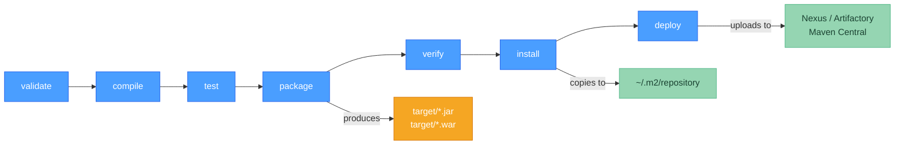

# 📦 Maven Fundamentals

> [!abstract] TL;DR
> Maven is the dominant Java build tool using **convention over configuration** and an XML-based POM (Project Object Model). Every Maven project has coordinates: **groupId:artifactId:version (GAV)**. Maven's **default lifecycle** has fixed phases (validate → compile → test → package → verify → install → deploy); running a phase executes all preceding phases. Dependencies are scoped (`compile`, `provided`, `runtime`, `test`). Artifacts are cached in `~/.m2/repository` and fetched from Maven Central or a private registry (Nexus/Artifactory).

---

## Intuition

Maven is like a recipe book with a rigid format: every dish (project) must have the same sections (POM), use the same cooking steps in the same order (lifecycle), and ingredients come from a shared pantry (Central repository). You don't choose the order to chop vegetables and boil water — the recipe defines it. That rigidity is exactly what makes Maven predictable: any Java developer can pick up any Maven project and know where things are.

---

## How It Works



---

## Key Concepts

### 1. POM Structure (pom.xml)

```xml
<?xml version="1.0" encoding="UTF-8"?>
<project xmlns="http://maven.apache.org/POM/4.0.0"
         xmlns:xsi="http://www.w3.org/2001/XMLSchema-instance"
         xsi:schemaLocation="http://maven.apache.org/POM/4.0.0
                             https://maven.apache.org/xsd/maven-4.0.0.xsd">
    <modelVersion>4.0.0</modelVersion>

    <!-- ── GAV coordinates — unique identifier of this artifact ── -->
    <groupId>com.example</groupId>           <!-- reverse-domain org name -->
    <artifactId>my-service</artifactId>      <!-- project name (becomes JAR name) -->
    <version>1.0.0-SNAPSHOT</version>        <!-- SNAPSHOT = dev build; remove for release -->
    <packaging>jar</packaging>               <!-- jar | war | pom | ear -->

    <!-- ── Inherit from a parent POM (e.g., Spring Boot parent) ── -->
    <parent>
        <groupId>org.springframework.boot</groupId>
        <artifactId>spring-boot-starter-parent</artifactId>
        <version>3.3.0</version>
        <relativePath/>  <!-- look up from repository, not local filesystem -->
    </parent>

    <!-- ── Reusable properties ── -->
    <properties>
        <java.version>21</java.version>
        <mapstruct.version>1.5.5.Final</mapstruct.version>
    </properties>

    <!-- ── Dependencies ── -->
    <dependencies>
        <dependency>
            <groupId>org.springframework.boot</groupId>
            <artifactId>spring-boot-starter-web</artifactId>
            <!-- version omitted: managed by spring-boot-starter-parent BOM -->
        </dependency>

        <dependency>
            <groupId>org.postgresql</groupId>
            <artifactId>postgresql</artifactId>
            <scope>runtime</scope>  <!-- only needed at runtime, not compilation -->
        </dependency>

        <dependency>
            <groupId>org.springframework.boot</groupId>
            <artifactId>spring-boot-starter-test</artifactId>
            <scope>test</scope>  <!-- test classpath only -->
        </dependency>

        <dependency>
            <groupId>jakarta.servlet</groupId>
            <artifactId>jakarta.servlet-api</artifactId>
            <scope>provided</scope>  <!-- provided by container at runtime, not packaged -->
        </dependency>
    </dependencies>

    <!-- ── Build configuration ── -->
    <build>
        <plugins>
            <plugin>
                <groupId>org.springframework.boot</groupId>
                <artifactId>spring-boot-maven-plugin</artifactId>
            </plugin>
        </plugins>
    </build>
</project>
```

### 2. Default Lifecycle Phases

| Phase | What Happens |
|-------|-------------|
| `validate` | Validates POM is correct and all required info is present |
| `compile` | Compiles `src/main/java` → `target/classes` |
| `test` | Runs unit tests via Surefire (fails build if tests fail) |
| `package` | Packages compiled code into JAR/WAR in `target/` |
| `verify` | Runs integration tests via Failsafe + checks (JaCoCo thresholds) |
| `install` | Installs the artifact into the local `~/.m2/repository` |
| `deploy` | Copies artifact to a remote repository (Nexus/Central) |

> Running `mvn package` executes: validate → compile → test → package (all preceding phases automatically).

There are also **clean** and **site** lifecycles (separate from default):
- `mvn clean` deletes `target/` directory
- `mvn site` generates project documentation site

### 3. Essential `mvn` Commands

```bash
# Build and package (skip no tests)
mvn clean package

# Build without running tests
mvn clean package -DskipTests

# Build without compiling tests (faster than -DskipTests)
mvn clean package -Dmaven.test.skip=true

# Install to local repo (e.g., before using in another local project)
mvn clean install

# Run a specific test class
mvn test -Dtest=UserServiceTest

# Run tests matching a pattern
mvn test -Dtest="*Integration*"

# Multi-module: build only a specific module and its dependencies
mvn clean package -pl my-service -am

# Multi-module: build specific module and modules that depend on it
mvn clean package -pl my-service -amd

# Display the effective POM (with all inheritance resolved)
mvn help:effective-pom

# Display the dependency tree (great for finding conflicts)
mvn dependency:tree

# Analyze which declared dependencies are unused, which are undeclared
mvn dependency:analyze

# Run a specific plugin goal directly
mvn spring-boot:run
mvn flyway:migrate
mvn versions:display-dependency-updates

# Parallel builds (uses N threads, or C = core count)
mvn clean package -T 4
mvn clean package -T 1C
```

### 4. Dependency Scope Reference

| Scope | Compile CP | Test CP | Runtime CP | Packaged |
|-------|-----------|---------|-----------|---------|
| `compile` (default) | ✓ | ✓ | ✓ | ✓ |
| `provided` | ✓ | ✓ | ✗ | ✗ |
| `runtime` | ✗ | ✓ | ✓ | ✓ |
| `test` | ✗ | ✓ | ✗ | ✗ |
| `system` | ✓ | ✓ | ✓ | ✗ |

- `compile` — default; available everywhere; transitive to downstream projects
- `provided` — compile-time only; container (Tomcat, app server) provides at runtime (e.g., `javax.servlet-api`)
- `runtime` — not needed for compilation; needed for execution (e.g., JDBC drivers, SLF4J binding)
- `test` — only for test compilation and execution (e.g., JUnit, Mockito, Spring Boot Test)
- `system` — like provided but you supply the JAR path; fragile — avoid

### 5. Maven Repositories

```xml
<!-- Local repository: ~/.m2/repository (auto-managed) -->
<!-- Maven first checks local, then goes to remote -->

<!-- Configuring additional repositories in pom.xml (prefer settings.xml for credentials) -->
<repositories>
    <repository>
        <id>company-nexus</id>
        <url>https://nexus.company.com/repository/maven-public/</url>
        <releases><enabled>true</enabled></releases>
        <snapshots><enabled>true</enabled></snapshots>
    </repository>
</repositories>

<!-- Mirror in ~/.m2/settings.xml (routes all requests through internal proxy) -->
<!-- <mirrors>
       <mirror>
         <id>nexus</id>
         <mirrorOf>*</mirrorOf>
         <url>https://nexus.company.com/repository/maven-public/</url>
       </mirror>
     </mirrors> -->
```

---

## Real-World Notes

- **Parent POM vs BOM**: the `spring-boot-starter-parent` sets plugin versions AND manages dependency versions. If you can't extend it (you have a corporate parent POM), import `spring-boot-dependencies` as a BOM in `<dependencyManagement>` to get version management without inheriting plugin config.
- **SNAPSHOT vs release**: `1.0.0-SNAPSHOT` is re-downloaded on every build (Maven always checks for newer snapshots). Release versions (`1.0.0`) are cached permanently once downloaded. Never depend on SNAPSHOTs in production builds.
- **Offline mode**: `mvn clean package -o` uses only the local `~/.m2` cache — useful in air-gapped CI environments after a first online build.

---

## Common Pitfalls

| Pitfall | Consequence | Fix |
|---------|-------------|-----|
| Missing `<relativePath/>` in parent declaration | Maven searches local filesystem first, finds wrong parent | Add `<relativePath/>` (empty = always resolve from repo) |
| SNAPSHOT dependency in production build | Non-reproducible builds; latest snapshot may break prod | Pin to release versions for prod; use `versions:lock-snapshots` |
| `-DskipTests` in CI | Tests never run in pipeline | Use only for packaging steps; always have a separate test stage |
| Accumulating stale artifacts in `~/.m2` | Disk fills; `-SNAPSHOT` served stale from cache | `mvn dependency:purge-local-repository` or `rm -rf ~/.m2/repository` |

---

## Related Concepts

- [[_MOC_Build_Tools|↑ Section MOC — Java Build Tools]]
- [[Gradle_Fundamentals]] — Alternative build tool with faster incremental builds
- [[Maven_vs_Gradle]] — When to choose Maven vs Gradle
- [[Dependency_Management]] — Conflict resolution, BOMs, and security scanning
- [[Build_Plugins]] — Surefire, Failsafe, JaCoCo, Jib plugins in Maven

---

## Review Questions

1. What is the difference between `mvn clean package -DskipTests` and `mvn clean package -Dmaven.test.skip=true`? When would you prefer one over the other?

2. A library your project depends on was compiled with `commons-lang3:3.4`, but another dependency requires `commons-lang3:3.12.0`. Which version does Maven use by default (nearest-wins rule)? How would you explicitly control the version?

3. Your microservice needs the `jakarta.servlet-api` for compilation (you use `HttpServletRequest` in your code) but Tomcat provides it at runtime, so you don't want it in the fat JAR. Which Maven dependency scope achieves this?

---

## Sources
- [Maven Reference](https://maven.apache.org/guides/introduction/introduction-to-the-lifecycle.html)
- [Maven Settings Reference](https://maven.apache.org/settings.html)
- Sonatype, *Maven: The Definitive Guide* (O'Reilly)

#java #build-tools #Maven #POM #lifecycle #Beginner
