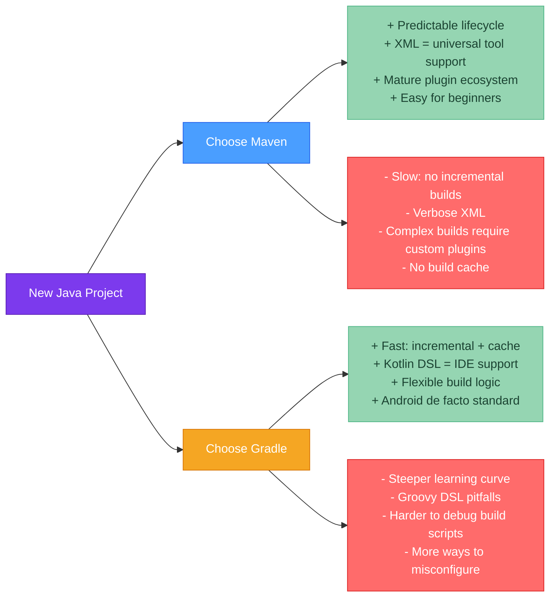

# ⚖️ Maven vs Gradle

> [!abstract] TL;DR
> **Maven**: strict XML conventions, predictable behavior, massive plugin ecosystem, excellent corporate/enterprise support, reproducible builds out of the box. **Gradle**: faster (incremental builds, build cache, parallel execution), more flexible DSL (Kotlin/Groovy), superior for Android and complex multi-project builds, steeper learning curve. In practice: choose Maven for teams with mixed experience levels or strong XML/convention preference; choose Gradle for new projects prioritizing build speed and complex build logic. Migration: `gradle init --type pom` converts a Maven POM to a Gradle build automatically.

---

## Intuition

Maven is a regulation-heavy government: it tells you exactly where to put everything, in what order to do things, and you can't deviate much — but any new employee immediately knows where to find things. Gradle is a startup: you can build anything any way you want, it's faster and more powerful, but onboarding a new developer requires reading the custom build scripts to understand what's happening.

---

## How It Works



---

## Key Concepts

### 1. Build Speed Comparison

**Gradle's three speed advantages:**

| Mechanism | Maven | Gradle |
|-----------|-------|--------|
| Incremental compilation | No (recompiles all changed files) | Yes (compiles only affected classes) |
| Incremental task execution | No (re-runs all phases every time) | Yes (UP-TO-DATE skips if inputs unchanged) |
| Build cache | No | Yes (local + remote; pull outputs from cache) |
| Parallel execution | Limited (multi-module with `-T` flag) | Yes (`org.gradle.parallel=true`, task-level) |
| Daemon | No (new JVM per build) | Yes (warm daemon eliminates JVM startup) |

**Real-world speed difference**: for a large 50-module project, Maven clean build: 4 minutes. Gradle incremental after one file change: 8 seconds. The gap widens with project size.

### 2. Feature Comparison Table

| Feature | Maven | Gradle |
|---------|-------|--------|
| Build file format | XML (pom.xml) | Kotlin DSL (.kts) or Groovy DSL |
| Convention | Strong (fixed directories, lifecycle) | Flexible (configurable, extensible) |
| Plugin ecosystem | Massive, well-documented, stable | Large, but Maven's is bigger |
| IDE support | Excellent (IntelliJ, Eclipse, VS Code) | Excellent (Kotlin DSL > Groovy DSL) |
| Android support | Not supported | Official build system |
| Learning curve | Low | Medium to High |
| Debug build scripts | Easy (structured phases) | Harder (scripting + lazy evaluation) |
| Reproducible builds | Strong (fixed lifecycle) | Good (build cache improves; lazy eval adds risk) |
| Multi-project builds | Supported but verbose | First-class, flexible |
| Custom build logic | Requires custom plugin (Maven extension) | Inline in build script |
| Corporate/enterprise | De facto standard | Growing adoption |

### 3. When to Choose Maven

- **Legacy enterprise environment** where all CI/CD tooling, code review processes, and team knowledge are Maven-oriented
- **Team with junior developers** — Maven's strict conventions reduce footguns; a junior can't accidentally break the build structure
- **Complex corporate POM hierarchies** — Maven's parent POM inheritance model is mature and well-understood
- **Regulatory / compliance contexts** — Maven's reproducible, linear lifecycle is easier to audit
- **JEE / Jakarta EE applications** — Maven has better tooling for WAR packaging, EAR packaging, and app server plugins

### 4. When to Choose Gradle

- **New greenfield project** — start with the better default (Gradle) if no legacy constraints
- **Android application** — Gradle is the only supported build system for Android
- **Monorepo with many modules** — Gradle's incremental + build cache makes large projects bearable
- **Complex build requirements** — code generation, custom source sets, variant-specific builds, cross-compilation
- **Performance-critical CI pipelines** — remote build cache can reduce CI build time by 80%+
- **Kotlin-first teams** — natural fit with Kotlin DSL

### 5. Migration: Maven → Gradle

```bash
# Automatic conversion (works for most projects)
# Run in the project root (where pom.xml lives)
gradle init --type pom

# This generates:
# ├── build.gradle.kts          (converted dependencies + plugins)
# ├── settings.gradle.kts       (project name)
# └── gradle/wrapper/...        (wrapper files)

# Common manual fixes needed after conversion:
# 1. Verify dependency configurations (compile → implementation)
# 2. Fix any Maven-specific plugin goals that have no Gradle equivalent
# 3. Replace Maven Surefire config with Gradle test task config
# 4. Check multi-module project structure if applicable
# 5. Verify Spring Boot plugin configuration
```

**Gradual migration (both build files coexist temporarily):**

You cannot run Maven and Gradle simultaneously on the same project, but teams often run Gradle in a feature branch while keeping Maven on main until Gradle is validated in CI.

### 6. Build File Equivalents

| Maven (pom.xml) | Gradle (build.gradle.kts) |
|-----------------|--------------------------|
| `<groupId>` / `<artifactId>` / `<version>` | `group = "..."` / `version = "..."` in root, `rootProject.name` in settings |
| `<dependency>...<scope>compile</scope>` | `implementation("...")` |
| `<dependency>...<scope>test</scope>` | `testImplementation("...")` |
| `<dependency>...<scope>provided</scope>` | `compileOnly("...")` |
| `<dependency>...<scope>runtime</scope>` | `runtimeOnly("...")` |
| `<properties>` | `ext {}` or Kotlin `val` in `buildSrc` |
| `<dependencyManagement>` BOM import | `platform("...")` or `enforcedPlatform("...")` |
| `<build><plugins>` | `plugins {}` block |
| `mvn clean package` | `./gradlew clean build` |
| `mvn install` | `./gradlew publishToMavenLocal` |
| `mvn dependency:tree` | `./gradlew dependencies` |

### 7. Both Together: The Practical Reality

Many organizations use **both tools**:
- Maven for backend Java microservices (existing, stable)
- Gradle for new services (faster builds, Kotlin DSL)
- Gradle for Android (mandatory)

There's no need to standardize on one globally — the overhead of a second build tool is lower than the risk of migrating hundreds of Maven projects.

---

## Real-World Notes

- **CI build time economics**: if your Maven build takes 10 minutes and runs 50 times per day across 10 developers, that's 83 developer-hours per day waiting. Gradle with remote build cache can cut this to 3 minutes = 25 hours per day saved. The ROI calculation often justifies migration for large teams.
- **Gradle Enterprise (Develocity)**: Gradle Inc.'s commercial product adds build scans (interactive build timeline), remote build cache, and predictive test selection. Many large engineering orgs (LinkedIn, Twitter, Netflix) use it.
- **Spring Boot team uses both**: Spring Boot itself is built with Gradle; Spring Boot projects generated by Spring Initializr offer both Maven and Gradle as options.

---

## Common Pitfalls

| Pitfall | Consequence | Fix |
|---------|-------------|-----|
| Migrating with `gradle init` and not testing integration tests | Failsafe → Gradle test task behavior differs | Verify `./gradlew test` runs all test types correctly |
| Mixing Groovy and Kotlin DSL in one project | Confusion, inconsistency | Pick one DSL and be consistent |
| Assuming Maven conventions hold in Gradle | Source directories, output paths may differ | Check Gradle Java plugin conventions explicitly |
| Using `gradle` command instead of `./gradlew` | Different Gradle version than the project expects | Always use the wrapper: `./gradlew` |

---

## Related Concepts

- [[_MOC_Build_Tools|↑ Section MOC — Java Build Tools]]
- [[Maven_Fundamentals]] — Maven POM structure, lifecycle, and commands
- [[Gradle_Fundamentals]] — Gradle task graph, DSL, and configurations
- [[Dependency_Management]] — How each tool resolves conflicts and uses BOMs

---

## Review Questions

1. A team has a 30-module Maven project. Clean builds take 8 minutes in CI. A senior engineer proposes migrating to Gradle. List three specific Gradle features that would reduce this build time and explain how each one helps.

2. Your company's Maven-based enterprise project needs complex build logic: it must generate Java source code from a custom schema format at build time. A Maven plugin for this schema language doesn't exist. How would you handle this in Maven vs Gradle, and which approach is simpler?

3. Run `gradle init --type pom` on a Maven project. The generated build compiles fine but integration tests (previously run by Maven Failsafe with `*IT.java` pattern) are no longer running. What is the root cause and how do you configure Gradle to run them?

---

## Sources
- [Gradle docs: Migrating from Maven](https://docs.gradle.org/current/userguide/migrating_from_maven.html)
- [HikariCP maintainer's post on Maven vs Gradle](https://github.com/brettwooldridge/HikariCP)
- Gradle official blog: "Gradle vs Maven: Performance"

#java #build-tools #Maven #Gradle #comparison #Intermediate
