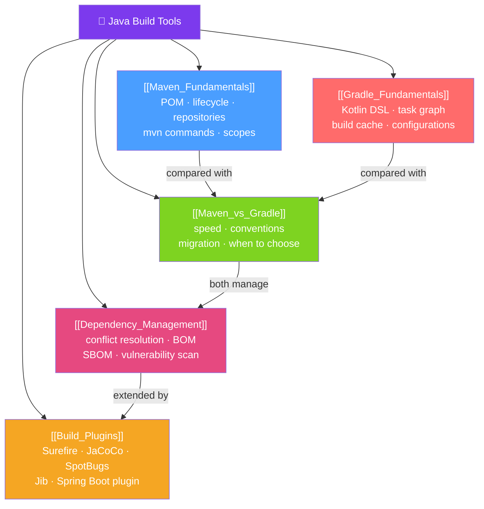

# 🔨 Java Build Tools — Map of Content

> [!abstract] What This Section Covers
> Build tools automate compilation, testing, packaging, and deployment of Java applications. This section covers both dominant build tools — Maven (convention-over-configuration, XML, huge ecosystem) and Gradle (flexible DSL, superior performance) — their dependency management features, and the most important build plugins every Java developer needs to know.

## Concept Map

## Learning Path
1. [[Maven_Fundamentals]] — Learn the POM structure, default lifecycle, and essential `mvn` commands — the foundation of most Java projects.
2. [[Gradle_Fundamentals]] — Understand Gradle's task graph, Kotlin DSL, incremental builds, and multi-project setup.
3. [[Maven_vs_Gradle]] — Compare both tools on speed, conventions, and use cases to make confident technology choices.
4. [[Dependency_Management]] — Master dependency conflict resolution, BOMs, SNAPSHOT vs release, and security scanning.
5. [[Build_Plugins]] — Integrate the most important plugins: test reporting (Surefire/Failsafe), code coverage (JaCoCo), static analysis (SpotBugs), and Docker image building (Jib).

## All Notes at a Glance
| Note | Difficulty | What You'll Learn |
|------|------------|-------------------|
| [[Maven_Fundamentals]] | Beginner | POM structure, default lifecycle phases, mvn commands, dependency scopes |
| [[Gradle_Fundamentals]] | Beginner | Kotlin DSL, task graph, incremental builds, build cache, multi-project |
| [[Maven_vs_Gradle]] | Intermediate | Speed comparison, migration path, when to choose each |
| [[Dependency_Management]] | Intermediate | Conflict resolution, exclusions, BOM imports, SBOM, OWASP scanning |
| [[Build_Plugins]] | Intermediate | Surefire, Failsafe, JaCoCo, SpotBugs, PMD, Jib, Spring Boot plugin |

## Key Questions This Section Answers
- What are Maven's default lifecycle phases and what does each one do?
- What is the difference between `implementation` and `api` in Gradle?
- How does Maven resolve dependency version conflicts when two transitive dependencies require different versions?
- What is a BOM (Bill of Materials) and why should you use `spring-boot-dependencies` as one?
- How do you build a Docker image for a Java app without writing a Dockerfile?
- What is the difference between Maven Surefire (unit tests) and Failsafe (integration tests)?

## Related Sections
- [[_MOC_Java_Master|↑ Java Master MOC]]
- [[_MOC_DevOps|→ DevOps]] — CI/CD pipelines that invoke Maven/Gradle
- [[_MOC_Spring_Framework|→ Spring Framework]] — Spring Boot Maven/Gradle plugins for fat JARs

#MOC #java #build-tools #Maven #Gradle
