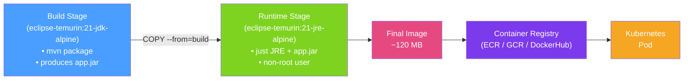

# 🐳 Docker for Java

> [!abstract] TL;DR
> Dockerising a Java application means packaging the JAR and its runtime into a portable, reproducible container image. **Multi-stage builds** separate the heavy build environment (JDK + Maven) from the lean runtime image (JRE or distroless), shrinking production images from 600 MB to under 100 MB. Key concerns are layer caching for fast rebuilds, JVM container-awareness flags, and security hardening (non-root user, minimal base image).

## Intuition — analogy FIRST

A Docker image is a **shipping container for software**. Before containers, shipping goods meant worrying about whether the destination port had the right cranes, forklifts, and procedures — every environment was different. With containers, you pack everything the cargo (application) needs into a standardised steel box. The same container ships on any freighter (Linux host) and is unpacked identically at any port (cloud provider or on-prem). A **multi-stage build** is like using a large factory (JDK image) to manufacture the product, then shipping only the finished product in the smallest container possible — not the entire factory.

---

## How It Works



## Key Concepts / Details

### Basic Multi-Stage Dockerfile

```dockerfile
# ---- Stage 1: Build ----
FROM eclipse-temurin:21-jdk-alpine AS build

WORKDIR /app

# Copy dependency descriptors first for layer caching
COPY pom.xml .
COPY .mvn/ .mvn/
COPY mvnw .
RUN ./mvnw dependency:go-offline -q   # cache deps in a layer

COPY src/ src/
RUN ./mvnw package -DskipTests -q

# ---- Stage 2: Runtime ----
FROM eclipse-temurin:21-jre-alpine AS runtime

# Security: create a non-root user
RUN addgroup -S appgroup && adduser -S appuser -G appgroup
USER appuser

WORKDIR /app

# Copy only the built JAR from Stage 1
COPY --from=build /app/target/*.jar app.jar

EXPOSE 8080

ENTRYPOINT ["java", \
  "-XX:+UseContainerSupport", \
  "-XX:MaxRAMPercentage=75.0", \
  "-XX:+ExitOnOutOfMemoryError", \
  "-jar", "app.jar"]
```

### Layer Caching Strategy

Docker layers are cached — a layer is only rebuilt when its content changes. Optimal ordering:

```dockerfile
# SLOW (invalidates cache on any src change — even README update)
COPY . .
RUN ./mvnw package

# FAST (dependencies layer is reused unless pom.xml changes)
COPY pom.xml .
RUN ./mvnw dependency:go-offline       # cached until pom.xml changes
COPY src/ src/
RUN ./mvnw package -DskipTests        # only this layer misses when src changes
```

### Image Size Comparison

| Base Image | Approximate Size | Notes |
|-----------|-----------------|-------|
| `eclipse-temurin:21` | ~460 MB | Full JDK on Ubuntu — only for build stage |
| `eclipse-temurin:21-jre` | ~250 MB | JRE only, Ubuntu base |
| `eclipse-temurin:21-jre-alpine` | ~120 MB | JRE on Alpine Linux — good default |
| `gcr.io/distroless/java21` | ~85 MB | No shell, no package manager — maximum hardening |
| GraalVM native binary | ~50 MB | No JVM at all — see [[GraalVM_Native_Image]] |

### JVM Tuning for Containers

```dockerfile
# Critical flags for containers
ENTRYPOINT ["java", \
  "-XX:+UseContainerSupport",        # Read cgroup memory limits (default Java 10+)
  "-XX:MaxRAMPercentage=75.0",       # Use 75% of cgroup limit for heap
  "-XX:InitialRAMPercentage=50.0",   # Start heap at 50%
  "-XX:+ExitOnOutOfMemoryError",     # Kill process cleanly on OOM (let K8s restart)
  "-Djava.security.egd=file:/dev/./urandom",  # Faster SecureRandom init
  "-jar", "app.jar"]
```

### .dockerignore

```
# .dockerignore — keep build context lean
target/
.git/
*.md
.idea/
**/*.log
```

### Spring Boot Buildpacks (Alternative to Manual Dockerfile)

Spring Boot 2.3+ supports building OCI images without a Dockerfile:

```bash
# Uses Paketo Buildpacks under the hood
./mvnw spring-boot:build-image -Dspring-boot.build-image.imageName=myapp:latest

# Or with Gradle
./gradlew bootBuildImage
```

The buildpack automatically applies memory calculator, certificates, and security hardening.

### Docker Compose for Local Development

```yaml
# docker-compose.yml
services:
  app:
    build: .
    ports: ["8080:8080"]
    environment:
      SPRING_PROFILES_ACTIVE: dev
      SPRING_DATASOURCE_URL: jdbc:postgresql://postgres:5432/mydb
    depends_on:
      postgres:
        condition: service_healthy

  postgres:
    image: postgres:16-alpine
    environment:
      POSTGRES_DB: mydb
      POSTGRES_USER: app
      POSTGRES_PASSWORD: secret
    healthcheck:
      test: ["CMD", "pg_isready", "-U", "app"]
      interval: 5s
      timeout: 5s
      retries: 5
```

## Real-World Notes

- **Alpine images have musl libc** — some native libraries compiled against glibc may fail; use `-slim` Debian-based images in that case.
- **Never run as root in containers** — most container security scanners fail images with `USER root`; create a non-root user in the Dockerfile.
- **Scan images in CI** — integrate `trivy` or `docker scout cves` into your pipeline to catch CVEs before deployment.
- **Pin base image digests for reproducibility** — use `eclipse-temurin:21.0.3_9-jre-alpine@sha256:abc123...` in production to prevent surprise base-image updates.

## Common Pitfalls

- **Copying the entire project before resolving dependencies** — the most expensive rebuild happens when any source change busts the dependency layer. Always copy `pom.xml` / `build.gradle` first.
- **Not using `UseContainerSupport`** — the JVM sees physical host RAM (e.g., 64 GB) and sets heap proportionally, causing it to exceed the container memory limit and getting OOMKilled.
- **Using JDK in the runtime image** — the JDK includes compilers, debuggers, and tools not needed at runtime; use a JRE-only image to reduce attack surface and size.
- **Missing `-XX:+ExitOnOutOfMemoryError`** — without this, a Java process in OOM may limp along in a degraded state instead of exiting cleanly for Kubernetes to restart it.

## Related Concepts
- [[Kubernetes_Java]] — Running Docker images in Kubernetes with probes and limits
- [[GraalVM_Native_Image]] — Alternative to JVM-based Docker: compile to native binary
- [[Cloud_Deployment_Patterns]] — How images flow through CI/CD to production

## Review Questions
1. Why should `pom.xml` / `build.gradle` be copied and dependencies resolved before copying `src/`?
2. What does `-XX:+UseContainerSupport` do, and which Java version enabled it by default?
3. What is the trade-off between using `eclipse-temurin:21-jre-alpine` vs `gcr.io/distroless/java21` as base image?

## Sources
- Docker Documentation: Multi-stage builds — https://docs.docker.com/build/building/multi-stage/
- Spring Boot Container Images — https://docs.spring.io/spring-boot/docs/current/reference/html/container-images.html
- Paketo Buildpacks — https://paketo.io/

#java #docker #cloud-native #containers #devops
