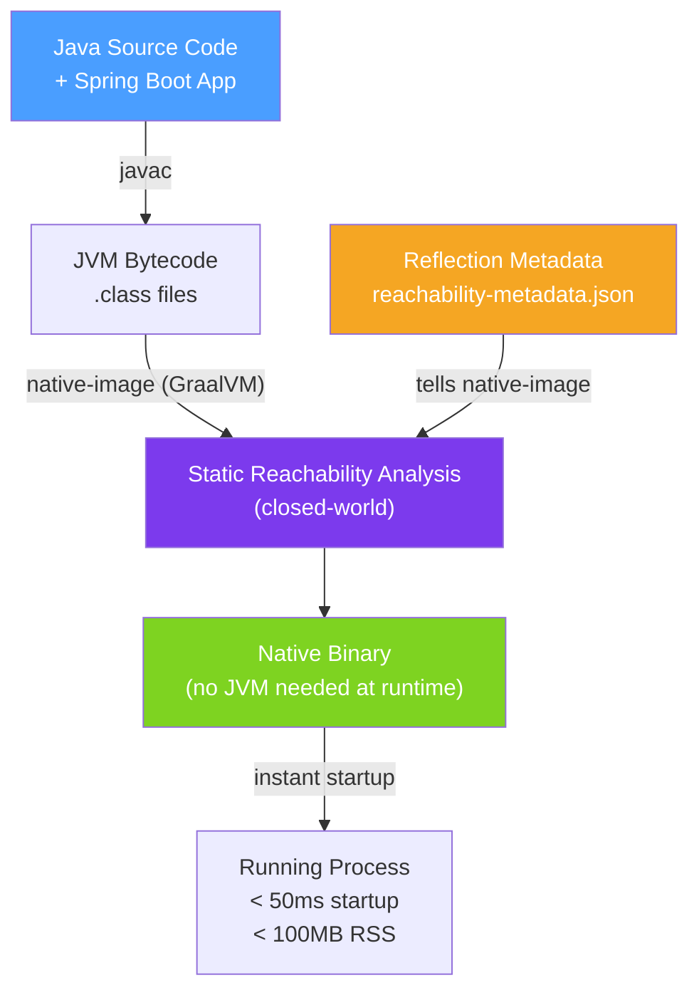

# ⚡ GraalVM Native Image

> [!abstract] TL;DR
> GraalVM Native Image compiles Java ahead-of-time (AOT) into a **native binary** with no JVM at runtime. The result starts in milliseconds, uses a fraction of the memory of a JVM app, and fits in a tiny Docker image — ideal for serverless functions, CLIs, and short-lived containers. The cost: longer build times, the **closed-world assumption** restricts dynamic Java features (reflection, dynamic proxies), and peak throughput is lower than a JIT-optimised JVM for long-running services.

## Intuition — analogy FIRST

Traditional Java is like a **restaurant kitchen** — when an order arrives (request), chefs (JVM + JIT) look up the recipe (bytecode), prep the ingredients, and cook it. Over time, the kitchen optimises its most popular dishes (JIT compilation) and becomes very fast for sustained high-volume cooking. GraalVM Native Image is like **meal-prepping in advance** — before the restaurant opens (build time), you prepare everything, freeze the meals, and at service time you just reheat instantly. Startup is instant, memory is minimal, but you are locked into what you prepared — you cannot improvise a new dish (dynamic class loading) at runtime.

---

## How It Works



## Key Concepts / Details

### The Closed-World Assumption

Native Image performs static analysis to determine **exactly** which classes, methods, and fields are reachable at runtime. It only includes reachable code in the binary.

**Problem:** Java is highly dynamic — reflection, dynamic proxies, JNI, resource loading, and serialisation all reference code that static analysis cannot see at build time.

**Solution:** Provide **reachability metadata** — JSON files that tell native-image what will be accessed at runtime:

```
META-INF/native-image/
├── reflect-config.json         # classes accessed via reflection
├── proxy-config.json           # dynamic proxy interfaces
├── resource-config.json        # classpath resources loaded at runtime
├── serialization-config.json   # serialised classes
└── jni-config.json             # JNI accessed classes
```

### Spring Boot 3 Native Support

Spring Boot 3 has first-class native image support via Spring AOT:

```xml
<!-- pom.xml — add native profile -->
<plugin>
    <groupId>org.graalvm.buildtools</groupId>
    <artifactId>native-maven-plugin</artifactId>
</plugin>
```

```bash
# Build native image (requires GraalVM JDK)
./mvnw -Pnative native:compile

# Or build Docker image with native binary using Buildpacks
./mvnw -Pnative spring-boot:build-image
```

Spring AOT processes beans at build time, generating optimised Java configuration and metadata automatically:

```java
// Spring AOT hint — tell native-image about reflection
@ImportRuntimeHints(MyRuntimeHints.class)
@SpringBootApplication
public class App { ... }

class MyRuntimeHints implements RuntimeHintsRegistrar {
    @Override
    public void registerHints(RuntimeHints hints, ClassLoader classLoader) {
        // Register reflection access
        hints.reflection().registerType(MyEntity.class,
            MemberCategory.INVOKE_DECLARED_CONSTRUCTORS,
            MemberCategory.INVOKE_PUBLIC_METHODS);
        // Register classpath resources
        hints.resources().registerPattern("templates/*.html");
    }
}
```

### Performance Trade-offs

| Dimension | JVM (JIT) | Native Image | Winner |
|-----------|-----------|--------------|--------|
| **Startup time** | 2–10 seconds | 10–100 ms | Native |
| **Memory (RSS)** | 200–500 MB | 30–100 MB | Native |
| **Peak throughput** | Very high (C2 JIT) | Lower (no JIT) | JVM |
| **Build time** | Seconds | 2–10 minutes | JVM |
| **Docker image size** | 100–200 MB | 30–60 MB | Native |
| **Dynamic features** | Full support | Restricted | JVM |

**Rule of thumb:** Use native image for **CLIs**, **serverless functions** (AWS Lambda, GCP Cloud Functions), and **short-lived jobs** where startup and memory dominate. Use JVM for **long-running microservices** where JIT throughput matters.

### Build-time vs Runtime Initialisation

```java
// Force class to be initialised at build time (faster startup)
@NativeRuntimeAccess   // Spring annotation
// Or via native-image.properties:
// Args = --initialize-at-build-time=com.example.MyConfig

// Classes with static state that depends on runtime env must be
// initialised at runtime:
// Args = --initialize-at-run-time=com.example.DatabaseDriver
```

### Tracing Agent — Automatic Metadata Generation

```bash
# Run app with tracing agent to auto-generate metadata
java -agentlib:native-image-agent=config-output-dir=META-INF/native-image \
     -jar myapp.jar

# Exercise all code paths (run integration tests) then collect metadata
# The generated JSON files tell native-image what to include
```

### Native Image in Serverless (AWS Lambda)

```java
// Custom runtime handler for native Lambda
public class OrderHandler implements RequestHandler<APIGatewayProxyRequestEvent,
                                                    APIGatewayProxyResponseEvent> {
    // Native binary = cold start < 50ms vs 3-8s for JVM Lambda
    // AWS SnapStart (Java 21) offers similar startup with JVM
}
```

## Real-World Notes

- **GraalVM Community vs Oracle GraalVM** — Community is free/open-source (Apache 2); Oracle adds profile-guided optimisation (PGO) and G1 GC integration in Oracle GraalVM for higher native throughput.
- **GraalVM Reachability Metadata repository** — The community maintains pre-generated metadata for 200+ popular libraries at github.com/oracle/graalvm-reachability-metadata. Add `graalvm-reachability-metadata` to your build to auto-include it.
- **AWS Lambda SnapStart** — For Java 21 Lambdas on JVM, AWS SnapStart creates a CRaC (Coordinated Restore at Checkpoint) snapshot after warmup, achieving < 1s cold start without native image. Simpler than native for AWS Lambda.
- **Test with Testcontainers native tests** — Spring Boot provides `@SpringBootTest` with `spring.aot.enabled=true` to validate AOT processing before building the native binary.

## Common Pitfalls

- **Reflection without metadata** — accessing a class via `Class.forName("com.example.Foo")` at runtime without registering it in `reflect-config.json` throws `ClassNotFoundException` in native mode.
- **Third-party libraries without native support** — some libraries use dynamic proxies or reflection extensively; check the GraalVM compatibility matrix before committing to native.
- **Not testing in native mode in CI** — native binary behaves differently from JVM; add a CI step that builds and runs smoke tests against the native binary.
- **Build memory** — `native-image` requires 4–8 GB of RAM during build; increase Docker daemon or CI runner memory accordingly.

## Related Concepts
- [[Docker_Java]] — Package native binary in a distroless container for minimal image size
- [[Kubernetes_Java]] — Native images start fast — ideal for burst scaling in K8s
- [[Cloud_Deployment_Patterns]] — Serverless patterns benefit most from native startup times

## Review Questions
1. What is the closed-world assumption and why does it restrict Java's dynamic features?
2. When should you prefer GraalVM Native Image over running the JVM with virtual threads?
3. How does the GraalVM Tracing Agent help generate reachability metadata?

## Sources
- GraalVM Native Image Documentation — https://www.graalvm.org/latest/reference-manual/native-image/
- Spring Boot GraalVM Native Image Support — https://docs.spring.io/spring-boot/docs/current/reference/html/native-image.html
- GraalVM Reachability Metadata — https://github.com/oracle/graalvm-reachability-metadata

#java #graalvm #native-image #aot #cloud-native #serverless
