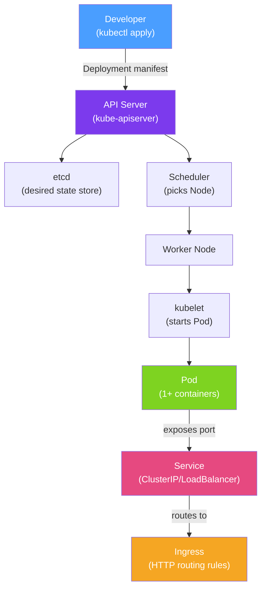

# ☸️ Kubernetes for Java

> [!abstract] TL;DR
> Kubernetes (K8s) is the industry-standard container orchestrator — it runs your Docker images as **Pods**, keeps them healthy, scales them horizontally, routes traffic via **Services**, and manages configuration through **ConfigMaps** and **Secrets**. Java/Spring Boot apps need correct **liveness/readiness probes**, proper **resource requests/limits**, and graceful shutdown configuration to behave well in Kubernetes.

## Intuition — analogy FIRST

Kubernetes is like a **smart hospital administrator** for your containerised applications. You tell the administrator "I need 3 instances of the Order Service always running, each with 512 MB RAM, and replace any that crash immediately." The administrator (K8s control plane) finds space across the available servers (Nodes), starts the containers (Pods), monitors their health (probes), routes patient requests to healthy rooms (Services), and automatically moves a patient when a server needs maintenance. You declare the desired state; Kubernetes makes it real and keeps it real.

---

## How It Works



## Key Concepts / Details

### Core Resources

| Resource | Purpose | Java equivalent |
|----------|---------|-----------------|
| **Pod** | Smallest deployable unit — one or more containers | Running JAR process |
| **Deployment** | Manages desired replica count, rolling updates | Process supervisor |
| **Service** | Stable network endpoint for a set of Pods | Load balancer / DNS |
| **ConfigMap** | Non-secret key-value config | `application.properties` |
| **Secret** | Base64-encoded sensitive config | Encrypted credentials |
| **HPA** | Horizontal Pod Autoscaler — scales based on metrics | Auto-scaling |
| **Ingress** | HTTP/HTTPS routing rules | Reverse proxy / API gateway |

### Spring Boot Deployment Manifest

```yaml
# deployment.yml
apiVersion: apps/v1
kind: Deployment
metadata:
  name: order-service
  labels:
    app: order-service
spec:
  replicas: 3
  selector:
    matchLabels:
      app: order-service
  template:
    metadata:
      labels:
        app: order-service
    spec:
      containers:
        - name: order-service
          image: myregistry/order-service:1.2.0
          ports:
            - containerPort: 8080
          env:
            - name: SPRING_PROFILES_ACTIVE
              value: "prod"
            - name: DB_PASSWORD
              valueFrom:
                secretKeyRef:
                  name: db-secret
                  key: password
          resources:
            requests:
              memory: "256Mi"
              cpu: "250m"
            limits:
              memory: "512Mi"
              cpu: "500m"
          # Probes — CRITICAL for Spring Boot
          startupProbe:
            httpGet:
              path: /actuator/health/liveness
              port: 8080
            failureThreshold: 30   # 30 × 10s = 5 min for slow starts
            periodSeconds: 10
          livenessProbe:
            httpGet:
              path: /actuator/health/liveness
              port: 8080
            initialDelaySeconds: 0
            periodSeconds: 10
            failureThreshold: 3
          readinessProbe:
            httpGet:
              path: /actuator/health/readiness
              port: 8080
            initialDelaySeconds: 0
            periodSeconds: 5
            failureThreshold: 3
```

### Liveness vs Readiness vs Startup Probes

| Probe | Question | Failure action | Spring Boot endpoint |
|-------|---------|----------------|----------------------|
| **Startup** | Is the app still starting up? | Kills container if not ready in time | `/actuator/health/liveness` |
| **Liveness** | Is the app alive (not hung/deadlocked)? | Restarts the container | `/actuator/health/liveness` |
| **Readiness** | Is the app ready to receive traffic? | Removes from Service endpoint | `/actuator/health/readiness` |

```yaml
# application.yml — expose K8s probes
management:
  endpoint:
    health:
      probes:
        enabled: true
      show-details: always
  health:
    livenessstate:
      enabled: true
    readinessstate:
      enabled: true
```

### Graceful Shutdown

```yaml
# application.yml
server:
  shutdown: graceful              # wait for in-flight requests

spring:
  lifecycle:
    timeout-per-shutdown-phase: 30s   # max wait time
```

### Horizontal Pod Autoscaler

```yaml
apiVersion: autoscaling/v2
kind: HorizontalPodAutoscaler
metadata:
  name: order-service-hpa
spec:
  scaleTargetRef:
    apiVersion: apps/v1
    kind: Deployment
    name: order-service
  minReplicas: 2
  maxReplicas: 20
  metrics:
    - type: Resource
      resource:
        name: cpu
        target:
          type: Utilization
          averageUtilization: 70
    - type: Resource
      resource:
        name: memory
        target:
          type: Utilization
          averageUtilization: 80
```

### ConfigMap and Secret Mounting

```yaml
# Mount Spring Boot config from ConfigMap
spec:
  volumes:
    - name: config-volume
      configMap:
        name: order-service-config
  containers:
    - name: order-service
      volumeMounts:
        - name: config-volume
          mountPath: /config
      env:
        - name: SPRING_CONFIG_ADDITIONAL_LOCATION
          value: "file:/config/"
```

### JVM Flags for Containers

```dockerfile
ENV JAVA_OPTS="-XX:+UseContainerSupport \
               -XX:MaxRAMPercentage=75.0 \
               -XX:+ExitOnOutOfMemoryError \
               -Djava.security.egd=file:/dev/./urandom"
```

`UseContainerSupport` (on by default since Java 10) makes the JVM read cgroup memory limits instead of physical host RAM — critical to prevent OOMKill.

## Real-World Notes

- **Never run JVM without resource limits** — without `limits.memory`, the JVM may consume all node memory causing other Pods to be evicted.
- **Use `requests` ≈ `limits` for Java** — JVM heap is fixed at startup; setting requests much lower than limits causes OOMKills when the JVM uses its full heap.
- **Spring Boot 3 sets Kubernetes probe endpoints automatically** — no extra configuration needed for K8s-integrated Spring Boot 3 apps.
- **Use init containers for schema migrations** — run Flyway as an init container before the main app starts to prevent migration races in multi-replica deployments.

## Common Pitfalls

- **Missing startup probe** — liveness probe kills slow-starting Spring apps (especially those loading many beans) before they finish initialising.
- **Liveness probe too aggressive** — if liveness kills a temporarily slow app (GC pause, cache warm-up), you get restart loops. Use a generous `failureThreshold`.
- **`MaxRAMPercentage` too high** — setting 90%+ leaves no room for thread stacks and metaspace, causing OOMKill.
- **No graceful shutdown** — Kubernetes sends SIGTERM and waits `terminationGracePeriodSeconds` (default 30s); without graceful shutdown, in-flight requests are dropped.

## Related Concepts
- [[Docker_Java]] — Building the image that runs in Kubernetes
- [[Spring_Cloud_Config]] — External configuration for Kubernetes deployments
- [[Cloud_Deployment_Patterns]] — Rolling updates, blue-green using Kubernetes primitives

## Review Questions
1. What is the difference between a liveness probe and a readiness probe? What happens when each fails?
2. Why must you set `-XX:+UseContainerSupport` (or use Java 10+) when running the JVM in Kubernetes?
3. How does a Horizontal Pod Autoscaler know when to add more replicas?

## Sources
- Kubernetes Documentation — https://kubernetes.io/docs/home/
- Spring Boot Kubernetes Documentation — https://docs.spring.io/spring-boot/docs/current/reference/html/deployment.html#deployment.cloud.kubernetes

#java #spring #kubernetes #cloud-native #devops
