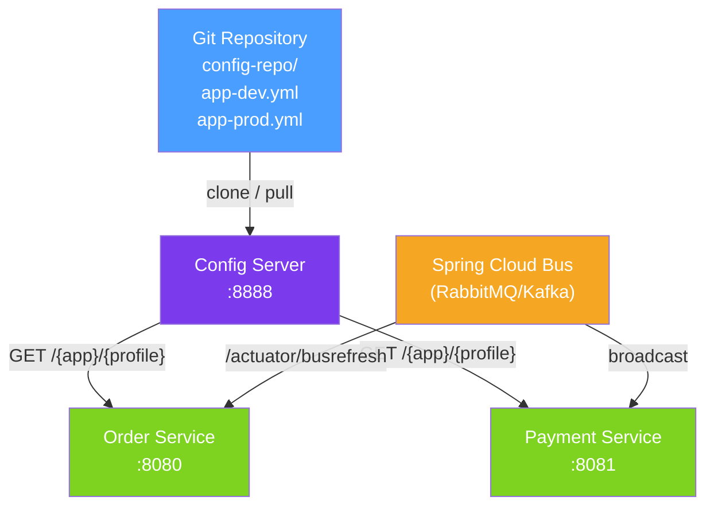

# ☁️ Spring Cloud Config

> [!abstract] TL;DR
> Spring Cloud Config provides a **centralised external configuration server** that serves environment-specific properties to all microservices from a Git repository (or filesystem/Vault). Services fetch their config at startup and can refresh without restarting using `@RefreshScope`. This implements the 12-factor app "config in the environment" principle at scale.

## Intuition — analogy FIRST

Think of Spring Cloud Config as a **company-wide settings panel in the cloud**. Instead of every employee (microservice) keeping their own copy of the office Wi-Fi password, VPN credentials, and database URLs in their desk drawer (application.properties), there's a single admin panel (Config Server) connected to a versioned document store (Git). Everyone fetches their settings from the panel at startup, and when the password changes, you update the panel once and everyone refreshes — no one needs to restart their laptop.

---

## How It Works



## Key Concepts / Details

### Config Server Setup

```java
// Config Server application
@SpringBootApplication
@EnableConfigServer
public class ConfigServerApplication {
    public static void main(String[] args) {
        SpringApplication.run(ConfigServerApplication.class, args);
    }
}
```

```yaml
# application.yml for the Config Server
server:
  port: 8888

spring:
  cloud:
    config:
      server:
        git:
          uri: https://github.com/myorg/config-repo
          default-label: main
          search-paths: "{application}"
          clone-on-start: true
          # For private repos:
          username: ${GIT_USER}
          password: ${GIT_TOKEN}
```

### Config Client Setup

```yaml
# bootstrap.yml (or application.yml in Spring Boot 2.4+)
spring:
  application:
    name: order-service       # maps to filename in Git repo
  config:
    import: "configserver:http://config-server:8888"
  profiles:
    active: prod              # maps to order-service-prod.yml in Git
```

### File Naming Convention in Git Repo

```
config-repo/
├── application.yml              # shared by ALL services
├── order-service.yml            # order-service defaults
├── order-service-dev.yml        # dev profile overrides
├── order-service-prod.yml       # prod profile overrides
└── payment-service-prod.yml
```

Property resolution priority (highest to lowest):
1. `{app}-{profile}.yml`
2. `{app}.yml`
3. `application-{profile}.yml`
4. `application.yml`

### RefreshScope — Dynamic Config Updates

```java
@RestController
@RefreshScope   // bean is re-created on /actuator/refresh
public class GreetingController {

    @Value("${greeting.message:Hello}")
    private String message;

    @GetMapping("/greeting")
    public String greet() {
        return message;
    }
}
```

Trigger a refresh:
```bash
# Refresh single service
curl -X POST http://order-service:8080/actuator/refresh

# Refresh all services via Spring Cloud Bus
curl -X POST http://config-server:8888/actuator/busrefresh
```

### Encrypting Sensitive Properties

```yaml
# In Config Server application.yml
encrypt:
  key: ${ENCRYPT_KEY}   # symmetric key, or use RSA keypair
```

Store encrypted values in Git with `{cipher}` prefix:
```yaml
# order-service-prod.yml in Git
spring:
  datasource:
    password: '{cipher}AQBqW7z3Kj9...'   # encrypted at rest
```

Encrypt/decrypt via Config Server endpoints:
```bash
curl -X POST http://config-server:8888/encrypt -d 'mySecretPassword'
# Returns: AQBqW7z3Kj9...
```

### Config Server High Availability

| Strategy | How | Trade-off |
|----------|-----|-----------|
| Multiple instances behind LB | Run 2-3 Config Server replicas | No shared state — all pull from same Git |
| Client-side retry | `spring.cloud.config.retry.*` | Handles transient failures |
| Config caching | `spring.cloud.config.cache-time-to-live` | Reduces Git calls |
| Fail-fast | `spring.cloud.config.fail-fast=true` | Service won't start without config |

### Alternative Backends

```yaml
# Vault backend
spring:
  cloud:
    config:
      server:
        vault:
          host: vault.mycompany.com
          port: 8200
          scheme: https
          backend: secret
          default-key: application

# Filesystem backend (for local dev)
spring:
  cloud:
    config:
      server:
        native:
          search-locations: classpath:/config
  profiles:
    active: native
```

## Real-World Notes

- **Git history is your config audit log** — every change to a property is versioned, reviewable via PR, and rollback-able with `git revert`.
- **Bootstrap context is deprecated in Spring Boot 2.4+** — use `spring.config.import` in `application.yml` instead of `bootstrap.yml`.
- **Kubernetes ConfigMaps are an alternative** — for simpler setups without Spring Cloud, mount ConfigMaps as environment variables or files. Spring Cloud Config adds encryption, audit, and multi-service sharing on top.
- **Never store secrets in Git plaintext** — always use `{cipher}` encryption or point the Config Server at HashiCorp Vault for secrets.

## Common Pitfalls

- **Missing `@RefreshScope` on beans using `@Value`** — properties injected with `@Value` are not updated on refresh unless the bean is `@RefreshScope`.
- **Git clone failures at startup** — set `clone-on-start: true` and `fail-fast: true` so misconfiguration is caught immediately, not lazily.
- **Using the same encryption key across environments** — rotate keys per environment; a compromised dev key should not unlock prod secrets.
- **Circular dependency with Config Server** — the Config Server itself must not depend on itself for configuration; use a `bootstrap.yml` or environment variables for its own settings.

## Related Concepts
- [[Kubernetes_Java]] — ConfigMaps and Secrets as an alternative/complement
- [[Docker_Java]] — Ensure config server URL is environment-variable driven in container
- [[Cloud_Deployment_Patterns]] — Config refresh during rolling deployments

## Review Questions
1. What is the property resolution order when a service with profile `prod` fetches configuration?
2. How do you refresh configuration in all running service instances simultaneously without restarting them?
3. Why should you never store database passwords as plaintext in the Git config repository?

## Sources
- Spring Cloud Config Reference — https://docs.spring.io/spring-cloud-config/docs/current/reference/html/
- 12-Factor App, Factor III — Config — https://12factor.net/config

#java #spring #cloud #configuration #cloud-native
