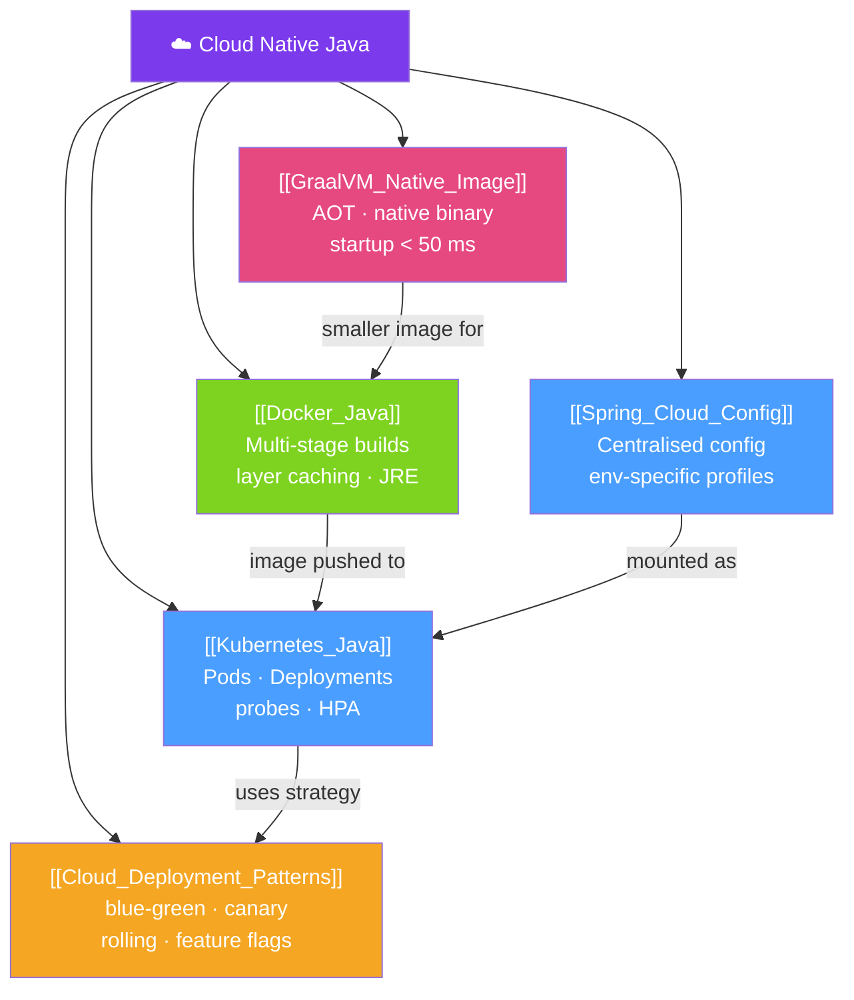

# ☁️ Cloud Native Java — Map of Content

> [!abstract] What This Section Covers
> Cloud-native Java means building services that are containerized, dynamically orchestrated, and microservices-oriented. This section covers the full deployment stack: centralised configuration with Spring Cloud Config, containerising Java apps with Docker, orchestrating at scale with Kubernetes, compiling to native binaries with GraalVM, and the higher-level deployment strategies (blue-green, canary, rolling) that let you ship changes without downtime. Together these topics define what "production-ready" means in 2026.

## Concept Map

## Learning Path
1. [[Docker_Java]] — Package a Java app into a minimal, secure Docker image using multi-stage builds.
2. [[Spring_Cloud_Config]] — Externalise all environment configuration to a central server instead of baking it into images.
3. [[Kubernetes_Java]] — Deploy, scale, and self-heal containers with Kubernetes — probes, resource limits, and HPA.
4. [[GraalVM_Native_Image]] — Compile to a native binary for serverless and short-lived containers that start in milliseconds.
5. [[Cloud_Deployment_Patterns]] — Ship safely with blue-green, canary, and rolling deployment strategies.

## All Notes at a Glance
| Note | Difficulty | What You'll Learn |
|------|------------|-------------------|
| [[Spring_Cloud_Config]] | Intermediate | Config server setup, Git-backed properties, encryption, refresh scope |
| [[Kubernetes_Java]] | Intermediate | Pod spec, Deployment, Service, liveness/readiness probes, HPA, resource limits |
| [[Docker_Java]] | Intermediate | Multi-stage Dockerfile, distroless base images, layer caching, JVM flags in containers |
| [[GraalVM_Native_Image]] | Advanced | AOT compilation, closed-world assumption, reflection metadata, Spring Boot native |
| [[Cloud_Deployment_Patterns]] | Intermediate | Blue-green, canary, rolling updates, feature flags, 12-factor app |

## Key Questions This Section Answers
- How do you externalise configuration so the same Docker image works in dev, staging, and prod?
- What liveness and readiness probes should a Spring Boot app expose in Kubernetes?
- How does a multi-stage Dockerfile reduce a Java image from 600 MB to under 100 MB?
- What is the closed-world assumption and why does GraalVM Native Image need reflection metadata?
- What is the difference between a blue-green and a canary deployment?

## Related Sections
- [[_MOC_Java_Master|↑ Java Master MOC]]
- [[_MOC_Observability_Java|→ Observability]]
- [[_MOC_Security_Advanced|→ Security Advanced]]

#MOC #java #cloud #kubernetes #docker #graalvm
