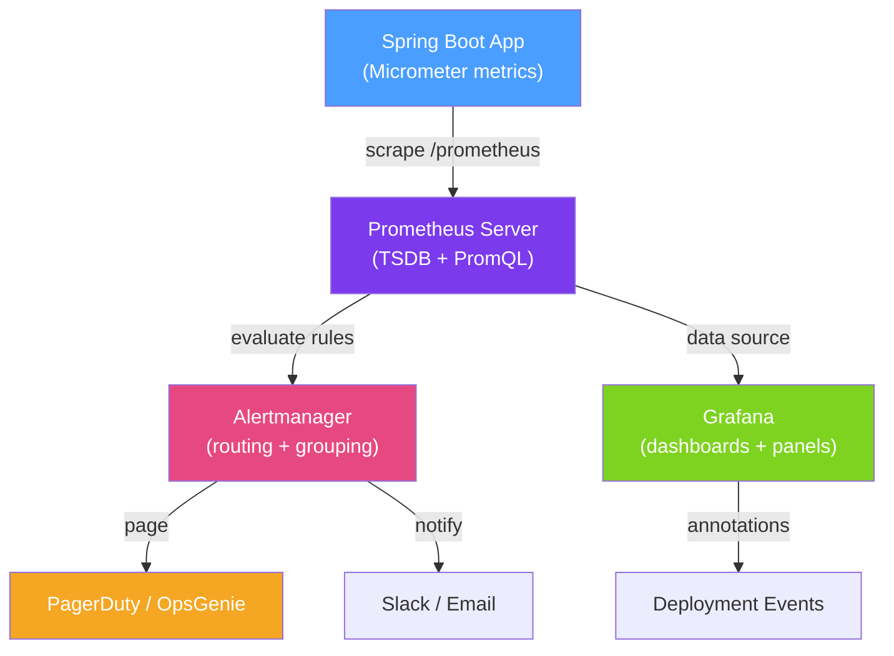

# 🚨 Alerting and Dashboards

> [!abstract] TL;DR
> Alerting translates metrics into actionable signals by defining rules that fire when service health degrades — error rate, latency, saturation. The **four golden signals** (latency, traffic, errors, saturation) provide a universal framework for what to monitor. Grafana dashboards make metrics visual, and SLI/SLO definitions provide the mathematical foundation for alert thresholds and error budgets.

## Intuition — analogy FIRST

A Grafana dashboard is the **mission control display** for your Java services — like NASA's control room with dozens of screens showing temperature, trajectory, and fuel. But displaying data isn't enough; you need **alarms** that sound only when something truly requires human action. A bad alerting setup is like a smoke detector that beeps for burnt toast (alert fatigue) and is muted so it misses the real fire (critical alerts unnoticed).

Good alerting follows the principle: **alert on symptoms, not causes**. Don't alert "CPU is at 80%" (a cause) — alert "p99 latency is above 500ms" (a symptom that users experience). The SLO framework gives you the mathematically correct thresholds: alert when you're burning through your error budget faster than sustainable.

---

## How It Works



## Key Concepts / Details

### The Four Golden Signals

| Signal | What it measures | Micrometer metric | Alert threshold example |
|--------|-----------------|-------------------|------------------------|
| **Latency** | Time to serve a request | `http_server_requests_seconds` p99 | p99 > 500ms for 5 min |
| **Traffic** | Rate of requests | `rate(http_server_requests...[5m])` | Sudden drop > 50% |
| **Errors** | Rate of failed requests | HTTP 5xx / total requests | Error rate > 1% for 5 min |
| **Saturation** | How full a resource is | CPU, memory, thread pool, queue depth | CPU > 85% for 10 min |

### SLI / SLO / SLA Definitions

| Term | Definition | Example |
|------|-----------|---------|
| **SLI** (Service Level Indicator) | A quantitative measure of service behaviour | % of requests completed in < 200ms |
| **SLO** (Service Level Objective) | The target value for the SLI | 99.9% of requests in < 200ms |
| **SLA** (Service Level Agreement) | The contractual commitment (usually weaker than SLO) | 99.5% availability per month |
| **Error Budget** | The allowed non-compliance = 100% - SLO | 0.1% failures = 43.8 min/month downtime |

**Error budget math for 99.9% monthly SLO:**
- Minutes in a month: 43,800
- 0.1% = 43.8 minutes of downtime budget
- If you've spent 40 minutes, you have 3.8 minutes left — STOP non-critical deployments

### Prometheus Alerting Rules

```yaml
# prometheus-alerts.yml
groups:
  - name: order-service
    rules:
      # Alert when error rate > 1% for 5 minutes
      - alert: HighErrorRate
        expr: |
          sum(rate(http_server_requests_seconds_count{
            application="order-service", status=~"5.."
          }[5m]))
          /
          sum(rate(http_server_requests_seconds_count{
            application="order-service"
          }[5m]))
          > 0.01
        for: 5m
        labels:
          severity: page
          team: platform
        annotations:
          summary: "High error rate on {{ $labels.application }}"
          description: "Error rate is {{ $value | humanizePercentage }} (threshold: 1%)"
          runbook: "https://wiki/runbooks/high-error-rate"

      # Alert when p99 latency > 500ms
      - alert: HighLatency
        expr: |
          histogram_quantile(0.99,
            rate(http_server_requests_seconds_bucket{
              application="order-service"
            }[5m])
          ) > 0.5
        for: 5m
        labels:
          severity: page
        annotations:
          summary: "High p99 latency on order-service"

      # Alert when heap usage > 85%
      - alert: HighHeapUsage
        expr: |
          jvm_memory_used_bytes{area="heap", application="order-service"}
          /
          jvm_memory_max_bytes{area="heap", application="order-service"}
          > 0.85
        for: 10m
        labels:
          severity: ticket   # not a page — give ops time to react
        annotations:
          summary: "Heap usage above 85% for {{ $labels.application }}"

      # Alert when connection pool near exhaustion
      - alert: HikariPoolExhaustion
        expr: |
          hikaricp_connections_pending{application="order-service"} > 5
        for: 2m
        labels:
          severity: page
        annotations:
          summary: "HikariCP connection pool backing up"
```

### Key PromQL Queries for Java Services

```promql
# Request rate (RPS)
rate(http_server_requests_seconds_count{application="order-service"}[5m])

# 99th percentile latency
histogram_quantile(0.99,
  rate(http_server_requests_seconds_bucket{application="order-service"}[5m])
)

# Error rate (5xx fraction)
sum(rate(http_server_requests_seconds_count{status=~"5.."}[5m]))
/ sum(rate(http_server_requests_seconds_count[5m]))

# JVM heap usage %
jvm_memory_used_bytes{area="heap"} / jvm_memory_max_bytes{area="heap"}

# GC pause time rate
rate(jvm_gc_pause_seconds_sum[5m])

# Active HikariCP connections
hikaricp_connections_active

# Kafka consumer lag (requires kafka-exporter or micrometer kafka)
kafka_consumer_fetch_manager_records_lag
```

### Grafana Dashboard Layout for Java Services

A standard Java service dashboard should have:

1. **Service Overview Row** — request rate, error rate, p50/p95/p99 latency (as stat tiles)
2. **JVM Health Row** — heap used/max, GC pause time, thread count, loaded classes
3. **Database Row** — HikariCP active connections, pending connections, SQL query latency
4. **Dependencies Row** — external HTTP call latency and error rate, Kafka consumer lag
5. **Kubernetes Row** — CPU usage, memory usage, pod count, restart count

### Alertmanager Routing

```yaml
# alertmanager.yml
route:
  group_by: [alertname, application]
  group_wait: 30s
  group_interval: 5m
  repeat_interval: 4h
  receiver: default
  routes:
    - match:
        severity: page
      receiver: pagerduty
      continue: false
    - match:
        severity: ticket
      receiver: slack-tickets

receivers:
  - name: pagerduty
    pagerduty_configs:
      - service_key: "${PAGERDUTY_KEY}"
  - name: slack-tickets
    slack_configs:
      - api_url: "${SLACK_WEBHOOK}"
        channel: "#platform-alerts"
```

## Real-World Notes

- **Alert on burn rate, not instantaneous value** — a brief CPU spike doesn't need a page. Alert on sustained conditions using `for: 5m` to avoid false positives from transient spikes.
- **Runbooks for every alert** — every `page`-severity alert should link to a runbook with diagnosis steps and remediation actions. An alert without a runbook is a productivity destroyer at 3 AM.
- **Grafana annotations for deployments** — push deployment events to Grafana via the annotations API; they appear as vertical lines on dashboards so you can visually correlate deployments with metric changes.
- **SLO-based alerting is superior to threshold alerting** — instead of alerting on "CPU > 80%", alert on "you're burning error budget at 14x the sustainable rate" using multi-window burn rate alerts.

## Common Pitfalls

- **Alert fatigue from noisy alerts** — if an alert fires 20 times a day without requiring action, engineers mute or ignore it. Keep alert volume low and actionable.
- **Not using `for` duration** — `expr: cpu > 0.8` without `for: 5m` fires on momentary spikes, causing alert storms during GC pauses or cold starts.
- **Missing the `rate()` wrapper on counters** — Prometheus counters only go up; querying the counter directly gives cumulative totals, not rates. Always use `rate(counter[5m])`.
- **Alerting on causes not symptoms** — "GC pause > 100ms" is a cause; "p99 latency > 500ms" is the symptom. Alert on what users experience, not internal metrics that may not translate to user impact.

## Related Concepts
- [[Metrics_Micrometer]] — The source of all metrics that Grafana and Prometheus consume
- [[Spring_Boot_Actuator_Metrics]] — `/actuator/prometheus` endpoint scraped by Prometheus
- [[Distributed_Tracing]] — Grafana Tempo for trace-based alerting on slow traces

## Review Questions
1. What are the four golden signals and which Micrometer metrics map to each one for a Spring Boot service?
2. What is an error budget and how does it determine when you should stop non-critical deployments?
3. Why is `for: 5m` important in a Prometheus alerting rule?

## Sources
- Google SRE Book — Monitoring Distributed Systems — https://sre.google/sre-book/monitoring-distributed-systems/
- Prometheus Alerting Rules — https://prometheus.io/docs/prometheus/latest/configuration/alerting_rules/
- Grafana Best Practices — https://grafana.com/docs/grafana/latest/best-practices/

#java #spring #grafana #prometheus #alerting #slo #observability #monitoring
