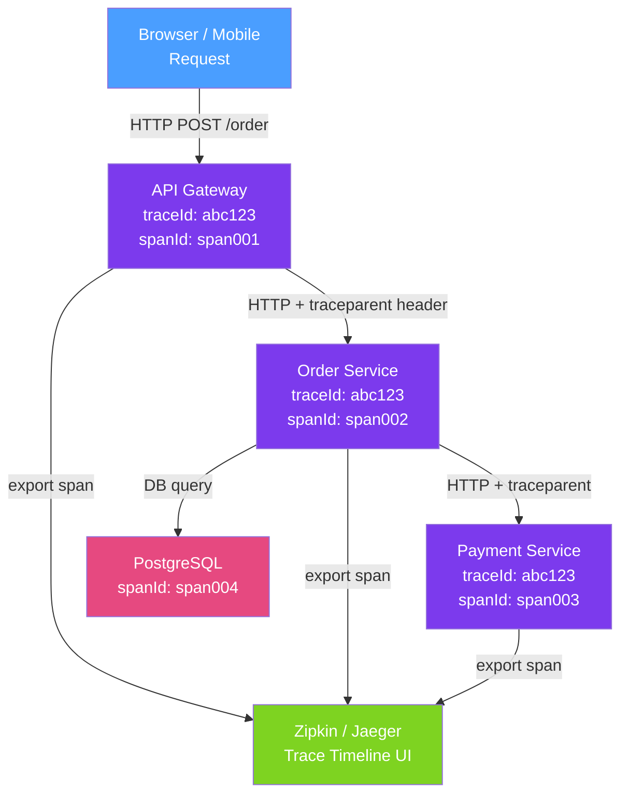

# 🔍 Distributed Tracing

> [!abstract] TL;DR
> Distributed tracing tracks a single request as it flows through multiple services, assigning a **trace ID** shared by all service calls and per-service **span IDs** for each unit of work. Micrometer Tracing (the successor to Spring Cloud Sleuth in Spring Boot 3) auto-instruments HTTP, Kafka, and database calls, injects trace IDs into MDC so every log line carries the trace ID, and exports spans to Zipkin or Jaeger for visualisation.

## Intuition — analogy FIRST

Imagine you ship a package that passes through 5 warehouses before delivery. Distributed tracing is like attaching a **single tracking number** (trace ID) to the package at origin, and every warehouse stamps the box with its own processing time (span). When a package is delayed, you look up the tracking number and see exactly which warehouse held it for 3 hours. Without tracking, you'd need to call every warehouse and manually correlate timestamps.

In microservices, a single user request might touch API Gateway → Order Service → Inventory Service → Payment Service → Notification Service. The trace ID travels with each HTTP call in a header, and each service creates a span recording its contribution. In Zipkin's UI you see the complete timeline: 200ms in Order, 50ms in Inventory, 800ms in Payment (which made a slow DB call), 20ms in Notification.

---

## How It Works



## Key Concepts / Details

### Core Concepts

| Term | Definition | Example |
|------|-----------|---------|
| **Trace** | A complete request journey across all services | One user's order creation — 5 services |
| **Span** | A single unit of work within a trace | The Payment Service processing the charge |
| **Trace ID** | Unique ID shared by all spans in a trace | `abc123def456...` (128-bit hex) |
| **Span ID** | Unique ID for one span | `1234abcd` (64-bit hex) |
| **Parent Span ID** | The span that triggered this one | OrderService span triggered PaymentService span |
| **Baggage** | Key-value pairs propagated with the trace | `tenantId=acme`, `userId=42` |

### W3C TraceContext Header

The industry standard for propagating trace context across HTTP calls:

```
traceparent: 00-4bf92f3577b34da6a3ce929d0e0e4736-00f067aa0ba902b7-01
             ^^ ^^^^^^^^^^^^^^^^^^^^^^^^^^^^^^^^ ^^^^^^^^^^^^^^^^ ^^
             version  trace-id (128-bit)          parent-span-id   flags
```

Spring Boot 3 with Micrometer Tracing propagates `traceparent` automatically via HTTP interceptors.

### Setup — Micrometer Tracing with Zipkin

```xml
<!-- pom.xml -->
<dependency>
    <groupId>io.micrometer</groupId>
    <artifactId>micrometer-tracing-bridge-brave</artifactId>
</dependency>
<dependency>
    <groupId>io.zipkin.reporter2</groupId>
    <artifactId>zipkin-reporter-brave</artifactId>
</dependency>
```

```yaml
# application.yml
management:
  tracing:
    sampling:
      probability: 1.0   # 1.0 = 100% sampled (use 0.1 = 10% in high-traffic prod)
  zipkin:
    tracing:
      endpoint: http://zipkin:9411/api/v2/spans
```

### Automatic MDC Integration

Micrometer Tracing automatically adds `traceId` and `spanId` to MDC:

```
# Log output with tracing auto-configured:
2026-07-26 14:30:00 [http-nio-8080-exec-1] INFO  OrderService [traceId=abc123def456, spanId=1234abcd] - Order 789 created
```

This means you can search by `traceId` in Kibana/Loki and find ALL log lines for a single distributed request across all services.

### Manual Span Creation

```java
@Service
public class OrderService {
    private final ObservationRegistry registry;

    public OrderService(ObservationRegistry registry) {
        this.registry = registry;
    }

    public Order processOrder(OrderRequest req) {
        return Observation.createNotStarted("order.processing", registry)
                .lowCardinalityKeyValue("payment_method", req.getPaymentMethod())
                .observe(() -> {
                    // Everything inside is wrapped in a span
                    validateOrder(req);
                    chargePayment(req);
                    return saveOrder(req);
                });
    }
}
```

### @Observed Annotation

```java
@Service
public class InventoryService {

    // Creates a span automatically — requires ObservedAspect bean
    @Observed(name = "inventory.check",
              contextualName = "check-inventory",
              lowCardinalityKeyValues = {"service", "inventory"})
    public boolean checkAvailability(String productId, int quantity) {
        return inventoryRepository.findByProductId(productId)
                .map(inv -> inv.getQuantity() >= quantity)
                .orElse(false);
    }
}

// Required configuration:
@Bean
public ObservedAspect observedAspect(ObservationRegistry registry) {
    return new ObservedAspect(registry);
}
```

### OpenTelemetry Alternative

```xml
<!-- Use OTel bridge instead of Brave/Zipkin -->
<dependency>
    <groupId>io.micrometer</groupId>
    <artifactId>micrometer-tracing-bridge-otel</artifactId>
</dependency>
<dependency>
    <groupId>io.opentelemetry</groupId>
    <artifactId>opentelemetry-exporter-otlp</artifactId>
</dependency>
```

```yaml
management:
  otlp:
    tracing:
      endpoint: http://otel-collector:4318/v1/traces
```

### Sampling Strategies

| Strategy | Description | Use Case |
|----------|-------------|---------|
| **Constant (1.0)** | Sample every request | Development, low traffic |
| **Probabilistic (0.1)** | Sample 10% randomly | High-traffic production |
| **Rate-limited** | Max N traces/second | Burst prevention |
| **Parent-based** | Follow the sampling decision of the parent span | Default — consistent within a trace |

## Real-World Notes

- **Always sample 100% of errors** — probabilistic sampling should oversample errors and slow requests. Use `SpanExporterFilter` to capture all error spans regardless of sampling rate.
- **Trace IDs in error pages** — expose trace IDs in HTTP error responses (`X-Trace-Id: abc123`) so support teams can quickly locate the exact trace in Zipkin.
- **Baggage vs tags** — tags are local to a span and not propagated; baggage is propagated to all downstream spans. Use baggage sparingly (tenant ID, feature flag) — it adds to every HTTP header.
- **Database spans** — Micrometer Tracing auto-instruments JDBC calls when used with Spring Data; each SQL query creates a span showing the full query and duration.

## Common Pitfalls

- **Sampling at 100% in production** — in high-throughput services (10K RPS), 100% sampling overwhelms Zipkin with span data. Set probability to 0.01–0.1 and use tail-based sampling.
- **Thread pool context loss** — trace context is stored in thread-local; when handing off to a custom ExecutorService, context is lost. Use `ExecutorService executor = Executors.newFixedThreadPool(n)` wrapped with `registry.wrap(executor)` or Spring's `@Async` which propagates context automatically.
- **Long span names from user input** — using request paths as span names creates high-cardinality span names (`/orders/12345` per order). Template the name: `/orders/{id}`.
- **Missing bridge dependency** — Micrometer Tracing is the facade; without `micrometer-tracing-bridge-brave` or `micrometer-tracing-bridge-otel`, no spans are emitted even with configuration.

## Related Concepts
- [[Logging_Java_SLF4J]] — Trace IDs injected into MDC by Micrometer Tracing
- [[Metrics_Micrometer]] — Shares the same ObservationRegistry infrastructure
- [[Alerting_and_Dashboards]] — Grafana Tempo for trace-based alerting

## Review Questions
1. What is the relationship between a trace and a span? How many traces can a single user request produce?
2. Why does probabilistic sampling in distributed tracing require parent-based sampling for consistency?
3. How does Micrometer Tracing automatically add trace IDs to log lines?

## Sources
- Micrometer Tracing Reference — https://micrometer.io/docs/tracing
- W3C Trace Context specification — https://www.w3.org/TR/trace-context/
- Zipkin — https://zipkin.io/

#java #spring #tracing #observability #zipkin #opentelemetry #micrometer
