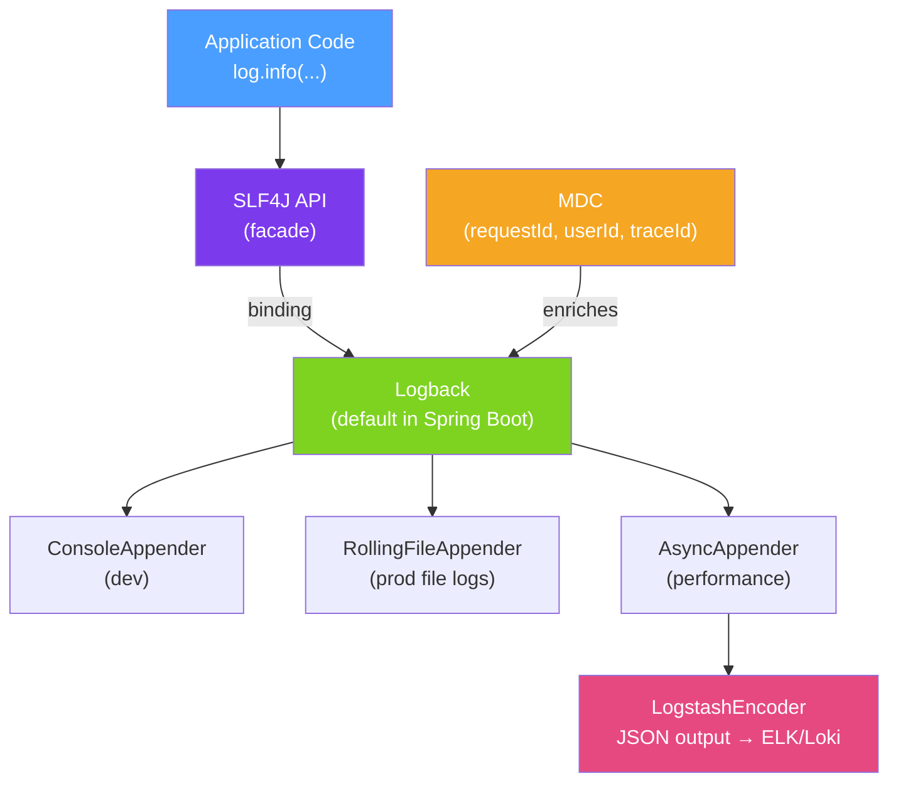

# 📝 Logging in Java with SLF4J

> [!abstract] TL;DR
> **SLF4J** is a logging facade — it standardises the logger API so your code doesn't depend on any specific logging implementation. **Logback** is the default implementation in Spring Boot, configured via `logback-spring.xml`. In production, you should output **structured JSON logs** (via the Logstash encoder) and attach contextual metadata (request ID, user ID, trace ID) using **MDC** so every log line is searchable and correlatable.

## Intuition — analogy FIRST

Imagine you are a writer who submits articles to different newspapers (logging frameworks). If you write directly for The Times (Log4j), your articles only work for The Times. If you use a **literary agent** (SLF4J) as your intermediary, you write one article and the agent formats it for whichever newspaper the publisher chooses. Switch newspapers later — your writing doesn't change, only the agent's formatting rules do.

MDC (Mapped Diagnostic Context) is like stamping every piece of your correspondence with a unique reference number. Even if thousands of letters are in transit simultaneously, each envelope has a `requestId` stamp so you can retrieve the entire conversation for any single request by searching for that stamp.

---

## How It Works



## Key Concepts / Details

### Logger Declaration

```java
import org.slf4j.Logger;
import org.slf4j.LoggerFactory;

public class OrderService {
    // One logger per class — use class literal for correct class name
    private static final Logger log = LoggerFactory.getLogger(OrderService.class);

    // Spring Boot also supports Lombok @Slf4j annotation:
    // @Slf4j
    // public class OrderService { ... }
}
```

### Parameterised Logging (Critical for Performance)

```java
// WRONG: String concatenation happens even if DEBUG is disabled
log.debug("Processing order " + orderId + " for user " + userId);

// CORRECT: {} placeholders — string is only built if level is enabled
log.debug("Processing order {} for user {}", orderId, userId);

// For expensive toString() — check level explicitly
if (log.isTraceEnabled()) {
    log.trace("Full order details: {}", order.toJson());
}
```

### Log Levels — When to Use Each

| Level | Use Case | Example |
|-------|----------|---------|
| `TRACE` | Very fine-grained — loop iterations, variable values | Entering for-loop iteration 5 |
| `DEBUG` | Development detail — method calls, state transitions | "Order state changed to PAID" |
| `INFO` | Significant business events | "Order 123 created for user 456" |
| `WARN` | Recoverable problems, degraded behaviour | "Retry 2/3 for payment service" |
| `ERROR` | Errors requiring attention, with exception | "Payment failed for order 123" |

### MDC — Mapped Diagnostic Context

```java
// In a Servlet filter or Spring interceptor
@Component
public class RequestLoggingFilter extends OncePerRequestFilter {

    @Override
    protected void doFilterInternal(HttpServletRequest req,
                                    HttpServletResponse res,
                                    FilterChain chain)
            throws ServletException, IOException {
        try {
            String requestId = UUID.randomUUID().toString();
            MDC.put("requestId", requestId);
            MDC.put("method", req.getMethod());
            MDC.put("path", req.getRequestURI());
            res.setHeader("X-Request-Id", requestId);

            chain.doFilter(req, res);
        } finally {
            MDC.clear();  // CRITICAL — prevent MDC leaking to the next request
        }
    }
}
```

### logback-spring.xml — Structured JSON for Production

```xml
<?xml version="1.0" encoding="UTF-8"?>
<configuration>
    <springProperty scope="context" name="appName" source="spring.application.name"/>

    <!-- Console for local dev — human-readable -->
    <appender name="CONSOLE" class="ch.qos.logback.core.ConsoleAppender">
        <encoder>
            <pattern>%d{HH:mm:ss} [%thread] %-5level %logger{36} [%X{requestId}] - %msg%n</pattern>
        </encoder>
    </appender>

    <!-- JSON for production — machine-parseable for ELK/Loki -->
    <appender name="JSON" class="ch.qos.logback.core.ConsoleAppender">
        <encoder class="net.logstash.logback.encoder.LogstashEncoder">
            <customFields>{"app":"${appName}"}</customFields>
            <!-- MDC fields (requestId, traceId) are automatically included -->
        </encoder>
    </appender>

    <!-- Async wrapper — non-blocking, buffers up to 512 events -->
    <appender name="ASYNC_JSON" class="ch.qos.logback.classic.AsyncAppender">
        <appender-ref ref="JSON"/>
        <queueSize>512</queueSize>
        <discardingThreshold>0</discardingThreshold>  <!-- never discard -->
        <neverBlock>false</neverBlock>
    </appender>

    <springProfile name="local,dev">
        <root level="INFO">
            <appender-ref ref="CONSOLE"/>
        </root>
        <logger name="com.example" level="DEBUG"/>
    </springProfile>

    <springProfile name="prod">
        <root level="INFO">
            <appender-ref ref="ASYNC_JSON"/>
        </root>
    </springProfile>
</configuration>
```

### Spring Boot application.yml Logging Config

```yaml
logging:
  level:
    root: INFO
    com.example: DEBUG
    org.springframework.web: WARN
    org.hibernate.SQL: DEBUG        # log SQL queries
    org.hibernate.type: TRACE       # log SQL parameters
  pattern:
    console: "%d{yyyy-MM-dd HH:mm:ss} [%thread] %-5level %logger{36} - %msg%n"
```

### Logstash JSON Output Example

```json
{
  "@timestamp": "2026-07-26T14:30:00.123Z",
  "level": "INFO",
  "logger_name": "com.example.OrderService",
  "message": "Order 123 created for user 456",
  "app": "order-service",
  "requestId": "a4c7e8f1-...",
  "traceId": "b3d4e5f6...",
  "thread_name": "http-nio-8080-exec-1"
}
```

## Real-World Notes

- **Never log sensitive data** — passwords, credit card numbers, and SSNs must never appear in logs. Use masking annotations or explicit toString() overrides that omit sensitive fields.
- **Structured logging is searchable** — JSON logs let you query `requestId = "xyz"` in Kibana/Loki instantly. Unstructured text logs require fragile regex parsing.
- **Async appender prevents logging bottlenecks** — synchronous file writing can add 5–10ms per request at high throughput. Wrap file appenders in `AsyncAppender` in production.
- **Log correlation with distributed tracing** — Micrometer Tracing automatically puts `traceId` and `spanId` into MDC, so every log line for a distributed request has the same trace ID.

## Common Pitfalls

- **MDC not cleared after request** — thread pools reuse threads; a previous request's MDC values pollute the next request. Always `MDC.clear()` in a `finally` block or filter.
- **String concatenation in log calls** — `log.debug("val=" + expensiveCompute())` computes the value even when DEBUG is disabled. Use `{}` placeholders.
- **Logging at ERROR level with no exception** — `log.error("Something failed")` without the exception loses the stack trace. Always pass the exception: `log.error("Order processing failed", e)`.
- **Using java.util.logging directly** — mixing `java.util.logging.Logger` with SLF4J in the same codebase causes duplicate/missing log entries. Use the `jul-to-slf4j` bridge.

## Related Concepts
- [[Distributed_Tracing]] — Trace IDs in MDC for cross-service correlation
- [[Metrics_Micrometer]] — Metrics complement logs for quantitative signals
- [[Spring_Boot_Actuator_Metrics]] — `/actuator/loggers` endpoint to change log levels at runtime

## Review Questions
1. Why is `log.debug("Value: {}", value)` better than `log.debug("Value: " + value)` even when both produce the same output?
2. What is MDC, and why must you clear it at the end of every request?
3. What advantage does JSON structured logging have over pattern-based text logging in production?

## Sources
- SLF4J User Manual — https://www.slf4j.org/manual.html
- Logback Documentation — https://logback.qos.ch/documentation.html
- Logstash Logback Encoder — https://github.com/logfellow/logstash-logback-encoder

#java #logging #slf4j #logback #observability #mdc
