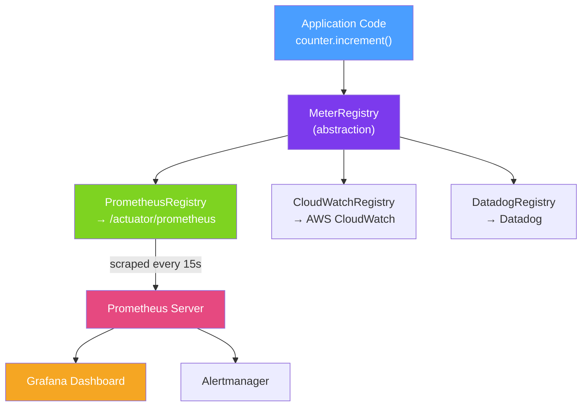

# 📈 Metrics with Micrometer

> [!abstract] TL;DR
> **Micrometer** is the vendor-neutral metrics facade for JVM applications — analogous to SLF4J for logging. It provides a unified API for recording counters, timers, gauges, and distribution summaries, then exports those metrics to any monitoring backend (Prometheus, CloudWatch, Datadog, InfluxDB) by swapping a registry dependency. Spring Boot auto-configures Micrometer and publishes dozens of JVM and Spring metrics out of the box.

## Intuition — analogy FIRST

A Micrometer `MeterRegistry` is like an **airline's flight operations dashboard**. The dashboard shows how many flights departed (Counter), how long each flight takes (Timer), how many seats are currently occupied (Gauge), and the distribution of flight durations (DistributionSummary). The dashboard itself doesn't care whether the data is displayed on a screen in Chicago or Tokyo — you plug in a display adapter (Prometheus registry, CloudWatch registry) and the same data appears in both systems. Your application code only talks to the dashboard API; the backend is swappable.

Tags in Micrometer are like flight attributes — `airline=Delta, route=JFK-LAX`. They let you drill down: "show me all flights from JFK" or "compare on-time rates per airline."

---

## How It Works



## Key Concepts / Details

### Dependencies (Spring Boot)

```xml
<!-- Spring Boot Actuator includes Micrometer -->
<dependency>
    <groupId>org.springframework.boot</groupId>
    <artifactId>spring-boot-starter-actuator</artifactId>
</dependency>

<!-- Prometheus registry -->
<dependency>
    <groupId>io.micrometer</groupId>
    <artifactId>micrometer-registry-prometheus</artifactId>
</dependency>
```

```yaml
# application.yml
management:
  endpoints:
    web:
      exposure:
        include: health,metrics,prometheus
  metrics:
    export:
      prometheus:
        enabled: true
    tags:
      application: ${spring.application.name}  # global tag on all metrics
      environment: ${spring.profiles.active:dev}
```

### Meter Types

#### Counter — counting events that only increase

```java
@Service
public class OrderService {
    private final Counter ordersCreated;
    private final Counter ordersFailed;

    public OrderService(MeterRegistry registry) {
        this.ordersCreated = Counter.builder("orders.created")
                .description("Number of orders successfully created")
                .tag("payment_method", "card")
                .register(registry);

        this.ordersFailed = Counter.builder("orders.failed")
                .description("Number of failed order attempts")
                .register(registry);
    }

    public Order createOrder(OrderRequest req) {
        try {
            Order order = processOrder(req);
            ordersCreated.increment();
            return order;
        } catch (Exception e) {
            ordersFailed.increment();
            throw e;
        }
    }
}
```

#### Timer — measuring duration of operations

```java
private final Timer orderTimer;

public OrderService(MeterRegistry registry) {
    this.orderTimer = Timer.builder("order.processing.duration")
            .description("Time taken to process an order")
            .publishPercentiles(0.5, 0.95, 0.99)  // p50, p95, p99
            .publishPercentileHistogram()            // for Prometheus histogram
            .register(registry);
}

public Order createOrder(OrderRequest req) {
    return orderTimer.record(() -> processOrder(req));  // wraps the call
}

// Or use sample for more control
public Order createOrder(OrderRequest req) {
    Timer.Sample sample = Timer.start(registry);
    try {
        return processOrder(req);
    } finally {
        sample.stop(orderTimer);
    }
}
```

#### Gauge — measuring a current value (can go up or down)

```java
// Register a gauge on an existing collection's size
private final Queue<Order> orderQueue = new ConcurrentLinkedQueue<>();

public OrderService(MeterRegistry registry) {
    Gauge.builder("order.queue.size", orderQueue, Queue::size)
         .description("Current size of the order processing queue")
         .register(registry);

    // Or for AtomicInteger
    AtomicInteger activeConnections = new AtomicInteger(0);
    Gauge.builder("db.connections.active", activeConnections, AtomicInteger::get)
         .register(registry);
}
```

#### @Timed Annotation — simplest timer

```java
@RestController
public class OrderController {

    @Timed(value = "http.orders.get", 
           description = "Time to retrieve an order",
           percentiles = {0.5, 0.95, 0.99})
    @GetMapping("/orders/{id}")
    public Order getOrder(@PathVariable Long id) {
        return orderService.findById(id);
    }
}
```

**Note:** `@Timed` requires `TimedAspect` bean:
```java
@Bean
public TimedAspect timedAspect(MeterRegistry registry) {
    return new TimedAspect(registry);
}
```

### DistributionSummary — value distributions

```java
DistributionSummary orderValueSummary = DistributionSummary
        .builder("order.value")
        .description("Value of created orders in USD")
        .baseUnit("USD")
        .publishPercentiles(0.5, 0.95, 0.99)
        .scale(0.01)  // if storing in cents, scale to dollars
        .register(registry);

// Record each order value
orderValueSummary.record(order.getTotalCentss());
```

### Prometheus Metric Naming

Micrometer converts camelCase/dot names to snake_case with `_total` suffix for counters:
- `orders.created` → `orders_created_total`
- `order.processing.duration` → `order_processing_duration_seconds`

PromQL query examples:
```promql
# Requests per second
rate(http_server_requests_seconds_count[5m])

# 99th percentile latency
histogram_quantile(0.99, rate(order_processing_duration_seconds_bucket[5m]))

# Error rate
sum(rate(http_server_requests_seconds_count{status=~"5.."}[5m]))
/ sum(rate(http_server_requests_seconds_count[5m]))
```

### Built-in Spring Boot Metrics

Spring Boot auto-configures metrics for:
- JVM: `jvm_memory_used_bytes`, `jvm_gc_pause_seconds`, `jvm_threads_live_threads`
- Spring MVC: `http_server_requests_seconds`
- Data source (HikariCP): `hikaricp_connections_active`, `hikaricp_connections_pending`
- Spring Kafka: `kafka_consumer_fetch_manager_records_consumed_rate`

## Real-World Notes

- **Tag cardinality explosion** — using high-cardinality values as tags (user ID, order ID) creates millions of time series and OOMs Prometheus. Tags should have low cardinality (status, region, method).
- **Histogram vs summary** — publish histograms (not summaries) to Prometheus so you can aggregate percentiles across instances. Summaries are computed per-instance and cannot be aggregated.
- **Global tags for service identity** — always tag every metric with `application` and `environment` so Grafana panels can filter by service without ambiguity.
- **Percentile precision** — `publishPercentiles` computes percentiles in the application (low overhead, not aggregatable); `publishPercentileHistogram` sends histogram buckets to Prometheus for server-side computation (aggregatable, higher data volume).

## Common Pitfalls

- **Missing `TimedAspect` bean** — `@Timed` annotations are silently ignored without the `TimedAspect` bean registered. Always verify metrics appear at `/actuator/metrics` after adding `@Timed`.
- **Recording user IDs or request IDs as tags** — these have infinite cardinality; Prometheus will run out of memory storing millions of time series.
- **Not setting percentile histogram** — without `publishPercentileHistogram()`, histogram_quantile PromQL queries return incorrect results.
- **Gauge referencing a garbage-collected object** — Micrometer holds a weak reference to the gauge function; if the monitored object is GC'd, the gauge disappears silently.

## Related Concepts
- [[Spring_Boot_Actuator_Metrics]] — Actuator exposes `/actuator/prometheus` endpoint
- [[Alerting_and_Dashboards]] — Prometheus and Grafana consume Micrometer metrics
- [[Distributed_Tracing]] — Micrometer Tracing builds on the same registry infrastructure

## Review Questions
1. What is the difference between a Counter, Timer, and Gauge in Micrometer? When would you use each?
2. Why should you never use a user ID or order ID as a Micrometer tag?
3. What is the difference between `publishPercentiles` and `publishPercentileHistogram`?

## Sources
- Micrometer Documentation — https://micrometer.io/docs
- Spring Boot Metrics — https://docs.spring.io/spring-boot/docs/current/reference/html/actuator.html#actuator.metrics

#java #spring #micrometer #metrics #prometheus #observability
