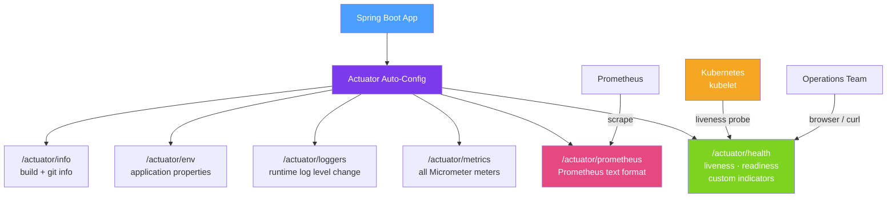

# 🔧 Spring Boot Actuator Metrics

> [!abstract] TL;DR
> **Spring Boot Actuator** provides production-ready HTTP endpoints that expose operational information about your application — health status, metrics, environment, bean definitions, log levels, HTTP trace, and more. It is the single most important dependency for making a Spring Boot service observable and Kubernetes-ready. The `/health` endpoint powers liveness and readiness probes; `/actuator/prometheus` is scraped by Prometheus for metrics.

## Intuition — analogy FIRST

Spring Boot Actuator is like the **instrument panel in an aircraft cockpit**. The pilot (operations team) doesn't need to look at the engine directly — the instrument panel shows altitude (heap usage), airspeed (request rate), fuel level (connection pool), engine temperature (GC pause times), and warning lights (health indicators). The plane (application) continues flying while the instruments provide a real-time view of its health. Without Actuator, you'd need to land the plane (restart) and open the hood every time something seemed wrong.

Kubernetes probes use the `/health` endpoint to decide whether to send traffic to a pod (readiness) or restart it (liveness) — the cockpit instruments tell the airport controller whether the plane is fit to fly.

---

## How It Works



## Key Concepts / Details

### Dependency and Basic Configuration

```xml
<dependency>
    <groupId>org.springframework.boot</groupId>
    <artifactId>spring-boot-starter-actuator</artifactId>
</dependency>
```

```yaml
# application.yml
management:
  server:
    port: 8081       # Expose Actuator on a separate port (recommended)
  endpoints:
    web:
      exposure:
        include: health,metrics,prometheus,info,loggers,env
        # NEVER expose: shutdown, heapdump, env in production without auth
  endpoint:
    health:
      show-details: when-authorized   # show-details: always for dev
      probes:
        enabled: true           # enable /health/liveness and /health/readiness
    shutdown:
      enabled: false            # disable the shutdown endpoint
  info:
    git:
      mode: full                # include git commit info in /info
    build:
      enabled: true             # include build info from META-INF/build-info.properties
```

### Health Endpoint

```json
// GET /actuator/health
{
  "status": "UP",
  "components": {
    "db": { "status": "UP", "details": { "database": "PostgreSQL", "validationQuery": "isValid()" }},
    "diskSpace": { "status": "UP", "details": { "total": 499963174912, "free": 121234567890 }},
    "redis": { "status": "UP" },
    "livenessState": { "status": "UP" },
    "readinessState": { "status": "UP" }
  }
}

// Kubernetes probes
// GET /actuator/health/liveness  → { "status": "UP" } or { "status": "DOWN" }
// GET /actuator/health/readiness → { "status": "UP" } or { "status": "OUT_OF_SERVICE" }
```

### Custom HealthIndicator

```java
@Component
public class ExternalPaymentServiceHealthIndicator implements HealthIndicator {

    private final PaymentServiceClient paymentClient;

    @Override
    public Health health() {
        try {
            boolean reachable = paymentClient.ping();
            if (reachable) {
                return Health.up()
                        .withDetail("payment-service", "reachable")
                        .build();
            } else {
                return Health.down()
                        .withDetail("payment-service", "unreachable")
                        .build();
            }
        } catch (Exception e) {
            return Health.down(e)
                    .withDetail("payment-service", "exception during health check")
                    .build();
        }
    }
}
```

### Metrics Endpoint

```bash
# List all available metrics
curl http://localhost:8081/actuator/metrics

# Get specific metric with tags
curl "http://localhost:8081/actuator/metrics/http.server.requests?tag=status:200"

# Response:
# {
#   "name": "http.server.requests",
#   "measurements": [
#     { "statistic": "COUNT", "value": 1523.0 },
#     { "statistic": "TOTAL_TIME", "value": 45.234 },
#     { "statistic": "MAX", "value": 1.234 }
#   ],
#   "availableTags": [
#     { "tag": "method", "values": ["GET", "POST"] },
#     { "tag": "status", "values": ["200", "404", "500"] }
#   ]
# }
```

### Runtime Log Level Management

```bash
# Check current log level
curl http://localhost:8081/actuator/loggers/com.example.OrderService

# Change log level at runtime (no restart)
curl -X POST http://localhost:8081/actuator/loggers/com.example.OrderService \
     -H "Content-Type: application/json" \
     -d '{"configuredLevel": "DEBUG"}'
```

### Info Endpoint — Build and Git Information

```xml
<!-- Add to pom.xml to generate build info -->
<plugin>
    <groupId>org.springframework.boot</groupId>
    <artifactId>spring-boot-maven-plugin</artifactId>
    <executions>
        <execution>
            <goals>
                <goal>build-info</goal>
            </goals>
        </execution>
    </executions>
</plugin>
```

```yaml
# Custom info properties
info:
  app:
    name: "@project.name@"
    version: "@project.version@"
    team: platform-engineering
```

### Securing Actuator Endpoints

```java
@Configuration
@EnableWebSecurity
public class SecurityConfig {

    @Bean
    public SecurityFilterChain filterChain(HttpSecurity http) throws Exception {
        http
            .authorizeHttpRequests(auth -> auth
                // Allow health/info without auth (for load balancer checks)
                .requestMatchers("/actuator/health/**", "/actuator/info").permitAll()
                // Require ACTUATOR_ADMIN role for sensitive endpoints
                .requestMatchers("/actuator/**").hasRole("ACTUATOR_ADMIN")
                .anyRequest().authenticated()
            );
        return http.build();
    }
}
```

### Key Built-in Health Indicators

| Indicator | What it checks | Auto-configured when |
|-----------|---------------|---------------------|
| `DataSourceHealthIndicator` | DB connection pool | DataSource bean present |
| `RedisHealthIndicator` | Redis PING/PONG | Spring Data Redis present |
| `RabbitHealthIndicator` | RabbitMQ connection | Spring AMQP present |
| `KafkaHealthIndicator` | Kafka broker reachable | Spring Kafka present |
| `DiskSpaceHealthIndicator` | Available disk space | Always |
| `LivenessStateHealthIndicator` | App liveness state | Always (Boot 2.3+) |
| `ReadinessStateHealthIndicator` | App readiness state | Always (Boot 2.3+) |

## Real-World Notes

- **Separate management port** — expose Actuator on port 8081 and keep 8080 for business APIs. This lets you block external access to Actuator via firewall rules while keeping the business port public.
- **Never expose `/env` publicly** — this endpoint exposes all configuration including sanitised secrets. It is invaluable for debugging but should require authentication.
- **Use `show-details: when-authorized`** — detailed health info (DB query status, connection counts) should only be visible to authenticated operators, not public health check callers.
- **Build info enables version tracking** — including git commit hash in `/actuator/info` lets you instantly correlate a deployment with its exact source code during an incident.

## Common Pitfalls

- **Exposing all endpoints by default** — Spring Boot 2 exposed many endpoints by default; Spring Boot 3 defaults to only `health`. Always explicitly set `include` instead of using wildcard `*`.
- **Health indicators timing out** — a slow database health check with a 30s timeout blocks the Kubernetes readiness probe, causing the pod to be marked unready. Set short timeouts on health indicator calls.
- **Not enabling K8s probe endpoints** — `management.endpoint.health.probes.enabled=true` is required for Spring Boot to expose `/health/liveness` and `/health/readiness` at separate paths.
- **Using Actuator port for business traffic** — mixing business APIs on port 8081 with Actuator management breaks the security boundary and makes firewall rules complex.

## Related Concepts
- [[Metrics_Micrometer]] — Micrometer populates the `/actuator/metrics` endpoint
- [[Kubernetes_Java]] — Actuator health endpoints used as liveness/readiness probes
- [[Distributed_Tracing]] — `/actuator/httptrace` for HTTP request history

## Review Questions
1. What is the difference between the `/actuator/health/liveness` and `/actuator/health/readiness` endpoints, and when does each report DOWN?
2. How do you change a logger's level to DEBUG at runtime without restarting the application?
3. Why should the Actuator management port be different from the application's business port in production?

## Sources
- Spring Boot Actuator Documentation — https://docs.spring.io/spring-boot/docs/current/reference/html/actuator.html
- Spring Boot Production-ready Features — https://docs.spring.io/spring-boot/docs/current/reference/html/production-ready-features.html

#java #spring #actuator #observability #metrics #kubernetes
