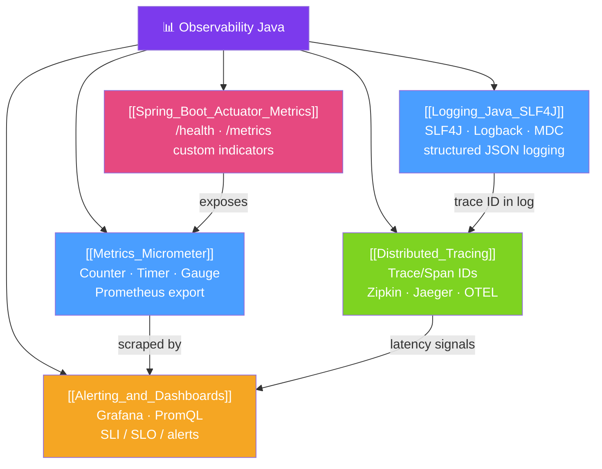

# 📊 Observability Java — Map of Content

> [!abstract] What This Section Covers
> Observability is the ability to understand a system's internal state from its external outputs. For Java services this means three pillars: **structured logs** (what happened), **metrics** (how much / how fast), and **distributed traces** (where time was spent across services). This section covers SLF4J/Logback for production logging, Micrometer for metrics, distributed tracing with Micrometer Tracing, Spring Boot Actuator as the operational API surface, and finally Prometheus/Grafana for alerting and dashboards.

## Concept Map

## Learning Path
1. [[Logging_Java_SLF4J]] — Set up structured JSON logging with SLF4J, Logback, and MDC context.
2. [[Spring_Boot_Actuator_Metrics]] — Expose health, metrics, and operational endpoints via Actuator.
3. [[Metrics_Micrometer]] — Record custom counters, timers, and gauges; export to Prometheus.
4. [[Distributed_Tracing]] — Propagate trace IDs across service calls for end-to-end request visibility.
5. [[Alerting_and_Dashboards]] — Build Grafana dashboards and Prometheus alerts based on SLI/SLO definitions.

## All Notes at a Glance
| Note | Difficulty | What You'll Learn |
|------|------------|-------------------|
| [[Logging_Java_SLF4J]] | Beginner | SLF4J facade, Logback config, MDC for request context, structured JSON logging |
| [[Metrics_Micrometer]] | Intermediate | Counter/Timer/Gauge/DistributionSummary, @Timed, Prometheus export, custom tags |
| [[Distributed_Tracing]] | Intermediate | Trace/span model, W3C traceparent, Micrometer Tracing, Zipkin/Jaeger integration |
| [[Spring_Boot_Actuator_Metrics]] | Intermediate | Actuator endpoints, health indicators, K8s probes, endpoint security |
| [[Alerting_and_Dashboards]] | Advanced | Four golden signals, PromQL, Grafana dashboards, SLO alerting, on-call runbooks |

## Key Questions This Section Answers
- How do you add a request correlation ID to every log line without changing each logger call?
- What is the difference between a Counter, Timer, and Gauge in Micrometer?
- How do trace IDs flow from service A to service B in an HTTP call?
- What is the difference between a liveness probe and a readiness probe in Spring Boot Actuator?
- How do you write a Prometheus alert that fires only when error rate exceeds 1% for 5 minutes?
- What are the four golden signals and how do you measure each one for a Spring Boot service?

## Related Sections
- [[_MOC_Java_Master|↑ Java Master MOC]]
- [[_MOC_Cloud_Native_Java|→ Cloud Native Java]]
- [[_MOC_Testing_Advanced|→ Testing Advanced]]

#MOC #java #observability #monitoring #logging #metrics #tracing
