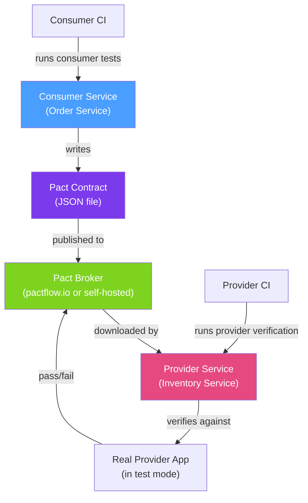

# 📜 Contract Testing

> [!abstract] TL;DR
> **Contract testing** verifies that a service API consumer and provider agree on the interface — preventing breaking changes from reaching production. In **consumer-driven contracts** (Pact, Spring Cloud Contract), the consumer writes the expected interactions as a "contract" that is automatically verified against the real provider. This catches API breakage in CI, long before integration testing or manual QA.

## Intuition — analogy FIRST

Imagine two departments in a company — the Marketing team (consumer) needs the IT team (provider) to produce monthly sales reports in a specific CSV format. Instead of Marketing checking each month whether IT changed the format, they write a **contract**: "the report must have columns Date, Revenue, Region in that order, with Revenue as a decimal." IT's CI pipeline automatically verifies their report-generation code against Marketing's contract before any release. If IT changes the format, the contract test fails immediately — the problem is caught before the broken report reaches Marketing's spreadsheet.

Traditional integration tests check a specific example ("did this exact request return this exact response?"). Contract tests check the **shape and semantics** of the interface: does the provider still fulfill what the consumer expects? They decouple the consumer and provider test suites — each can run independently.

---

## How It Works



## Key Concepts / Details

### Pact — Consumer Side

```java
@ExtendWith(PactConsumerTestExt.class)
@PactTestFor(providerName = "inventory-service", port = "8081")
class OrderServiceContractTest {

    @Pact(consumer = "order-service", provider = "inventory-service")
    public RequestResponsePact checkInventoryPact(PactDslWithProvider builder) {
        return builder
            .given("product-123 has 10 units in stock")
            .uponReceiving("a request to check inventory for product-123")
                .path("/inventory/product-123")
                .method("GET")
                .headers(Map.of("Accept", "application/json"))
            .willRespondWith()
                .status(200)
                .headers(Map.of("Content-Type", "application/json"))
                .body(new PactDslJsonBody()
                    .stringType("productId", "product-123")
                    .integerType("quantity", 10)
                    .booleanType("available", true))
            .toPact();
    }

    @Test
    @PactTestFor(pactMethod = "checkInventoryPact")
    void checkInventory_returnsAvailable(MockServer mockServer) {
        // The consumer code is tested against the Pact mock server
        InventoryClient client = new InventoryClient("http://localhost:" + mockServer.getPort());
        InventoryResponse response = client.checkInventory("product-123");

        assertThat(response.isAvailable()).isTrue();
        assertThat(response.getQuantity()).isGreaterThan(0);
    }
}
```

### Pact — Provider Verification

```java
@Provider("inventory-service")
@PactBroker(url = "https://pactbroker.mycompany.com",
             authentication = @PactBrokerAuth(token = "${PACT_BROKER_TOKEN}"))
@SpringBootTest(webEnvironment = SpringBootTest.WebEnvironment.RANDOM_PORT)
class InventoryServicePactVerificationTest {

    @LocalServerPort
    int port;

    @BeforeEach
    void setUp(PactVerificationContext context) {
        context.setTarget(new HttpTestTarget("localhost", port));
    }

    @TestTemplate
    @ExtendWith(PactVerificationInvocationContextProvider.class)
    void verifyPacts(PactVerificationContext context) {
        context.verifyInteraction();
    }

    // Provider state setup — runs before each interaction that has "given()" state
    @State("product-123 has 10 units in stock")
    void setupProductInStock() {
        // Insert test data or configure mocks
        inventoryRepository.save(new Inventory("product-123", 10));
    }
}
```

### Spring Cloud Contract (Alternative)

Spring Cloud Contract is the Spring-native approach — contracts are written as Groovy/YAML DSL files, and the framework auto-generates both consumer stubs and provider tests.

```groovy
// src/test/resources/contracts/inventory/getInventory.groovy
import org.springframework.cloud.contract.spec.Contract

Contract.make {
    description "Should return inventory for a valid product ID"

    request {
        method GET()
        url "/inventory/product-123"
        headers { accept(applicationJson()) }
    }

    response {
        status OK()
        body(
            productId: "product-123",
            quantity: $(producer(anyNumber()), consumer(10)),
            available: true
        )
        headers { contentType(applicationJson()) }
    }
}
```

Spring Cloud Contract generates:
1. **WireMock stub** (JAR) for consumers to use in their tests
2. **JUnit test** for the provider to verify its implementation

### Consumer Using Generated Stub

```java
@SpringBootTest
@AutoConfigureStubRunner(
    ids = "com.example:inventory-service:+:stubs:8081",
    stubsMode = StubRunnerProperties.StubsMode.LOCAL   // or REMOTE for Nexus/Artifactory
)
class OrderServiceTest {

    @Autowired
    private OrderService orderService;

    @Test
    void createOrder_checksInventoryViaStub() {
        // The stub server (WireMock) runs on port 8081
        // OrderService makes HTTP call to "inventory-service"
        Order order = orderService.createOrder(new OrderRequest("product-123", 2));
        assertThat(order.getStatus()).isEqualTo(OrderStatus.PENDING);
    }
}
```

### Pact vs Spring Cloud Contract

| Aspect | Pact | Spring Cloud Contract |
|--------|------|----------------------|
| Language support | Polyglot (JS, Go, .NET, Python, Java) | Primarily Spring/JVM |
| Contract format | Pact JSON | Groovy DSL / YAML |
| Stub generation | WireMock (via plugin) | WireMock (built-in) |
| Broker | Pact Broker / PactFlow | Git / Nexus / Artifactory |
| Provider state | `@State` annotation | `@BeforeEach` / explicit setup |
| Best for | Multi-language orgs, complex microservices | Spring-only orgs |

### Publishing and Can-I-Deploy

```bash
# Publish pact to broker after consumer tests
./mvnw pact:publish

# Check if it's safe to deploy consumer (all provider contracts verified?)
pact-broker can-i-deploy \
  --pacticipant order-service \
  --version 1.2.0 \
  --to-environment production
# Returns: "Computer says yes" or lists failing contracts
```

## Real-World Notes

- **Contracts are living documentation** — the Pact Broker's network diagram shows exactly which services depend on which API shapes, creating an automatically-maintained service dependency map.
- **"Can I deploy?" is the killer feature** — before any deployment, CI asks Pact Broker "has every consumer's contract been verified by this provider version?" It's a deployment gate that prevents API breakage.
- **Don't test business logic in contracts** — contracts verify the API shape (HTTP status, field names, types), not business rules ("does discount apply correctly"). Business logic belongs in unit tests.
- **Provider state setup complexity** — for each `given()` clause in a Pact, you need corresponding provider state setup code. Keep states simple and avoid sharing state between interactions.

## Common Pitfalls

- **Testing too many details in contracts** — contracts that assert exact values (e.g., `quantity: 10`) become brittle. Use type matchers (`integerType()`) for values that change between environments.
- **Consumer tests passing but provider verification failing** — the consumer tests only verify that the consumer correctly uses the mock; they don't verify that the provider implements the contract. Both sides must run.
- **Not version-tagging pacts** — unversioned pacts make it impossible to correlate a consumer version with a provider verification. Always publish with the application version.
- **Circular dependencies in verification order** — if Service A consumes Service B and Service B consumes Service A, you need a strategy for bootstrapping contract verification order in CI.

## Related Concepts
- [[Integration_Testing_Spring]] — Use WireMock stubs from contract tests as HTTP mocks
- [[Test_Containers]] — Provider verification may need a real database
- [[Performance_Testing_Java]] — Load test against the real provider API after contract tests pass

## Review Questions
1. What is the difference between an integration test and a consumer-driven contract test?
2. What does "can-I-deploy" in Pact check, and why is it valuable as a deployment gate?
3. When should you use type matchers (`integerType()`) instead of exact value matchers in a Pact contract?

## Sources
- Pact Documentation — https://docs.pact.io/
- Spring Cloud Contract Reference — https://spring.io/projects/spring-cloud-contract
- PactFlow — https://pactflow.io/

#java #spring #testing #contracts #pact #spring-cloud-contract #consumer-driven
