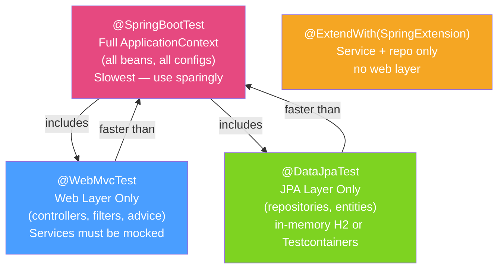

# 🔗 Integration Testing with Spring

> [!abstract] TL;DR
> Spring integration tests verify that multiple components work correctly together — database, HTTP layer, business logic — without deploying to a real server. **Test slices** (`@WebMvcTest`, `@DataJpaTest`) start only the relevant layer, making tests fast. **`@SpringBootTest`** starts the full context for end-to-end tests. **MockMvc** lets you test HTTP controllers without a real server, while **Testcontainers** provides real databases.

## Intuition — analogy FIRST

Unit tests are like testing individual LEGO bricks for structural integrity. Integration tests are like assembling a section of the model and checking that the bricks connect correctly and the bridge holds weight. **Test slices** are like testing just the arch section (web layer) or just the base (database layer) in isolation — much faster than testing the whole castle every time. **`@SpringBootTest`** tests the full castle assembly.

The test pyramid guides the balance: many unit tests (fast, isolated), fewer integration tests (slower, realistic), and a small number of full end-to-end tests. Test slices let you push integration tests down the pyramid — they test multiple real components but still avoid the full application startup cost.

---

## How It Works



## Key Concepts / Details

### @WebMvcTest — Controller Layer Only

```java
@WebMvcTest(OrderController.class)
class OrderControllerTest {

    @Autowired
    private MockMvc mockMvc;

    @MockBean                    // Mockito mock injected into Spring context
    private OrderService orderService;

    @Autowired
    private ObjectMapper objectMapper;

    @Test
    void createOrder_returnsCreated_whenValidRequest() throws Exception {
        // Arrange
        OrderRequest req = new OrderRequest("product-123", 2);
        Order saved = new Order(1L, "product-123", 2, OrderStatus.PENDING);
        when(orderService.create(any())).thenReturn(saved);

        // Act & Assert
        mockMvc.perform(
                post("/orders")
                    .contentType(MediaType.APPLICATION_JSON)
                    .content(objectMapper.writeValueAsString(req)))
            .andExpect(status().isCreated())
            .andExpect(jsonPath("$.id").value(1))
            .andExpect(jsonPath("$.status").value("PENDING"));

        verify(orderService).create(any(OrderRequest.class));
    }

    @Test
    void createOrder_returns400_whenInvalidRequest() throws Exception {
        mockMvc.perform(
                post("/orders")
                    .contentType(MediaType.APPLICATION_JSON)
                    .content("{}"))  // missing required fields
            .andExpect(status().isBadRequest());
    }
}
```

### @DataJpaTest — Repository Layer Only

```java
@DataJpaTest
// By default uses in-memory H2. To use real DB with Testcontainers:
// @AutoConfigureTestDatabase(replace = AutoConfigureTestDatabase.Replace.NONE)
class OrderRepositoryTest {

    @Autowired
    private OrderRepository orderRepository;

    @Autowired
    private TestEntityManager entityManager;

    @Test
    void findByCustomerId_returnsOrders() {
        // Arrange — persist test data
        Order order = new Order(null, "product-1", 3, OrderStatus.PAID);
        order.setCustomerId(42L);
        entityManager.persist(order);
        entityManager.flush();

        // Act
        List<Order> found = orderRepository.findByCustomerId(42L);

        // Assert
        assertThat(found).hasSize(1);
        assertThat(found.get(0).getProductId()).isEqualTo("product-1");
    }

    @Test
    @Transactional  // auto-rolled back after test
    void save_persistsOrder() {
        Order order = orderRepository.save(new Order(null, "product-2", 1, OrderStatus.PENDING));
        assertThat(order.getId()).isNotNull();
    }
}
```

### @SpringBootTest — Full Integration

```java
@SpringBootTest(webEnvironment = SpringBootTest.WebEnvironment.RANDOM_PORT)
class OrderApiIntegrationTest {

    @Autowired
    private TestRestTemplate restTemplate;

    @Autowired
    private OrderRepository orderRepository;

    @Test
    void createAndRetrieveOrder_endToEnd() {
        // Create order
        OrderRequest req = new OrderRequest("product-123", 2);
        ResponseEntity<Order> createResponse = restTemplate.postForEntity(
                "/orders", req, Order.class);

        assertThat(createResponse.getStatusCode()).isEqualTo(HttpStatus.CREATED);
        Long orderId = createResponse.getBody().getId();

        // Retrieve order
        ResponseEntity<Order> getResponse = restTemplate.getForEntity(
                "/orders/" + orderId, Order.class);

        assertThat(getResponse.getStatusCode()).isEqualTo(HttpStatus.OK);
        assertThat(getResponse.getBody().getId()).isEqualTo(orderId);
    }
}
```

### MockMvc — Request Builders and Matchers

```java
// GET with query params
mockMvc.perform(get("/orders")
        .param("status", "PAID")
        .param("page", "0")
        .header("Authorization", "Bearer " + jwtToken))
    .andExpect(status().isOk())
    .andExpect(jsonPath("$.content", hasSize(greaterThan(0))))
    .andExpect(jsonPath("$.totalElements").isNumber())
    .andDo(print());   // prints full request/response to console — useful for debugging

// File upload
mockMvc.perform(multipart("/documents")
        .file(new MockMultipartFile("file", "test.pdf", "application/pdf", pdfBytes)))
    .andExpect(status().isOk());
```

### @TestConfiguration and @Import

```java
@TestConfiguration
public class TestConfig {

    @Bean
    @Primary
    public EmailService mockEmailService() {
        return Mockito.mock(EmailService.class);  // replace real email service in tests
    }
}

@SpringBootTest
@Import(TestConfig.class)
class OrderServiceIntegrationTest { ... }
```

### @Sql for Test Data Setup

```java
@DataJpaTest
class OrderRepositoryTest {

    @Test
    @Sql(scripts = "/sql/insert-test-orders.sql",
         executionPhase = Sql.ExecutionPhase.BEFORE_TEST_METHOD)
    @Sql(scripts = "/sql/cleanup.sql",
         executionPhase = Sql.ExecutionPhase.AFTER_TEST_METHOD)
    void findPaidOrders_returnsExpectedCount() {
        assertThat(orderRepository.findByStatus(OrderStatus.PAID)).hasSize(3);
    }
}
```

### Test Slice Comparison

| Annotation | What loads | Typical use |
|-----------|-----------|-------------|
| `@WebMvcTest` | Controllers, filters, security, advice | Controller unit tests |
| `@DataJpaTest` | JPA entities, repositories, DataSource | Repository tests |
| `@DataMongoTest` | Mongo repositories | MongoDB repository tests |
| `@JsonTest` | Jackson ObjectMapper only | Serialisation tests |
| `@SpringBootTest(MOCK)` | Full context + MockMvc | Full integration, no HTTP port |
| `@SpringBootTest(RANDOM_PORT)` | Full context + real HTTP | End-to-end API tests |

## Real-World Notes

- **@DataJpaTest rolls back by default** — each test is wrapped in a transaction that rolls back after completion. Use `@Commit` only for tests that verify post-commit state (e.g., auto-generated IDs).
- **@WebMvcTest auto-configures Spring Security** — if your controller has security annotations, Spring Security is active in `@WebMvcTest`. Use `@WithMockUser` to simulate authenticated users.
- **Avoid @SpringBootTest for everything** — a full application context can take 15–30 seconds to start. Use slices for the 80% of tests that only touch one layer.
- **`@MockBean` resets between tests** — unlike plain Mockito mocks, `@MockBean` instances are reset after each test class (but shared within a class). Avoid configuring shared state in `@BeforeAll`.

## Common Pitfalls

- **H2 compatibility issues with PostgreSQL-specific SQL** — H2 in compatibility mode works for standard SQL but fails on Postgres-specific types (UUID, JSONB, array types). Use Testcontainers with real PostgreSQL instead.
- **@Transactional on @SpringBootTest test methods** — transactions in full-context tests don't roll back HTTP requests because they run in a different transaction than the test's transaction. Use `@DirtiesContext` or manual cleanup instead.
- **Context caching with @MockBean** — adding `@MockBean` to any test class forces a new ApplicationContext creation, breaking context caching across test classes. Put `@MockBean` in a shared base class or use a single test slice context.
- **Missing `@ActiveProfiles("test")`** — without a test profile, your test may connect to a real external database or queue. Always configure a test profile that uses in-memory or Testcontainers dependencies.

## Related Concepts
- [[Test_Containers]] — Replace H2 with real PostgreSQL in @DataJpaTest
- [[Contract_Testing]] — Stub server responses in @WebMvcTest with WireMock
- [[Performance_Testing_Java]] — JMH for benchmarking specific service methods

## Review Questions
1. What is the difference between `@WebMvcTest` and `@SpringBootTest(MOCK_MVC)` in terms of what Spring beans are loaded?
2. Why does `@Transactional` on a `@SpringBootTest` test method not roll back HTTP requests made via `TestRestTemplate`?
3. Why might you prefer Testcontainers over H2 for `@DataJpaTest` even though H2 is faster?

## Sources
- Spring Boot Testing Documentation — https://docs.spring.io/spring-boot/docs/current/reference/html/test-auto-configuration.html
- Spring Framework Testing — https://docs.spring.io/spring-framework/docs/current/reference/html/testing.html

#java #spring #testing #integration #mockmvc #webmvctest #datajpatest
