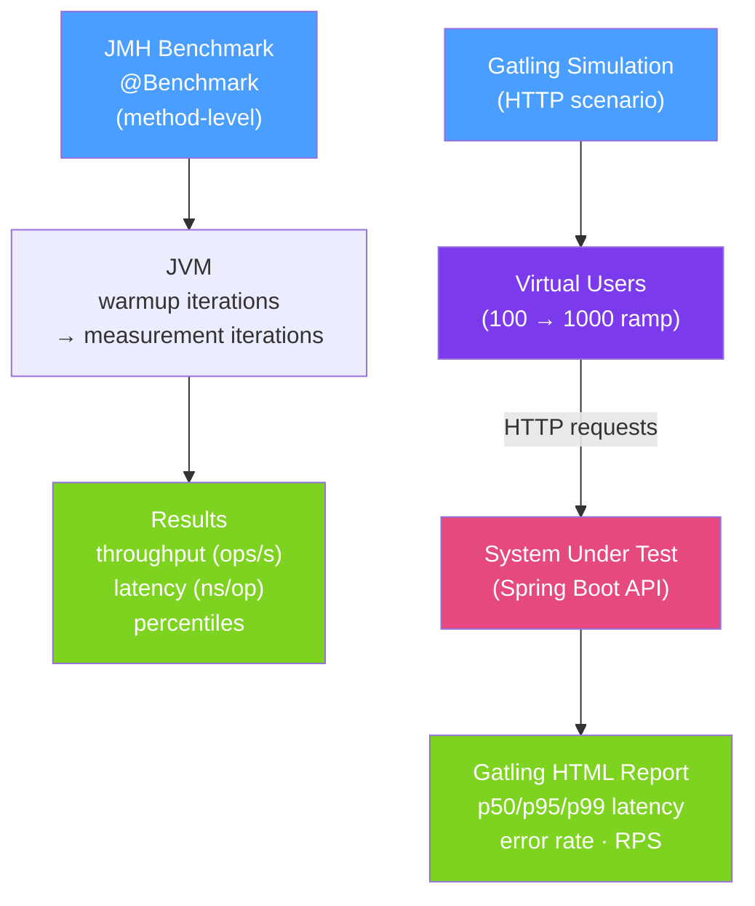

# ⚡ Performance Testing Java

> [!abstract] TL;DR
> Performance testing in Java spans two levels: **microbenchmarks** with JMH (Java Microbenchmark Harness) measure the performance of individual methods or algorithms under controlled JVM conditions, while **load testing** with Gatling or k6 measures entire HTTP APIs under realistic concurrent user load. Both require careful setup to avoid JIT warmup skewing results and to measure the right percentiles (p99 matters more than average).

## Intuition — analogy FIRST

**JMH** is like a **precision instrument in a controlled lab** — you test how fast a single chemical reaction runs, controlling temperature, humidity, and measurement error. The JVM's JIT compiler is like temperature drift that must be accounted for via warmup iterations. Benchmarking `String.format()` vs `StringBuilder` in a real application is meaningless without isolating JIT effects — JMH does this automatically.

**Gatling** is like a **fire hose test on a complete building** — you simulate 500 simultaneous users hitting your API for 10 minutes and measure whether pipes burst (errors spike), pressure drops (latency degrades), or the building handles it gracefully. You care about throughput (requests per second), latency distribution (p99 < 500ms?), and error rate under sustained load.

---

## How It Works



## Key Concepts / Details

### JMH — Java Microbenchmark Harness

```xml
<!-- pom.xml -->
<dependency>
    <groupId>org.openjdk.jmh</groupId>
    <artifactId>jmh-core</artifactId>
    <version>1.37</version>
    <scope>test</scope>
</dependency>
<dependency>
    <groupId>org.openjdk.jmh</groupId>
    <artifactId>jmh-generator-annprocess</artifactId>
    <version>1.37</version>
    <scope>test</scope>
</dependency>
```

```java
@BenchmarkMode(Mode.AverageTime)       // Measure average time per operation
@OutputTimeUnit(TimeUnit.NANOSECONDS)
@State(Scope.Thread)                   // One state instance per benchmark thread
@Warmup(iterations = 5, time = 1)     // 5 warmup iterations × 1 second
@Measurement(iterations = 10, time = 1) // 10 measurement iterations × 1 second
@Fork(2)                               // Run in 2 separate JVM forks (avoids JIT profile pollution)
public class StringConcatBenchmark {

    private String first = "Hello";
    private String second = "World";

    @Benchmark
    public String stringConcat() {
        return first + " " + second;   // String concatenation
    }

    @Benchmark
    public String stringBuilder() {
        return new StringBuilder(first).append(" ").append(second).toString();
    }

    @Benchmark
    public String stringFormat() {
        return String.format("%s %s", first, second);
    }

    public static void main(String[] args) throws Exception {
        org.openjdk.jmh.Main.main(args);
    }
}
```

### JMH Benchmark Modes

| Mode | Measures | Use When |
|------|---------|---------|
| `Throughput` | Operations per second | Maximising RPS |
| `AverageTime` | Average time per op | Minimising latency |
| `SampleTime` | Percentiles (p99, p999) | Latency distribution |
| `SingleShotTime` | One cold invocation | Cold-start / first-call cost |

### JMH Pitfall: Dead Code Elimination

```java
// WRONG: JIT may eliminate computation if result is unused
@Benchmark
public void badBenchmark() {
    Math.sqrt(1234567.89);   // result not used → JIT eliminates the call
}

// CORRECT: Use @Blackhole or return the result
@Benchmark
public double goodBenchmark(Blackhole bh) {
    double result = Math.sqrt(1234567.89);
    bh.consume(result);      // prevents dead code elimination
    return result;           // or return it
}
```

### JMH @Setup and @TearDown

```java
@State(Scope.Thread)
public class DatabaseBenchmark {
    private DataSource dataSource;
    private Connection connection;

    @Setup(Level.Trial)     // once per @Fork
    public void setupDataSource() {
        dataSource = createConnectionPool();
    }

    @Setup(Level.Invocation) // before every @Benchmark call (expensive!)
    public void getConnection() throws Exception {
        connection = dataSource.getConnection();
    }

    @TearDown(Level.Invocation)
    public void closeConnection() throws Exception {
        connection.close();
    }

    @Benchmark
    public ResultSet runQuery() throws Exception {
        return connection.createStatement()
                .executeQuery("SELECT 1");
    }
}
```

### Gatling Load Test

```scala
// OrderServiceSimulation.scala
import io.gatling.core.Predef._
import io.gatling.http.Predef._
import scala.concurrent.duration._

class OrderServiceSimulation extends Simulation {

  val httpProtocol = http
    .baseUrl("http://localhost:8080")
    .acceptHeader("application/json")
    .contentTypeHeader("application/json")

  val createOrderScenario = scenario("Create Order")
    .exec(
      http("POST /orders")
        .post("/orders")
        .body(StringBody("""{"productId": "product-123", "quantity": 2}"""))
        .check(status.is(201))
        .check(jsonPath("$.id").saveAs("orderId"))
    )
    .pause(100.milliseconds)
    .exec(
      http("GET /orders/{id}")
        .get("/orders/#{orderId}")
        .check(status.is(200))
    )

  setUp(
    createOrderScenario.inject(
      rampUsersPerSec(10) to 100 during 60.seconds,  // ramp from 10 to 100 RPS over 1 min
      constantUsersPerSec(100) during 5.minutes       // hold at 100 RPS for 5 minutes
    )
  ).protocols(httpProtocol)
   .assertions(
     global.responseTime.percentile(99).lt(500),       // p99 < 500ms
     global.successfulRequests.percent.gt(99)          // error rate < 1%
   )
}
```

### Running Gatling

```bash
# Maven
./mvnw gatling:test -Dgatling.simulationClass=OrderServiceSimulation

# View HTML report
open target/gatling/orderservicesimulation-*/index.html
```

### Interpreting Results

| Metric | What it tells you | Concern threshold |
|--------|------------------|-------------------|
| **p50 (median)** | Typical user experience | > 200ms for CRUD |
| **p95** | 1 in 20 requests | > 500ms |
| **p99** | 1 in 100 requests (SLO-relevant) | > 1000ms |
| **p999** | 1 in 1000 (tail latency) | Indicates GC pauses |
| **Error rate** | % of failed requests | > 0.1% investigate |
| **Throughput** | Requests per second capacity | Validate against SLA |

## Real-World Notes

- **Always use JMH for JVM microbenchmarks** — naive `System.nanoTime()` before/after tests are unreliable because JIT compile profiling is reset between test runs and GC may pause during measurement.
- **Gatling simulations belong in CI** — run a smoke load test (10 RPS, 1 min) in CI pipelines to catch regressions. Full load tests (100+ RPS, 30 min) run nightly or pre-release.
- **Flame graphs identify bottlenecks** — after a Gatling run reveals high latency, use `async-profiler` with a flame graph to identify which Java methods consume the most CPU time.
- **p99 is your SLO target, not average** — optimise for tail latency. A 50ms average with 5000ms p99 means 1% of users have terrible experiences. p99 is what users complain about.

## Common Pitfalls

- **JMH without warmup** — the JVM starts interpreting bytecode, then compiles hot methods. Without warmup iterations, you're benchmarking the interpreter, not the JIT-compiled code.
- **Benchmarking with insufficient iterations** — too few iterations lead to high variance. JMH's default iteration counts are sufficient; don't reduce them.
- **Load testing against localhost** — network overhead on localhost is essentially zero; load test against a realistic environment (staging) over real network paths.
- **Ignoring think time in Gatling** — real users pause between actions (`.pause()`). Omitting pauses simulates a denial-of-service attack, not real usage patterns.

## Related Concepts
- [[Integration_Testing_Spring]] — Functional correctness before performance testing
- [[Test_Containers]] — Realistic performance tests need real databases, not in-memory H2
- [[Alerting_and_Dashboards]] — Monitor p99 latency in production to validate load test predictions

## Review Questions
1. What are "warmup iterations" in JMH and why are they necessary?
2. Why does using `@Blackhole` or returning a result in JMH benchmarks matter?
3. Why should you optimise p99 latency rather than average latency?

## Sources
- JMH Documentation — https://github.com/openjdk/jmh
- Gatling Documentation — https://gatling.io/docs/
- Aleksey Shipilev's JMH Tutorial — https://shipilev.net/talks/devoxx-Nov2013-benchmarking.pdf

#java #testing #performance #jmh #gatling #load-testing #benchmarking
