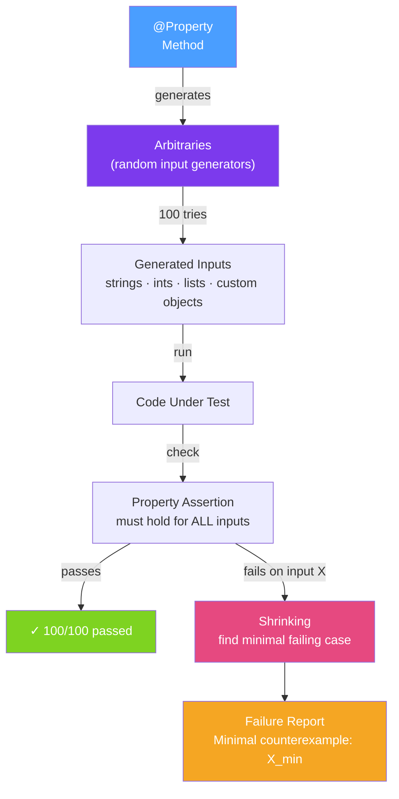

# 🎲 Property-Based Testing

> [!abstract] TL;DR
> **Property-based testing** generates hundreds of random inputs automatically and verifies that a **property** (a universal invariant) holds for all of them — unlike example-based testing which checks one specific input/output pair. When a property fails, the framework **shrinks** the failing input to the simplest possible counterexample. In Java, **jqwik** is the premier property-based testing library, integrating natively with JUnit 5.

## Intuition — analogy FIRST

Example-based testing is like a **bank auditor who checks 5 specific transactions**: "did this $100 deposit work? Did this $50 withdrawal work?" They're only as good as the examples chosen. Property-based testing is like an auditor who has an **automated system that generates 10,000 random transactions** and verifies that for every single one: account balance is never negative, total money in the system is conserved, and withdrawal never exceeds balance. The automated system finds the one weird edge case you never thought to test — like a $0 deposit, or a withdrawal of Integer.MAX_VALUE.

The "property" is the invariant — a truth that must hold for all inputs, not just the ones you thought of. Once a property fails, the framework tries smaller and smaller inputs until it finds the **minimal failing case** (shrinking) — instead of "fails with this 10,000-character string", it tells you "fails with the empty string".

---

## How It Works



## Key Concepts / Details

### jqwik Dependency

```xml
<dependency>
    <groupId>net.jqwik</groupId>
    <artifactId>jqwik</artifactId>
    <version>1.8.3</version>
    <scope>test</scope>
</dependency>
```

### Basic Property Example

```java
import net.jqwik.api.*;

class ListReverseProperties {

    // Property: reversing a list twice gives the original list
    @Property
    void reversingTwiceGivesOriginal(@ForAll List<Integer> list) {
        List<Integer> reversed = reverse(list);
        List<Integer> reversedAgain = reverse(reversed);

        assertThat(reversedAgain).isEqualTo(list);  // must hold for ALL inputs
    }

    // Property: sorting a list gives an ordered result
    @Property
    void sortedListIsOrdered(@ForAll List<@IntRange(min = -1000, max = 1000) Integer> list) {
        List<Integer> sorted = list.stream().sorted().collect(Collectors.toList());

        for (int i = 0; i < sorted.size() - 1; i++) {
            assertThat(sorted.get(i)).isLessThanOrEqualTo(sorted.get(i + 1));
        }
    }

    // Property: list size is preserved after filtering + mapping
    @Property
    void sizePreservationAfterMap(@ForAll List<String> list) {
        List<String> mapped = list.stream().map(String::toUpperCase).collect(Collectors.toList());
        assertThat(mapped).hasSize(list.size());
    }
}
```

### Constrained Input Generation

```java
class MoneyTransferProperties {

    // Constrain integer range
    @Property
    void depositIncreasesBalance(@ForAll @IntRange(min = 1, max = 10000) int amount) {
        BankAccount account = new BankAccount(100);
        account.deposit(amount);
        assertThat(account.getBalance()).isEqualTo(100 + amount);
    }

    // String constraints
    @Property
    void usernameValidation(@ForAll @StringLength(min = 3, max = 50)
                            @AlphaChars String username) {
        assertThat(UserValidator.isValid(username)).isTrue();
    }

    // Non-null strings
    @Property
    void emailParserNeverThrows(@ForAll @NotEmpty String input) {
        // Property: parser must not throw for any non-empty string
        assertThatCode(() -> EmailParser.parse(input))
            .doesNotThrowAnyException();  // it may return empty Optional, but must not throw
    }
}
```

### Custom Arbitraries — Generating Domain Objects

```java
class OrderProperties {

    @Provide
    Arbitrary<Order> validOrders() {
        Arbitrary<String> productIds = Arbitraries.strings()
            .alpha().ofMinLength(5).ofMaxLength(20).map(s -> "product-" + s);
        Arbitrary<Integer> quantities = Arbitraries.integers().between(1, 100);
        Arbitrary<BigDecimal> prices = Arbitraries.bigDecimals()
            .between(BigDecimal.valueOf(0.01), BigDecimal.valueOf(9999.99))
            .ofScale(2);

        return Combinators.combine(productIds, quantities, prices)
            .as((productId, qty, price) -> new Order(productId, qty, price));
    }

    // Property: total must always equal unit price × quantity
    @Property
    void totalIsQuantityTimesPrice(@ForAll("validOrders") Order order) {
        BigDecimal expected = order.getUnitPrice()
            .multiply(BigDecimal.valueOf(order.getQuantity()));
        assertThat(order.calculateTotal()).isEqualByComparingTo(expected);
    }

    // Property: an order is never negative total
    @Property
    void totalIsNeverNegative(@ForAll("validOrders") Order order) {
        assertThat(order.calculateTotal()).isGreaterThanOrEqualTo(BigDecimal.ZERO);
    }
}
```

### Shrinking in Action

```java
@Property
void stringSplitNeverLosesCharacters(@ForAll String input) {
    String[] parts = input.split(",");
    int totalLength = Arrays.stream(parts).mapToInt(String::length).sum();
    // BUG: if input is empty, split returns [""], which has length 0 but original has length 0 too...
    // jqwik shrinks to: input = "" — the minimal failing case
    assertThat(totalLength).isEqualTo(input.length());
}
// After shrinking, jqwik reports: Minimal failing case: input = "a,b"
// (commas are lost in the count — they're not counted in parts)
```

### Property vs Example-Based Comparison

| Aspect | Example-Based (@Test) | Property-Based (@Property) |
|--------|----------------------|---------------------------|
| **Input** | Manually chosen | Auto-generated (100+ random) |
| **Coverage** | What you thought of | What you didn't think of |
| **Documentation** | "does this specific case work" | "this invariant always holds" |
| **Shrinking** | N/A | Minimises failing case automatically |
| **Maintenance** | Low — fixed inputs | Medium — need to define properties |
| **Best for** | Business rules, specific formats | Algorithms, parsers, data transformations |

### When to Use Property-Based Testing

- **Parsers and serializers** — "parsing then serialising gives the original input"
- **Mathematical functions** — "all outputs are in valid range", "result is commutative"
- **Data transformations** — "no data is lost during transformation"
- **Collections** — "size invariants", "ordering invariants"
- **State machines** — "invalid state transitions are never reached"
- **Security input handling** — "injection characters don't cause crashes"

## Real-World Notes

- **Start with one property per function** — don't try to model everything. Even one property (e.g., "parsing never throws") adds significant value over pure example tests.
- **Properties are living documentation** — a property like `sortedListIsOrdered` precisely documents what "sorted" means more clearly than any doc comment.
- **Use both approaches together** — property tests find unknown unknowns; example tests document known requirements and regressions. Use them as complementary, not competing.
- **jqwik integrates with Kotlin and Groovy** — not just Java; Kotlin's data classes work well with jqwik's `Combinators.combine()`.

## Common Pitfalls

- **Properties that are too weak** — a property that always passes (like "list is not null after processing") finds no bugs. Properties must be strong enough to fail on incorrect implementations.
- **Slow properties due to setup** — each property attempt runs the code (100+ times). If setup is expensive (DB access, HTTP calls), use example tests instead or cache setup with `@Before`.
- **Confusing properties with oracles** — avoid "correct output" properties that require reimplementing the function. Focus on invariants (structural properties) that hold regardless of specific output.
- **Not seeding for reproducibility** — jqwik prints the seed when a property fails. You can rerun the exact failing sequence with `@Property(seed = "12345")` for debugging.

## Related Concepts
- [[Integration_Testing_Spring]] — Combine property tests with Spring test slices
- [[Performance_Testing_Java]] — Property-based testing generates many inputs; combine with JMH to ensure performance properties hold
- [[Contract_Testing]] — Consumer-driven contracts define interface properties

## Review Questions
1. What is the difference between an example-based test and a property-based test? What does each verify?
2. What is "shrinking" in property-based testing, and why is it useful when a property fails?
3. Why would you use `@Provide` with a custom `Arbitrary` instead of `@ForAll` with built-in arbitraries?

## Sources
- jqwik User Guide — https://jqwik.net/docs/current/user-guide.html
- Hypothesis (Python inspiration) — https://hypothesis.readthedocs.io/
- John Hughes: "Testing the Hard Stuff and Staying Sane" — https://www.youtube.com/watch?v=zi0rHwfiX1Q

#java #testing #property-based #jqwik #quickcheck #random-testing
