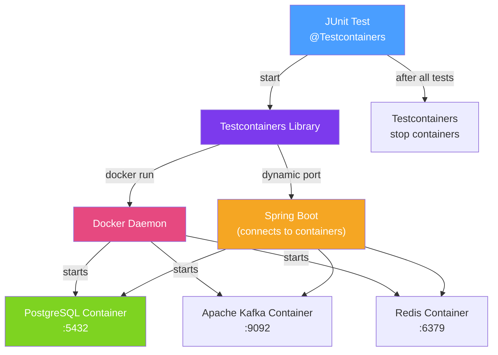

# 🐳 Testcontainers

> [!abstract] TL;DR
> **Testcontainers** is a Java library that spins up **real Docker containers** (PostgreSQL, Redis, Kafka, Elasticsearch, etc.) during JUnit tests. Unlike in-memory databases (H2, HSQLDB), Testcontainers provides production-identical behaviour — same SQL dialect, same constraint enforcement, same connection pool behaviour. Spring Boot 3.1+ provides `@ServiceConnection` for zero-boilerplate integration.

## Intuition — analogy FIRST

Testing with an H2 in-memory database is like practising cooking with fake plastic ingredients — the motion is the same but you never discover how the real ingredients behave (how they brown, how they shrink, how they interact with heat). Testcontainers gives you **real ingredients in a test kitchen** — actual PostgreSQL with its exact constraint enforcement, UUID handling, JSONB support, and transaction isolation behaviour. When the recipe works in the test kitchen with real ingredients, you can be confident it will work in the real restaurant.

The cost is startup time (10–30 seconds for a first PostgreSQL container pull), but **container reuse** across test runs brings this to near-zero after the first run.

---

## How It Works



## Key Concepts / Details

### Dependencies

```xml
<dependency>
    <groupId>org.springframework.boot</groupId>
    <artifactId>spring-boot-testcontainers</artifactId>
    <scope>test</scope>
</dependency>
<dependency>
    <groupId>org.testcontainers</groupId>
    <artifactId>postgresql</artifactId>
    <scope>test</scope>
</dependency>
<dependency>
    <groupId>org.testcontainers</groupId>
    <artifactId>kafka</artifactId>
    <scope>test</scope>
</dependency>
<dependency>
    <groupId>org.testcontainers</groupId>
    <artifactId>junit-jupiter</artifactId>
    <scope>test</scope>
</dependency>
```

### Basic Usage — @Testcontainers + @Container

```java
@Testcontainers
@DataJpaTest
@AutoConfigureTestDatabase(replace = AutoConfigureTestDatabase.Replace.NONE)
class OrderRepositoryTest {

    @Container
    static PostgreSQLContainer<?> postgres = new PostgreSQLContainer<>("postgres:16-alpine")
            .withDatabaseName("testdb")
            .withUsername("test")
            .withPassword("test");

    @DynamicPropertySource
    static void configureProperties(DynamicPropertyRegistry registry) {
        registry.add("spring.datasource.url", postgres::getJdbcUrl);
        registry.add("spring.datasource.username", postgres::getUsername);
        registry.add("spring.datasource.password", postgres::getPassword);
    }

    @Autowired
    private OrderRepository orderRepository;

    @Test
    void save_andRetrieve_withUUID() {
        Order order = orderRepository.save(
            new Order(UUID.randomUUID(), "product-1", 3, OrderStatus.PENDING));

        Optional<Order> found = orderRepository.findById(order.getId());
        assertThat(found).isPresent();
        assertThat(found.get().getProductId()).isEqualTo("product-1");
    }
}
```

### Spring Boot 3.1+ @ServiceConnection (Zero-Boilerplate)

Spring Boot 3.1 introduced `@ServiceConnection` — automatically reads connection details from the container:

```java
@SpringBootTest
@Testcontainers
class OrderServiceIntegrationTest {

    @Container
    @ServiceConnection  // No @DynamicPropertySource needed!
    static PostgreSQLContainer<?> postgres = new PostgreSQLContainer<>("postgres:16-alpine");

    @Container
    @ServiceConnection
    static KafkaContainer kafka = new KafkaContainer(DockerImageName.parse("confluentinc/cp-kafka:7.4.0"));

    @Container
    @ServiceConnection
    static RedisContainer redis = new RedisContainer("redis:7-alpine");

    @Autowired
    private OrderService orderService;

    @Test
    void createOrder_publishesKafkaEvent() {
        // All three containers are running and autowired automatically
        Order order = orderService.createOrder(new OrderRequest("product-1", 2));
        assertThat(order).isNotNull();
    }
}
```

### Reusable Containers — Fastest Startup

```java
// Shared across all tests in the JVM — container NOT stopped after each test class
@Container
static PostgreSQLContainer<?> postgres = new PostgreSQLContainer<>("postgres:16-alpine")
        .withReuse(true);   // Requires ~/.testcontainers.properties: testcontainers.reuse.enable=true
```

```properties
# ~/.testcontainers.properties
testcontainers.reuse.enable=true
```

With `withReuse(true)`, the container persists across test runs in the same session and even between sessions (until manually stopped), eliminating the 5–10 second startup cost.

### Kafka Integration Test Example

```java
@SpringBootTest
@Testcontainers
class KafkaIntegrationTest {

    @Container
    @ServiceConnection
    static KafkaContainer kafka = new KafkaContainer(
            DockerImageName.parse("confluentinc/cp-kafka:7.4.0"));

    @Autowired
    private KafkaTemplate<String, OrderEvent> kafkaTemplate;

    @Autowired
    private OrderEventConsumer consumer;

    @Test
    void publishAndConsume_orderCreatedEvent() throws Exception {
        CountDownLatch latch = new CountDownLatch(1);
        consumer.setLatch(latch);

        kafkaTemplate.send("order-events",
            new OrderEvent("ORDER_CREATED", "order-123"));

        boolean consumed = latch.await(10, TimeUnit.SECONDS);
        assertThat(consumed).isTrue();
        assertThat(consumer.getLastEvent().getOrderId()).isEqualTo("order-123");
    }
}
```

### Common Container Modules

| Module | Docker image | What it tests |
|--------|-------------|---------------|
| `PostgreSQLContainer` | `postgres:16` | JPA repositories, native SQL |
| `KafkaContainer` | `confluentinc/cp-kafka` | Kafka producers/consumers |
| `RedisContainer` | `redis:7` | Spring Cache with Redis |
| `MongoDBContainer` | `mongo:7` | Spring Data MongoDB |
| `ElasticsearchContainer` | `elasticsearch:8` | Search functionality |
| `LocalStackContainer` | `localstack/localstack` | AWS S3, SQS, DynamoDB |
| `WireMockContainer` | `wiremock/wiremock` | HTTP dependency stubs |

### Spring Boot 3.1 Test Development Mode

```java
// src/test/java/com/example/TestApplication.java
// Launches your app with Testcontainers for local development
@SpringBootApplication
public class TestApplication {
    public static void main(String[] args) {
        SpringApplication.from(Application::main)
            .with(LocalContainersConfig.class)
            .run(args);
    }
}

@TestConfiguration(proxyBeanMethods = false)
class LocalContainersConfig {
    @Bean
    @ServiceConnection
    PostgreSQLContainer<?> postgresContainer() {
        return new PostgreSQLContainer<>("postgres:16-alpine");
    }
}
```

## Real-World Notes

- **Testcontainers requires Docker installed** — CI must have Docker available. GitHub Actions, GitLab CI, and most cloud CI systems support Docker-in-Docker or Docker socket mounting.
- **Use fixed image tags** — `postgres:16-alpine` not `postgres:latest` to prevent surprise behaviour changes when PostgreSQL releases a new minor version.
- **Static containers are faster** — `static` container fields are shared across all test methods in a class, avoiding repeated startup. Non-static containers restart for each test method (slow).
- **Flyway/Liquibase runs inside tests** — with Testcontainers providing a real database, your migration scripts run exactly as they do in production, catching migration errors in CI.

## Common Pitfalls

- **Missing `NONE` replace mode for @DataJpaTest** — `@DataJpaTest` replaces the DataSource with H2 by default. Add `@AutoConfigureTestDatabase(replace = NONE)` to use the Testcontainers PostgreSQL instead.
- **Docker not available in CI** — some CI environments don't have Docker. Verify with `docker info` before assuming Testcontainers will work. GitHub Actions with `ubuntu-latest` runner works out of the box.
- **Concurrent container startup** — if multiple test classes each start their own PostgreSQL container, startup time multiplies. Use `@Container static` fields or a shared base class with a single container.
- **Not cleaning test data between tests** — with reusable containers, data from one test affects the next. Use `@Sql(scripts = "/cleanup.sql")` or `@Transactional` (with `@Rollback`) to isolate test data.

## Related Concepts
- [[Integration_Testing_Spring]] — @DataJpaTest with Testcontainers instead of H2
- [[Docker_Java]] — Testcontainers uses the same Docker images as production deployments
- [[Contract_Testing]] — WireMockContainer for HTTP stub-based contract tests

## Review Questions
1. What problem does Testcontainers solve that an in-memory H2 database cannot?
2. What is `@ServiceConnection` (Spring Boot 3.1) and how does it simplify Testcontainers setup?
3. Why should `@Container` fields be declared `static` in JUnit 5 test classes?

## Sources
- Testcontainers Documentation — https://java.testcontainers.org/
- Spring Boot Testcontainers Support — https://docs.spring.io/spring-boot/docs/current/reference/html/features.html#features.testing.testcontainers

#java #spring #testing #testcontainers #docker #integration-testing
