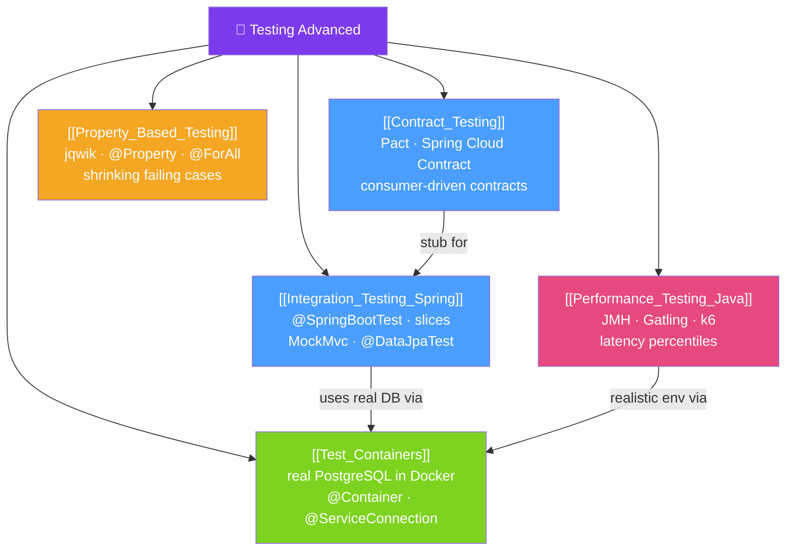

# 🧪 Testing Advanced — Map of Content

> [!abstract] What This Section Covers
> Beyond unit tests with JUnit and Mockito lies a rich ecosystem of advanced testing techniques. This section covers **Spring integration testing** with test slices, **consumer-driven contract testing** to catch API breaking changes before deployment, **performance testing** with JMH and Gatling, **Testcontainers** for realistic integration tests with real databases and queues, and **property-based testing** with jqwik for finding edge cases that example-based tests miss.

## Concept Map

## Learning Path
1. [[Integration_Testing_Spring]] — Spring test slices vs full context; MockMvc; @DataJpaTest.
2. [[Test_Containers]] — Replace in-memory H2 with real PostgreSQL/Kafka containers in tests.
3. [[Contract_Testing]] — Consumer-driven contracts with Pact or Spring Cloud Contract.
4. [[Performance_Testing_Java]] — Microbenchmarks with JMH; load testing with Gatling.
5. [[Property_Based_Testing]] — Generate hundreds of inputs automatically with jqwik.

## All Notes at a Glance
| Note | Difficulty | What You'll Learn |
|------|------------|-------------------|
| [[Integration_Testing_Spring]] | Intermediate | @SpringBootTest, @WebMvcTest, @DataJpaTest, MockMvc, test slices |
| [[Contract_Testing]] | Advanced | Pact DSL, Spring Cloud Contract, stub runner, contract broker |
| [[Performance_Testing_Java]] | Advanced | JMH annotations, Gatling scenarios, latency percentiles, flame graphs |
| [[Test_Containers]] | Intermediate | @Testcontainers, @ServiceConnection, reusable containers, dynamic properties |
| [[Property_Based_Testing]] | Intermediate | @Property, @ForAll, Arbitraries, shrinking, when to use property-based tests |

## Key Questions This Section Answers
- What is the difference between `@SpringBootTest`, `@WebMvcTest`, and `@DataJpaTest`? When do you use each?
- Why is Testcontainers preferable to in-memory H2 for JPA integration tests?
- What is a consumer-driven contract test and how does it prevent breaking API changes?
- What are the common pitfalls of JMH microbenchmarks (JIT warmup, dead code elimination)?
- How does property-based testing find bugs that example-based tests miss?

## Related Sections
- [[_MOC_Java_Master|↑ Java Master MOC]]
- [[27_Observability_Java/_MOC_Observability_Java|← Observability Java]]
- [[29_Security_Advanced/_MOC_Security_Advanced|→ Security Advanced]]

#MOC #java #testing #integration #testcontainers #contracts #performance
