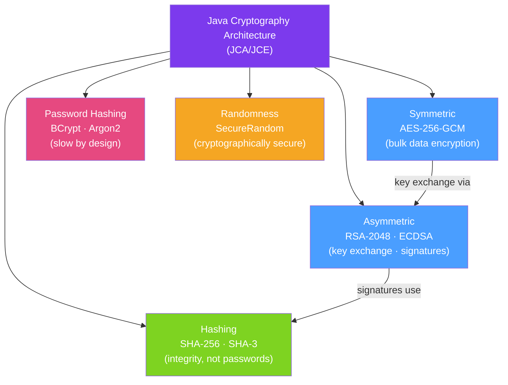

# 🔑 Cryptography in Java

> [!abstract] TL;DR
> Java Cryptography Architecture (JCA) provides a provider-based framework for encryption, hashing, signing, and key management. The key rules: use **AES-256-GCM** (authenticated encryption) for symmetric encryption, **RSA or ECDH** for asymmetric, **bcrypt/Argon2** for password hashing (never MD5/SHA-1), and **`SecureRandom`** (never `Random`) for cryptographic randomness. Bouncy Castle extends JCA for advanced algorithms.

## Intuition — analogy FIRST

Cryptography is like **physical security for information**. **Symmetric encryption** (AES) is like a combination lock — both sender and receiver know the combination. It's fast but requires securely sharing the combination. **Asymmetric encryption** (RSA) is like a public mailbox — anyone can drop a letter in (encrypt with public key), but only the owner has the key to open the box (private key). You use asymmetric to securely share a symmetric key, then symmetric for bulk data.

**Password hashing** (bcrypt) is like a one-way shredder — you can verify a document went through the shredder (compare hashes) but cannot recover the original. MD5 is like a shredder that's been cracked — attackers have rainbow tables for billions of MD5 hashes. Bcrypt adds a unique salt and makes the shredding deliberately slow so brute force is impractical.

---

## How It Works



## Key Concepts / Details

### AES-256-GCM — Symmetric Encryption

GCM (Galois/Counter Mode) provides **authenticated encryption** — it encrypts AND guarantees the ciphertext hasn't been tampered with:

```java
import javax.crypto.*;
import javax.crypto.spec.*;
import java.security.*;

public class AESGCMEncryption {
    private static final String ALGORITHM = "AES/GCM/NoPadding";
    private static final int GCM_IV_LENGTH = 12;   // 96-bit IV for GCM
    private static final int GCM_TAG_LENGTH = 128; // 128-bit authentication tag

    public static byte[] encrypt(byte[] plaintext, SecretKey key) throws Exception {
        byte[] iv = new byte[GCM_IV_LENGTH];
        new SecureRandom().nextBytes(iv);   // unique random IV per encryption

        Cipher cipher = Cipher.getInstance(ALGORITHM);
        cipher.init(Cipher.ENCRYPT_MODE, key, new GCMParameterSpec(GCM_TAG_LENGTH, iv));

        byte[] ciphertext = cipher.doFinal(plaintext);

        // Prepend IV to ciphertext (IV is not secret, needed for decryption)
        byte[] result = new byte[GCM_IV_LENGTH + ciphertext.length];
        System.arraycopy(iv, 0, result, 0, GCM_IV_LENGTH);
        System.arraycopy(ciphertext, 0, result, GCM_IV_LENGTH, ciphertext.length);
        return result;
    }

    public static byte[] decrypt(byte[] ivAndCiphertext, SecretKey key) throws Exception {
        byte[] iv = Arrays.copyOfRange(ivAndCiphertext, 0, GCM_IV_LENGTH);
        byte[] ciphertext = Arrays.copyOfRange(ivAndCiphertext, GCM_IV_LENGTH, ivAndCiphertext.length);

        Cipher cipher = Cipher.getInstance(ALGORITHM);
        cipher.init(Cipher.DECRYPT_MODE, key, new GCMParameterSpec(GCM_TAG_LENGTH, iv));
        return cipher.doFinal(ciphertext);  // throws AEADBadTagException if tampered
    }

    public static SecretKey generateKey() throws Exception {
        KeyGenerator kg = KeyGenerator.getInstance("AES");
        kg.init(256, new SecureRandom());
        return kg.generateKey();
    }
}
```

### Password Hashing — BCrypt

```java
// Spring Security BCrypt (most common)
import org.springframework.security.crypto.bcrypt.BCryptPasswordEncoder;

BCryptPasswordEncoder encoder = new BCryptPasswordEncoder(12);

// Hashing (during registration)
String rawPassword = "mySecretPassword";
String hashed = encoder.encode(rawPassword);
// Result: $2a$12$... (includes work factor + salt + hash)

// Verification (during login) — NEVER compare hashes directly
boolean matches = encoder.matches(rawPassword, hashed);  // true

// WRONG: == or equals() comparison (timing attack vulnerability)
// hashed.equals(encoder.encode(rawPassword))  ← WRONG

// Argon2 — modern winner of Password Hashing Competition
import org.springframework.security.crypto.argon2.Argon2PasswordEncoder;
Argon2PasswordEncoder argon2 = Argon2PasswordEncoder.defaultsForSpringSecurity_v5_8();
String argon2Hash = argon2.encode(rawPassword);
```

### SecureRandom vs Random

```java
// WRONG: java.util.Random is not cryptographically secure
Random badRandom = new Random();
byte[] badToken = new byte[32];
badRandom.nextBytes(badToken);  // predictable!

// CORRECT: SecureRandom uses OS entropy (/dev/urandom or CryptGenRandom on Windows)
SecureRandom secureRandom = new SecureRandom();
byte[] goodToken = new byte[32];
secureRandom.nextBytes(goodToken);

// Generating secure tokens (for session IDs, CSRF tokens, API keys)
String secureToken = Base64.getUrlEncoder().withoutPadding()
    .encodeToString(goodToken);
// Result: 43-character URL-safe Base64 string
```

### RSA Key Pair — Asymmetric Encryption

```java
public class RSAExample {
    public static KeyPair generateKeyPair() throws Exception {
        KeyPairGenerator kpg = KeyPairGenerator.getInstance("RSA");
        kpg.initialize(2048);  // 2048 minimum; prefer 4096 for long-term keys
        return kpg.generateKeyPair();
    }

    public static byte[] encrypt(byte[] plaintext, PublicKey publicKey) throws Exception {
        // RSA-OAEP: padding scheme that prevents known attacks on plain RSA
        Cipher cipher = Cipher.getInstance("RSA/ECB/OAEPWithSHA-256AndMGF1Padding");
        cipher.init(Cipher.ENCRYPT_MODE, publicKey);
        return cipher.doFinal(plaintext);
        // NOTE: RSA can only encrypt small payloads (< key size - padding overhead)
        // For large data: encrypt a random AES key with RSA, then encrypt data with AES
    }

    public static byte[] decrypt(byte[] ciphertext, PrivateKey privateKey) throws Exception {
        Cipher cipher = Cipher.getInstance("RSA/ECB/OAEPWithSHA-256AndMGF1Padding");
        cipher.init(Cipher.DECRYPT_MODE, privateKey);
        return cipher.doFinal(ciphertext);
    }
}
```

### Digital Signatures

```java
// Signing a message (sender)
Signature signer = Signature.getInstance("SHA256withRSA");
signer.initSign(privateKey);
signer.update(messageBytes);
byte[] signature = signer.sign();

// Verifying a signature (receiver)
Signature verifier = Signature.getInstance("SHA256withRSA");
verifier.initVerify(publicKey);
verifier.update(messageBytes);
boolean valid = verifier.verify(signature);
```

### PBKDF2 — Key Derivation from Passwords

```java
// Derive an encryption key from a password (don't use password directly as AES key)
SecretKeyFactory factory = SecretKeyFactory.getInstance("PBKDF2WithHmacSHA256");
byte[] salt = new byte[16];
new SecureRandom().nextBytes(salt);

KeySpec spec = new PBEKeySpec(
    password.toCharArray(),
    salt,
    600_000,  // iterations — NIST 2023 recommends 600K for PBKDF2-SHA256
    256       // key length in bits
);
SecretKey derivedKey = new SecretKeySpec(
    factory.generateSecret(spec).getEncoded(), "AES");
```

### Algorithm Comparison

| Algorithm | Category | Length | Use For | Avoid |
|-----------|----------|--------|---------|-------|
| AES-256-GCM | Symmetric | 256-bit key | Bulk data encryption | ECB mode |
| RSA-2048 | Asymmetric | 2048+ bit | Key exchange, signatures | Textbook RSA |
| ECDSA P-256 | Asymmetric | 256-bit | Signatures (more efficient than RSA) | |
| SHA-256 | Hash | 256-bit | Integrity, HMAC | MD5, SHA-1 |
| BCrypt (12) | Password | adaptive | Password storage | MD5, SHA-1, SHA-256 |
| Argon2id | Password | adaptive | New systems (Winner PHC) | |
| PBKDF2-SHA256 | KDF | 256-bit | Key derivation from password | Low iteration counts |

## Real-World Notes

- **Never implement your own cryptography** — use established libraries (JCA, Bouncy Castle, Tink). Subtle implementation errors (wrong IV reuse, padding oracle) are catastrophic.
- **Key management is the hard part** — even perfect encryption is useless if the key is stored in plaintext next to the ciphertext. Use a KMS (AWS KMS, GCP KMS, HashiCorp Vault).
- **GCM requires a unique IV per encryption** — reusing the same IV with the same key in GCM completely breaks security. Always generate a fresh random IV for each encryption operation.
- **Bouncy Castle for advanced algorithms** — JCA doesn't include Argon2, EdDSA, X25519, or many modern algorithms. Add Bouncy Castle as a security provider for these.

## Common Pitfalls

- **Storing IVs or salts alongside the ciphertext is correct** — IVs and salts are not secret; they prevent attackers from seeing patterns across messages. Always store them with the ciphertext.
- **Comparing BCrypt hashes with `equals()`** — this is a timing attack vulnerability. Always use `encoder.matches()` which uses a constant-time comparison.
- **Using ECB mode for AES** — AES-ECB is deterministic; identical plaintext blocks produce identical ciphertext blocks, revealing patterns. Always use GCM or CBC with proper IV.
- **Weak work factor for BCrypt** — BCrypt work factor 4–8 is too fast on modern hardware. Use 12 (production) or 10 (test environments); use `BCryptPasswordEncoder(12)`.

## Related Concepts
- [[OWASP_Top_10_Java]] — A02 Cryptographic Failures covers what happens when you get this wrong
- [[Vault_Secrets_Management]] — Managing encryption keys with HashiCorp Vault
- [[Secure_Coding_Practices]] — Using cryptographic outputs correctly (TLS, token generation)

## Review Questions
1. Why must AES-GCM use a unique random IV for every encryption operation?
2. Why is BCrypt preferable to PBKDF2 for password hashing, even though both are "slow"?
3. What is the hybrid encryption pattern and why is it used with RSA?

## Sources
- NIST Cryptographic Standards — https://csrc.nist.gov/publications/
- Java Cryptography Architecture Guide — https://docs.oracle.com/en/java/javase/21/security/java-cryptography-architecture-jca-reference-guide.html
- OWASP Cryptographic Storage Cheat Sheet — https://cheatsheetseries.owasp.org/cheatsheets/Cryptographic_Storage_Cheat_Sheet.html

#java #security #cryptography #aes #rsa #bcrypt #jca
