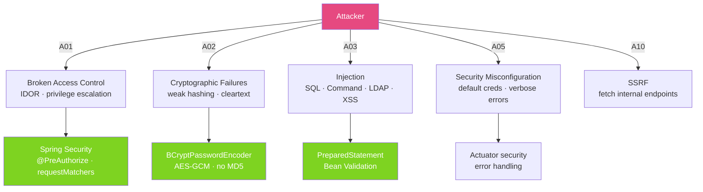

# 🔓 OWASP Top 10 in Java

> [!abstract] TL;DR
> The **OWASP Top 10 (2021)** lists the most critical web application security risks. For Java/Spring developers, the highest-impact items are broken access control, cryptographic failures, injection (SQL, command, LDAP), XSS, and SSRF. Spring Security provides mitigations for most of these out of the box — but only if you configure it correctly and don't disable defaults.

## Intuition — analogy FIRST

OWASP Top 10 is like the **"10 most common ways burglars enter houses"** — a ranked list based on real incident data. A security-aware homeowner (Java developer) knows: most burglars enter through unlocked doors (broken access control), some pick weak locks (cryptographic failures), and others trick residents into opening the door (injection attacks). Knowing the list lets you prioritise defences: lock the door first, then upgrade the lock, then install a camera.

The key insight: most application security breaches are not exotic zero-day exploits — they are failures to follow known best practices that OWASP has documented for decades.

---

## How It Works



## Key Concepts / Details

### A01 — Broken Access Control (Most Critical)

```java
// VULNERABLE: trusting client-provided user ID
@GetMapping("/orders/{orderId}")
public Order getOrder(@PathVariable Long orderId) {
    return orderRepository.findById(orderId).orElseThrow(); // any authenticated user can see any order!
}

// SECURE: verify the order belongs to the authenticated user
@GetMapping("/orders/{orderId}")
@PreAuthorize("@orderSecurity.isOwner(#orderId, authentication)")
public Order getOrder(@PathVariable Long orderId) {
    return orderRepository.findById(orderId).orElseThrow();
}

// Security service
@Component("orderSecurity")
public class OrderSecurity {
    public boolean isOwner(Long orderId, Authentication auth) {
        return orderRepository.findById(orderId)
            .map(o -> o.getUserId().equals(getCurrentUserId(auth)))
            .orElse(false);
    }
}
```

### A02 — Cryptographic Failures

```java
// VULNERABLE: storing passwords as MD5 hash
String badHash = MessageDigest.getInstance("MD5").digest(password.getBytes());

// VULNERABLE: storing passwords as SHA-256 without salt
String badHash2 = DigestUtils.sha256Hex(password);

// SECURE: BCrypt with adaptive work factor
@Bean
public PasswordEncoder passwordEncoder() {
    return new BCryptPasswordEncoder(12);  // work factor 12 = ~300ms on modern hardware
}

// VULNERABLE: transmitting sensitive data over HTTP
// SECURE: enforce HTTPS in Spring Security
http.requiresChannel(channel -> channel.anyRequest().requiresSecure());

// VULNERABLE: AES-ECB (patterns visible in ciphertext)
// SECURE: AES-256-GCM (authenticated encryption) — see Cryptography_Java
```

### A03 — Injection

**SQL Injection:**
```java
// VULNERABLE: string concatenation in SQL
String query = "SELECT * FROM users WHERE name = '" + userName + "'";
// Attack input: ' OR '1'='1  → returns all users

// SECURE: parameterised query with PreparedStatement
PreparedStatement stmt = conn.prepareStatement(
    "SELECT * FROM users WHERE name = ?");
stmt.setString(1, userName);

// SECURE: Spring Data JPA (always parameterised)
List<User> users = userRepository.findByName(userName);

// SECURE: @Query with named parameter
@Query("SELECT u FROM User u WHERE u.name = :name")
List<User> findByName(@Param("name") String name);
```

**Command Injection:**
```java
// VULNERABLE
Runtime.exec("ping " + host);  // host = "localhost; rm -rf /"

// SECURE: use ProcessBuilder with argument list (no shell interpretation)
ProcessBuilder pb = new ProcessBuilder("ping", "-c", "1", host);
pb.start();
```

**XSS (Cross-Site Scripting):**
```java
// SECURE: Thymeleaf auto-escapes by default
// <p th:text="${userInput}">  ← safe: escapes HTML
// <p th:utext="${userInput}"> ← DANGEROUS: renders raw HTML

// Content Security Policy header in Spring Security
http.headers(headers -> headers
    .contentSecurityPolicy(csp -> csp
        .policyDirectives("default-src 'self'; script-src 'self' 'nonce-{random}'")));
```

### A05 — Security Misconfiguration

```java
// Spring Security — avoid overly permissive config
http.authorizeHttpRequests(auth -> auth
    // VULNERABLE: .anyRequest().permitAll()
    .requestMatchers("/public/**").permitAll()
    .requestMatchers("/actuator/health", "/actuator/info").permitAll()
    .requestMatchers("/actuator/**").hasRole("ADMIN")
    .anyRequest().authenticated());

// Never expose default credentials (Spring Security disables default password in Boot 3)
// Disable directory listing on embedded Tomcat
server.tomcat.maxHttpHeaderSize=8KB   // prevent header overflow attacks
```

**Verbose Error Responses:**
```java
// VULNERABLE: exposing stack traces to clients
@ExceptionHandler(Exception.class)
public ResponseEntity<String> handleAll(Exception e) {
    return ResponseEntity.status(500).body(e.getMessage());  // leaks internals!
}

// SECURE: generic error with correlation ID only
@ExceptionHandler(Exception.class)
public ResponseEntity<ProblemDetail> handleAll(Exception e, HttpServletRequest req) {
    String traceId = MDC.get("traceId");
    log.error("Unhandled error [traceId={}]", traceId, e);  // log full details server-side
    ProblemDetail pd = ProblemDetail.forStatus(500);
    pd.setTitle("Internal Server Error");
    pd.setProperty("traceId", traceId);  // client can report this to support
    return ResponseEntity.status(500).body(pd);
}
```

### A10 — SSRF (Server-Side Request Forgery)

```java
// VULNERABLE: fetching user-provided URLs
@GetMapping("/fetch")
public String fetchUrl(@RequestParam String url) {
    return restTemplate.getForObject(url, String.class);
    // Attack: url = "http://169.254.169.254/latest/meta-data/"  (AWS metadata service)
}

// SECURE: whitelist allowed hosts
@GetMapping("/fetch")
public String fetchUrl(@RequestParam String url) {
    URI uri = URI.create(url);
    List<String> allowedHosts = List.of("api.trusted.com", "data.partner.org");
    if (!allowedHosts.contains(uri.getHost())) {
        throw new SecurityException("URL host not in allowlist");
    }
    return restTemplate.getForObject(url, String.class);
}
```

### OWASP Top 10 (2021) Summary

| # | Vulnerability | Java/Spring Mitigation |
|---|--------------|----------------------|
| A01 | Broken Access Control | `@PreAuthorize`, method security, ownership checks |
| A02 | Cryptographic Failures | BCrypt, AES-GCM, TLS, no plaintext secrets |
| A03 | Injection (SQL, Command, LDAP, XSS) | PreparedStatement, Spring Data, Thymeleaf escaping, CSP |
| A04 | Insecure Design | Threat modelling, security requirements in design |
| A05 | Security Misconfiguration | Actuator security, no default creds, HSTS |
| A06 | Vulnerable Components | OWASP Dependency-Check, Snyk, Dependabot |
| A07 | Auth & Session Management Failures | Spring Security, stateless JWT, secure session config |
| A08 | Software & Data Integrity | Signed artifacts, SBOM, supply chain security |
| A09 | Security Logging & Monitoring | Structured logging, alerting on auth failures |
| A10 | SSRF | URL host allowlist, network segmentation |

## Real-World Notes

- **OWASP Top 10 is based on real breach data** — A01 (Broken Access Control) moved to #1 in 2021 because IDOR and privilege escalation are the most exploited in practice.
- **Spring Security provides defaults for most items** — CSRF protection, session fixation protection, clickjacking prevention (X-Frame-Options), and content sniffing prevention are enabled by default.
- **A06 (Vulnerable Components) is now automated** — GitHub Dependabot, Snyk, and OWASP Dependency-Check can automatically scan your `pom.xml` / `build.gradle` and raise PRs for CVEs.
- **Inject vulnerabilities persist despite awareness** — SQL injection remains in the OWASP Top 10 for 20+ years because developers continue to build dynamic queries with string concatenation, especially in complex JPQL queries.

## Common Pitfalls

- **Disabling CSRF for convenience** — CSRF attacks target state-changing operations (form POSTs, API calls from browsers). Never disable CSRF for stateful web applications with cookie-based sessions.
- **Using `@Query` with string interpolation** — `@Query("SELECT u FROM User u WHERE u.name = '" + name + "'")` is still SQL injection even in JPA. Always use `:namedParam` syntax.
- **Relying on client-provided IDs for access control** — never trust request parameters for resource ownership. Always verify against the authenticated user's identity server-side.
- **Exposing actuator endpoints without authentication** — Spring Boot's `/actuator/env` exposes all configuration including (sanitised) secrets; `/actuator/heapdump` can expose heap memory contents.

## Related Concepts
- [[Cryptography_Java]] — Detailed AES, RSA, bcrypt implementations
- [[Secure_Coding_Practices]] — Security headers, input validation, error handling
- [[Vault_Secrets_Management]] — Prevents A02 by removing hardcoded credentials

## Review Questions
1. What is IDOR (Insecure Direct Object Reference) and how does `@PreAuthorize` mitigate it?
2. Why is BCrypt preferable to SHA-256 for storing passwords, even with a salt?
3. What is SSRF and what is the safest way to allow user-provided URLs in a Java service?

## Sources
- OWASP Top 10 2021 — https://owasp.org/Top10/
- Spring Security Reference — https://docs.spring.io/spring-security/reference/

#java #spring #security #owasp #sql-injection #xss #csrf #ssrf
