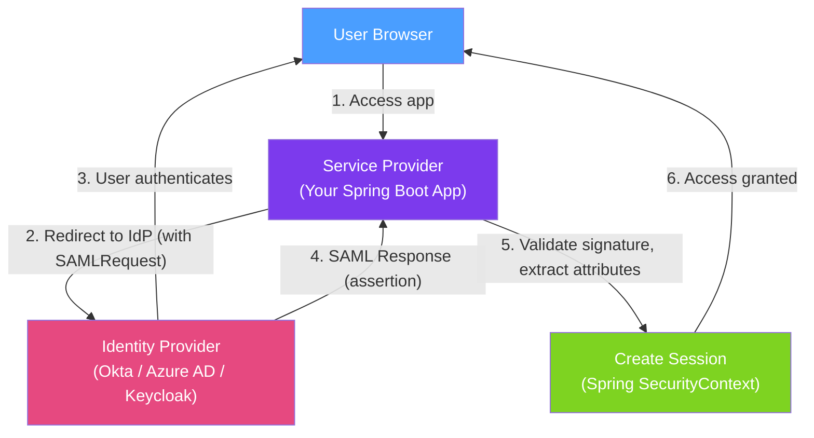

# 🔑 SAML and SSO

> [!abstract] TL;DR
> **Single Sign-On (SSO)** lets users authenticate once with an Identity Provider (IdP) and access multiple applications without re-logging in. **SAML 2.0** is the enterprise XML-based standard used by corporate IdPs (Okta, Azure AD, ADFS). **OpenID Connect (OIDC)** is the modern JSON/JWT-based alternative, preferred for new systems. Spring Security supports both natively since Spring Boot 3.

## Intuition — analogy FIRST

SSO is like a **hotel key card system**. Instead of carrying separate keys for the gym, pool, restaurant, and room (separate login per application), you have one master key card (SSO session) issued when you check in (authenticate at the IdP). Every door reader (application) validates your key card against the hotel's master record (IdP) — you never re-enter your room number and PIN. When you check out (logout), all doors stop working simultaneously.

**SAML** is like an old-school stamped paper voucher system — formal, complex, verbose XML documents with cryptographic signatures. **OIDC** is the modern digital equivalent — lightweight JSON Web Tokens, simpler flows, works in single-page apps and mobile natively.

---

## How It Works



## Key Concepts / Details

### SAML 2.0 Core Concepts

| Term | Definition |
|------|-----------|
| **Identity Provider (IdP)** | Authenticates users and issues assertions (Okta, Azure AD, ADFS, Keycloak) |
| **Service Provider (SP)** | Your application that trusts the IdP's assertions |
| **SAML Assertion** | XML document signed by IdP declaring user identity and attributes |
| **SAML Response** | Wraps one or more assertions; sent to SP via HTTP POST (browser redirect) |
| **Metadata** | XML file describing SP or IdP endpoints, certificates, entity IDs |
| **EntityID** | Unique identifier for SP or IdP in the federation |
| **ACS URL** | Assertion Consumer Service URL — where IdP POSTs the SAML Response |

### Spring Boot 3 SAML Configuration

```xml
<dependency>
    <groupId>org.springframework.security</groupId>
    <artifactId>spring-security-saml2-service-provider</artifactId>
</dependency>
```

```yaml
# application.yml
spring:
  security:
    saml2:
      relyingparty:
        registration:
          okta:
            identityprovider:
              metadata-uri: https://myorg.okta.com/app/abc123/sso/saml/metadata
              # Or inline:
              # entity-id: https://myorg.okta.com
              # singlesignon:
              #   url: https://myorg.okta.com/app/abc123/sso/saml
              #   sign-request: false
              verification:
                credentials:
                  - certificate-location: "classpath:okta.crt"  # IdP's signing cert
            signing:
              credentials:
                - private-key-location: "classpath:sp-private.key"
                  certificate-location: "classpath:sp-cert.crt"
            entity-id: "https://myapp.example.com"
            acs:
              location: "https://myapp.example.com/login/saml2/sso/okta"
```

```java
@Configuration
@EnableWebSecurity
public class SAMLSecurityConfig {

    @Bean
    public SecurityFilterChain filterChain(HttpSecurity http) throws Exception {
        http
            .authorizeHttpRequests(auth -> auth
                .anyRequest().authenticated())
            .saml2Login(saml2 -> saml2
                .loginProcessingUrl("/login/saml2/sso/{registrationId}")
                .defaultSuccessUrl("/dashboard")
                .failureHandler(new SimpleUrlAuthenticationFailureHandler("/login?error")))
            .saml2Logout(logout -> logout
                .logoutUrl("/logout")
                .logoutSuccessUrl("/login?logout"));
        return http.build();
    }
}
```

### OIDC / OAuth2 — Modern SSO Alternative

```yaml
# application.yml — OIDC with Keycloak
spring:
  security:
    oauth2:
      client:
        registration:
          keycloak:
            client-id: my-app
            client-secret: ${KEYCLOAK_CLIENT_SECRET}
            scope: openid,profile,email
            authorization-grant-type: authorization_code
            redirect-uri: "{baseUrl}/login/oauth2/code/{registrationId}"
        provider:
          keycloak:
            issuer-uri: https://keycloak.mycompany.com/realms/production
            # Spring auto-discovers endpoints from issuer-uri/.well-known/openid-configuration
```

```java
@Configuration
@EnableWebSecurity
public class OIDCSecurityConfig {

    @Bean
    public SecurityFilterChain filterChain(HttpSecurity http) throws Exception {
        http
            .authorizeHttpRequests(auth -> auth
                .requestMatchers("/public/**").permitAll()
                .anyRequest().authenticated())
            .oauth2Login(oauth2 -> oauth2
                .defaultSuccessUrl("/dashboard")
                .userInfoEndpoint(ui -> ui
                    .userAuthoritiesMapper(this::mapAuthorities)));
        return http.build();
    }

    private Collection<GrantedAuthority> mapAuthorities(Collection<? extends GrantedAuthority> authorities) {
        // Map Keycloak realm roles to Spring Security GrantedAuthority
        return authorities.stream()
            .map(a -> new SimpleGrantedAuthority("ROLE_" + a.getAuthority().toUpperCase()))
            .collect(Collectors.toList());
    }
}
```

### Extracting SAML Attributes

```java
@Controller
public class DashboardController {

    @GetMapping("/dashboard")
    public String dashboard(@AuthenticationPrincipal Saml2AuthenticatedPrincipal principal,
                            Model model) {
        String email = principal.getFirstAttribute("email");
        String name = principal.getFirstAttribute("displayName");
        List<String> groups = principal.getAttribute("memberOf");

        model.addAttribute("email", email);
        model.addAttribute("name", name);
        model.addAttribute("groups", groups);
        return "dashboard";
    }
}
```

### SAML vs OIDC Comparison

| Aspect | SAML 2.0 | OpenID Connect (OIDC) |
|--------|----------|----------------------|
| **Format** | XML (verbose) | JSON/JWT (compact) |
| **Age** | 2005 | 2014 |
| **Complexity** | High — certificates, metadata exchange | Lower — discovery via `.well-known` |
| **Browser-only?** | Yes — relies on browser redirects | No — works in APIs, mobile, SPAs |
| **Token** | SAML Assertion (XML) | ID Token (JWT) + Access Token |
| **Logout** | SLO (Single Logout) — complex | End-session endpoint — simpler |
| **Use case** | Enterprise, legacy IdPs, Salesforce | New systems, APIs, mobile apps |
| **IdP support** | Okta, Azure AD, ADFS, Shibboleth | Okta, Azure AD, Google, Keycloak, all |

### Keycloak — Self-Hosted IdP

```yaml
# Docker Compose for local development
services:
  keycloak:
    image: quay.io/keycloak/keycloak:24.0.0
    command: start-dev
    environment:
      KEYCLOAK_ADMIN: admin
      KEYCLOAK_ADMIN_PASSWORD: admin
    ports: ["8080:8080"]
```

Keycloak supports both SAML 2.0 and OIDC — a single IdP for your entire organisation.

## Real-World Notes

- **SAML is required for corporate enterprise** — most Fortune 500 companies mandate SAML for application federation with their corporate identity systems (Microsoft ADFS, Azure AD SAML).
- **OIDC for everything new** — for any new system or API, prefer OIDC. It's simpler, more secure, and supported by every modern IdP.
- **Validate every SAML attribute before trusting it** — SAML assertions are signed, but the signature only covers the assertion element itself. Validate that the assertion's `Recipient` and `Audience` match your SP to prevent assertion replay attacks.
- **Spring Security handles the cryptographic complexity** — you never need to manually verify SAML signatures or decrypt assertions. Spring Security handles this via the configured IdP certificate.

## Common Pitfalls

- **Not validating the SAML InResponseTo field** — without InResponseTo validation, an attacker can replay a SAML response from another session. Spring Security validates this by default.
- **Trusting email from SAML without signature verification** — SAML attributes (including email) are only trustworthy if the assertion is validly signed by the trusted IdP certificate.
- **Hard-coding IdP metadata** — IdP metadata (certificates, endpoints) changes during certificate rotation. Use `metadata-uri` so Spring fetches and caches it dynamically.
- **Not implementing Single Logout (SLO)** — users who logout from your app remain logged into the IdP and vice versa. Implement SLO to ensure logout is complete across all applications.

## Related Concepts
- [[OWASP_Top_10_Java]] — A07 (Authentication Failures) is prevented by proper SSO implementation
- [[Cryptography_Java]] — SAML signatures use RSA; understanding this aids debugging
- [[Secure_Coding_Practices]] — Session security after SAML authentication

## Review Questions
1. What is the role of the Assertion Consumer Service (ACS) URL in SAML 2.0?
2. Why would you choose OIDC over SAML for a new internal microservice API?
3. What is the InResponseTo field in a SAML response and why must you validate it?

## Sources
- Spring Security SAML 2.0 — https://docs.spring.io/spring-security/reference/servlet/saml2/
- Spring Security OAuth2 Login — https://docs.spring.io/spring-security/reference/servlet/oauth2/login/
- Keycloak Documentation — https://www.keycloak.org/documentation

#java #spring #security #saml #sso #oidc #oauth2 #keycloak
