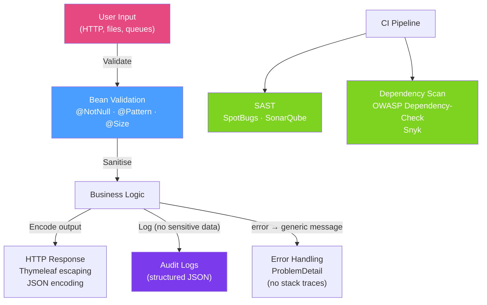

# 🛡️ Secure Coding Practices

> [!abstract] TL;DR
> Secure coding is building security into every decision rather than bolting it on afterward. The key practices are: **validate all input** (whitelist, not blacklist), **encode all output** (context-aware: HTML, SQL, shell), **never leak internals** in error responses, add **security headers**, scan **dependencies** for CVEs, and run **static analysis** (SAST) tools in CI. Most vulnerabilities exist because one of these practices was skipped.

## Intuition — analogy FIRST

Secure coding is like building a bank vault. The vault's security isn't achieved by reacting to robbers after they've entered — it's built into the architecture: steel walls (input validation), one-way locks (cryptography), motion sensors (logging), a safe without a combination written on the door (no hardcoded secrets), and limited access to the inner vault (least privilege). A building inspector (SAST tool) checks the blueprints for violations before construction is complete.

The principle is **defence in depth**: even if an attacker bypasses one layer (say, manipulates an HTTP parameter), multiple other layers (access control, logging, network segmentation) prevent or detect the attack.

---

## How It Works



## Key Concepts / Details

### Input Validation — Whitelist, Not Blacklist

```java
// WRONG: blacklist approach — attackers find bypass every time
if (input.contains("<script>") || input.contains("DROP TABLE")) {
    throw new InvalidInputException("Invalid characters");
}

// CORRECT: whitelist — define exactly what IS allowed
@PostMapping("/orders")
public Order createOrder(@Valid @RequestBody OrderRequest request) {
    return orderService.create(request);
}

// Bean Validation on the DTO
public class OrderRequest {
    @NotBlank
    @Size(min = 5, max = 50)
    @Pattern(regexp = "^[a-zA-Z0-9-]+$", message = "Product ID must be alphanumeric")
    private String productId;

    @NotNull
    @Min(1)
    @Max(1000)
    private Integer quantity;

    @Email
    private String customerEmail;
}
```

### Security Headers

```java
@Bean
public SecurityFilterChain filterChain(HttpSecurity http) throws Exception {
    http.headers(headers -> headers
        // Prevent clickjacking
        .frameOptions(fo -> fo.deny())
        // Enforce HTTPS for 1 year
        .httpStrictTransportSecurity(hsts -> hsts
            .maxAgeInSeconds(31536000)
            .includeSubDomains(true))
        // Prevent MIME type sniffing
        .contentTypeOptions(Customizer.withDefaults())
        // Referrer policy
        .referrerPolicy(rp -> rp
            .policy(ReferrerPolicyHeaderWriter.ReferrerPolicy.STRICT_ORIGIN_WHEN_CROSS_ORIGIN))
        // Content Security Policy
        .contentSecurityPolicy(csp -> csp
            .policyDirectives("default-src 'self'; script-src 'self'; style-src 'self' 'unsafe-inline'"))
        // Permissions policy (replaces Feature-Policy)
        .permissionsPolicy(pp -> pp
            .policy("geolocation=(), microphone=(), camera=()")));
    return http.build();
}
```

### Secure Error Handling

```java
// SECURE: global exception handler that never leaks internals
@RestControllerAdvice
public class GlobalExceptionHandler {

    private static final Logger log = LoggerFactory.getLogger(GlobalExceptionHandler.class);

    @ExceptionHandler(Exception.class)
    public ResponseEntity<ProblemDetail> handleAll(
            Exception ex, HttpServletRequest request) {

        String traceId = MDC.get("traceId");
        // Log full details server-side only
        log.error("Unhandled exception [traceId={}, path={}]",
                  traceId, request.getRequestURI(), ex);

        // Return generic message to client — no stack trace, no internal class names
        ProblemDetail problem = ProblemDetail.forStatus(HttpStatus.INTERNAL_SERVER_ERROR);
        problem.setTitle("An unexpected error occurred");
        problem.setDetail("Please contact support with reference: " + traceId);
        return ResponseEntity.status(500).body(problem);
    }

    @ExceptionHandler(AccessDeniedException.class)
    public ResponseEntity<ProblemDetail> handleAccessDenied(AccessDeniedException ex) {
        // Don't distinguish "not found" from "forbidden" to prevent enumeration
        ProblemDetail problem = ProblemDetail.forStatus(HttpStatus.FORBIDDEN);
        problem.setTitle("Access Denied");
        return ResponseEntity.status(403).body(problem);
    }
}
```

### Never Log Sensitive Data

```java
// WRONG: logging sensitive fields
log.info("User login attempt for {} with password {}", username, password);
log.debug("Payment processed for card {}", creditCardNumber);

// CORRECT: mask sensitive data
log.info("User login attempt for {}", username);
log.debug("Payment processed for card ****{}", lastFourDigits(creditCardNumber));

// @JsonIgnore on serialisation (prevents leaking in API responses)
public class User {
    private String username;

    @JsonIgnore
    private String passwordHash;

    @JsonProperty(access = JsonProperty.Access.WRITE_ONLY)
    private String password;  // accept in input, never return
}
```

### Dependency Scanning (SCA)

```xml
<!-- OWASP Dependency-Check Maven plugin -->
<plugin>
    <groupId>org.owasp</groupId>
    <artifactId>dependency-check-maven</artifactId>
    <version>9.2.0</version>
    <configuration>
        <failBuildOnCVSS>7</failBuildOnCVSS>  <!-- Fail CI on HIGH (7+) CVEs -->
        <suppressionFiles>
            <suppressionFile>dependency-check-suppressions.xml</suppressionFile>
        </suppressionFiles>
    </configuration>
    <executions>
        <execution>
            <goals><goal>check</goal></goals>
        </execution>
    </executions>
</plugin>
```

### Static Analysis (SAST)

```xml
<!-- SpotBugs with Find Security Bugs plugin -->
<plugin>
    <groupId>com.github.spotbugs</groupId>
    <artifactId>spotbugs-maven-plugin</artifactId>
    <configuration>
        <plugins>
            <plugin>
                <groupId>com.h3xstream.findsecbugs</groupId>
                <artifactId>findsecbugs-plugin</artifactId>
                <version>1.13.0</version>
            </plugin>
        </plugins>
    </configuration>
</plugin>
```

FindSecBugs detects: SQL injection, command injection, predictable random, hardcoded credentials, XXE, path traversal.

### Least Privilege in Code

```java
// File operations — validate path stays within allowed directory
public Path resolveUserFile(String fileName) {
    Path base = Paths.get("/safe/uploads").normalize();
    Path resolved = base.resolve(fileName).normalize();

    // Prevent path traversal: ../../../etc/passwd
    if (!resolved.startsWith(base)) {
        throw new SecurityException("Path traversal detected: " + fileName);
    }
    return resolved;
}

// SQL — use read-only connection for read operations
@Transactional(readOnly = true)
public List<Order> getOrders(Long userId) {
    return orderRepository.findByUserId(userId);
}
```

### Secure Session Configuration

```java
http.sessionManagement(session -> session
    .sessionCreationPolicy(SessionCreationPolicy.IF_REQUIRED)  // or STATELESS for JWT
    .maximumSessions(1)                  // prevent session hijacking via multiple sessions
    .expiredSessionStrategy(event ->
        event.getResponse().setStatus(401))
    .and()
    .sessionFixation().changeSessionId()  // regenerate session ID after login
);

// Secure cookie flags
server:
  servlet:
    session:
      cookie:
        secure: true      # HTTPS only
        http-only: true   # JavaScript cannot access
        same-site: strict # CSRF protection
```

## Real-World Notes

- **Security in CI, not just code review** — SAST (SpotBugs/SonarQube) and SCA (Dependency-Check/Snyk) should block builds automatically on HIGH severity findings. Security reviews alone miss 80% of vulnerabilities.
- **Principle of least privilege for service accounts** — database users for your Spring Boot app should have only `SELECT, INSERT, UPDATE` on their specific tables, never `DROP`, `CREATE`, or `superuser`.
- **Rotate secrets regularly** — even well-stored secrets become liabilities if retained indefinitely. Use Vault's dynamic secrets to automatically rotate database passwords every 24 hours.
- **Input validation at every boundary** — don't rely on validation in the controller only. Validate at the service layer too, especially if the service is called by other services internally.

## Common Pitfalls

- **Assuming internal APIs don't need security** — attackers who breach your network can call internal service APIs. Apply authentication and authorisation to all endpoints.
- **Logging PII in debug mode** — DEBUG logging enabled in production can log request bodies, headers, and parameters containing PII or credentials.
- **`suppressionFiles` in dependency-check without review** — suppressing CVEs permanently without documenting a risk acceptance decision creates blind spots in your security posture.
- **Implicit trust of JVM's default TLS configuration** — the JVM may allow weak cipher suites by default. Configure TLS explicitly: `server.ssl.enabled-protocols=TLSv1.3` and `server.ssl.ciphers=...`.

## Related Concepts
- [[OWASP_Top_10_Java]] — The vulnerabilities these practices prevent
- [[Cryptography_Java]] — Implementing cryptography securely
- [[Vault_Secrets_Management]] — Externalising secrets out of code and config

## Review Questions
1. Why is input validation using a whitelist safer than input filtering using a blacklist?
2. What information should a production HTTP error response contain, and what should it never include?
3. What is the difference between SAST (Static Analysis) and SCA (Software Composition Analysis)?

## Sources
- OWASP Secure Coding Practices — https://owasp.org/www-project-secure-coding-practices-quick-reference-guide/
- Spring Security Reference — https://docs.spring.io/spring-security/reference/
- FindSecBugs — https://find-sec-bugs.github.io/

#java #spring #security #secure-coding #input-validation #headers #dependency-scan
