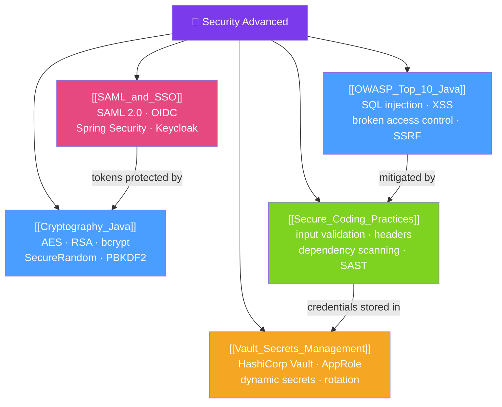

# 🔐 Security Advanced — Map of Content

> [!abstract] What This Section Covers
> Security is not a feature — it is a cross-cutting concern woven into every layer of a Java application. This section covers the **OWASP Top 10** vulnerabilities and their Java mitigations, **Java cryptography** (AES, RSA, hashing), **secure coding practices** (input validation, error handling, dependency scanning), **SAML and SSO** for enterprise authentication, and **HashiCorp Vault** for secrets management. Together these topics define what "secure by default" means for production Java services.

## Concept Map

## Learning Path
1. [[OWASP_Top_10_Java]] — Know the top 10 vulnerabilities and their Java-specific mitigations.
2. [[Secure_Coding_Practices]] — Build security in: input validation, error handling, headers, dependency scanning.
3. [[Cryptography_Java]] — Use AES-GCM for encryption, bcrypt for passwords, HMAC for integrity.
4. [[SAML_and_SSO]] — Integrate enterprise identity providers via SAML 2.0 or OIDC.
5. [[Vault_Secrets_Management]] — Manage application secrets with HashiCorp Vault and dynamic credentials.

## All Notes at a Glance
| Note | Difficulty | What You'll Learn |
|------|------------|-------------------|
| [[OWASP_Top_10_Java]] | Intermediate | OWASP 2021 top 10, Java attack examples, Spring mitigations |
| [[Cryptography_Java]] | Advanced | JCA/JCE, AES-256-GCM, RSA, bcrypt, PBKDF2, KeyStore |
| [[Secure_Coding_Practices]] | Intermediate | Input validation, secure error handling, security headers, SCA scanning |
| [[SAML_and_SSO]] | Advanced | SAML 2.0 flow, Spring Security SAML, OIDC comparison, Keycloak setup |
| [[Vault_Secrets_Management]] | Advanced | Vault architecture, KV engine, dynamic secrets, AppRole, Spring Cloud Vault |

## Key Questions This Section Answers
- What is the difference between SQL injection and stored XSS, and how do you prevent each in Spring?
- Why should you never use `MD5` or `SHA-1` to hash passwords?
- What is the difference between symmetric (AES) and asymmetric (RSA) encryption? When do you use each?
- How does SAML 2.0 differ from OpenID Connect for enterprise SSO?
- Why are dynamic database credentials from Vault more secure than static credentials?

## Related Sections
- [[_MOC_Java_Master|↑ Java Master MOC]]
- [[_MOC_Testing_Advanced|← Testing Advanced]]
- [[_MOC_Database_Advanced|→ Database Advanced]]

#MOC #java #security #owasp #cryptography #saml #vault
