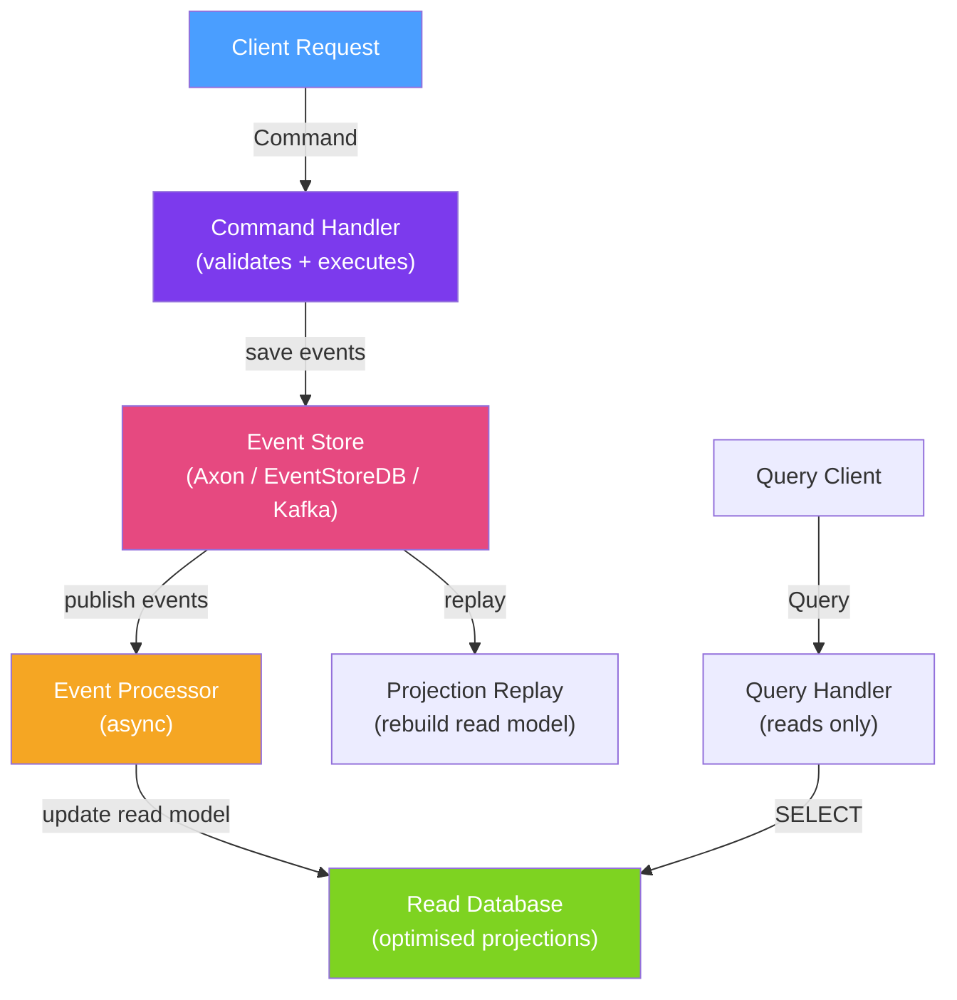

# 📋 CQRS and Event Sourcing

> [!abstract] TL;DR
> **CQRS** (Command Query Responsibility Segregation) separates write operations (commands) from read operations (queries) using different models, databases, or services. **Event Sourcing** stores state as an immutable sequence of events rather than the current state — the current state is derived by replaying events. Together they enable independent scaling of reads and writes, a complete audit log, and the ability to rebuild read models from scratch.

## Intuition — analogy FIRST

**CQRS** is like a bank having separate departments for tellers (commands: deposit, withdraw, transfer) and ATMs/online banking (queries: check balance, view history). The teller department writes to the ledger; ATMs show a read-optimised view. They can scale independently — 100 ATMs to one head teller.

**Event Sourcing** replaces the ledger showing current balances with a **complete transaction journal** — every deposit, withdrawal, and transfer is recorded as an immutable event. The current balance is derived by summing all events. The journal never loses history; you can time-travel to any past state and understand exactly how you got there. Traditional databases show "current balance: $500" — Event Sourcing shows "started $0 → deposited $1000 → withdrew $500 → current: $500."

---

## How It Works



## Key Concepts / Details

### Simple CQRS Without Event Sourcing

```java
// Command side — writes to main database
@Service
public class OrderCommandService {

    @Transactional
    public OrderId createOrder(CreateOrderCommand cmd) {
        // Validate
        inventoryService.checkAvailability(cmd.getProductId(), cmd.getQuantity());

        // Execute — save to write DB
        Order order = new Order(cmd);
        orderRepository.save(order);

        // Publish domain event for query side update
        eventPublisher.publishEvent(new OrderCreatedEvent(order));

        return order.getId();
    }
}

// Query side — reads from optimised read model
@Service
public class OrderQueryService {

    // Reads from a denormalized "OrderSummary" table — no JOINs needed
    @Transactional(readOnly = true)
    public List<OrderSummaryDto> getOrdersByUser(Long userId) {
        return orderSummaryRepository.findByUserId(userId);
    }
}

// Event listener — updates read model asynchronously
@EventListener
@Async
public void onOrderCreated(OrderCreatedEvent event) {
    OrderSummary summary = new OrderSummary(
        event.getOrderId(),
        event.getUserId(),
        event.getTotalAmount(),
        event.getStatus()
    );
    orderSummaryRepository.save(summary);
}
```

### Event Sourcing with Axon Framework

```java
// Aggregate — state is rebuilt from events, never stored directly
@Aggregate
public class OrderAggregate {

    @AggregateIdentifier
    private OrderId orderId;
    private OrderStatus status;
    private List<OrderLine> lines;

    // Command handler — validates and publishes events
    @CommandHandler
    public OrderAggregate(CreateOrderCommand cmd) {
        // Validate
        if (cmd.getLines().isEmpty()) {
            throw new IllegalArgumentException("Order must have at least one line");
        }
        // Publish event — do NOT set state here
        AggregateLifecycle.apply(new OrderCreatedEvent(
            cmd.getOrderId(), cmd.getCustomerId(), cmd.getLines()));
    }

    // Event handler — applies state changes
    @EventSourcingHandler
    void on(OrderCreatedEvent event) {
        this.orderId = event.getOrderId();
        this.status = OrderStatus.PENDING;
        this.lines = event.getLines();
    }

    @CommandHandler
    void handle(ConfirmOrderCommand cmd) {
        if (status != OrderStatus.PENDING) {
            throw new IllegalStateException("Can only confirm a PENDING order");
        }
        AggregateLifecycle.apply(new OrderConfirmedEvent(orderId, Instant.now()));
    }

    @EventSourcingHandler
    void on(OrderConfirmedEvent event) {
        this.status = OrderStatus.CONFIRMED;
    }
}
```

### Event Store Schema

```sql
-- Simple event store table
CREATE TABLE domain_events (
    id          BIGSERIAL PRIMARY KEY,
    aggregate_id VARCHAR(36) NOT NULL,
    aggregate_type VARCHAR(100) NOT NULL,
    event_type  VARCHAR(200) NOT NULL,
    payload     JSONB NOT NULL,
    metadata    JSONB,
    sequence_number BIGINT NOT NULL,
    occurred_at TIMESTAMPTZ NOT NULL DEFAULT NOW(),

    UNIQUE (aggregate_id, sequence_number)
);

CREATE INDEX idx_events_aggregate_id ON domain_events(aggregate_id);
```

### Projection — Read Model from Events

```java
@Service
public class OrderProjection {

    // Rebuild read model by replaying all order events
    @EventHandler
    public void on(OrderCreatedEvent event) {
        OrderView view = new OrderView(
            event.getOrderId().toString(),
            event.getCustomerId(),
            "PENDING",
            event.getLines()
        );
        orderViewRepository.save(view);
    }

    @EventHandler
    public void on(OrderConfirmedEvent event) {
        orderViewRepository.updateStatus(event.getOrderId().toString(), "CONFIRMED");
    }

    @EventHandler
    public void on(OrderShippedEvent event) {
        orderViewRepository.updateStatus(event.getOrderId().toString(), "SHIPPED");
    }
}
```

### CQRS Patterns Summary

| Pattern | Description | Trade-off |
|---------|-------------|-----------|
| **Same DB, different models** | Commands write, queries read from same tables | Simple but no independent scaling |
| **Separate read DB** | Write to PostgreSQL, sync to Elasticsearch for queries | Eventual consistency + more infrastructure |
| **Event Sourcing** | Events are the source of truth; state is derived | Full audit log + complex implementation |
| **Materialized views** | DB-level read model (PostgreSQL `CREATE MATERIALIZED VIEW`) | Simple but refresh latency |

### Eventual Consistency Handling

```java
// After a CreateOrder command, the read model is NOT immediately updated
// Handle this in the API:

@PostMapping("/orders")
public ResponseEntity<OrderCreatedResponse> createOrder(@RequestBody CreateOrderCommand cmd) {
    OrderId orderId = commandGateway.sendAndWait(cmd);

    // Option 1: Return 202 Accepted with a location to poll
    return ResponseEntity
        .accepted()
        .header("Location", "/orders/" + orderId)
        .body(new OrderCreatedResponse(orderId, "Order is being processed"));
}

// Option 2: Poll until read model is updated (with timeout)
@GetMapping("/orders/{orderId}")
public ResponseEntity<OrderView> getOrder(@PathVariable String orderId)
        throws InterruptedException {
    int maxAttempts = 10;
    for (int i = 0; i < maxAttempts; i++) {
        Optional<OrderView> view = orderViewRepository.findById(orderId);
        if (view.isPresent()) return ResponseEntity.ok(view.get());
        Thread.sleep(50 * (i + 1));  // exponential backoff
    }
    return ResponseEntity.status(202).build();  // still processing
}
```

## Real-World Notes

- **Start with CQRS, add Event Sourcing only if you need it** — CQRS (separate read/write models) has a moderate overhead; Event Sourcing adds significant complexity. Use Event Sourcing when you need a complete audit trail or time-travel queries.
- **Snapshotting prevents slow aggregate reconstruction** — replaying 10,000 events to reconstruct an aggregate is slow. Take snapshots every N events and replay only from the latest snapshot.
- **Event schema evolution is hard** — once published, events are immutable. Design event schemas carefully and use event upcasting (transform old event formats to new) when schemas must change.
- **Axon Framework vs manual** — Axon automates aggregate loading, event publishing, and projection management. For simpler use cases, manual event publishing with Spring's `ApplicationEventPublisher` and an `events` table is sufficient.

## Common Pitfalls

- **Commands that look like events** — `OrderCreated` is an event (past tense, immutable); `CreateOrder` is a command (imperative, may fail). Keep the naming distinction rigorous.
- **Projections that are too fine-grained** — rebuilding 10 separate projections from a single event stream multiplies processing time. Group related projections into a single processor.
- **No idempotency in event handlers** — at-least-once delivery can deliver events multiple times. Event handlers must be idempotent (processing the same event twice has the same effect as once).
- **Synchronous command + read model expectation** — the write returns before the read model is updated. APIs that return the created resource immediately after a command may return stale data.

## Related Concepts
- [[Transaction_Management]] — Command handlers must be transactional
- [[Database_Sharding_Java]] — Event store can be sharded by aggregate ID
- [[Database_Migration_Flyway]] — Event store schema managed by Flyway

## Review Questions
1. What is the difference between the command model and the query model in CQRS?
2. What is event sourcing and how does it enable "time-travel" queries?
3. Why must event handlers in event sourcing be idempotent?

## Sources
- Martin Fowler — CQRS — https://martinfowler.com/bliki/CQRS.html
- Axon Framework Documentation — https://docs.axoniq.io/
- Greg Young — Event Sourcing talk — https://www.youtube.com/watch?v=8JKjvY4etTY

#java #spring #architecture #cqrs #event-sourcing #axon #ddd
