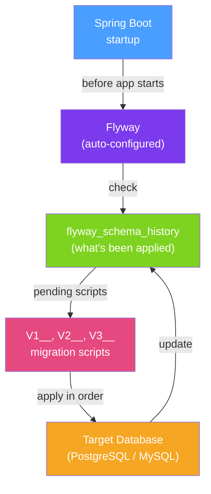

# 🛠️ Database Migration with Flyway

> [!abstract] TL;DR
> **Flyway** is the leading Java database migration tool — it version-controls your SQL schema changes using numbered migration scripts (`V1__Create_orders_table.sql`), applies them in order at application startup, and tracks what's been applied in a `flyway_schema_history` table. This ensures schema changes are reproducible, auditable, and applied consistently across all environments. Spring Boot auto-configures Flyway and runs migrations before the application starts.

## Intuition — analogy FIRST

Flyway is like **`git` for your database schema**. Just as code changes are committed in sequence and applied to any checkout, Flyway migration scripts are numbered in sequence and applied to any database. When a new developer joins, they run the app and Flyway automatically brings the database from version 0 to the current version by applying every migration in order. When you deploy to production, Flyway checks what's been applied and runs only the new scripts.

Without Flyway, database changes are applied manually — no record of what ran where, which environment has which version, or how to recreate the schema from scratch. Flyway eliminates the "works on my machine" problem for databases.

---

## How It Works



## Key Concepts / Details

### Dependency and Auto-Configuration

```xml
<dependency>
    <groupId>org.flywaydb</groupId>
    <artifactId>flyway-core</artifactId>
</dependency>
<!-- For PostgreSQL 15+ -->
<dependency>
    <groupId>org.flywaydb</groupId>
    <artifactId>flyway-database-postgresql</artifactId>
</dependency>
```

Spring Boot auto-detects Flyway and runs migrations at startup using the configured DataSource. No `@Bean` configuration needed for basic setup.

### Migration Naming Convention

```
src/main/resources/db/migration/
├── V1__Create_users_table.sql
├── V2__Create_orders_table.sql
├── V3__Add_status_column_to_orders.sql
├── V4__Create_order_items_table.sql
└── R__Create_reporting_views.sql        # Repeatable migration (no version prefix)
```

| Prefix | Pattern | Runs when |
|--------|---------|-----------|
| `V` | `V{version}__{description}.sql` | Once, in version order |
| `U` | `U{version}__{description}.sql` | Undo migration (rollback) |
| `R` | `R__{description}.sql` | Every time checksum changes |

Version numbers: `V1__`, `V1.1__`, `V1.2__`, `V2__` — supports integer, decimal, and timestamp versions.

### Migration Script Examples

```sql
-- V1__Create_orders_table.sql
CREATE TABLE orders (
    id          UUID PRIMARY KEY DEFAULT gen_random_uuid(),
    customer_id UUID NOT NULL,
    status      VARCHAR(20) NOT NULL DEFAULT 'PENDING',
    total_cents BIGINT NOT NULL,
    created_at  TIMESTAMPTZ NOT NULL DEFAULT NOW(),
    updated_at  TIMESTAMPTZ NOT NULL DEFAULT NOW()
);

CREATE INDEX idx_orders_customer_id ON orders(customer_id);
CREATE INDEX idx_orders_status ON orders(status);

-- V2__Create_order_items_table.sql
CREATE TABLE order_items (
    id          UUID PRIMARY KEY DEFAULT gen_random_uuid(),
    order_id    UUID NOT NULL REFERENCES orders(id) ON DELETE CASCADE,
    product_id  VARCHAR(50) NOT NULL,
    quantity    INT NOT NULL CHECK (quantity > 0),
    unit_price_cents BIGINT NOT NULL
);

-- V3__Add_shipped_at_to_orders.sql
-- Backward-compatible: new nullable column, existing app still works
ALTER TABLE orders ADD COLUMN shipped_at TIMESTAMPTZ;

-- V4__Backfill_shipped_at.sql
-- Separate backfill from schema change for large tables
UPDATE orders SET shipped_at = updated_at WHERE status = 'SHIPPED';
```

### application.yml Configuration

```yaml
spring:
  flyway:
    enabled: true
    locations: classpath:db/migration       # default location
    baseline-on-migrate: true               # create schema_history for existing databases
    baseline-version: 0                     # starting version for baseline
    validate-on-migrate: true               # fail if checksums don't match
    out-of-order: false                     # don't allow V2 if V3 already applied
    clean-disabled: true                    # NEVER allow flyway:clean in production
    schemas: public                         # which schemas Flyway manages
    table: flyway_schema_history            # history table name

  # For PostgreSQL-specific migrations:
  # locations: classpath:db/migration/common,classpath:db/migration/postgresql
```

### Java-Based Migrations

```java
// For data migrations that are easier to express in Java
@Component
public class V5__Migrate_currency_format implements JavaMigration {

    @Override
    public MigrationVersion getVersion() {
        return MigrationVersion.fromVersion("5");
    }

    @Override
    public String getDescription() {
        return "Migrate currency from decimal to integer cents";
    }

    @Override
    public void migrate(Context context) throws Exception {
        try (PreparedStatement stmt = context.getConnection().prepareStatement(
                "UPDATE products SET price_cents = ROUND(price * 100) WHERE price_cents IS NULL")) {
            stmt.executeUpdate();
        }
    }

    @Override
    public Integer getChecksum() {
        return 12345;  // Change this value to trigger re-run on checksum change
    }

    @Override
    public boolean isUndo() { return false; }
    @Override
    public boolean canExecuteInTransaction() { return true; }
}
```

### Flyway in Tests

```yaml
# application-test.yml
spring:
  flyway:
    enabled: true
    clean-on-validation-error: true  # reset DB during development tests
  datasource:
    url: jdbc:h2:mem:testdb;MODE=PostgreSQL;DATABASE_TO_LOWER=TRUE
```

```java
// Test with real Flyway migration
@SpringBootTest
@Testcontainers
class OrderRepositoryTest {

    @Container
    @ServiceConnection
    static PostgreSQLContainer<?> postgres = new PostgreSQLContainer<>("postgres:16-alpine");

    // Flyway automatically runs all migrations against the Testcontainers PostgreSQL
    // exactly as it would in production

    @Autowired
    private OrderRepository orderRepository;

    @Test
    void testOrderCreation() { ... }
}
```

### Safe Migration Practices

```sql
-- SAFE: Add nullable column — both old and new app versions work
ALTER TABLE orders ADD COLUMN shipping_address_id UUID;

-- SAFE: Add column with default — backward compatible
ALTER TABLE orders ADD COLUMN priority INT DEFAULT 0 NOT NULL;

-- RISKY for large tables: adding NOT NULL column with no default locks table
-- FIX: Add as nullable first, backfill, then add constraint
-- V10: ALTER TABLE orders ADD COLUMN priority INT;        -- step 1
-- V11: UPDATE orders SET priority = 0 WHERE priority IS NULL;  -- step 2
-- V12: ALTER TABLE orders ALTER COLUMN priority SET NOT NULL;  -- step 3

-- DANGEROUS: Rename/remove columns while old app is running
-- FIX: expand-contract migration pattern:
-- 1. Add new column (V10)
-- 2. Deploy app to read from both columns (V10-V11 transition)
-- 3. Backfill new column (V11)
-- 4. Deploy app to read only from new column
-- 5. Drop old column (V12)
```

### Flyway Repair — Fixing Failed Migrations

```bash
# If a migration failed mid-way and left the DB in inconsistent state:
flyway repair

# This removes the failed migration from flyway_schema_history
# Then fix the migration script and re-run flyway migrate
```

## Real-World Notes

- **Never modify applied migrations** — Flyway verifies checksums; modifying a script that's already been applied fails validation on the next startup. Create a new migration instead.
- **Test migrations on a staging replica** — before applying to production, run migrations on a copy of the production database. Large-table `ALTER TABLE` operations can lock the table for minutes.
- **Zero-downtime migrations require expand-contract** — with rolling deployments, the old and new app version run simultaneously against the same database. New columns must be nullable; removed columns must be deprecated in code first.
- **`clean-disabled: true` in production** — `flyway:clean` drops the entire schema. One accidental command destroys the database. Explicitly disable it in production via configuration.

## Common Pitfalls

- **Editing applied migration scripts** — any change to a checksum-validated script causes `Detected resolved migration not applied to database` errors on next startup.
- **Running migrations in parallel** — two application instances starting simultaneously may both attempt to apply the same migration. Flyway uses a database lock to prevent this, but the lock timeout must be configured correctly.
- **Large table migrations causing downtime** — `ALTER TABLE ADD COLUMN NOT NULL` without a default locks the entire table in PostgreSQL for large tables. Use `pg_repack` or the expand-contract pattern.
- **Baseline on clean database** — if `baseline-on-migrate: false` (the default) and you point Flyway at an existing populated database, it fails because V1 was already applied without Flyway. Always use `baseline-on-migrate: true` for existing databases.

## Related Concepts
- [[Multi_Tenancy]] — Running per-tenant Flyway migrations at onboarding
- [[Transaction_Management]] — Each Flyway migration runs in a transaction
- [[Test_Containers]] — Flyway runs migration scripts against Testcontainers databases for realistic test environments

## Review Questions
1. What is the Flyway `flyway_schema_history` table used for?
2. Why should you never edit a migration script that has already been applied to production?
3. What is the "expand-contract" migration pattern and when is it necessary?

## Sources
- Flyway Documentation — https://documentation.red-gate.com/fd/
- Spring Boot Flyway Auto-configuration — https://docs.spring.io/spring-boot/docs/current/reference/html/howto.html#howto.data-initialization.migration-tool.flyway

#java #spring #database #flyway #migrations #schema-evolution
