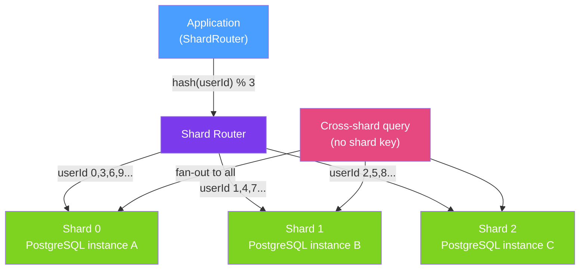

# ⚡ Database Sharding in Java

> [!abstract] TL;DR
> **Database sharding** is horizontal partitioning — splitting data across multiple database instances to scale writes beyond what a single server can handle. Each **shard** holds a subset of data determined by a **shard key**. The critical trade-offs: shard key selection determines query efficiency (queries without the shard key require fan-out to all shards), and cross-shard transactions are expensive or impossible. Choose sharding only after exhausting vertical scaling, read replicas, and caching.

## Intuition — analogy FIRST

A single-table library with 10 million books is unmanageable for one librarian. **Sharding** is like opening 10 branch libraries, each responsible for books whose titles start with letters A-C, D-F, etc. (range sharding) or assigning books by `hash(title) % 10` (hash sharding). When a patron wants a book, they go to the right branch directly — no need to check all 10. But if a patron wants "all books by Stephen King" (cross-shard query), they must visit all 10 branches and combine the results — expensive.

The **shard key** is the most critical decision. A bad shard key (e.g., timestamp) creates **hot shards** where all recent writes pile up on one branch while the rest sit idle.

---

## How It Works



## Key Concepts / Details

### Sharding Strategies

| Strategy | How | Pros | Cons |
|----------|-----|------|------|
| **Hash sharding** | `shard = hash(key) % N` | Even distribution | Resharding requires moving all data |
| **Range sharding** | Key ranges assigned to shards | Easy range queries | Hot shards on monotonic keys (IDs, timestamps) |
| **Directory sharding** | Lookup table maps keys to shards | Flexible, easy rebalancing | Lookup table is a single point of failure |
| **Geo sharding** | Region/geography determines shard | Data residency compliance | Skewed if traffic is geographically uneven |

### Consistent Hashing (Minimises Resharding Impact)

```java
import java.util.TreeMap;

public class ConsistentHashRing {
    private final TreeMap<Long, String> ring = new TreeMap<>();
    private final int virtualNodes;

    public ConsistentHashRing(List<String> shards, int virtualNodes) {
        this.virtualNodes = virtualNodes;
        for (String shard : shards) {
            for (int i = 0; i < virtualNodes; i++) {
                long hash = hash(shard + "-" + i);
                ring.put(hash, shard);
            }
        }
    }

    public String getShard(String key) {
        long hash = hash(key);
        Map.Entry<Long, String> entry = ring.ceilingEntry(hash);
        return entry != null ? entry.getValue() : ring.firstEntry().getValue();
    }

    private long hash(String key) {
        return MurmurHash3.hash(key);  // deterministic hash
    }
}
```

When adding a shard to a consistent hash ring, only ~1/N of keys need to move (vs all keys in modular hashing).

### AbstractRoutingDataSource — Spring Shard Router

```java
public class ShardRoutingDataSource extends AbstractRoutingDataSource {

    @Override
    protected Object determineCurrentLookupKey() {
        // Return the shard key stored in thread-local context
        return ShardContext.getCurrentShard();
    }
}

// Thread-local context for shard selection
public class ShardContext {
    private static final ThreadLocal<String> SHARD = new ThreadLocal<>();

    public static void setCurrentShard(String shard) { SHARD.set(shard); }
    public static String getCurrentShard() { return SHARD.get(); }
    public static void clear() { SHARD.remove(); }
}

// Configuration
@Configuration
public class ShardDataSourceConfig {

    @Bean
    public DataSource dataSource() {
        Map<Object, Object> targetDataSources = Map.of(
            "shard-0", createDataSource("jdbc:postgresql://db0:5432/app"),
            "shard-1", createDataSource("jdbc:postgresql://db1:5432/app"),
            "shard-2", createDataSource("jdbc:postgresql://db2:5432/app")
        );

        ShardRoutingDataSource routing = new ShardRoutingDataSource();
        routing.setTargetDataSources(targetDataSources);
        routing.setDefaultTargetDataSource(targetDataSources.get("shard-0"));
        return routing;
    }
}

// Service usage
@Service
public class OrderService {
    private final ConsistentHashRing ring;

    @Transactional
    public Order createOrder(OrderRequest req) {
        String shard = ring.getShard(req.getUserId().toString());
        ShardContext.setCurrentShard(shard);
        try {
            return orderRepository.save(new Order(req));
        } finally {
            ShardContext.clear();
        }
    }
}
```

### Cross-Shard Query Fan-Out

```java
@Service
public class ReportingService {

    private final List<OrderRepository> shardRepositories;

    // Queries without shard key — fan-out to ALL shards
    public List<Order> findAllPendingOrders() {
        return shardRepositories.parallelStream()
            .flatMap(repo -> repo.findByStatus(OrderStatus.PENDING).stream())
            .collect(Collectors.toList());
    }

    // Cross-shard aggregation — must aggregate in application
    public Map<String, Long> getOrderCountByProduct() {
        return shardRepositories.parallelStream()
            .flatMap(repo -> repo.countByProduct().entrySet().stream())
            .collect(Collectors.groupingBy(
                Map.Entry::getKey,
                Collectors.summingLong(Map.Entry::getValue)));
    }
}
```

### What Sharding Makes Impossible/Hard

| Operation | Single DB | After Sharding |
|-----------|-----------|---------------|
| `SELECT * WHERE userId = 42` | Easy | Easy (route to shard) |
| `SELECT * WHERE status = 'PAID'` | Easy | Hard (fan-out to all shards) |
| `COUNT(*) across all orders` | Easy | Must sum counts from all shards |
| `JOIN orders o ON o.customerId = c.id` | Easy | Very hard (customers may be on different shards) |
| `ORDER BY created_at LIMIT 10` | Easy | Must merge sorted results from all shards |
| Cross-shard transaction | ACID | Two-phase commit or saga pattern |
| Unique constraint across shards | Enforced by DB | Must use UUID or application-level deduplication |

### Apache ShardingSphere (Framework Alternative)

```yaml
# application.yml with ShardingSphere JDBC
spring:
  datasource:
    driver-class-name: org.apache.shardingsphere.driver.ShardingSphereDriver
    url: "jdbc:shardingsphere:classpath:sharding-config.yml"
```

ShardingSphere intercepts JDBC calls and transparently routes to the correct shard, handling fan-out, aggregation, and distributed transactions.

## Real-World Notes

- **Shard before you need it, but not too early** — sharding adds enormous operational complexity. Exhaust read replicas, caching, and vertical scaling first. Sharding at 10M rows is premature; at 1B rows it's necessary.
- **UUID shard keys prevent hot shards** — monotonically increasing IDs (auto-increment) cause all inserts to go to the last shard. Use UUID v4 or ULID (lexicographically sortable UUID) as primary keys.
- **OLAP queries should not use the sharded OLTP database** — fan-out queries on sharded databases put enormous load on all shards. Route analytics to a data warehouse or use CDC (Debezium) to stream data there.
- **Schema changes across all shards** — `ALTER TABLE` must be applied to every shard. Use Flyway with a multi-datasource configuration or a shard management tool to coordinate migrations.

## Common Pitfalls

- **Choosing a bad shard key** — a shard key with low cardinality (e.g., `status` with 3 values) creates only 3 effective shards regardless of how many servers you have.
- **Cross-shard joins in production** — starting with a schema that requires cross-shard joins is a design smell. Denormalize or replicate data to avoid joins across shards.
- **Ignoring resharding cost** — adding a 4th shard to a 3-shard system with modular hashing (`hash % 3`) requires moving 75% of all data. Use consistent hashing from the start.
- **Global sequences across shards** — `AUTO_INCREMENT` doesn't work across shards. Generate globally unique IDs at the application layer using UUID, Snowflake IDs, or a dedicated ID service.

## Related Concepts
- [[CQRS_Event_Sourcing]] — CQRS can route queries to a read-optimised database, reducing need for cross-shard queries
- [[Multi_Tenancy]] — Tenant-per-shard is a common multi-tenancy pattern
- [[Transaction_Management]] — Distributed transactions across shards use the Saga pattern

## Review Questions
1. Why does `hash(userId) % N` sharding cause massive data movement when N changes, and how does consistent hashing mitigate this?
2. What queries are fundamentally expensive or impossible after sharding and why?
3. Why is `AUTO_INCREMENT` a bad choice for primary keys in a sharded database?

## Sources
- Martin Fowler — Sharding — https://martinfowler.com/bliki/CQRS.html
- Apache ShardingSphere — https://shardingsphere.apache.org/
- Designing Data-Intensive Applications, Chapter 6 — Martin Kleppmann

#java #database #sharding #horizontal-scaling #consistent-hashing #distributed
