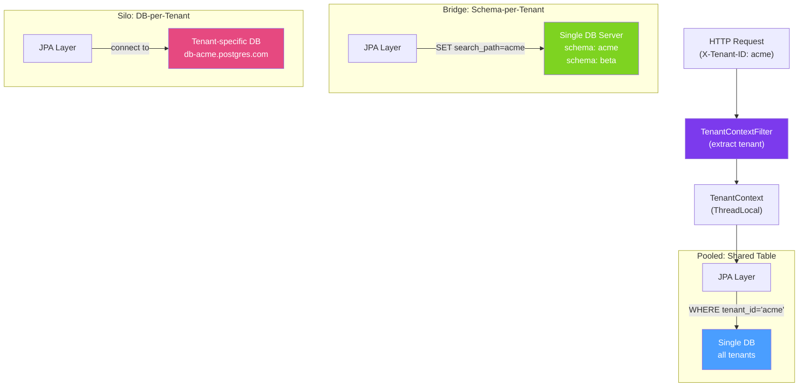

# 🏢 Multi-Tenancy

> [!abstract] TL;DR
> Multi-tenancy lets a single application serve multiple customers (tenants) on shared infrastructure. The three models are **pooled** (shared schema with `tenant_id` column — simplest but least isolated), **silo** (separate database per tenant — maximum isolation but expensive), and **bridge** (separate schema per tenant within a shared database — middle ground). Each model has distinct implications for Spring/JPA configuration, Flyway migrations, and tenant isolation.

## Intuition — analogy FIRST

Imagine a coworking space (the application) serving multiple companies (tenants). **Pooled** is like a shared open-plan office — everyone works in the same room, identified only by their name badge (`tenant_id`). Cheap and efficient, but if one employee shouts confidential information, everyone hears. **Silo** is like giving each company its own building — complete privacy, but you maintain 100 buildings instead of one. **Bridge** is like separate locked rooms within one building — better isolation than open plan, still sharing some infrastructure (the building = database server).

The right choice depends on your customers' isolation requirements (regulated industries like finance/healthcare demand silo), operational budget (silo is 10× more expensive to operate), and tenant count (100 tenants: easy; 10,000 tenants: silo becomes impractical).

---

## How It Works



## Key Concepts / Details

### Model Comparison

| Dimension | Pooled | Bridge (Schema-per-Tenant) | Silo (DB-per-Tenant) |
|-----------|--------|---------------------------|----------------------|
| **Isolation** | Low (row-level) | Medium (schema boundary) | High (DB boundary) |
| **Cost** | Lowest | Medium | Highest |
| **Scalability** | High (shared resources) | Medium | Low (N databases to manage) |
| **Data leak risk** | Highest (missing WHERE clause) | Low | None |
| **Compliance** | Difficult (GDPR, HIPAA) | Easier | Easiest |
| **Migration complexity** | Simple (one schema) | Medium (N schemas) | High (N databases) |

### Tenant Context Propagation

```java
// Tenant context stored in ThreadLocal
public class TenantContext {
    private static final ThreadLocal<String> TENANT = new ThreadLocal<>();

    public static void setTenant(String tenantId) { TENANT.set(tenantId); }
    public static String getTenant() { return TENANT.get(); }
    public static void clear() { TENANT.remove(); }
}

// Extract tenant from HTTP request header
@Component
public class TenantContextFilter extends OncePerRequestFilter {

    @Override
    protected void doFilterInternal(HttpServletRequest req,
                                    HttpServletResponse res,
                                    FilterChain chain)
            throws ServletException, IOException {
        String tenantId = req.getHeader("X-Tenant-ID");
        if (tenantId == null || tenantId.isBlank()) {
            res.sendError(400, "X-Tenant-ID header is required");
            return;
        }
        TenantContext.setTenant(tenantId);
        MDC.put("tenantId", tenantId);  // also add to logs
        try {
            chain.doFilter(req, res);
        } finally {
            TenantContext.clear();
            MDC.remove("tenantId");
        }
    }
}
```

### Pooled Model — Hibernate Filter

```java
// Entity with tenant_id column
@Entity
@Table(name = "orders")
@FilterDef(name = "tenantFilter", parameters = {
    @ParamDef(name = "tenantId", type = String.class)
})
@Filter(name = "tenantFilter", condition = "tenant_id = :tenantId")
public class Order {

    @Id
    @GeneratedValue(strategy = GenerationType.UUID)
    private UUID id;

    @Column(name = "tenant_id", nullable = false, updatable = false)
    private String tenantId;

    // ... other fields
}

// Aspect to automatically enable tenant filter on all sessions
@Aspect
@Component
public class TenantFilterAspect {

    @Autowired
    private EntityManager entityManager;

    @Before("@annotation(org.springframework.transaction.annotation.Transactional)")
    public void enableTenantFilter() {
        String tenantId = TenantContext.getTenant();
        if (tenantId != null) {
            Session session = entityManager.unwrap(Session.class);
            session.enableFilter("tenantFilter")
                   .setParameter("tenantId", tenantId);
        }
    }
}
```

### Bridge Model — Schema-per-Tenant with Hibernate

```java
// Custom MultiTenantConnectionProvider for schema-based isolation
@Component
public class SchemaMultiTenantConnectionProvider
        extends AbstractDataSourceBasedMultiTenantConnectionProviderImpl {

    @Override
    protected DataSource selectAnyDataSource() {
        return defaultDataSource;  // used for schema-agnostic operations
    }

    @Override
    protected DataSource selectDataSource(String tenantIdentifier) {
        return defaultDataSource;  // all tenants share the same DataSource
    }

    @Override
    public Connection getConnection(String tenantIdentifier) throws SQLException {
        Connection conn = super.getConnection(tenantIdentifier);
        // PostgreSQL schema-based isolation
        conn.createStatement().execute("SET search_path TO " + tenantIdentifier + ",public");
        return conn;
    }
}

// Tenant identifier resolver
@Component
public class TenantIdentifierResolver implements CurrentTenantIdentifierResolver<String> {

    @Override
    public String resolveCurrentTenantIdentifier() {
        String tenant = TenantContext.getTenant();
        return tenant != null ? tenant : "public";  // default schema
    }

    @Override
    public boolean validateExistingCurrentSessions() {
        return true;
    }
}
```

### Multi-Tenant Flyway Migrations

```java
@Component
public class MultiTenantFlywayMigrator {

    private final DataSource dataSource;
    private final TenantRepository tenantRepository;

    @PostConstruct
    public void migrateAllTenants() {
        tenantRepository.findAll().forEach(this::migrateTenant);
    }

    private void migrateTenant(Tenant tenant) {
        Flyway flyway = Flyway.configure()
            .dataSource(dataSource)
            .schemas(tenant.getSchemaName())           // tenant-specific schema
            .locations("classpath:db/migration/tenant") // tenant migration scripts
            .table("flyway_schema_history")
            .load();
        flyway.migrate();
    }

    // Called when a new tenant is onboarded
    public void onboardNewTenant(String tenantId) {
        // Create schema
        jdbcTemplate.execute("CREATE SCHEMA IF NOT EXISTS " + tenantId);
        migrateTenant(new Tenant(tenantId, tenantId));
    }
}
```

### PostgreSQL Row-Level Security (Pooled Model Alternative)

```sql
-- Enable RLS on table (security enforced by database, not application)
ALTER TABLE orders ENABLE ROW LEVEL SECURITY;

CREATE POLICY tenant_isolation_policy ON orders
    USING (tenant_id = current_setting('app.tenant_id')::text);

-- Set per-connection context
SET app.tenant_id = 'acme';
SELECT * FROM orders;  -- returns only acme's orders
```

```java
// Set RLS context before each query
@EventListener
public void beforeQuery(SessionEventListenerAdapter event) {
    jdbcTemplate.execute("SET app.tenant_id = '" + TenantContext.getTenant() + "'");
}
```

## Real-World Notes

- **Pooled is right for most SaaS** — unless you have customers demanding data isolation for compliance, pooled with Hibernate filters and RLS is the right starting point. It scales the furthest on the least infrastructure.
- **Noisy neighbor problem** — in pooled mode, one tenant's heavy queries slow all tenants. Mitigate with per-tenant query timeouts, connection limits, and monitoring for tenant-level resource consumption.
- **Tenant onboarding automation is essential** — manually creating schemas or databases for each new tenant is error-prone. Automate with a `TenantOnboardingService` that runs Flyway migrations and creates necessary resources.
- **GDPR right to erasure per tenant** — silo model makes tenant data deletion trivial (drop database). Pooled requires `DELETE WHERE tenant_id = ?` across all tables with careful cascade handling.

## Common Pitfalls

- **Missing `tenant_id` in pooled model WHERE clauses** — one forgotten `WHERE tenant_id = ?` is a data leak. Use Hibernate filters or a base repository class that adds the condition automatically.
- **Schema names with special characters** — tenant-provided names must be sanitised (alphanumeric, underscore only) before using in `SET search_path` to prevent SQL injection in DDL statements.
- **Leaking tenant context across threads** — ThreadLocal is not propagated to async threads. Use `DelegatingSecurityContextExecutor` or MDC propagation wrappers for async operations.
- **Flyway running simultaneously on all schemas** — multiple instances starting simultaneously will each try to migrate all tenant schemas. Flyway's distributed locking handles this, but ensure your shared `flyway_schema_history` table is per-schema.

## Related Concepts
- [[Database_Migration_Flyway]] — Running per-tenant migrations at onboarding and upgrade
- [[Database_Sharding_Java]] — Tenant-per-shard combines silo isolation with horizontal scaling
- [[Transaction_Management]] — Tenant context must be set before transaction starts

## Review Questions
1. What is the difference between pooled, bridge, and silo multi-tenancy models?
2. How does PostgreSQL Row-Level Security (RLS) provide tenant isolation in a pooled model?
3. Why is ThreadLocal a dangerous carrier for tenant context in asynchronous applications?

## Sources
- Hibernate Multi-Tenancy Guide — https://docs.jboss.org/hibernate/orm/6.5/userguide/html_single/Hibernate_User_Guide.html#multitenancy
- PostgreSQL Row Level Security — https://www.postgresql.org/docs/current/ddl-rowsecurity.html

#java #spring #database #multi-tenancy #saas #schema-per-tenant #rls
