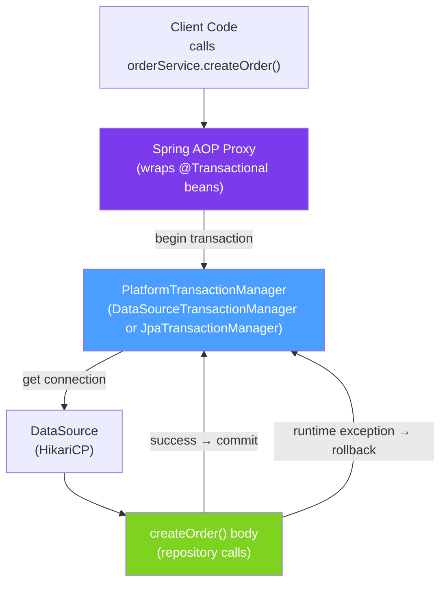

# 💾 Transaction Management

> [!abstract] TL;DR
> Spring's `@Transactional` wraps method calls in a database transaction, ensuring ACID guarantees. Key decisions: **propagation** (does this method join an existing transaction or start a new one?), **isolation level** (how much do concurrent transactions see each other?), and **rollback rules** (which exceptions trigger a rollback?). The most dangerous pitfall is **self-invocation** — calling a `@Transactional` method from within the same class bypasses the Spring proxy.

## Intuition — analogy FIRST

A database transaction is like a **bank transfer** — you debit one account and credit another. These two operations must be atomic: either both succeed or both fail. If the system crashes between the debit and the credit, the transaction rolls back, and neither account changes. The database guarantees ACID: Atomicity, Consistency, Isolation, Durability.

Spring's `@Transactional` is the **transaction controller** — it decides when to start a transaction, whether to join an existing one, and whether to commit or rollback when the method exits. Think of `REQUIRED` propagation as "join the ongoing bank shift" and `REQUIRES_NEW` as "step outside, start a separate transaction at a different counter, come back when done."

---

## How It Works



## Key Concepts / Details

### Basic Usage

```java
@Service
public class OrderService {

    @Transactional                          // uses defaults: REQUIRED, isolation=DEFAULT
    public Order createOrder(OrderRequest req) {
        Order order = new Order(req);
        orderRepository.save(order);        // within transaction
        inventoryService.decrementStock(req.getProductId(), req.getQuantity()); // also within
        notificationService.sendConfirmation(order);
        return order;
    }

    @Transactional(readOnly = true)         // hint to DB to optimise; disables dirty checks in Hibernate
    public List<Order> getOrdersByUser(Long userId) {
        return orderRepository.findByUserId(userId);
    }
}
```

### Propagation Behaviours

| Propagation | Behaviour | Use Case |
|-------------|----------|---------|
| `REQUIRED` (default) | Join existing tx; start new if none | Standard service methods |
| `REQUIRES_NEW` | Always start a new, independent tx | Audit logging — must commit even if outer tx rolls back |
| `SUPPORTS` | Join if exists; execute non-transactionally if not | Read methods that work in either context |
| `NOT_SUPPORTED` | Suspend current tx; execute non-transactionally | Operations that must not be in a tx (e.g., long computations) |
| `MANDATORY` | Must join existing tx; throw if none | Internal methods requiring a tx context |
| `NEVER` | Must NOT have a tx; throw if one exists | Sanity check methods |
| `NESTED` | Create savepoint within current tx | Partial rollback without rolling back outer tx |

```java
@Service
public class AuditService {

    // REQUIRES_NEW: audit log is committed even if the calling transaction rolls back
    @Transactional(propagation = Propagation.REQUIRES_NEW)
    public void logAction(String action, Long userId) {
        auditRepository.save(new AuditLog(action, userId, Instant.now()));
    }
}
```

### Isolation Levels

| Level | Dirty Read | Non-Repeatable Read | Phantom Read | Use Case |
|-------|-----------|--------------------|--------------|----|
| `READ_UNCOMMITTED` | Yes | Yes | Yes | Never — sees uncommitted changes |
| `READ_COMMITTED` (default for PostgreSQL) | No | Yes | Yes | General OLTP |
| `REPEATABLE_READ` (MySQL default) | No | No | Yes | Consistency-critical reads |
| `SERIALIZABLE` | No | No | No | Financial transactions, audits |

```java
@Transactional(isolation = Isolation.SERIALIZABLE)
public void processPayment(PaymentRequest req) {
    // No other transaction can read or modify affected rows until this completes
    Account account = accountRepository.findByIdForUpdate(req.getAccountId());
    account.debit(req.getAmount());
    accountRepository.save(account);
}
```

### Rollback Rules

```java
// Default: rollback on RuntimeException and Error; NO rollback on checked exceptions
@Transactional
public Order createOrder(OrderRequest req) throws IOException {
    // IOException is checked → NO automatic rollback!
    // Use rollbackFor to include checked exceptions:
}

@Transactional(rollbackFor = Exception.class)
public Order createOrder(OrderRequest req) throws IOException {
    // Now IOException also triggers rollback
}

@Transactional(noRollbackFor = ValidationException.class)
public Order createOrder(OrderRequest req) {
    // ValidationException extends RuntimeException but will NOT trigger rollback
    // (useful when you catch, log, and continue)
}
```

### The Self-Invocation Trap

```java
@Service
public class OrderService {

    // @Transactional works via a Spring proxy — the proxy intercepts the call
    @Transactional
    public void createOrderAndAudit(OrderRequest req) {
        createOrder(req);       // SELF-INVOCATION — bypasses proxy!
        auditOrder(req);
    }

    @Transactional(propagation = Propagation.REQUIRES_NEW)
    public void auditOrder(OrderRequest req) {
        // This @Transactional is IGNORED when called from createOrderAndAudit!
        // Because this is a direct Java method call, not through the proxy.
        auditRepository.save(new Audit(req));
    }
}

// FIX 1: Inject self and call through proxy
@Service
public class OrderService {
    @Autowired
    private ApplicationContext ctx;

    @Transactional
    public void createOrderAndAudit(OrderRequest req) {
        createOrder(req);
        ctx.getBean(OrderService.class).auditOrder(req);  // goes through proxy
    }
}

// FIX 2: Move auditOrder() to a separate bean (preferred approach)
@Service
public class AuditService {
    @Transactional(propagation = Propagation.REQUIRES_NEW)
    public void auditOrder(OrderRequest req) { ... }
}
```

### @Transactional in Tests

```java
@SpringBootTest
class OrderServiceTest {

    @Test
    @Transactional              // test-level transaction
    @Rollback(true)             // automatically rolled back after test (default for @Transactional tests)
    void createOrder_persistsToDatabase() {
        Order order = orderService.createOrder(new OrderRequest("p-1", 2));
        assertThat(order.getId()).isNotNull();
        // Transaction rolled back after test — no test data remains in DB
    }
}
```

## Real-World Notes

- **`readOnly = true` improves performance** — it tells Hibernate to skip dirty checking at flush time (a significant saving for large entity graphs) and may give the database a hint to use read replicas.
- **`REQUIRES_NEW` creates a new connection** — it suspends the current connection and borrows another from HikariCP. With a small pool, this can cause deadlocks if all connections are in `REQUIRES_NEW` transactions waiting for a connection.
- **Checked vs unchecked is a gotcha** — by default, `@Transactional` does NOT rollback on checked exceptions. If your service method throws `IOException` or `SQLException`, the transaction commits with partial work done.
- **@Transactional on interface methods** — works with JDK interface proxy. If using CGLIB (no interface), annotate the concrete class implementation.

## Common Pitfalls

- **Self-invocation** — the most frequent bug. A `@Transactional` method calling another `@Transactional` method in the same class bypasses the proxy; the inner annotation is ignored.
- **@Transactional on private methods** — Spring AOP cannot intercept private methods; the annotation is silently ignored. Always use public or protected methods.
- **Long transactions holding DB connections** — a `@Transactional` that does HTTP calls or sends emails holds a database connection open during the external call, exhausting HikariCP.
- **Not understanding isolation = DEFAULT** — `DEFAULT` means "use the database's default", which is `READ_COMMITTED` for PostgreSQL and `REPEATABLE_READ` for MySQL. This difference causes inconsistencies in mixed-DB applications.

## Related Concepts
- [[Database_Migration_Flyway]] — Migrations also run in transactions
- [[CQRS_Event_Sourcing]] — Command handler must be transactional; queries are separate
- [[Multi_Tenancy]] — Schema-per-tenant requires transaction-aware tenant switching

## Review Questions
1. What is the self-invocation trap with `@Transactional` and what are two ways to fix it?
2. When would you use `Propagation.REQUIRES_NEW` instead of `Propagation.REQUIRED`?
3. Why does `@Transactional(readOnly = true)` improve performance in Hibernate applications?

## Sources
- Spring Transaction Management Reference — https://docs.spring.io/spring-framework/docs/current/reference/html/data-access.html#transaction
- Vlad Mihalcea — Spring @Transactional Pitfalls — https://vladmihalcea.com/spring-transactional-pitfalls/

#java #spring #database #transactions #transactional #jpa #isolation
