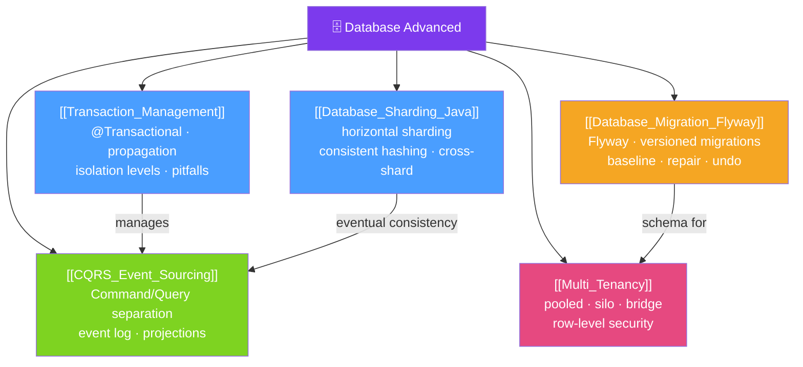

# 🗄️ Database Advanced — Map of Content

> [!abstract] What This Section Covers
> Advanced database topics for Java/Spring engineers: **Transaction Management** with Spring's `@Transactional` (propagation, isolation, pitfalls), **Database Sharding** for horizontal scale, **CQRS + Event Sourcing** for separating read and write models, **Multi-Tenancy** patterns for SaaS applications, and **Database Migrations** with Flyway. These topics bridge the gap between "making queries work" and "making queries work at scale, safely, and correctly."

## Concept Map

## Learning Path
1. [[Transaction_Management]] — Master `@Transactional` propagation, isolation levels, and the self-invocation trap.
2. [[Database_Migration_Flyway]] — Version-control your schema with Flyway for safe, repeatable migrations.
3. [[Multi_Tenancy]] — Choose pooled, silo, or bridge isolation for SaaS database architectures.
4. [[Database_Sharding_Java]] — Scale writes horizontally with sharding strategies and cross-shard query limitations.
5. [[CQRS_Event_Sourcing]] — Separate read and write models; use an event log as the source of truth.

## All Notes at a Glance
| Note | Difficulty | What You'll Learn |
|------|------------|-------------------|
| [[Transaction_Management]] | Intermediate | @Transactional propagation/isolation, rollback rules, self-invocation pitfall |
| [[Database_Sharding_Java]] | Advanced | Horizontal sharding, shard key selection, consistent hashing, cross-shard queries |
| [[CQRS_Event_Sourcing]] | Advanced | Command/Query separation, event store, projections, eventual consistency |
| [[Multi_Tenancy]] | Advanced | Pooled/silo/bridge models, RLS, schema-per-tenant with Flyway, noisy neighbor |
| [[Database_Migration_Flyway]] | Intermediate | Flyway naming, versioned/repeatable scripts, Spring Boot integration, repair |

## Key Questions This Section Answers
- What happens when a `@Transactional` method calls another `@Transactional` method in the same class?
- What is the difference between `REQUIRES_NEW` and `NESTED` transaction propagation?
- How do you choose a shard key and what queries become impossible after sharding?
- What does "the event store is the source of truth" mean in Event Sourcing?
- How does Flyway prevent two application instances from running the same migration simultaneously?

## Related Sections
- [[_MOC_Java_Master|↑ Java Master MOC]]
- [[29_Security_Advanced/_MOC_Security_Advanced|← Security Advanced]]
- [[31_API_Design/_MOC_API_Design|→ API Design]]

#MOC #java #database #transactions #sharding #cqrs #flyway #multi-tenancy
