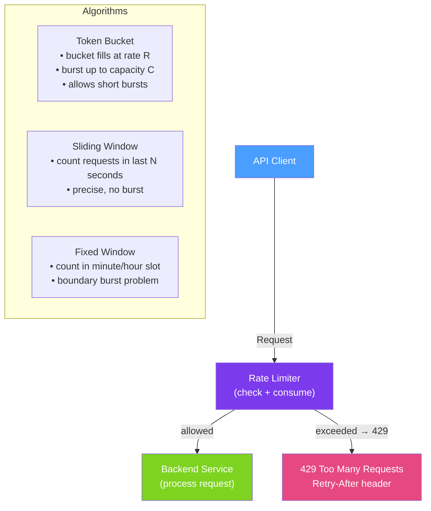

# 🚦 API Rate Limiting

> [!abstract] TL;DR
> **Rate limiting** controls how many requests a client can make in a given time window, preventing abuse, ensuring fair usage, and protecting backend systems from overload. The two most common algorithms are **token bucket** (allows bursting) and **sliding window** (smooth rate enforcement). In Spring Boot, rate limiting is implemented via Resilience4j's `@RateLimiter`, Spring Cloud Gateway filters, or Redis-backed distributed limiters.

## Intuition — analogy FIRST

Rate limiting is like a **ticket dispenser at a theme park**. A token bucket dispenser gives you 100 tickets at midnight and lets you spend them however you want — burn all 100 in the first hour (burst traffic) or spread them across the day. When you run out, you wait until more are dispensed. A sliding window limiter is more like a **turnstile that counts entries in the last hour** — you can enter 100 times in any 60-minute window, but no more. Both limit total throughput; the bucket allows bursting, the window is more even.

Without rate limiting, one bad client can issue 10,000 requests per second and take down your API for legitimate users. Rate limiting ensures **fairness** (each client gets their fair share) and **protection** (backend databases are not overwhelmed).

---

## How It Works



## Key Concepts / Details

### Algorithm Comparison

| Algorithm | Behaviour | Burst Allowed | Complexity | Best For |
|-----------|----------|---------------|------------|---------|
| **Token Bucket** | Fill at rate R, burst up to C | Yes | Low | APIs where occasional bursts are OK |
| **Leaky Bucket** | Queue requests, process at fixed rate | No | Low | Smooth outbound traffic |
| **Fixed Window** | Count per minute/hour slot | Yes (at boundary) | Very low | Simple enforcement |
| **Sliding Window** | Count in last N seconds | No | Medium | Precise, fair enforcement |
| **Sliding Log** | Track every request timestamp | No | High | Exact tracking (expensive at scale) |

### Resilience4j @RateLimiter

```xml
<dependency>
    <groupId>io.github.resilience4j</groupId>
    <artifactId>resilience4j-spring-boot3</artifactId>
</dependency>
```

```yaml
# application.yml
resilience4j:
  ratelimiter:
    instances:
      orderApi:
        limitForPeriod: 100        # allow 100 calls
        limitRefreshPeriod: 1s     # per second (token bucket refill)
        timeoutDuration: 0         # don't wait — fail fast
      externalPaymentApi:
        limitForPeriod: 10
        limitRefreshPeriod: 1s
        timeoutDuration: 500ms     # wait up to 500ms for a permit
```

```java
@RestController
public class OrderController {

    @PostMapping("/orders")
    @RateLimiter(name = "orderApi", fallbackMethod = "rateLimitedFallback")
    public ResponseEntity<OrderDto> createOrder(@RequestBody CreateOrderRequest req) {
        return ResponseEntity.status(201).body(orderService.create(req));
    }

    public ResponseEntity<OrderDto> rateLimitedFallback(
            CreateOrderRequest req, RequestNotPermitted ex) {
        return ResponseEntity.status(429)
            .header("Retry-After", "1")  // retry after 1 second
            .header("X-RateLimit-Limit", "100")
            .header("X-RateLimit-Remaining", "0")
            .build();
    }
}
```

### Per-Client Rate Limiting with Spring Cloud Gateway

```yaml
# spring cloud gateway application.yml
spring:
  cloud:
    gateway:
      routes:
        - id: order-service
          uri: lb://order-service
          predicates:
            - Path=/api/orders/**
          filters:
            - name: RequestRateLimiter
              args:
                # Redis token bucket: 10 req/sec per client, burst up to 20
                redis-rate-limiter.replenishRate: 10
                redis-rate-limiter.burstCapacity: 20
                redis-rate-limiter.requestedTokens: 1
                key-resolver: "#{@apiKeyResolver}"
```

```java
// Rate limit key — by API key, user ID, or IP address
@Bean
public KeyResolver apiKeyResolver() {
    return exchange -> Mono.justOrEmpty(
        exchange.getRequest().getHeaders().getFirst("X-API-Key")
    ).switchIfEmpty(Mono.just(
        exchange.getRequest().getRemoteAddress().getAddress().getHostAddress()
    ));
}
```

### Redis-Backed Distributed Rate Limiter

```java
// Custom distributed rate limiter using Redis Lua script (sliding window)
@Component
public class RedisRateLimiter {

    private static final String RATE_LIMIT_SCRIPT = """
        local key = KEYS[1]
        local now = tonumber(ARGV[1])
        local window = tonumber(ARGV[2])
        local limit = tonumber(ARGV[3])
        
        -- Remove expired entries
        redis.call('ZREMRANGEBYSCORE', key, '-inf', now - window)
        
        -- Count current requests in window
        local count = redis.call('ZCARD', key)
        
        if count < limit then
            redis.call('ZADD', key, now, now)
            redis.call('EXPIRE', key, window / 1000)
            return 1  -- allowed
        else
            return 0  -- rate limited
        end
        """;

    private final RedisTemplate<String, String> redisTemplate;
    private final DefaultRedisScript<Long> script;

    public boolean isAllowed(String clientId, int limit, Duration window) {
        String key = "rate_limit:" + clientId;
        long now = System.currentTimeMillis();
        long windowMs = window.toMillis();

        Long result = redisTemplate.execute(script,
            List.of(key),
            String.valueOf(now),
            String.valueOf(windowMs),
            String.valueOf(limit));

        return result != null && result == 1L;
    }
}

// Servlet filter using the distributed limiter
@Component
public class RateLimitingFilter extends OncePerRequestFilter {

    @Autowired private RedisRateLimiter rateLimiter;

    @Override
    protected void doFilterInternal(HttpServletRequest req,
                                    HttpServletResponse res,
                                    FilterChain chain)
            throws ServletException, IOException {

        String apiKey = req.getHeader("X-API-Key");
        String clientId = apiKey != null ? "apikey:" + apiKey
                                        : "ip:" + req.getRemoteAddr();

        if (!rateLimiter.isAllowed(clientId, 100, Duration.ofMinutes(1))) {
            res.setStatus(429);
            res.setHeader("Retry-After", "60");
            res.setHeader("Content-Type", "application/json");
            res.getWriter().write("""
                {"error": "Rate limit exceeded", "retryAfter": 60}
                """);
            return;
        }
        chain.doFilter(req, res);
    }
}
```

### Rate Limit Response Headers

```http
HTTP/1.1 429 Too Many Requests
Content-Type: application/problem+json
Retry-After: 30
X-RateLimit-Limit: 100
X-RateLimit-Remaining: 0
X-RateLimit-Reset: 1721995200

{
  "type": "about:blank",
  "title": "Too Many Requests",
  "status": 429,
  "detail": "API rate limit exceeded. 100 requests per minute allowed.",
  "retryAfter": 30
}
```

### Rate Limit Tiers (API Plans)

```java
// Different limits per API tier
@Service
public class RateLimitService {

    private static final Map<String, Integer> TIER_LIMITS = Map.of(
        "free",       100,   // 100 req/hour
        "starter",    1000,  // 1,000 req/hour
        "pro",        10000, // 10,000 req/hour
        "enterprise", 100000 // 100,000 req/hour
    );

    public int getLimitForClient(String apiKey) {
        ApiClient client = apiKeyRepository.findByKey(apiKey).orElseThrow();
        return TIER_LIMITS.getOrDefault(client.getTier(), 100);
    }
}
```

## Real-World Notes

- **Rate limit by API key, not by IP** — IP-based limiting is easily circumvented with VPNs and shared IPs in corporate NAT environments. API key-based limiting is more accurate and fair.
- **Separate rate limits for read vs write** — reads are cheap; writes touch the database. Apply stricter limits on mutation endpoints (`POST`, `PUT`, `DELETE`) than read endpoints.
- **Rate limiting headers are a courtesy** — include `X-RateLimit-Limit`, `X-RateLimit-Remaining`, and `X-RateLimit-Reset` so well-behaved clients can back off before hitting 429.
- **Don't rate limit health and metrics endpoints** — `GET /actuator/health` used by Kubernetes probes and `GET /actuator/prometheus` used by Prometheus must never be rate-limited.

## Common Pitfalls

- **Rate limiting per instance, not globally** — with 5 application instances, an instance-level limit of 100 allows 500 total requests. Use a shared Redis store for distributed rate limiting.
- **Not handling 429 in clients** — clients that don't implement retry with backoff on 429 responses amplify the problem by immediately retrying, creating a thundering herd.
- **Too-strict limits during deployments** — rate limits may reject legitimate traffic spikes during new feature launches. Plan for 3–5× normal traffic in limits for marketing-driven events.
- **Ignoring burst capacity** — a 100 req/min limit with no burst capacity rejects legitimate clients who send 10 requests simultaneously. Allow a burst of 2–3× the per-second rate.

## Related Concepts
- [[REST_Best_Practices]] — 429 status code and Retry-After header
- [[GraphQL_Java]] — GraphQL queries need complexity-based rate limiting in addition to request count
- [[API_Versioning]] — Apply different rate limits per API version

## Review Questions
1. What is the difference between a token bucket and a sliding window rate limiter?
2. Why should rate limiting use a shared Redis store rather than in-memory per instance?
3. What headers should a 429 response include and why?

## Sources
- Resilience4j Rate Limiter — https://resilience4j.readme.io/docs/ratelimiter
- Spring Cloud Gateway Rate Limiter — https://docs.spring.io/spring-cloud-gateway/docs/current/reference/html/#the-requestratelimiter-gatewayfilter-factory
- IETF Rate Limiting Headers — https://www.ietf.org/archive/id/draft-ietf-httpapi-ratelimit-headers-07.txt

#java #spring #api #rate-limiting #resilience4j #redis #token-bucket
