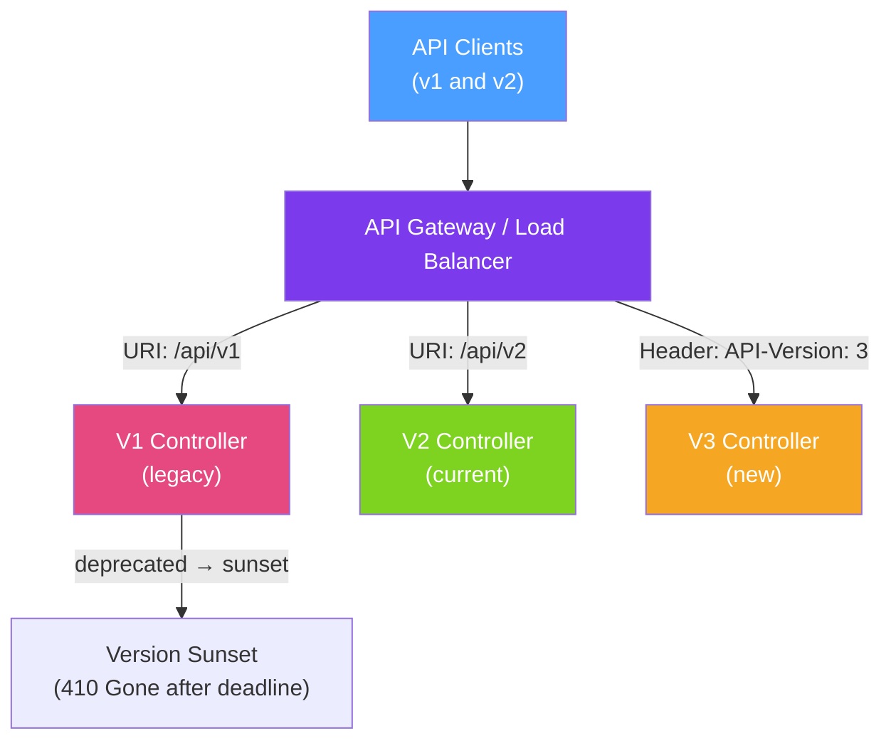

# 🔢 API Versioning

> [!abstract] TL;DR
> API versioning allows you to evolve an API without breaking existing clients. The three main strategies are **URI versioning** (`/api/v1/orders` — most visible and cacheable), **header versioning** (`API-Version: 2` — cleaner URLs but less discoverable), and **content-type versioning** (`Accept: application/vnd.myapp.v2+json` — most RESTful but most complex). The best strategy depends on client type and team conventions; URI versioning is most common for public APIs.

## Intuition — analogy FIRST

API versioning is like releasing a **new edition of a textbook** while keeping old editions available in the library. Students (clients) using the 1st edition can continue using their old copy (API v1) while new students start with the 2nd edition (API v2). The library (API gateway) routes students to the right edition based on the edition number on the book's spine (URI path), a sticker on the book (header), or the catalogue description (content type). Eventually, old editions are retired when no students use them.

The key insight: **breaking changes require a new version**. Non-breaking changes (adding new optional fields) can be added to the existing version. Breaking changes (removing fields, changing types, renaming endpoints) require a new version.

---

## How It Works



## Key Concepts / Details

### Strategy Comparison

| Strategy | Example | Pros | Cons |
|----------|---------|------|------|
| **URI versioning** | `/api/v1/orders` | Simple, cacheable, visible | Clutters URLs, not "REST pure" |
| **Query param** | `/api/orders?version=1` | No URL structure change | Hard to make default, less visible |
| **Header** | `API-Version: 2` | Clean URLs | Less discoverable, harder to test |
| **Content-type** | `Accept: application/vnd.myapp.v2+json` | Most RESTful | Most complex, poor tooling support |

### URI Versioning (Most Common)

```java
// Option 1: Separate controller per version
@RestController
@RequestMapping("/api/v1/orders")
public class OrderControllerV1 {

    @GetMapping("/{id}")
    public OrderDtoV1 getOrder(@PathVariable UUID id) {
        Order order = orderService.findById(id).orElseThrow();
        return OrderDtoV1.from(order);  // V1 response shape
    }
}

@RestController
@RequestMapping("/api/v2/orders")
public class OrderControllerV2 {

    @GetMapping("/{id}")
    public OrderDtoV2 getOrder(@PathVariable UUID id) {
        Order order = orderService.findById(id).orElseThrow();
        return OrderDtoV2.from(order);  // V2 response with additional fields
    }
}

// Option 2: Version as path variable with condition
@RestController
@RequestMapping("/api/{version}/orders")
public class OrderController {

    @GetMapping("/{id}")
    public ResponseEntity<?> getOrder(
            @PathVariable String version,
            @PathVariable UUID id) {
        return switch (version) {
            case "v1" -> ResponseEntity.ok(OrderDtoV1.from(orderService.findById(id).orElseThrow()));
            case "v2" -> ResponseEntity.ok(OrderDtoV2.from(orderService.findById(id).orElseThrow()));
            default -> ResponseEntity.status(410).body("Version not supported");
        };
    }
}
```

### Header Versioning

```java
@RestController
@RequestMapping("/api/orders")
public class OrderController {

    // Version 1 — no version header or v1
    @GetMapping(value = "/{id}", headers = "!API-Version")
    public OrderDtoV1 getOrderV1(@PathVariable UUID id) {
        return OrderDtoV1.from(orderService.findById(id).orElseThrow());
    }

    // Version 2
    @GetMapping(value = "/{id}", headers = "API-Version=2")
    public OrderDtoV2 getOrderV2(@PathVariable UUID id) {
        return OrderDtoV2.from(orderService.findById(id).orElseThrow());
    }
}
```

### Content-Type Versioning (Most RESTful)

```java
@GetMapping(value = "/{id}",
    produces = "application/vnd.mycompany.orders.v1+json")
public OrderDtoV1 getOrderV1(@PathVariable UUID id) { ... }

@GetMapping(value = "/{id}",
    produces = "application/vnd.mycompany.orders.v2+json")
public OrderDtoV2 getOrderV2(@PathVariable UUID id) { ... }

// Client request:
// Accept: application/vnd.mycompany.orders.v2+json
```

### Breaking vs Non-Breaking Changes

| Change Type | Breaking? | Version Bump Required? |
|-------------|-----------|----------------------|
| Add optional response field | No | No |
| Add optional request field | No | No |
| Remove response field | Yes | Major version |
| Change field type (String → Int) | Yes | Major version |
| Rename endpoint | Yes | Major version |
| Change error response format | Yes | Major version |
| Add required request field | Yes | Major version |
| Change default value behaviour | Usually yes | Major version |

### Deprecation and Sunset

```java
// Add deprecation headers to old version responses
@GetMapping("/{id}")
public ResponseEntity<OrderDtoV1> getOrder(@PathVariable UUID id) {
    return ResponseEntity.ok()
        .header("Deprecation", "true")
        .header("Sunset", "Sat, 31 Dec 2026 23:59:59 GMT")  // RFC 7089
        .header("Link", "</api/v2/orders/" + id + ">; rel=\"successor-version\"")
        .body(OrderDtoV1.from(orderService.findById(id).orElseThrow()));
}

// After sunset date — return 410 Gone
@GetMapping("/api/v1/orders/{id}")
public ResponseEntity<Void> sunsetV1(@PathVariable UUID id) {
    return ResponseEntity.status(HttpStatus.GONE)
        .header("Link", "</api/v2/orders/" + id + ">; rel=\"successor-version\"")
        .build();
}
```

### Protobuf/gRPC Versioning

Protocol Buffers have built-in backward/forward compatibility:
- Add new fields with new field numbers — old clients ignore them
- Never remove or reuse field numbers from published schemas
- `optional` fields are safe to add; required fields require a new version

```protobuf
// v1 message
message Order {
    string id = 1;
    string customer_id = 2;
    string status = 3;
    // Adding new field in v1.1 — backward compatible:
    int64 total_cents = 4;  // old clients just ignore this field
}

// NEVER do:
// Remove field 2 — old clients crash
// Reuse field number 2 with different type — data corruption
```

## Real-World Notes

- **URL versioning is pragmatic** — while content-type versioning is the "most RESTful" approach, URI versioning is what 95% of public APIs use because it's simple to document, test, and cache.
- **Run two major versions simultaneously during transition** — never force a hard cutover; give clients a minimum 6–12 month migration window with active deprecation warnings.
- **Semantic versioning for breaking changes only** — internal APIs between services can use semantic versioning: MAJOR.MINOR.PATCH. Only MAJOR indicates breaking changes.
- **API Gateway routing enables zero-code versioning** — use Kong, AWS API Gateway, or Nginx to route `/api/v1/` to old service instances and `/api/v2/` to new ones without changing application code.

## Common Pitfalls

- **Treating every change as a new version** — version proliferation (v1, v2, v3 within 6 months) creates maintenance overhead and confuses consumers. Only break the version for breaking changes.
- **Not communicating deprecation** — clients won't know a version is deprecated without `Deprecation` and `Sunset` headers. Monitor usage by version using access logs before retiring a version.
- **Duplicating business logic across versions** — the versioning layer (controllers, DTOs) should be thin; business logic in service classes should be version-agnostic with adapters handling the translation.
- **Missing default version** — when no version is specified, what happens? Define a clear default (usually the latest stable version) and document it.

## Related Concepts
- [[REST_Best_Practices]] — REST principles that versioning extends
- [[gRPC_Java]] — Protobuf's built-in backward compatibility model
- [[API_Rate_Limiting]] — Apply rate limits per API version to phase out old versions

## Review Questions
1. What is the difference between a breaking and non-breaking API change?
2. What HTTP headers should deprecated API versions include?
3. Why does URI versioning violate REST principles, and why is it still the most popular strategy?

## Sources
- RFC 7089 — HTTP Deprecation Header — https://www.rfc-editor.org/rfc/rfc8594
- Troy Hunt — Your API versioning is wrong — https://www.troyhunt.com/your-api-versioning-is-wrong-which-is
- Spring MVC versioning — https://docs.spring.io/spring-framework/docs/current/reference/html/web.html

#java #spring #api #versioning #rest #backward-compatibility #deprecation
