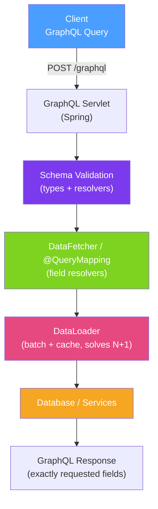

# 🔷 GraphQL in Java

> [!abstract] TL;DR
> **GraphQL** is a query language for APIs where clients specify exactly what data they need. Unlike REST (one endpoint per resource), GraphQL exposes a single `/graphql` endpoint with a strongly-typed schema. This eliminates over-fetching (REST returning 50 fields when you need 3) and under-fetching (making 5 REST calls to build one view). Spring for GraphQL (Spring Boot 3+) provides first-class integration with schema-first development.

## Intuition — analogy FIRST

REST APIs are like a restaurant with a **fixed menu** — each dish (endpoint) is pre-composed, and you get everything on the plate whether you want it or not. GraphQL is like a restaurant where you order from a **modular ingredient list** — "I want a burger but without cheese, add bacon, and also bring me only the price and name from the menu, not the full description." The kitchen (server) prepares exactly what you asked for, nothing more.

**Over-fetching** (REST returning unused data) wastes bandwidth on mobile. **Under-fetching** (making multiple REST calls to compose a view) adds latency. GraphQL solves both: one request, exactly the fields you need.

---

## How It Works



## Key Concepts / Details

### GraphQL Schema Definition

```graphql
# src/main/resources/graphql/schema.graphqls
type Query {
    order(id: ID!): Order
    orders(status: OrderStatus, page: Int, size: Int): OrderPage!
    customer(id: ID!): Customer
}

type Mutation {
    createOrder(input: CreateOrderInput!): Order!
    cancelOrder(id: ID!): Order!
}

type Subscription {
    orderStatusUpdated(customerId: ID!): Order!
}

type Order {
    id: ID!
    status: OrderStatus!
    customer: Customer!   # resolved separately
    items: [OrderItem!]!  # resolved separately
    totalAmount: Float!
    createdAt: String!
}

type Customer {
    id: ID!
    name: String!
    email: String!
}

type OrderItem {
    product: Product!
    quantity: Int!
    unitPrice: Float!
}

type OrderPage {
    content: [Order!]!
    totalElements: Int!
    totalPages: Int!
}

input CreateOrderInput {
    customerId: ID!
    items: [OrderItemInput!]!
}

input OrderItemInput {
    productId: ID!
    quantity: Int!
}

enum OrderStatus {
    PENDING
    CONFIRMED
    SHIPPED
    DELIVERED
    CANCELLED
}
```

### Spring for GraphQL Controllers

```java
@Controller
public class OrderGraphQLController {

    @Autowired private OrderService orderService;
    @Autowired private CustomerService customerService;

    // Query resolver
    @QueryMapping
    public Order order(@Argument String id) {
        return orderService.findById(UUID.fromString(id))
            .orElseThrow(() -> new RuntimeException("Order not found: " + id));
    }

    @QueryMapping
    public OrderPage orders(
            @Argument String status,
            @Argument Integer page,
            @Argument Integer size) {
        PageRequest pageable = PageRequest.of(
            page != null ? page : 0,
            size != null ? size : 20
        );
        return orderService.findAll(status, pageable);
    }

    // Mutation resolver
    @MutationMapping
    public Order createOrder(@Argument CreateOrderInput input) {
        return orderService.create(input);
    }

    // Sub-field resolver — called per Order to resolve the customer field
    @SchemaMapping(typeName = "Order", field = "customer")
    public CompletableFuture<Customer> customer(Order order,
                                                DataLoader<String, Customer> customerLoader) {
        // DataLoader batches multiple customer loads into one DB query
        return customerLoader.load(order.getCustomerId().toString());
    }

    // Subscription
    @SubscriptionMapping
    public Flux<Order> orderStatusUpdated(@Argument String customerId) {
        return orderService.subscribeToStatusUpdates(customerId);
    }
}
```

### DataLoader — Solving the N+1 Problem

```java
// Without DataLoader: N+1 problem
// Fetching 100 orders → 100 separate SELECT queries for each order's customer

// With DataLoader: all customer IDs are batched into ONE query
@Configuration
public class DataLoaderConfig {

    @Bean
    public DataLoaderRegistry dataLoaderRegistry(CustomerService customerService) {
        DataLoaderRegistry registry = new DataLoaderRegistry();

        BatchLoaderWithContext<String, Customer> customerBatchLoader =
            (customerIds, batchLoaderEnvironment) ->
                customerService.findAllById(customerIds)    // ONE query for all IDs
                    .stream()
                    .collect(Collectors.toMap(c -> c.getId().toString(), Function.identity()))
                    .let(customerMap ->
                        customerIds.stream()
                            .map(id -> customerMap.get(id))
                            .collect(Collectors.toList()));

        registry.register("customerLoader",
            DataLoader.newMappedDataLoader(customerBatchLoader));
        return registry;
    }
}
```

### Client Queries

```graphql
# Client query — requests only what it needs
query GetOrderDetails {
    order(id: "abc-123") {
        id
        status
        customer {
            name
            email
        }
        items {
            quantity
            unitPrice
        }
        # "totalAmount" and "createdAt" NOT requested — not fetched
    }
}

# Mutation
mutation CancelOrder {
    cancelOrder(id: "abc-123") {
        id
        status
    }
}
```

### application.yml

```yaml
spring:
  graphql:
    schema:
      locations: classpath:graphql/**/
      file-extensions: .graphqls,.gqls
    graphiql:
      enabled: true       # enable GraphiQL IDE at /graphiql (dev only)
    path: /graphql        # endpoint path
    websocket:
      path: /graphql      # WebSocket for subscriptions
```

### Error Handling

```java
@Component
public class CustomDataFetcherExceptionResolver
        extends DataFetcherExceptionResolverAdapter {

    @Override
    protected GraphQLError resolveToSingleError(Throwable ex, DataFetchingEnvironment env) {
        if (ex instanceof OrderNotFoundException e) {
            return GraphqlErrorBuilder.newError(env)
                .errorType(ErrorType.NOT_FOUND)
                .message("Order not found: " + e.getOrderId())
                .build();
        }
        if (ex instanceof SecurityException) {
            return GraphqlErrorBuilder.newError(env)
                .errorType(ErrorType.FORBIDDEN)
                .message("Access denied")
                .build();
        }
        return null;  // fall through to default handling
    }
}
```

## Real-World Notes

- **GraphQL for front-end driven APIs, REST for simple CRUD** — GraphQL adds complexity (schema, DataLoader, query complexity limits). It shines when mobile clients need different data shapes than desktop clients, or when multiple teams consume the same API with different needs.
- **Query complexity limits are essential** — a deeply nested GraphQL query can trigger quadratic database calls. Use `graphql-java`'s `MaxQueryComplexityInstrumentation` to reject queries above a complexity threshold.
- **DataLoader is not optional** — without DataLoader, every N-item list query causes N+1 database queries. DataLoader batches and caches per request.
- **Schema-first vs code-first** — Spring for GraphQL uses schema-first (`.graphqls` files). `graphql-kotlin` supports code-first (generate schema from Kotlin classes). Schema-first is more explicit and better for multi-team APIs.

## Common Pitfalls

- **Ignoring the N+1 problem** — the most common GraphQL performance bug. Every field resolver for a sub-type is called N times. Always use DataLoader for sub-entity resolution.
- **No query depth/complexity limits** — a malicious client can craft a query like `orders { customer { orders { customer { orders { ...}}}}}` that causes exponential database load.
- **Exposing internal domain objects directly** — GraphQL type != JPA entity. Use DTOs as GraphQL types to control what's exposed and avoid accidental field exposure.
- **Subscriptions without load testing** — WebSocket-based subscriptions maintain persistent connections. 10,000 subscribers = 10,000 connections. Test WebSocket server capacity before launch.

## Related Concepts
- [[REST_Best_Practices]] — REST for simpler, resource-oriented APIs
- [[gRPC_Java]] — Better for inter-service APIs where efficiency matters more than flexibility
- [[API_Rate_Limiting]] — GraphQL APIs need complexity-based rate limiting

## Review Questions
1. What is the N+1 problem in GraphQL and how does DataLoader solve it?
2. When would you choose GraphQL over REST for an API?
3. What is query complexity limiting and why is it necessary for GraphQL APIs?

## Sources
- Spring for GraphQL Reference — https://docs.spring.io/spring-graphql/docs/current/reference/html/
- graphql-java — https://www.graphql-java.com/
- The GraphQL N+1 Problem — https://medium.com/the-marcy-lab-school/how-to-use-dataloader-js-9727c527efd0

#java #spring #graphql #api #dataloader #n-plus-one
