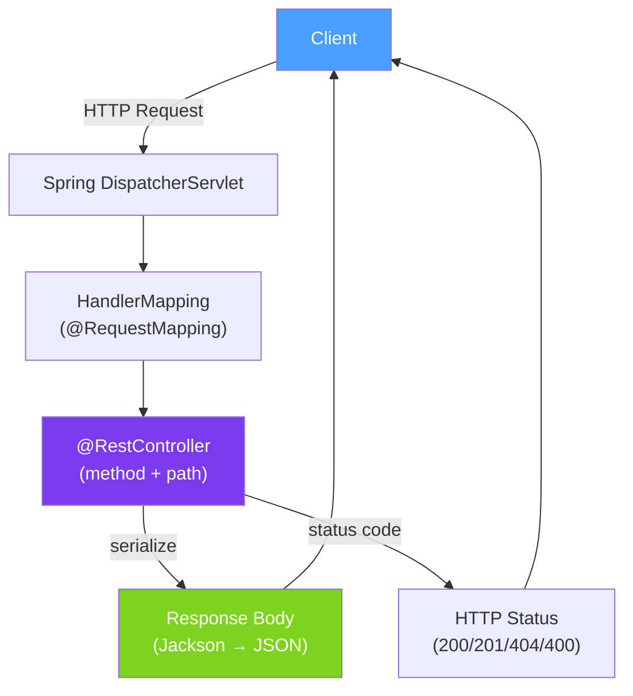

# 🌐 REST Best Practices

> [!abstract] TL;DR
> REST (Representational State Transfer) is an architectural style for HTTP APIs. **Richardson Maturity Model** provides four levels of REST quality (0–3). The key principles are: use nouns for resources, HTTP methods for operations, correct status codes, and idempotent design. **HATEOAS** (Level 3) embeds links in responses to enable API discoverability. Spring MVC implements REST natively through `@RestController`.

## Intuition — analogy FIRST

A well-designed REST API is like a **well-organised library catalogue**. Resources are books (nouns), operations are what you do with books (borrow, return, reserve — mapped to HTTP methods), and the catalogue tells you where to find related materials (HATEOAS links). A poorly-designed REST API is like a library where you have to call a specific librarian function: "LibrarianService.findBookByAuthorAndBorrowIfAvailable()" — verbs baked into the name, no discoverability.

The Richardson Maturity Model is the quality ladder: Level 0 is using HTTP just as a transport (one endpoint, verb-based), Level 1 adds resources, Level 2 adds HTTP verbs and status codes properly, Level 3 adds HATEOAS for full discoverability.

---

## How It Works



## Key Concepts / Details

### Richardson Maturity Model (RMM)

| Level | Name | Description | Example |
|-------|------|-------------|---------|
| 0 | POX/RPC | One endpoint, operations as POST body | `POST /service {"action": "getOrder", "id": 1}` |
| 1 | Resources | Separate endpoint per resource type | `POST /orders/getById` |
| 2 | HTTP Verbs | Use GET/POST/PUT/DELETE properly | `GET /orders/1` |
| 3 | HATEOAS | Links in response for discoverability | `{"id": 1, "_links": {"self": "/orders/1", "cancel": "/orders/1/cancel"}}` |

### Resource Naming

```
# CORRECT: nouns, plural, hierarchical
GET    /orders                    # list orders
POST   /orders                    # create order
GET    /orders/{id}               # get specific order
PUT    /orders/{id}               # replace order
PATCH  /orders/{id}               # partial update
DELETE /orders/{id}               # delete order
GET    /orders/{id}/items         # sub-resources
POST   /orders/{id}/cancel        # action as sub-resource (not a verb on the base)

# WRONG: verbs in URLs
GET /getOrder?id=1
POST /createOrder
POST /deleteOrder
```

### HTTP Methods and Semantics

| Method | Safe? | Idempotent? | Body? | Use For |
|--------|-------|------------|-------|---------|
| GET | Yes | Yes | No | Retrieve resources |
| POST | No | No | Yes | Create resource (non-idempotent) |
| PUT | No | Yes | Yes | Replace entire resource |
| PATCH | No | Not always | Yes | Partial update |
| DELETE | No | Yes | Optional | Delete resource |
| HEAD | Yes | Yes | No | GET without body (check existence) |
| OPTIONS | Yes | Yes | No | CORS preflight, capabilities |

### Spring REST Controller

```java
@RestController
@RequestMapping("/api/v1/orders")
public class OrderController {

    @GetMapping
    public ResponseEntity<Page<OrderDto>> listOrders(
            @RequestParam(defaultValue = "0") int page,
            @RequestParam(defaultValue = "20") int size,
            @RequestParam(required = false) String status) {
        Pageable pageable = PageRequest.of(page, size);
        return ResponseEntity.ok(orderService.findAll(status, pageable));
    }

    @PostMapping
    public ResponseEntity<OrderDto> createOrder(
            @Valid @RequestBody CreateOrderRequest request) {
        OrderDto created = orderService.create(request);
        URI location = ServletUriComponentsBuilder
            .fromCurrentRequest()
            .path("/{id}")
            .buildAndExpand(created.getId())
            .toUri();
        return ResponseEntity.created(location).body(created);  // 201 Created + Location header
    }

    @GetMapping("/{id}")
    public ResponseEntity<OrderDto> getOrder(@PathVariable UUID id) {
        return orderService.findById(id)
            .map(ResponseEntity::ok)
            .orElse(ResponseEntity.notFound().build());  // 404
    }

    @PutMapping("/{id}")
    public ResponseEntity<OrderDto> replaceOrder(
            @PathVariable UUID id,
            @Valid @RequestBody ReplaceOrderRequest request) {
        return ResponseEntity.ok(orderService.replace(id, request));
    }

    @PatchMapping("/{id}")
    public ResponseEntity<OrderDto> updateOrder(
            @PathVariable UUID id,
            @RequestBody Map<String, Object> updates) {
        return ResponseEntity.ok(orderService.partialUpdate(id, updates));
    }

    @DeleteMapping("/{id}")
    public ResponseEntity<Void> deleteOrder(@PathVariable UUID id) {
        orderService.delete(id);
        return ResponseEntity.noContent().build();  // 204 No Content
    }

    @PostMapping("/{id}/cancel")
    public ResponseEntity<OrderDto> cancelOrder(@PathVariable UUID id) {
        return ResponseEntity.ok(orderService.cancel(id));
    }
}
```

### HTTP Status Codes

| Code | Name | When to Use |
|------|------|-------------|
| 200 | OK | Successful GET, PUT, PATCH |
| 201 | Created | Successful POST that creates a resource |
| 204 | No Content | Successful DELETE or PATCH with no response body |
| 400 | Bad Request | Validation failure, malformed request |
| 401 | Unauthorized | Missing/invalid authentication |
| 403 | Forbidden | Authenticated but not authorized |
| 404 | Not Found | Resource doesn't exist |
| 409 | Conflict | Optimistic lock conflict, duplicate resource |
| 422 | Unprocessable Entity | Business rule violation (valid format, invalid semantics) |
| 429 | Too Many Requests | Rate limit exceeded |
| 500 | Internal Server Error | Unexpected server error |
| 503 | Service Unavailable | Circuit breaker open, maintenance mode |

### HATEOAS with Spring HATEOAS

```java
@GetMapping("/{id}")
public EntityModel<OrderDto> getOrder(@PathVariable UUID id) {
    OrderDto order = orderService.findById(id).orElseThrow();

    return EntityModel.of(order,
        linkTo(methodOn(OrderController.class).getOrder(id)).withSelfRel(),
        linkTo(methodOn(OrderController.class).listOrders(0, 20, null)).withRel("orders"),
        order.getStatus() == OrderStatus.PENDING ?
            linkTo(methodOn(OrderController.class).cancelOrder(id)).withRel("cancel") : null
    );
}

// Response:
// {
//   "id": "abc-123",
//   "status": "PENDING",
//   "_links": {
//     "self": { "href": "/api/v1/orders/abc-123" },
//     "orders": { "href": "/api/v1/orders" },
//     "cancel": { "href": "/api/v1/orders/abc-123/cancel" }
//   }
// }
```

### Idempotency Keys for POST

```java
// POST is not idempotent — duplicate requests create duplicate resources
// Solution: use idempotency keys
@PostMapping
public ResponseEntity<OrderDto> createOrder(
        @RequestHeader("Idempotency-Key") String idempotencyKey,
        @Valid @RequestBody CreateOrderRequest request) {

    // Check if this idempotency key was already processed
    Optional<OrderDto> existing = idempotencyStore.get(idempotencyKey);
    if (existing.isPresent()) {
        return ResponseEntity.ok(existing.get());  // return cached response
    }

    OrderDto created = orderService.create(request);
    idempotencyStore.store(idempotencyKey, created, Duration.ofHours(24));
    return ResponseEntity.created(URI.create("/orders/" + created.getId())).body(created);
}
```

## Real-World Notes

- **`PUT` for full replacement, `PATCH` for partial** — `PUT /orders/1` replaces the entire order; `PATCH /orders/1` updates only provided fields. Clients must send the full resource for `PUT`.
- **Pagination is essential for collection endpoints** — `GET /orders` without pagination returns millions of rows. Always default to `?page=0&size=20` and document max page size.
- **Include problem details in errors** — RFC 9457 (`ProblemDetail`) is the standard for structured error responses: type, title, status, detail, instance. Spring 6+ supports it natively.
- **API Gateway vs application-level REST** — rate limiting, authentication, and CORS are best handled at the API gateway (Kong, AWS API Gateway), not duplicated in every service.

## Common Pitfalls

- **Using `GET` for state-changing operations** — `GET /orders/1/approve` changes state and is cached by browsers/proxies. Use `POST /orders/1/approve` for state-changing actions.
- **Returning 200 with error in body** — `{"success": false, "error": "..."}` with HTTP 200 breaks HTTP semantics. Use appropriate 4xx/5xx status codes.
- **Inconsistent naming** — mixing `/user` (singular) and `/orders` (plural) in the same API. Pick plural nouns consistently.
- **No Location header on 201** — RFC 7231 requires `Location` header in 201 responses pointing to the created resource. Omitting it forces clients to make a second request to find the resource.

## Related Concepts
- [[API_Versioning]] — Versioning REST APIs using URI or headers
- [[API_Rate_Limiting]] — Protecting REST APIs from abuse
- [[GraphQL_Java]] — Alternative when clients need flexible query shapes

## Review Questions
1. What are the four levels of the Richardson Maturity Model?
2. Why is `PUT` idempotent but `POST` is not?
3. What is the purpose of an idempotency key in REST API design?

## Sources
- Richardson Maturity Model — https://martinfowler.com/articles/richardsonMaturityModel.html
- RFC 9457 — Problem Details for HTTP APIs — https://www.rfc-editor.org/rfc/rfc9457
- Spring HATEOAS — https://spring.io/projects/spring-hateoas

#java #spring #rest #api #hateoas #http #idempotency
