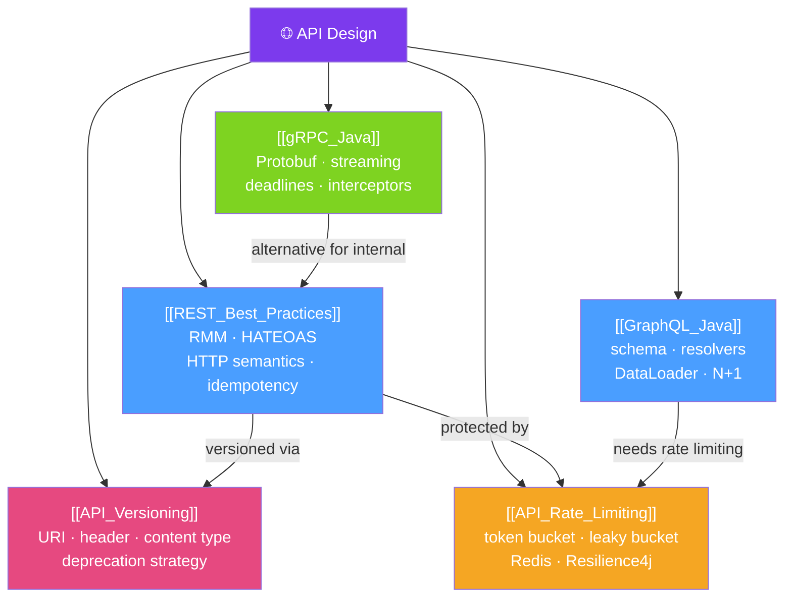

# 🌐 API Design — Map of Content

> [!abstract] What This Section Covers
> API design is the contract between services and their consumers. This section covers **REST best practices** (Richardson Maturity Model, HATEOAS, HTTP semantics), **GraphQL** for flexible client-driven queries, **gRPC** for high-performance service-to-service communication, **API versioning** strategies (URI, header, query param), and **rate limiting** to protect APIs from abuse and ensure fair usage.

## Concept Map

## Learning Path
1. [[REST_Best_Practices]] — Master HTTP semantics, resource naming, and idempotency.
2. [[API_Versioning]] — Design a versioning strategy before you launch your first API.
3. [[API_Rate_Limiting]] — Protect APIs from abuse with token bucket and sliding window algorithms.
4. [[GraphQL_Java]] — Expose flexible data queries for front-end driven APIs.
5. [[gRPC_Java]] — High-performance typed RPC for internal microservice communication.

## All Notes at a Glance
| Note | Difficulty | What You'll Learn |
|------|------------|-------------------|
| [[REST_Best_Practices]] | Intermediate | RMM levels, HTTP method semantics, HATEOAS, status codes, idempotency |
| [[GraphQL_Java]] | Intermediate | Schema definition, resolvers, DataFetcher, N+1 problem, DataLoader |
| [[gRPC_Java]] | Advanced | Protocol Buffers, unary/streaming RPCs, deadlines, interceptors |
| [[API_Versioning]] | Intermediate | URI/header/content-type versioning, deprecation, semantic versioning |
| [[API_Rate_Limiting]] | Advanced | Token bucket, sliding window, Redis-backed limiter, Resilience4j |

## Key Questions This Section Answers
- What is the difference between Level 2 and Level 3 of the Richardson Maturity Model?
- Why is `PUT` idempotent but `PATCH` is not always idempotent?
- How does GraphQL's DataLoader solve the N+1 problem?
- What are the trade-offs between gRPC and REST for internal service communication?
- What is the difference between a token bucket and a leaky bucket rate limiter?

## Related Sections
- [[_MOC_Java_Master|↑ Java Master MOC]]
- [[30_Database_Advanced/_MOC_Database_Advanced|← Database Advanced]]
- [[32_Distributed_Systems_Java/_MOC_Distributed_Systems|→ Distributed Systems]]

#MOC #java #api #rest #graphql #grpc #versioning #rate-limiting
