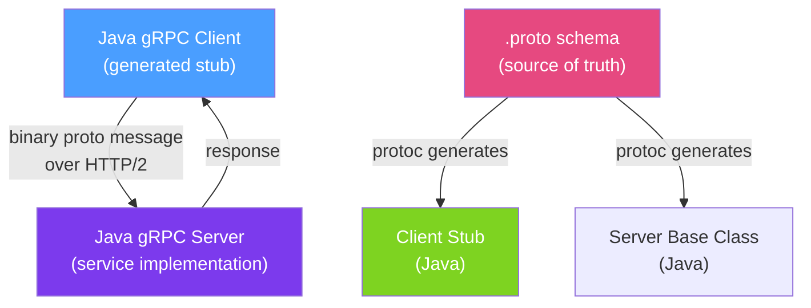

# ⚡ gRPC in Java

> [!abstract] TL;DR
> **gRPC** is a high-performance RPC framework from Google using **Protocol Buffers** (binary serialization) over HTTP/2. Compared to REST+JSON, gRPC is 3–10× faster due to binary encoding and HTTP/2 multiplexing, strongly typed via `.proto` schemas with code generation, and supports **streaming** (server-streaming, client-streaming, bidirectional). It is the preferred choice for internal service-to-service communication in high-throughput systems.

## Intuition — analogy FIRST

REST+JSON is like communicating via **handwritten letters** — legible by anyone, bulky (JSON overhead), sent one at a time (HTTP/1.1), and requires you to separately share what format the letter should be in. gRPC is like **encrypted binary radio communication** — compact, fast, supports multiple simultaneous channels (HTTP/2 multiplexing), and the protocol definition (`.proto` file) is shared in advance so both sides know exactly the format.

Protocol Buffers are to gRPC what JSON is to REST, but 3–10× smaller and faster to parse because they're binary and schema-driven. The trade-off: binary messages are not human-readable, and you need code generation tooling.

---

## How It Works



## Key Concepts / Details

### Protocol Buffer Schema (.proto)

```protobuf
// src/main/proto/order_service.proto
syntax = "proto3";

package com.example.orders;
option java_package = "com.example.orders.grpc";
option java_outer_classname = "OrderServiceProto";
option java_multiple_files = true;

import "google/protobuf/timestamp.proto";

service OrderService {
    // Unary RPC
    rpc GetOrder (GetOrderRequest) returns (OrderResponse);
    rpc CreateOrder (CreateOrderRequest) returns (OrderResponse);

    // Server-streaming: receive a stream of order updates
    rpc WatchOrders (WatchOrdersRequest) returns (stream OrderEvent);

    // Client-streaming: send batch order items
    rpc BatchCreateOrders (stream CreateOrderRequest) returns (BatchCreateResponse);

    // Bidirectional streaming
    rpc OrderChat (stream ChatMessage) returns (stream ChatMessage);
}

message GetOrderRequest {
    string order_id = 1;
}

message CreateOrderRequest {
    string customer_id = 1;
    repeated OrderItem items = 2;
}

message OrderItem {
    string product_id = 1;
    int32 quantity = 2;
    int64 unit_price_cents = 3;
}

message OrderResponse {
    string id = 1;
    string customer_id = 2;
    string status = 3;
    int64 total_cents = 4;
    google.protobuf.Timestamp created_at = 5;
}

message WatchOrdersRequest {
    string customer_id = 1;
}

message OrderEvent {
    string order_id = 1;
    string new_status = 2;
}

message BatchCreateResponse {
    repeated string order_ids = 1;
    int32 failed_count = 2;
}
```

### Maven Setup

```xml
<dependency>
    <groupId>io.grpc</groupId>
    <artifactId>grpc-spring-boot-starter</artifactId>  <!-- community starter -->
    <version>3.1.0</version>
</dependency>

<plugin>
    <groupId>org.xolstice.maven.plugins</groupId>
    <artifactId>protobuf-maven-plugin</artifactId>
    <configuration>
        <protocArtifact>com.google.protobuf:protoc:3.25.0:exe:${os.detected.classifier}</protocArtifact>
        <pluginId>grpc-java</pluginId>
        <pluginArtifact>io.grpc:protoc-gen-grpc-java:1.63.0:exe:${os.detected.classifier}</pluginArtifact>
    </configuration>
</plugin>
```

### gRPC Server Implementation

```java
@GrpcService
public class OrderGrpcService extends OrderServiceGrpc.OrderServiceImplBase {

    @Autowired private OrderService orderService;

    // Unary RPC
    @Override
    public void getOrder(GetOrderRequest request,
                         StreamObserver<OrderResponse> responseObserver) {
        try {
            Order order = orderService.findById(UUID.fromString(request.getOrderId()))
                .orElseThrow(() -> Status.NOT_FOUND
                    .withDescription("Order not found: " + request.getOrderId())
                    .asRuntimeException());

            responseObserver.onNext(toProto(order));
            responseObserver.onCompleted();
        } catch (StatusRuntimeException e) {
            responseObserver.onError(e);
        }
    }

    // Server-streaming RPC
    @Override
    public void watchOrders(WatchOrdersRequest request,
                            StreamObserver<OrderEvent> responseObserver) {
        Flux<OrderEvent> events = orderService.subscribeToOrderEvents(request.getCustomerId())
            .map(event -> OrderEvent.newBuilder()
                .setOrderId(event.getOrderId().toString())
                .setNewStatus(event.getStatus().name())
                .build());

        events.subscribe(
            responseObserver::onNext,
            responseObserver::onError,
            responseObserver::onCompleted
        );
    }

    private OrderResponse toProto(Order order) {
        return OrderResponse.newBuilder()
            .setId(order.getId().toString())
            .setCustomerId(order.getCustomerId().toString())
            .setStatus(order.getStatus().name())
            .setTotalCents(order.getTotalCents())
            .build();
    }
}
```

### gRPC Client

```java
@Service
public class InventoryGrpcClient {

    private final InventoryServiceGrpc.InventoryServiceBlockingStub blockingStub;
    private final InventoryServiceGrpc.InventoryServiceStub asyncStub;

    public InventoryGrpcClient(ManagedChannel channel) {
        this.blockingStub = InventoryServiceGrpc.newBlockingStub(channel)
            .withDeadlineAfter(5, TimeUnit.SECONDS);  // ALWAYS set deadline
        this.asyncStub = InventoryServiceGrpc.newStub(channel);
    }

    public boolean checkAvailability(String productId, int quantity) {
        CheckInventoryRequest request = CheckInventoryRequest.newBuilder()
            .setProductId(productId)
            .setQuantity(quantity)
            .build();

        try {
            CheckInventoryResponse response = blockingStub.checkInventory(request);
            return response.getAvailable();
        } catch (StatusRuntimeException e) {
            if (e.getStatus().getCode() == Status.Code.NOT_FOUND) {
                return false;
            }
            throw new RuntimeException("Inventory check failed: " + e.getStatus(), e);
        }
    }
}
```

### gRPC Status Codes

| Code | HTTP Equivalent | When to Use |
|------|----------------|-------------|
| `OK` | 200 | Success |
| `NOT_FOUND` | 404 | Resource doesn't exist |
| `INVALID_ARGUMENT` | 400 | Bad request parameters |
| `PERMISSION_DENIED` | 403 | Access denied |
| `UNAUTHENTICATED` | 401 | Missing/invalid credentials |
| `ALREADY_EXISTS` | 409 | Duplicate resource |
| `RESOURCE_EXHAUSTED` | 429 | Rate limit exceeded |
| `INTERNAL` | 500 | Internal server error |
| `UNAVAILABLE` | 503 | Service unavailable |
| `DEADLINE_EXCEEDED` | 504 | Timeout |

### gRPC Interceptors (Cross-Cutting Concerns)

```java
// Server-side interceptor for logging and auth
@Component
public class LoggingServerInterceptor implements ServerInterceptor {

    @Override
    public <Q, R> ServerCall.Listener<Q> interceptCall(
            ServerCall<Q, R> call,
            Metadata headers,
            ServerCallHandler<Q, R> next) {

        String method = call.getMethodDescriptor().getFullMethodName();
        log.info("gRPC call: {}", method);

        // Extract JWT from metadata
        String token = headers.get(Metadata.Key.of("Authorization",
                                                    Metadata.ASCII_STRING_MARSHALLER));
        if (token == null) {
            call.close(Status.UNAUTHENTICATED.withDescription("Missing auth token"), headers);
            return new ServerCall.Listener<>() {};
        }

        return next.startCall(call, headers);
    }
}
```

## Real-World Notes

- **gRPC is ideal for internal APIs** — the Protobuf binary format is not human-readable; use gRPC between microservices where you control both sides. Use REST/GraphQL for external APIs that browsers or third parties consume.
- **Always set deadlines on clients** — gRPC channels without deadlines can hang indefinitely if the server is slow. `withDeadlineAfter(5, TimeUnit.SECONDS)` on every stub call is mandatory.
- **gRPC-web for browser clients** — standard gRPC uses HTTP/2 features that browsers can't access directly. Use `grpc-web` proxy (Envoy) to expose gRPC to browser JavaScript clients.
- **Streaming replaces WebSockets** — gRPC bidirectional streaming is a type-safe, efficient alternative to WebSockets for real-time server-to-client communication.

## Common Pitfalls

- **Forgetting deadlines** — without a deadline, a slow or crashed downstream service causes the client to wait indefinitely, cascading to the caller.
- **Using blocking stub in reactive code** — `blockingStub.someMethod()` blocks the calling thread. In WebFlux applications, use the async stub and convert to `Mono`/`Flux`.
- **Not handling StatusRuntimeException** — gRPC errors are wrapped in `StatusRuntimeException`. Catch it and map to appropriate application exceptions.
- **Large message sizes** — by default, gRPC limits messages to 4 MB. Use `maxInboundMessageSize()` on the channel for larger payloads, or better, use streaming for large data.

## Related Concepts
- [[REST_Best_Practices]] — REST for external-facing APIs; gRPC for internal service calls
- [[API_Versioning]] — Protobuf is forward/backward compatible via field numbers
- [[Distributed_Tracing]] — gRPC interceptors propagate trace context headers

## Review Questions
1. What are the four types of gRPC methods (RPC patterns)?
2. Why should you always set a deadline on gRPC client stubs?
3. When would you choose gRPC over REST for an API endpoint?

## Sources
- gRPC Java Documentation — https://grpc.io/docs/languages/java/
- Protocol Buffers Language Guide — https://protobuf.dev/programming-guides/proto3/
- grpc-spring-boot-starter — https://github.com/grpc-ecosystem/grpc-spring

#java #grpc #protobuf #api #rpc #http2 #streaming
