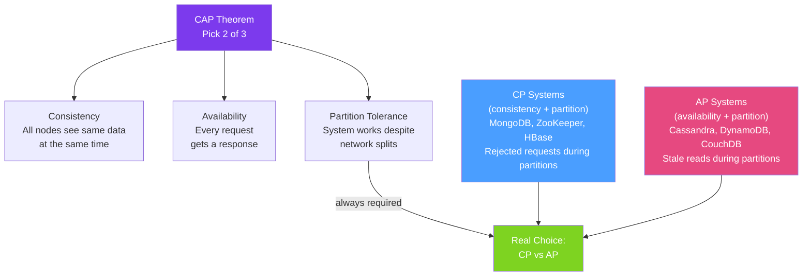
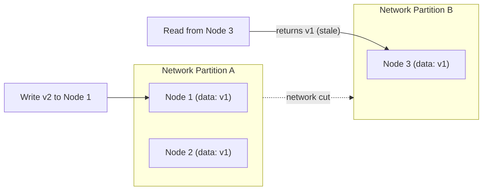

# 📐 CAP Theorem in Practice

> [!abstract] TL;DR
> The **CAP theorem** states that a distributed system can only guarantee two of three properties simultaneously: **Consistency** (every read returns the most recent write), **Availability** (every request receives a response), and **Partition Tolerance** (the system continues operating despite network partitions). Since network partitions are unavoidable in production, the real choice is **CP** (sacrifice availability during partitions) vs **AP** (sacrifice consistency for always-available reads). **PACELC** extends CAP by also considering latency trade-offs when no partition exists.

## Intuition — analogy FIRST

Imagine two ATMs in different cities connected by a network that occasionally goes down (network partition). You have $500 in your account. If you withdraw at City A while the network is down, what should the ATM do?

**CP choice**: Refuse the transaction ("I can't reach the other ATM to verify your balance — please try later"). Consistent but unavailable. **AP choice**: Allow the transaction ("I'll approve it and sync when the network recovers"). Available but potentially inconsistent (you might overdraft by withdrawing at both ATMs during the partition).

Banks choose CP for accounts (no overdraft allowed) but may choose AP for other features (you can still view your statement, cached data, even when network is down). The CAP theorem says you must make this choice — you cannot be both perfectly consistent AND always available when the network fails.

---

## How It Works



## Key Concepts / Details

### The Three Properties

| Property | Formal Definition | Informal |
|----------|------------------|---------|
| **Consistency (C)** | Every read returns the most recent write or an error | All nodes return the same (latest) data |
| **Availability (A)** | Every request receives a non-error response, but not necessarily the most recent write | The system is always up and responsive |
| **Partition Tolerance (P)** | The system continues operating when network messages are dropped or delayed | The system survives network splits |

**Key insight:** P cannot be given up in real distributed systems — networks always partition eventually. The choice is CP vs AP, not choosing to avoid P.

### CP vs AP System Examples

| System | Model | During Partition | Example Use Case |
|--------|-------|-----------------|-----------------|
| **PostgreSQL** (single node) | Strong consistency | N/A (not distributed) | Financial transactions |
| **ZooKeeper** | CP | Returns error if quorum unavailable | Configuration, leader election |
| **etcd** | CP | Returns error if quorum unavailable | Kubernetes control plane |
| **MongoDB** (default) | CP | Primary unavailable, no writes | Document storage with consistency needs |
| **Cassandra** | AP | Accepts reads/writes with stale data | High-write IoT, user activity |
| **DynamoDB** | AP (default), CP (optional) | Serves potentially stale data | Shopping carts, session data |
| **Redis** | AP (Cluster) | Serves stale data | Caching, session store |

### PACELC — Extending CAP

CAP only addresses behaviour during partitions. **PACELC** extends it to cover normal (non-partition) operation:

> **P**artition: choose **A**vailability or **C**onsistency;  
> **E**lse (normal operation): choose **L**atency or **C**onsistency

| System | Partition | Else | Notes |
|--------|-----------|------|-------|
| DynamoDB | AP | EL | Fast reads with eventual consistency by default |
| Cassandra | AP | EL | Tunable consistency per query |
| PostgreSQL | CP | EC | Synchronous replication = consistency + latency |
| Spanner (Google) | CP | EC | Global transactions with TrueTime clock |
| CockroachDB | CP | EC | Distributed SQL with serialisable isolation |

### Consistency Spectrum

```
Weaker ←────────────────────────────────────────────→ Stronger

Eventual    Causal   Read-your-writes   Sequential   Linearisable   Strict
Consistency Consistency Consistency     Consistency   = Strong       Serializability
(DNS, caches) (social media) (Amazon S3)           (single server)  (distributed DB)
```

### Choosing CP vs AP in Java Architecture

```java
// CP choice: use distributed lock to prevent concurrent writes
@Service
public class InventoryService {
    private final RedissonClient redisson;

    public boolean reserveItem(String itemId, int quantity) {
        RLock lock = redisson.getLock("inventory-lock:" + itemId);
        try {
            if (!lock.tryLock(1, 10, TimeUnit.SECONDS)) {
                throw new ServiceUnavailableException("Could not acquire lock");
            }
            // Only one node can modify this item at a time — CP
            return doReserve(itemId, quantity);
        } finally {
            lock.unlock();
        }
    }
}

// AP choice: allow concurrent updates, resolve conflicts later
@Service
public class ShoppingCartService {
    // Each add-to-cart operation succeeds independently
    // Conflicts resolved at checkout with last-write-wins or merge
    public void addItem(String cartId, CartItem item) {
        cartRepository.append(cartId, item);  // always succeeds
    }
}
```

### Network Partition in Practice



During the partition:
- **CP system**: blocks writes or returns error (no divergence allowed)
- **AP system**: allows write to Node 1 and returns stale v1 from Node 3 (diverged state)

## Real-World Notes

- **"CA" systems don't exist in distributed systems** — a system that claims CA ignores partition tolerance, which means it's a single-node system where partitions don't apply. Every real distributed system is CP or AP.
- **You can tune consistency per operation** — Cassandra allows `ConsistencyLevel.ALL` (CP-like) or `ConsistencyLevel.ONE` (AP-like) per query. Use strong consistency for writes to critical data, eventual for reads.
- **The CAP theorem is often over-simplified** — real systems operate on a spectrum, not a binary choice. Read-your-writes consistency (you see your own writes immediately) is achievable in AP systems via session affinity.
- **Network partitions are rare but catastrophic** — in well-operated AWS VPCs, partitions happen less than once per year, but when they do, poorly designed AP systems can create months of data reconciliation work.

## Common Pitfalls

- **Treating CAP as a one-time design decision** — different parts of the system may need different consistency guarantees. The checkout process (CP) needs different guarantees than the product recommendation feed (AP).
- **Confusing "consistency" in CAP with ACID consistency** — CAP consistency = linearisable reads. ACID consistency = integrity constraints. These are completely different concepts with the same word.
- **Assuming replicas converge instantly** — AP systems with eventual consistency may take seconds, minutes, or longer to converge during high write volumes. Design for "what if this is stale?" in every read path.
- **Not planning for partition recovery** — the hard part of AP systems is merging diverged state when the partition heals. Design conflict resolution strategies before the partition happens.

## Related Concepts
- [[Eventual_Consistency]] — How AP systems converge after a partition
- [[Consensus_Algorithms]] — Raft/Paxos make CP systems reliable
- [[Leader_Election]] — Requires CP behaviour (quorum) to avoid split-brain

## Review Questions
1. Why is "CA" (Consistency + Availability) not a valid choice in a distributed system?
2. What does PACELC add to the CAP theorem that CAP itself misses?
3. How would you decide whether to use a CP or AP datastore for a shopping cart vs a bank account?

## Sources
- Eric Brewer — CAP Twelve Years Later — https://www.infoq.com/articles/cap-twelve-years-later-how-the-rules-have-changed/
- PACELC — http://dbmsmusings.blogspot.com/2010/04/problems-with-cap-and-yahoos-little.html
- Designing Data-Intensive Applications — Chapter 9 — Martin Kleppmann

#java #distributed-systems #cap-theorem #consistency #availability #pacelc
