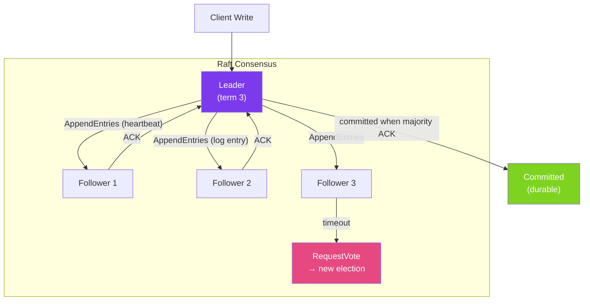

# 🗳️ Consensus Algorithms

> [!abstract] TL;DR
> **Consensus** is the problem of getting distributed nodes to agree on a single value despite failures. **Paxos** (Lamport, 1989) is the foundational algorithm — correct but notoriously hard to understand. **Raft** (2014) is designed for understandability, organising consensus around leader election and log replication. Both require a **quorum** (majority) of nodes to progress, tolerating up to (N-1)/2 failures in an N-node cluster.

## Intuition — analogy FIRST

Consensus is like a **jury reaching a unanimous verdict** despite some jurors being unreliable (nodes crashing) or receiving conflicting information (network partitions). The rules: any juror can propose a verdict, but the verdict only becomes final when a **majority** agrees — not all, just majority. This way, even if 2 of 5 jurors are unreachable, the remaining 3 can reach consensus.

**Paxos** is like a jury where any juror can initiate a vote at any time, creating complex simultaneous ballot situations that must be carefully resolved with ballot numbers. **Raft** simplifies this by designating a single **foreperson (leader)** who manages all decisions and log entries, making the process much easier to understand and implement.

---

## How It Works



## Key Concepts / Details

### Raft — Leader Election

```
Terms: monotonically increasing integers, reset on each election

Election process:
1. Follower times out waiting for leader heartbeat
2. Follower increments term, transitions to CANDIDATE
3. Candidate votes for itself, sends RequestVote to all peers
4. If majority vote for candidate: becomes LEADER
5. Leader sends periodic heartbeats (AppendEntries with no log entries)
6. If candidate receives AppendEntries from valid leader: reverts to FOLLOWER

Split vote (two candidates get equal votes):
- Both increment term and restart election
- Randomized election timeout (150-300ms) prevents repeated splits
```

```java
// Raft implementation pseudocode (from etcd perspective)
public class RaftNode {
    private volatile NodeState state = NodeState.FOLLOWER;
    private int currentTerm = 0;
    private String votedFor = null;
    private List<LogEntry> log = new ArrayList<>();
    private int commitIndex = 0;

    public synchronized void onElectionTimeout() {
        if (state == NodeState.LEADER) return;

        // Start election
        state = NodeState.CANDIDATE;
        currentTerm++;
        votedFor = myNodeId;

        RequestVoteRequest request = new RequestVoteRequest(
            currentTerm, myNodeId, log.size() - 1,
            log.isEmpty() ? 0 : log.get(log.size() - 1).getTerm()
        );

        int votesReceived = 1;  // vote for self
        for (String peer : peers) {
            if (sendRequestVote(peer, request)) {
                votesReceived++;
            }
        }

        if (votesReceived > (peers.size() + 1) / 2) {
            // Won the election
            state = NodeState.LEADER;
            startSendingHeartbeats();
        }
    }

    public synchronized void onRequestVote(RequestVoteRequest req) {
        boolean voteGranted = req.getTerm() >= currentTerm
            && (votedFor == null || votedFor.equals(req.getCandidateId()))
            && isLogUpToDate(req.getLastLogIndex(), req.getLastLogTerm());

        if (req.getTerm() > currentTerm) {
            currentTerm = req.getTerm();
            state = NodeState.FOLLOWER;
            votedFor = null;
        }

        if (voteGranted) {
            votedFor = req.getCandidateId();
        }
    }
}
```

### Raft — Log Replication

```
Client write process:
1. Client sends write request to Leader
2. Leader appends entry to its log (not yet committed)
3. Leader sends AppendEntries to all Followers
4. When majority ACK: Leader commits the entry
5. Leader responds to client: "committed"
6. Next AppendEntries to Followers includes commit index
7. Followers apply committed entries to their state machines

Key safety property:
- A log entry is committed ONLY when a majority has it
- A new leader MUST have all committed entries (guaranteed by election voting)
```

### Paxos — Single-Decree Consensus

```
Phase 1 — Prepare:
  Proposer → Acceptors: "Prepare(n)" (ballot number n)
  Acceptors → Proposer: "Promise(n, last_accepted_value)"
  (Promise not to accept any proposal with ballot < n)

Phase 2 — Accept:
  Proposer → Acceptors: "Accept(n, value)" (using highest last_accepted_value)
  Acceptors → Learners: "Accepted(n, value)" if ballot is still current

A value is chosen when a majority of acceptors accept it.
```

**Paxos problems in practice:**
- **Multi-Paxos**: Single-decree Paxos only agrees on one value; Multi-Paxos extends to a log of values (same as Raft, more complex)
- **Leader instability**: Without a stable leader, multiple proposers fight, requiring ballot number escalation
- **Liveness issues**: Two proposers can interrupt each other indefinitely (theoretical liveness problem)

### Quorum and Fault Tolerance

```
For N nodes:
  - Quorum = ⌊N/2⌋ + 1 (majority)
  - Max failures tolerated = ⌊(N-1)/2⌋

Examples:
  N=3: quorum=2, tolerates 1 failure
  N=5: quorum=3, tolerates 2 failures
  N=7: quorum=4, tolerates 3 failures

WHY ODD NUMBERS:
  N=4: quorum=3, tolerates 1 failure (same as N=3 but 4× hardware cost)
  → Use odd numbers for efficient fault tolerance
```

### Real Systems Using Consensus

| System | Algorithm | Use |
|--------|-----------|-----|
| **etcd** | Raft | Kubernetes state store |
| **ZooKeeper** | ZAB (Raft-like) | Distributed coordination |
| **CockroachDB** | Raft | Distributed SQL |
| **TiKV** | Raft | Distributed key-value store |
| **Consul** | Raft | Service discovery |
| **Spanner (Google)** | Paxos | Global transactions |
| **Kafka** (KRaft) | Raft | Metadata management (replaces ZooKeeper) |

### Using etcd in Java for Consensus

```java
import io.etcd.jetcd.*;
import io.etcd.jetcd.kv.PutResponse;

public class EtcdConsensus {
    private final Client etcdClient;

    // Atomic compare-and-swap — consensus primitive
    public boolean atomicUpdate(String key, String expectedValue, String newValue) {
        ByteSequence keyBS = ByteSequence.from(key, StandardCharsets.UTF_8);

        // Conditional transaction: only update if current value matches expected
        Txn txn = etcdClient.getKVClient().txn();
        CompletableFuture<TxnResponse> future = txn
            .If(new Cmp(keyBS, Cmp.Op.EQUAL,
                CmpTarget.value(ByteSequence.from(expectedValue, StandardCharsets.UTF_8))))
            .Then(Op.put(keyBS,
                ByteSequence.from(newValue, StandardCharsets.UTF_8),
                PutOption.DEFAULT))
            .commit();

        return future.join().isSucceeded();
    }

    // Distributed lock via etcd lease
    public String acquireLock(String lockName, long leaseTtlSeconds) {
        // Create lease with TTL — lock auto-releases if holder crashes
        long leaseId = etcdClient.getLeaseClient()
            .grant(leaseTtlSeconds).join().getID();

        // Try to put lock key with lease — only succeeds if key doesn't exist
        LockResponse response = etcdClient.getLockClient()
            .lock(ByteSequence.from(lockName, StandardCharsets.UTF_8), leaseId)
            .join();

        return response.getKey().toString(StandardCharsets.UTF_8);
    }
}
```

## Real-World Notes

- **You almost never implement Paxos or Raft from scratch** — use etcd, ZooKeeper, or Consul. Correctly implementing Raft is a PhD-level exercise. Use proven implementations.
- **Raft's understandability has made it the modern standard** — Raft is used in etcd (Kubernetes), Consul, CockroachDB, TiKV. Paxos is mainly in older systems (Chubby, Zookeeper ZAB).
- **Consensus is expensive — use it sparingly** — every write to an etcd or ZooKeeper cluster involves N network round trips. Don't use consensus for data that changes frequently; use it for metadata and coordination only.
- **Network partition + minority partition = no progress** — a minority partition (< quorum) cannot make progress. This is CP behaviour — accept this trade-off consciously.

## Common Pitfalls

- **Cluster of 2 nodes** — two nodes cannot tolerate any failure (1 node = minority quorum). Always use at least 3 nodes for fault tolerance.
- **Using ZooKeeper as a database** — ZooKeeper is designed for coordination metadata (small values, infrequent writes). Storing application data in ZooKeeper kills its performance.
- **Ignoring leader lease expiry** — a Raft leader that hasn't heard from a majority in `election_timeout` should step down. Ignoring this causes split-brain.
- **Long-running transactions during elections** — a Raft election means no writes for `election_timeout` (150–300ms). Applications must handle this brief unavailability with retries.

## Related Concepts
- [[Leader_Election]] — Raft is the mechanism behind etcd/ZooKeeper leader election
- [[CAP_Theorem_Practice]] — Consensus algorithms provide CP guarantees
- [[Distributed_Transactions]] — Consensus is used for 2PC coordinator decisions

## Review Questions
1. How many failures can a Raft cluster of 5 nodes tolerate and why?
2. What is the "split vote" problem in Raft elections and how does randomized timeout solve it?
3. What is the key safety property that ensures a new Raft leader has all committed log entries?

## Sources
- Raft Paper — https://raft.github.io/raft.pdf
- Raft Visualization — https://raft.github.io/
- The Part-Time Parliament (Paxos) — https://lamport.azurewebsites.net/pubs/lamport-paxos.pdf

#java #distributed-systems #consensus #raft #paxos #quorum #etcd
