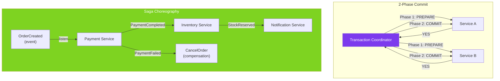

# 🔗 Distributed Transactions

> [!abstract] TL;DR
> A distributed transaction spans multiple services or databases and must maintain ACID guarantees across all of them. **Two-Phase Commit (2PC)** achieves this but blocks on coordinator failure. The **Saga pattern** breaks a distributed transaction into a sequence of local transactions with compensating transactions for rollback. The **Outbox pattern** ensures exactly-once event publishing alongside database writes.

## Intuition — analogy FIRST

A distributed transaction is like **booking a vacation package** — hotel, flight, and car rental must all succeed or all be cancelled. Without coordination, you might book the hotel but fail the flight, leaving you paying for a hotel you cannot use.

**2PC** is like having a **travel agent who calls all vendors simultaneously**: "Are you ready to confirm? Reply YES or NO." If all say YES, the agent commits all bookings. If anyone says NO, the agent cancels everything. The problem: if the travel agent's phone dies after collecting all YESes but before sending the COMMIT, everyone is frozen waiting, unable to confirm or cancel.

**Saga** is like a **chain of individual bookings** — each vendor is booked separately. If the car rental fails after the hotel and flight succeed, you cancel the hotel (compensating transaction) and the flight. No central coordinator needed, but you must handle partial failures with explicit compensation.

---

## How It Works



## Key Concepts / Details

### Two-Phase Commit (2PC)

```
Phase 1 — PREPARE:
  Coordinator → Participant A: "Prepare to commit, lock resources"
  Coordinator → Participant B: "Prepare to commit, lock resources"
  Participant A → Coordinator: "Prepared (YES)" or "Abort (NO)"
  Participant B → Coordinator: "Prepared (YES)"

Phase 2 — COMMIT or ROLLBACK:
  If all YES: Coordinator → All: "COMMIT"
  If any NO:  Coordinator → All: "ROLLBACK"
```

**Problems with 2PC:**
- **Blocking**: If coordinator fails after Phase 1, participants are locked indefinitely
- **Single point of failure**: Coordinator failure = system unavailable
- **Performance**: All participants hold locks during both phases — high latency
- **Not cloud-friendly**: Assumes reliable long-lived connections between services

### Saga Pattern — Choreography

```java
// Order Service — publishes events, no central coordinator
@Service
public class OrderService {

    @Transactional
    public Order createOrder(CreateOrderRequest req) {
        Order order = orderRepository.save(new Order(req));
        // Publish event for other services to react to
        eventPublisher.publish(new OrderCreatedEvent(order.getId(),
                                                     order.getCustomerId(),
                                                     order.getTotalAmount()));
        return order;
    }

    // Compensation — called if downstream fails
    @Transactional
    @EventListener
    public void onPaymentFailed(PaymentFailedEvent event) {
        orderRepository.findById(event.getOrderId()).ifPresent(order -> {
            order.setStatus(OrderStatus.CANCELLED);
            orderRepository.save(order);
        });
        eventPublisher.publish(new OrderCancelledEvent(event.getOrderId()));
    }
}

// Payment Service — listens and publishes
@Service
public class PaymentService {

    @EventListener
    @Transactional
    public void onOrderCreated(OrderCreatedEvent event) {
        try {
            paymentGateway.charge(event.getCustomerId(), event.getAmount());
            eventPublisher.publish(new PaymentCompletedEvent(event.getOrderId()));
        } catch (PaymentException e) {
            eventPublisher.publish(new PaymentFailedEvent(event.getOrderId(), e.getMessage()));
        }
    }
}
```

### Saga Pattern — Orchestration

```java
// Central saga orchestrator — knows the full flow
@Service
public class OrderSagaOrchestrator {

    @Transactional
    public void startOrderSaga(UUID orderId) {
        // Step 1: Reserve inventory
        inventoryService.reserve(orderId);
    }

    @EventListener
    @Transactional
    public void onInventoryReserved(InventoryReservedEvent event) {
        // Step 2: Charge payment
        paymentService.charge(event.getOrderId());
    }

    @EventListener
    @Transactional
    public void onPaymentCompleted(PaymentCompletedEvent event) {
        // Step 3: Confirm order
        orderRepository.updateStatus(event.getOrderId(), OrderStatus.CONFIRMED);
        notificationService.sendConfirmation(event.getOrderId());
    }

    @EventListener
    @Transactional
    public void onPaymentFailed(PaymentFailedEvent event) {
        // Compensate: release inventory
        inventoryService.release(event.getOrderId());
        orderRepository.updateStatus(event.getOrderId(), OrderStatus.FAILED);
    }
}
```

With Axon Framework for orchestration:

```java
@Saga
public class OrderSaga {

    @Autowired @Transient
    private CommandGateway commandGateway;

    @StartSaga
    @SagaEventHandler(associationProperty = "orderId")
    public void on(OrderCreatedEvent event) {
        SagaLifecycle.associateWith("orderId", event.getOrderId().toString());
        commandGateway.send(new ReserveInventoryCommand(event.getOrderId(),
                                                        event.getProductId(),
                                                        event.getQuantity()));
    }

    @SagaEventHandler(associationProperty = "orderId")
    public void on(InventoryReservedEvent event) {
        commandGateway.send(new ChargePaymentCommand(event.getOrderId()));
    }

    @SagaEventHandler(associationProperty = "orderId")
    public void on(PaymentFailedEvent event) {
        commandGateway.send(new ReleaseInventoryCommand(event.getOrderId()));
        commandGateway.send(new CancelOrderCommand(event.getOrderId(), event.getReason()));
        SagaLifecycle.end();
    }

    @EndSaga
    @SagaEventHandler(associationProperty = "orderId")
    public void on(OrderCompletedEvent event) {
        // Saga completed successfully
    }
}
```

### Outbox Pattern — Reliable Event Publishing

```java
// The "dual write problem": how do you atomically write to DB AND publish to Kafka?
// Solution: write event to "outbox" table in the SAME transaction, then relay asynchronously

@Entity
@Table(name = "outbox_events")
public class OutboxEvent {
    @Id UUID id;
    String aggregateId;
    String aggregateType;
    String eventType;
    String payload;  // JSON
    Instant createdAt;
    boolean processed;
}

@Transactional
public Order createOrder(CreateOrderRequest req) {
    Order order = orderRepository.save(new Order(req));

    // Write event to outbox table in SAME transaction — atomic!
    outboxRepository.save(new OutboxEvent(
        UUID.randomUUID(),
        order.getId().toString(),
        "Order",
        "OrderCreated",
        objectMapper.writeValueAsString(new OrderCreatedEvent(order))
    ));

    return order;  // if transaction commits, outbox event is guaranteed to be there
}

// Separate relay process (Debezium CDC or scheduled poller)
@Scheduled(fixedDelay = 1000)
@Transactional
public void relayOutboxEvents() {
    List<OutboxEvent> pending = outboxRepository.findUnprocessed();
    for (OutboxEvent event : pending) {
        kafkaTemplate.send("order-events", event.getAggregateId(), event.getPayload());
        event.setProcessed(true);
        outboxRepository.save(event);
    }
}
```

### Choreography vs Orchestration

| Aspect | Choreography | Orchestration |
|--------|-------------|--------------|
| **Coordination** | Events — each service reacts | Central orchestrator controls flow |
| **Coupling** | Loose — services don't know each other | Tighter — orchestrator knows all steps |
| **Visibility** | Hard to see the full saga flow | Easy — orchestrator is the diagram |
| **Error handling** | Each service publishes failure events | Orchestrator explicitly handles failures |
| **Testing** | Harder — need to simulate events | Easier — test orchestrator in isolation |
| **Best for** | Simple sagas, < 3–4 steps | Complex sagas with many branches |

## Real-World Notes

- **Saga's eventual consistency is often acceptable** — most business processes don't need strict ACID across services. "The payment will be charged within 5 seconds of order creation" is sufficient for most e-commerce.
- **Idempotent compensating transactions are essential** — compensating transactions may be executed multiple times (at-least-once delivery). They must be idempotent: releasing inventory that's already released is a no-op.
- **Outbox + Debezium is the gold standard** — CDC (Change Data Capture) via Debezium reads the outbox table from the database's replication log and publishes to Kafka with exactly-once delivery guarantees.
- **Consider Axon Framework or Eventuate for complex sagas** — implementing sagas manually is error-prone. Axon Framework provides saga infrastructure with durable state, retry, and timeout support.

## Common Pitfalls

- **Missing compensating transactions** — designing the happy path is easy; compensating transactions (rollback logic) are the hard part. Design compensations before implementing the forward path.
- **Not handling idempotency in saga steps** — at-least-once delivery means a saga step may execute twice. Every step must check "did I already do this?" to avoid double-charging or double-booking.
- **Choreography growing unmanageable** — a choreographed saga with 10 services and 20 event types becomes impossible to understand. Switch to orchestration at 5+ steps.
- **2PC in disguise** — using a message broker like Kafka as "the coordinator" in choreography doesn't eliminate the distributed transaction problem if services hold database locks waiting for messages.

## Related Concepts
- [[CAP_Theorem_Practice]] — Sagas embrace AP over CP for availability
- [[CQRS_Event_Sourcing]] — Event store as the foundation for saga event flow
- [[Eventual_Consistency]] — Sagas lead to eventual consistency, not immediate consistency

## Review Questions
1. What is the "blocking problem" in 2-Phase Commit?
2. What is the difference between Saga choreography and Saga orchestration?
3. How does the Outbox pattern solve the dual-write problem in event-driven systems?

## Sources
- Chris Richardson — Saga Pattern — https://microservices.io/patterns/data/saga.html
- Outbox Pattern — https://microservices.io/patterns/data/transactional-outbox.html
- Axon Framework Sagas — https://docs.axoniq.io/

#java #spring #distributed-systems #saga #2pc #outbox #transactions
