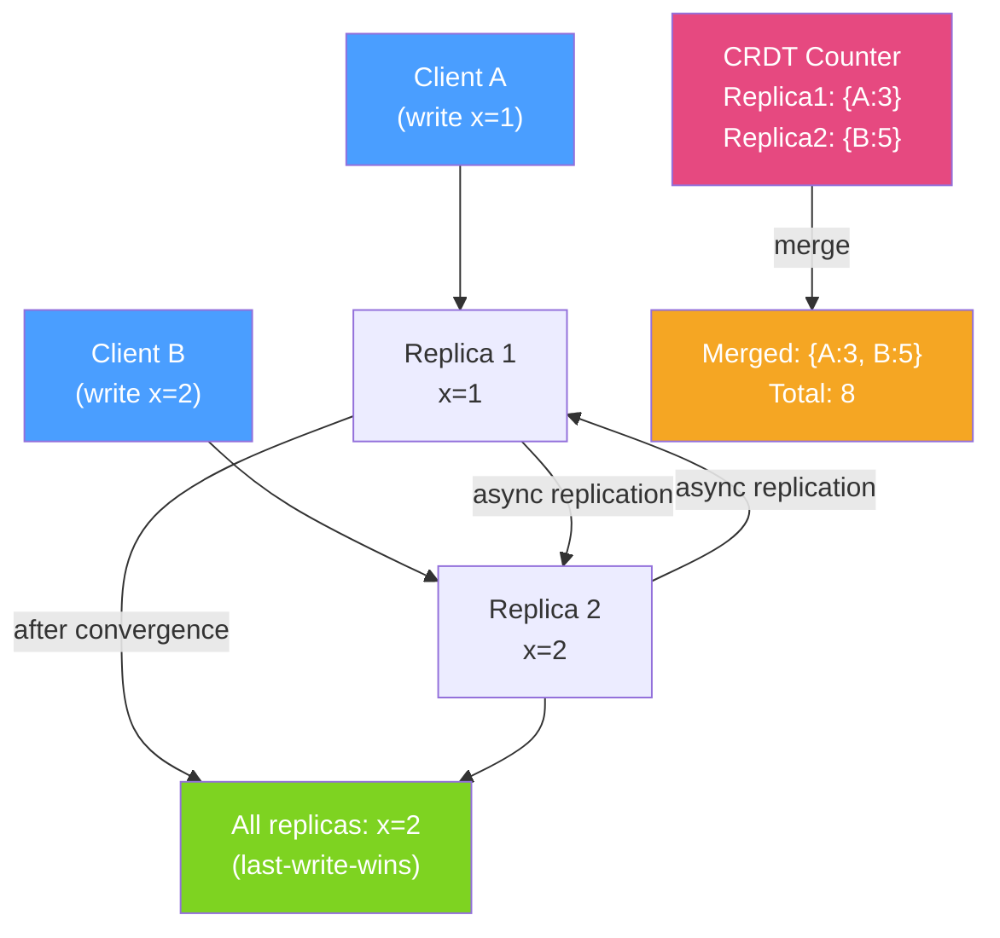

# 🔄 Eventual Consistency

> [!abstract] TL;DR
> **Eventual consistency** is the guarantee that, if no new updates are made to a data item, all replicas will eventually return the same value. AP distributed systems use eventual consistency to remain available during partitions at the cost of temporarily serving stale or conflicting data. Key patterns include **last-write-wins** (simple but lossy), **vector clocks** (detect concurrent updates), and **CRDTs** (conflict-free data structures that merge automatically).

## Intuition — analogy FIRST

Eventual consistency is like a **Wikipedia article** that can be edited by multiple people simultaneously. If two editors make changes at the same time (concurrent updates), they see conflicting versions. Wikipedia must resolve the conflict — either the last edit wins (last-write-wins), the edits are merged (CRDT-like approach), or a human chooses (manual resolution). Eventually, all readers see the same version, but in the interim they may see different edits.

A strongly consistent system is like a **single-author Google Doc with editing locked** — only one person edits at a time, all readers see the same version instantly, but throughput is limited by that one lock. Eventual consistency unlocks the doc and allows parallel edits at the cost of conflict resolution.

---

## How It Works



## Key Concepts / Details

### Consistency Models (Weakest to Strongest)

| Model | Guarantee | Example Systems |
|-------|-----------|----------------|
| **Eventual** | All replicas converge eventually | DNS, shopping cart, social media "likes" |
| **Monotonic read** | Once you see value X, you never see older value | User sees own posts immediately |
| **Read-your-writes** | After writing X, you read X or newer | E-commerce cart: see item you just added |
| **Causal** | Causally related operations appear in order | Chat messages (reply after question) |
| **Sequential** | All processes see operations in same order | |
| **Linearisable (Strong)** | Every operation appears atomic instantly | Bank balance, inventory count |

### Last-Write-Wins (LWW)

```java
// Simple but lossy — concurrent updates lose one write
public class LWWRegister<T> {
    private T value;
    private long timestamp;

    public synchronized void write(T newValue, long newTimestamp) {
        if (newTimestamp > this.timestamp) {
            this.value = newValue;
            this.timestamp = newTimestamp;
        }
    }

    public T read() { return value; }
}

// Problem: if two nodes write simultaneously with same timestamp,
// one write is lost. Use Lamport timestamps or hybrid logical clocks (HLC).
```

### Vector Clocks — Detecting Concurrent Updates

```java
public class VectorClock {
    private final Map<String, Integer> clock = new HashMap<>();

    public void increment(String nodeId) {
        clock.merge(nodeId, 1, Integer::sum);
    }

    // Returns: BEFORE, AFTER, CONCURRENT, EQUAL
    public ClockRelation compare(VectorClock other) {
        boolean beforeOrEqual = clock.entrySet().stream()
            .allMatch(e -> e.getValue() <= other.clock.getOrDefault(e.getKey(), 0));
        boolean afterOrEqual = other.clock.entrySet().stream()
            .allMatch(e -> e.getValue() <= clock.getOrDefault(e.getKey(), 0));

        if (beforeOrEqual && afterOrEqual) return ClockRelation.EQUAL;
        if (beforeOrEqual) return ClockRelation.BEFORE;
        if (afterOrEqual) return ClockRelation.AFTER;
        return ClockRelation.CONCURRENT;  // neither is a causal predecessor
    }

    public VectorClock merge(VectorClock other) {
        VectorClock merged = new VectorClock();
        Set<String> allKeys = new HashSet<>(clock.keySet());
        allKeys.addAll(other.clock.keySet());
        allKeys.forEach(k -> merged.clock.put(k,
            Math.max(clock.getOrDefault(k, 0), other.clock.getOrDefault(k, 0))));
        return merged;
    }
}
```

### CRDTs — Conflict-Free Replicated Data Types

CRDTs are data structures that can be merged without conflicts — the merge operation is commutative, associative, and idempotent.

```java
// G-Counter (Grow-only counter) — no decrement, always converges
public class GCounter {
    private final String nodeId;
    private final Map<String, Long> counts = new ConcurrentHashMap<>();

    public GCounter(String nodeId) {
        this.nodeId = nodeId;
        this.counts.put(nodeId, 0L);
    }

    public void increment() {
        counts.merge(nodeId, 1L, Long::sum);
    }

    public long value() {
        return counts.values().stream().mapToLong(Long::longValue).sum();
    }

    // Merge two replicas — always converges (max per node ID)
    public GCounter merge(GCounter other) {
        GCounter merged = new GCounter(nodeId);
        Set<String> allNodes = new HashSet<>(counts.keySet());
        allNodes.addAll(other.counts.keySet());
        allNodes.forEach(node -> merged.counts.put(node,
            Math.max(counts.getOrDefault(node, 0L),
                     other.counts.getOrDefault(node, 0L))));
        return merged;
    }
}

// PN-Counter (increment + decrement) = two G-Counters
public class PNCounter {
    private final GCounter increments;
    private final GCounter decrements;

    public void increment() { increments.increment(); }
    public void decrement() { decrements.increment(); }
    public long value() { return increments.value() - decrements.value(); }

    public PNCounter merge(PNCounter other) {
        return new PNCounter(
            increments.merge(other.increments),
            decrements.merge(other.decrements)
        );
    }
}
```

### Read Repair and Anti-Entropy

```java
// Cassandra-style read repair: detect inconsistency during reads and fix it
@Service
public class ConsistentReadService {

    // Read from multiple replicas and repair inconsistencies
    public <T> T readWithRepair(String key, Class<T> type) {
        List<ReplicaResponse<T>> responses = replicaClients.stream()
            .map(client -> client.read(key))
            .collect(Collectors.toList());

        // Find the most recent value
        T mostRecent = responses.stream()
            .max(Comparator.comparing(r -> r.getTimestamp()))
            .map(ReplicaResponse::getValue)
            .orElseThrow();

        // Repair stale replicas asynchronously
        responses.stream()
            .filter(r -> r.getTimestamp() < maxTimestamp)
            .forEach(stale -> executor.submit(
                () -> stale.getReplica().write(key, mostRecent)));

        return mostRecent;
    }
}
```

### Conflict Resolution Strategies

| Strategy | How | Use Case | Risk |
|----------|-----|---------|------|
| **Last-Write-Wins (LWW)** | Keep highest timestamp | Simple data, idempotent operations | Concurrent writes lose one update |
| **First-Write-Wins** | Keep first timestamp | Registrations, unique usernames | May block legitimate updates |
| **Merge (CRDT)** | Mathematically merge both | Counters, sets, maps | Limited to CRDT-compatible data types |
| **Application-level** | Expose conflict to user | Google Docs, version control | User burden, complex UX |
| **Multi-version** | Keep all versions, resolve later | Shopping carts (Amazon Dynamo) | Storage overhead |

## Real-World Notes

- **Design for eventual consistency from the start** — retrofitting eventual consistency into a strongly consistent design is very hard. Decide upfront which operations can tolerate stale reads.
- **Idempotency + eventual consistency = resilience** — if every write operation is idempotent (safe to retry), replicas can receive messages out of order and still converge to the correct state.
- **Cassandra's tunable consistency** — Cassandra allows `ConsistencyLevel.QUORUM` (strong) or `ConsistencyLevel.ONE` (eventual) per operation. Use strong for writes to critical data, eventual for reads.
- **CRDT libraries for Java** — `akka-distributed-data` provides PNCounter, GSet, ORSet (Observed-Remove Set), LWWMap CRDTs ready to use in distributed Akka systems.

## Common Pitfalls

- **Assuming "eventually" is bounded** — eventual consistency offers no time bound. In theory, two replicas might diverge indefinitely if network heals very slowly. Design UI to handle stale data gracefully.
- **Using LWW for financial data** — last-write-wins on account balances causes silent data loss during concurrent updates. Use strong consistency or CRDTs (PNCounter) for monetary values.
- **Not testing concurrent write scenarios** — eventual consistency bugs only manifest under concurrent load. Test with tools like Jepsen or write multi-threaded chaos tests.
- **Ignoring clock drift** — LWW depends on timestamps. Servers with different clock times may have 100–500ms drift, causing the "earlier" write to win when it shouldn't.

## Related Concepts
- [[CAP_Theorem_Practice]] — AP systems use eventual consistency by definition
- [[Distributed_Transactions]] — Sagas achieve eventual consistency through compensating transactions
- [[Consensus_Algorithms]] — Consensus is used to achieve strong consistency in replicated systems

## Review Questions
1. What is a CRDT and why does a G-Counter never have merge conflicts?
2. What is the difference between causal consistency and eventual consistency?
3. Why is last-write-wins problematic for financial data?

## Sources
- Shapiro et al. — CRDTs — https://crdt.tech/
- Werner Vogels — Eventually Consistent — https://www.allthingsdistributed.com/2008/12/eventually_consistent.html
- Designing Data-Intensive Applications, Chapter 5 — Martin Kleppmann

#java #distributed-systems #eventual-consistency #crdt #vector-clocks #consistency
