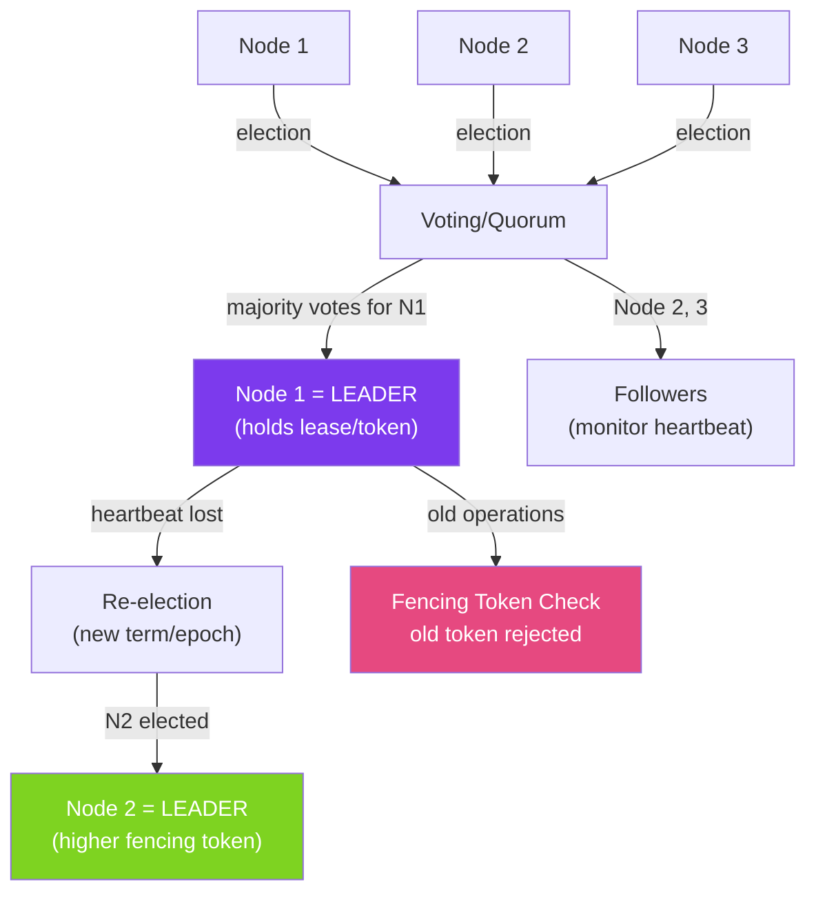

# 👑 Leader Election

> [!abstract] TL;DR
> **Leader election** designates one node among a group as the "leader" responsible for coordinating actions (e.g., running scheduled tasks, writing to a primary database, partitioning work). Without a single leader, multiple nodes might execute the same action (duplicate processing) or no node might act (split-brain). Leader election requires a consensus protocol — ZooKeeper, etcd, or Raft — to guarantee at most one leader at a time.

## Intuition — analogy FIRST

Leader election is like choosing a **project manager for a group project**. Without a PM (leader), every team member independently tries to assign themselves tasks, creating duplicates and conflicts. With a PM, one person coordinates — assigns tasks, resolves conflicts, and ensures every subtask is done exactly once. When the PM is on vacation (node failure), the team elects a new PM via a vote (new election). The challenge: ensuring **exactly one PM at a time** — having two PMs issuing contradictory instructions is worse than having none.

**Split-brain** is the nightmare scenario where two nodes both believe they are the leader simultaneously — like two project managers both independently issuing contradictory task assignments. Fencing tokens (a monotonically increasing number given to each elected leader) prevent split-brain effects: any operation from the old leader (with a stale lower token) is rejected.

---

## How It Works



## Key Concepts / Details

### Bully Algorithm (Basic)

```java
// Simple leader election: highest ID wins
public class BullyElection {
    private final String nodeId;
    private final List<String> allNodes;  // sorted by priority
    private volatile String currentLeader;

    public void startElection() {
        // Send ELECTION to all nodes with higher ID
        List<String> higherNodes = allNodes.stream()
            .filter(id -> id.compareTo(nodeId) > 0)
            .collect(Collectors.toList());

        if (higherNodes.isEmpty()) {
            // I am the highest — declare myself leader
            becomeLeader();
        } else {
            // Send election messages and wait for OK responses
            boolean anyHigherAlive = higherNodes.parallelStream()
                .anyMatch(this::sendElectionMessage);
            if (!anyHigherAlive) {
                becomeLeader();
            }
        }
    }

    private void becomeLeader() {
        currentLeader = nodeId;
        // Broadcast COORDINATOR message to all lower nodes
        allNodes.stream()
            .filter(id -> id.compareTo(nodeId) < 0)
            .forEach(id -> sendCoordinatorMessage(id, nodeId));
    }
}
```

### ZooKeeper-Based Leader Election

```java
// ZooKeeper: create ephemeral sequential znodes, lowest number = leader
public class ZooKeeperLeaderElection {

    private final CuratorFramework client;
    private final LeaderLatch latch;

    public ZooKeeperLeaderElection(CuratorFramework client, String electionPath) {
        this.client = client;
        this.latch = new LeaderLatch(client, electionPath, nodeId);
        this.latch.addListener(new LeaderLatchListener() {
            @Override
            public void isLeader() {
                log.info("This node is now the leader");
                onBecomeLeader();
            }
            @Override
            public void notLeader() {
                log.info("This node is no longer the leader");
                onLoseLeadership();
            }
        });
    }

    public void start() throws Exception {
        latch.start();
    }

    public boolean isLeader() {
        return latch.hasLeadership();
    }
}

// Spring Boot integration — scheduled task only runs on leader
@Service
public class LeaderOnlyScheduler {

    @Autowired private ZooKeeperLeaderElection election;

    @Scheduled(fixedDelay = 60_000)
    public void runOnLeaderOnly() {
        if (!election.isLeader()) {
            return;  // skip — I'm not the leader
        }
        // Only the leader runs this
        performLeaderTask();
    }
}
```

### Spring Integration Leader Election

```java
// Spring Integration with ZooKeeper or etcd
@Configuration
public class LeaderConfig {

    @Bean
    public LeaderInitiator leaderInitiator(ZookeeperClient zkClient) {
        return new LeaderInitiator(
            zkClient,
            new DefaultCandidate(UUID.randomUUID().toString(), "my-leader-role")
        );
    }
}

@EventListener(OnGrantedEvent.class)
public void onLeaderGranted(OnGrantedEvent event) {
    log.info("Became leader for role: {}", event.getRole());
    // Start leader tasks
}

@EventListener(OnRevokedEvent.class)
public void onLeaderRevoked(OnRevokedEvent event) {
    log.info("Lost leadership for role: {}", event.getRole());
    // Stop leader tasks
}
```

### Kubernetes Leader Election

```java
// Kubernetes leader election via ConfigMap/Lease resource
// Used by Kubernetes controllers themselves
dependencies {
    implementation 'io.fabric8:kubernetes-client:6.10.0'
}

public class KubernetesLeaderElection {
    private final LeaderElector leaderElector;

    public KubernetesLeaderElection(KubernetesClient client, String namespace) {
        LeaderElectionConfig config = new LeaderElectionConfigBuilder()
            .withName("order-service-leader")
            .withNamespace(namespace)
            .withLeaseDuration(Duration.ofSeconds(15))
            .withRenewDeadline(Duration.ofSeconds(10))
            .withRetryPeriod(Duration.ofSeconds(2))
            .withLeaderCallbacks(new LeaderCallbacks(
                () -> log.info("Became leader"),
                () -> log.info("Lost leadership"),
                id -> log.info("New leader: {}", id)
            ))
            .build();
        this.leaderElector = client.leaderElector()
            .withConfig(config)
            .build();
    }

    public void start() {
        leaderElector.run();  // blocking — runs election loop
    }
}
```

### Fencing Tokens — Preventing Split-Brain

```java
// Problem: old leader (Network partition delayed) thinks it's still leader
// Solution: every operation includes a fencing token (monotonically increasing epoch)

public interface StorageService {
    void write(String key, String value, long fencingToken);
}

public class FencedStorageService implements StorageService {
    private volatile long currentFencingToken = 0;

    @Override
    public void write(String key, String value, long fencingToken) {
        if (fencingToken < currentFencingToken) {
            throw new StaleLeaderException(
                "Operation rejected: fencing token " + fencingToken +
                " is older than current token " + currentFencingToken);
        }
        this.currentFencingToken = fencingToken;
        doWrite(key, value);
    }
}

// ZooKeeper gives each leader a unique, monotonically increasing epoch number
// Old leader (stale epoch) operations are rejected by storage layer
```

### Comparison of Leader Election Approaches

| Approach | Guarantee | Complexity | Use Case |
|----------|-----------|------------|---------|
| **Database (SELECT FOR UPDATE)** | At-most-one leader | Low | Simple single-DB deployments |
| **ZooKeeper** | Consensus-based | Medium | Classic distributed coordination |
| **etcd** | Raft-based, fast | Medium | Cloud-native, Kubernetes era |
| **Kubernetes Lease** | etcd-backed | Low | Applications running in Kubernetes |
| **Redis SETNX + expiry** | Near-correct (clock-dependent) | Low | High-throughput, tolerate rare duplicates |

## Real-World Notes

- **Redis-based election is approximate** — `SETNX` with TTL works well in practice but can elect two leaders if clocks are skewed or network is slow. Use Redlock for stronger guarantees (still contested).
- **Kubernetes Lease is the simplest for K8s apps** — if your service runs in Kubernetes, use the native `coordination.k8s.io/v1/Lease` resource via the fabric8 client or `leader-elector` sidecar.
- **Don't hold leadership forever** — use short lease durations (15–30 seconds) so a crashed leader is replaced quickly. Renewing the lease every 5–10 seconds is typical.
- **Test leadership transitions** — manually kill the current leader and verify that a new leader is elected within the expected time, picks up in-flight work, and doesn't duplicate completed work.

## Common Pitfalls

- **Split-brain without fencing tokens** — an old leader that temporarily lost connectivity may resume processing after the partition heals while a new leader is already active. Always use fencing tokens.
- **Long GC pauses causing false leader failure** — a leader pausing for 10+ seconds in GC may lose its ZooKeeper heartbeat, causing re-election. The old leader resumes after GC and becomes split-brain. Use short lease durations and `ZGC` for long-running leader processes.
- **Not handling leadership loss during task execution** — if the leader loses election mid-task, the task must be idempotent so the new leader can safely restart it.
- **Using leader election as a crutch for all coordination** — if you need a leader for most operations, consider whether the design is correct. Leaderless systems (CRDTs, CRDT-based databases) scale better.

## Related Concepts
- [[Consensus_Algorithms]] — Raft and Paxos are the underlying algorithms for leader election in ZooKeeper and etcd
- [[CAP_Theorem_Practice]] — Leader election requires CP guarantees to prevent split-brain
- [[Distributed_Transactions]] — Leader coordinates distributed transactions

## Review Questions
1. What is split-brain in distributed systems and how do fencing tokens prevent it?
2. How does ZooKeeper's ephemeral sequential node mechanism implement leader election?
3. Why do ZooKeeper-based elections require an odd number of nodes?

## Sources
- Apache Curator LeaderLatch — https://curator.apache.org/curator-recipes/leader-latch.html
- Designing Data-Intensive Applications, Chapter 8 — Martin Kleppmann
- Kubernetes Leader Election — https://kubernetes.io/blog/2016/01/simple-leader-election-with-kubernetes/

#java #distributed-systems #leader-election #zookeeper #etcd #split-brain #fencing
