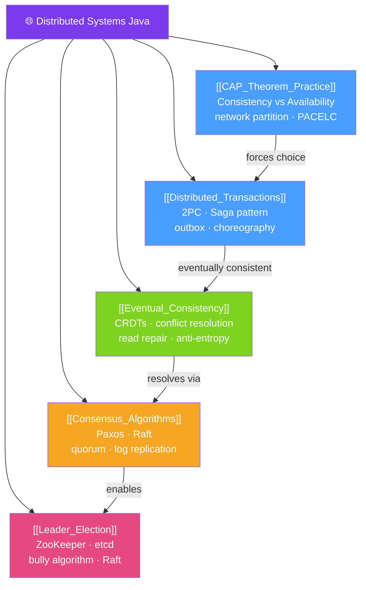

# 🌐 Distributed Systems Java — Map of Content

> [!abstract] What This Section Covers
> Distributed systems are fundamentally about trade-offs: consistency vs availability, safety vs liveness, simplicity vs resilience. This section covers the **CAP theorem** in practice, **distributed transactions** (2PC and Saga), **eventual consistency** patterns, **leader election**, and **consensus algorithms** (Paxos, Raft). Understanding these concepts is essential for any senior engineer building or operating multi-service systems.

## Concept Map

## Learning Path
1. [[CAP_Theorem_Practice]] — Understand the fundamental constraints of distributed systems.
2. [[Consensus_Algorithms]] — How distributed nodes agree on values despite failures.
3. [[Leader_Election]] — Choosing a single coordinator among distributed nodes.
4. [[Distributed_Transactions]] — Handling multi-service transactions safely with Saga.
5. [[Eventual_Consistency]] — Designing for "eventually consistent" state across replicas.

## All Notes at a Glance
| Note | Difficulty | What You'll Learn |
|------|------------|-------------------|
| [[CAP_Theorem_Practice]] | Advanced | CAP theorem, PACELC, CP vs AP systems, real examples |
| [[Distributed_Transactions]] | Advanced | 2PC limitations, Saga (choreography vs orchestration), outbox pattern |
| [[Eventual_Consistency]] | Advanced | Consistency models, CRDTs, read repair, conflict resolution |
| [[Leader_Election]] | Advanced | Bully algorithm, ZooKeeper/etcd-based election, fencing tokens |
| [[Consensus_Algorithms]] | Advanced | Paxos (single decree), Raft (log replication), quorum voting |

## Key Questions This Section Answers
- What does the CAP theorem actually say, and why is it often misunderstood?
- Why does 2-Phase Commit (2PC) create a blocking problem and how does Saga avoid it?
- What is the difference between strong consistency, linearisability, and eventual consistency?
- How does Raft ensure that only one leader is elected at a time?
- What is a CRDT and when does it solve the conflict resolution problem?

## Related Sections
- [[_MOC_Java_Master|↑ Java Master MOC]]
- [[31_API_Design/_MOC_API_Design|← API Design]]
- [[33_Java_Generics/_MOC_Java_Generics|→ Java Generics]]

#MOC #java #distributed-systems #cap #consensus #saga #eventual-consistency
