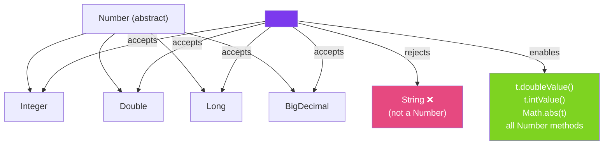

# 🔒 Bounded Type Parameters

> [!abstract] TL;DR
> Bounded type parameters restrict what types can be substituted for a type parameter. `<T extends Number>` means T must be Number or a subclass — enabling you to call `.doubleValue()` on T. Multiple bounds use `&`: `<T extends Comparable<T> & Serializable>`. The **Comparable recursive bound** `<T extends Comparable<T>>` is the classic pattern for generic sorting/min/max utilities.

## Intuition — Why Bounds Exist

Unbounded `<T>` means "any type" — which means you can only call methods on `Object`. That's too restrictive. Bounded `<T extends Number>` means "any Number or subclass" — giving you access to all Number methods (`.intValue()`, `.doubleValue()`, etc.) while still being generic.

Think of bounds as a **job requirement**: `<T extends Number>` is like "must have a math degree" — you can work with any candidate who meets the requirement, not just one specific person.

---

## How It Works



## Key Concepts / Details

### Upper Bounded Type Parameter: `extends`

```java
// Without bound: can only call Object methods on T
public static <T> double sum(List<T> list) {
    // Can't call t.doubleValue() — T might be String, List, anything
    return 0;  // useless
}

// With upper bound: T must be Number (or subclass)
public static <T extends Number> double sum(List<T> list) {
    double total = 0;
    for (T element : list) {
        total += element.doubleValue();  // OK — Number has doubleValue()
    }
    return total;
}

// Usage
List<Integer> ints = List.of(1, 2, 3, 4, 5);
System.out.println(sum(ints));    // 15.0

List<Double> doubles = List.of(1.5, 2.5, 3.0);
System.out.println(sum(doubles)); // 7.0

// sum(List.of("a", "b")) — compile error: String is not a Number
```

### Recursive Bound — `Comparable<T>`

The most important pattern in Java generics — used by `Collections.sort`, `TreeSet`, `TreeMap`, etc.

```java
// T must be comparable to itself — allows sorting/min/max
public static <T extends Comparable<T>> T max(List<T> list) {
    if (list.isEmpty()) throw new NoSuchElementException();
    T result = list.get(0);
    for (T element : list) {
        if (element.compareTo(result) > 0) {
            result = element;
        }
    }
    return result;
}

// Works for any Comparable type
System.out.println(max(List.of(3, 1, 4, 1, 5, 9)));  // 9
System.out.println(max(List.of("banana", "apple", "cherry")));  // "cherry"

// Your own class
public class Temperature implements Comparable<Temperature> {
    private final double celsius;
    public Temperature(double celsius) { this.celsius = celsius; }

    @Override
    public int compareTo(Temperature other) {
        return Double.compare(this.celsius, other.celsius);
    }
}

System.out.println(max(List.of(
    new Temperature(20), new Temperature(35), new Temperature(15)
)));  // Temperature(35)
```

### Multiple Bounds: `extends T1 & T2 & ...`

```java
// T must implement BOTH Comparable and Serializable
public static <T extends Comparable<T> & Serializable> T clamp(T value, T min, T max) {
    if (value.compareTo(min) < 0) return min;
    if (value.compareTo(max) > 0) return max;
    return value;
}

// Rules for multiple bounds:
// 1. At most ONE class (not interface) — must come FIRST
// 2. Any number of interfaces after the class
// <T extends Number & Comparable<T> & Serializable>  -- OK
// <T extends Comparable<T> & Number> -- ERROR if Number is a class (it is)
// Actually Number IS abstract class — put it first:
// <T extends Number & Comparable<T>>  -- OK
```

### Bounded Type in Generic Classes

```java
// Generic class that works only with Number subtypes
public class Statistics<T extends Number> {
    private final List<T> data;

    public Statistics(List<T> data) {
        this.data = List.copyOf(data);
    }

    public double mean() {
        return data.stream()
            .mapToDouble(Number::doubleValue)
            .average()
            .orElse(0.0);
    }

    public double max() {
        return data.stream()
            .mapToDouble(Number::doubleValue)
            .max()
            .orElse(0.0);
    }

    public double standardDeviation() {
        double mean = mean();
        double variance = data.stream()
            .mapToDouble(n -> Math.pow(n.doubleValue() - mean, 2))
            .average()
            .orElse(0.0);
        return Math.sqrt(variance);
    }
}

// Usage
Statistics<Integer> stats = new Statistics<>(List.of(1, 2, 3, 4, 5));
System.out.println(stats.mean());   // 3.0
System.out.println(stats.standardDeviation());  // 1.414...
```

### Bounds vs Wildcards — When to Use Which

| Scenario | Use | Example |
|----------|-----|---------|
| **Declaring a class type parameter** | Bounded `T extends X` | `class Stats<T extends Number>` |
| **Method that returns T** | Bounded `T extends X` | `<T extends Comparable<T>> T max(List<T>)` |
| **Read-only method parameter (producer)** | Wildcard `? extends X` | `void print(List<? extends Number>)` |
| **Write-only method parameter (consumer)** | Wildcard `? super X` | `void add(List<? super Integer>)` |
| **Multiple bounds on same type** | `T extends A & B` | `<T extends Comparable<T> & Serializable>` |

## Real-World Notes

- **Java's standard library uses recursive bounds everywhere** — `TreeMap<K extends Comparable<? super K>>`, `Collections.sort(List<T extends Comparable<? super T>>)`. The pattern is idiomatic Java.
- **Bounds enable calling methods on the type parameter** — without a bound, `T` only has `Object` methods. With `<T extends Runnable>`, you can call `t.run()`.
- **`extends` means "is a" — includes the bound itself** — `<T extends Number>` accepts `Number`, `Integer`, `Double`, `BigDecimal`, etc. It's the Java upper bound (not strict upper bound).
- **Lower bounds don't exist for type parameters** — `<T super Integer>` is not valid syntax. Lower bounds only exist in wildcards (`? super Integer`). See [[Wildcards]].

## Common Pitfalls

- **Putting a class after an interface in multiple bounds** — `<T extends Comparable<T> & Number>` is wrong if Number is a class (it is). Class must come first: `<T extends Number & Comparable<T>>`.
- **Confusing bounded type parameters with wildcards** — `<T extends Number>` and `<? extends Number>` look similar but serve different purposes. Type parameters (`T`) let you reference the specific type later; wildcards (`?`) are for one-time-use flexible parameters.
- **Not using bounds when you need to call methods** — if you find yourself doing `(T instanceof Number)` inside a generic method, that's a sign you should have declared `<T extends Number>` instead.
- **Over-bounding** — `<T extends Number & Comparable<T> & Serializable & Cloneable>` makes the type too restrictive. Only bound what you actually need.

## Related Concepts
- [[Wildcards]] — `? extends T` and `? super T` for method parameters
- [[Generic_Methods]] — where bounded type parameters are most commonly declared
- [[Generic_Types]] — bounded type parameters in class declarations

## Review Questions
1. What does `<T extends Comparable<T>>` mean and why is the recursive bound necessary?
2. When you declare `<T extends Number & Comparable<T>>`, which constraint must come first and why?
3. Why can't you use `(T) someObject` as an alternative to a bound?

#java #generics #bounded-type-parameters #comparable #recursive-bounds
