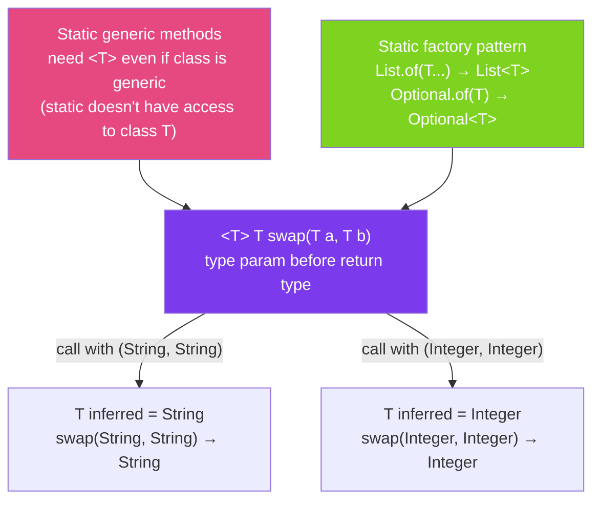

# 🔧 Generic Methods

> [!abstract] TL;DR
> Generic methods have their **own type parameter**, independent of the enclosing class. The type parameter is declared before the return type: `public static <T> T identity(T value)`. The compiler **infers** the type from the arguments — no explicit passing needed in most cases. Generic methods are ideal for utility functions (swap, zip, flatten) and static factory patterns (`Optional.of()`, `List.of()`).

## Intuition — Methods With Their Own Type Slot

A generic class is like a **typed container** — the type is fixed at construction. A generic method is like a **typed tool** — the type is fixed per call. A wrench fits any bolt of the right size; you don't buy a wrench per size, you use one wrench that adapts per usage.

`Collections.sort(list)` doesn't need to know the list's element type at compile time for the sort() method itself to exist — it just needs to know the element type when you call it (and the compiler figures that out from `list`'s declared type).

---

## How It Works



## Key Concepts / Details

### Basic Generic Method Syntax

```java
// Generic method: type parameter <T> declared before return type
public class Utility {

    // Identity function — returns the argument unchanged
    public static <T> T identity(T value) {
        return value;
    }

    // Swap two elements in an array
    public static <T> void swap(T[] array, int i, int j) {
        T temp = array[i];
        array[i] = array[j];
        array[j] = temp;
    }

    // Wrap a value in a list
    public static <T> List<T> singletonList(T value) {
        List<T> list = new ArrayList<>();
        list.add(value);
        return list;
    }
}

// Usage — compiler infers T from arguments
String s = Utility.identity("hello");   // T inferred as String
Integer n = Utility.identity(42);       // T inferred as Integer

String[] arr = {"a", "b", "c"};
Utility.swap(arr, 0, 2);  // T inferred as String
System.out.println(Arrays.toString(arr));  // [c, b, a]
```

### Type Inference — How the Compiler Guesses T

```java
public class InferenceDemo {

    // T inferred from argument
    public static <T> Optional<T> wrap(T value) {
        return Optional.of(value);
    }

    // T inferred from expected return type (target-type inference — Java 8+)
    public static <T> List<T> emptyList() {
        return new ArrayList<>();
    }
}

// Argument-based inference
Optional<String> opt = InferenceDemo.wrap("hello");  // T = String from argument

// Target-type inference
List<String> list = InferenceDemo.emptyList();  // T = String from left-hand side

// Explicit type argument (rarely needed)
List<String> list2 = InferenceDemo.<String>emptyList();  // force T = String

// Sometimes inference fails — explicit type required
// Context is complex (nested generics, overloaded methods)
Map<String, List<Integer>> map = Collections.<String, List<Integer>>emptyMap();
// Or just:
Map<String, List<Integer>> map2 = Collections.emptyMap(); // usually inferred
```

### Generic Methods with Bounds

```java
public class BoundedMethods {

    // Upper bound — T must be Comparable
    public static <T extends Comparable<T>> T max(T a, T b) {
        return a.compareTo(b) >= 0 ? a : b;
    }

    // Multiple bounds — T must be Number AND Comparable
    public static <T extends Number & Comparable<T>> T clamp(T value, T min, T max) {
        if (value.compareTo(min) < 0) return min;
        if (value.compareTo(max) > 0) return max;
        return value;
    }

    // Generic method using PECS wildcard
    public static <T> void copy(List<? super T> dest, List<? extends T> src) {
        for (T item : src) {
            dest.add(item);
        }
    }
}

// Usage
System.out.println(BoundedMethods.max("apple", "banana"));  // "banana"
System.out.println(BoundedMethods.max(42, 17));               // 42
System.out.println(BoundedMethods.clamp(150, 0, 100));        // 100
```

### Static Generic Methods in Generic Classes

```java
// IMPORTANT: static methods cannot use the class's type parameter
public class Box<T> {
    private T value;

    // This uses the CLASS type parameter T — instance method, OK
    public T get() { return value; }

    // WRONG: static methods cannot access class-level T
    // public static Box<T> of(T value) {}  // COMPILE ERROR

    // CORRECT: declare own type parameter U (or also T, but it shadows)
    public static <U> Box<U> of(U value) {
        Box<U> box = new Box<>();
        box.value = value;
        return box;
    }
}

Box<String> strBox = Box.of("hello");     // U inferred as String
Box<Integer> intBox = Box.of(42);          // U inferred as Integer
```

### Generic Methods vs. Wildcards

```java
// These two are often equivalent for read-only methods:

// Option 1: Generic method
public static <T> void printList1(List<T> list) {
    list.forEach(System.out::println);
}

// Option 2: Wildcard
public static void printList2(List<?> list) {
    list.forEach(System.out::println);
}

// DIFFERENCE: Generic method allows referencing T elsewhere:
// Option 1 can be called as <String>printList1(list), and T is reusable in the method
// Option 2 is simpler when you don't need to reference T

// Use generic method when:
// - The return type depends on the parameter type
// - Multiple parameters must have the same type
// - You need to express a relationship between types
public static <T> T firstElement(List<T> list) {
    return list.get(0);  // return type is T — wildcard can't express this
}

public static <T> Pair<T, T> firstAndLast(List<T> list) {
    return Pair.of(list.get(0), list.get(list.size() - 1));
}
```

### Common Generic Method Patterns

```java
public class GenericPatterns {

    // Factory pattern — create instances safely
    public static <T> T createInstance(Class<T> clazz) {
        try {
            return clazz.getDeclaredConstructor().newInstance();
        } catch (ReflectiveOperationException e) {
            throw new RuntimeException("Failed to create " + clazz.getName(), e);
        }
    }

    // Safe cast pattern
    public static <T> Optional<T> safeCast(Object obj, Class<T> type) {
        return type.isInstance(obj) ? Optional.of(type.cast(obj)) : Optional.empty();
    }

    // Zip two lists into pairs
    public static <A, B> List<Pair<A, B>> zip(List<A> as, List<B> bs) {
        int size = Math.min(as.size(), bs.size());
        List<Pair<A, B>> result = new ArrayList<>(size);
        for (int i = 0; i < size; i++) {
            result.add(Pair.of(as.get(i), bs.get(i)));
        }
        return result;
    }

    // Flatten a list of lists
    public static <T> List<T> flatten(List<List<T>> nested) {
        return nested.stream()
            .flatMap(List::stream)
            .collect(Collectors.toList());
    }
}

// Usage
String s = GenericPatterns.createInstance(String.class);  // type-safe factory

Optional<Integer> num = GenericPatterns.safeCast("not a number", Integer.class);  // empty
Optional<String> str = GenericPatterns.safeCast("hello", String.class);  // "hello"

List<Pair<String, Integer>> pairs = GenericPatterns.zip(
    List.of("a", "b", "c"),
    List.of(1, 2, 3)
);  // [(a,1), (b,2), (c,3)]
```

## Real-World Notes

- **All `Collections` utility methods are generic** — `sort`, `max`, `min`, `unmodifiableList`, `singletonList` — they're the canonical example of generic methods in the JDK.
- **Functional interfaces in `java.util.function`** use generic methods extensively** — `Function<T,R>`, `Predicate<T>`, `Consumer<T>` are all built around generic type parameters in methods.
- **`Optional.of(T value)`, `List.of(T... elements)`, `Map.of(K k, V v, ...)` are all generic static factory methods** — the pattern is universally used in modern Java APIs.
- **Type inference in Java 8+ is much smarter** — chained stream operations can often infer types across several transformations. When inference fails, add explicit type arguments or intermediate variables.

## Common Pitfalls

- **Forgetting `<T>` before the return type** — `public T identity(T value)` is a method in a class that has its own `T`. `public static <T> T identity(T value)` is a self-contained generic method. Missing `<T>` causes a compile error if the class doesn't declare `T`.
- **Shadowing the class type parameter** — in `class Box<T>`, a static method `public static <T> Box<T> of(T v)` creates a new, independent `T` that shadows the class `T`. This is valid but confusing — use `U` for the method to avoid ambiguity.
- **Over-using explicit type arguments** — `Collections.<String>emptyList()` is rarely needed in modern Java. Type inference handles it. Only use explicit types when inference fails.
- **Wildcard when generic method is needed** — if you need the return type to match the input type, use a type parameter, not a wildcard. `List<?> get()` loses the type; `<T> List<T> get(Class<T> t)` preserves it.

## Related Concepts
- [[Bounded_Type_Parameters]] — bounds for generic method type parameters
- [[Wildcards]] — alternative to generic methods for read-only scenarios
- [[Type_Erasure]] — generic method type parameters are also erased at runtime

## Review Questions
1. Why must static generic methods in a generic class declare their own `<T>` parameter?
2. When should you use a generic method `<T> void foo(List<T> list)` instead of a wildcard `void foo(List<?> list)`?
3. How does Java's type inference determine `T` in `Collections.emptyList()` assigned to `List<String>`?

#java #generics #generic-methods #type-inference #static-factory
