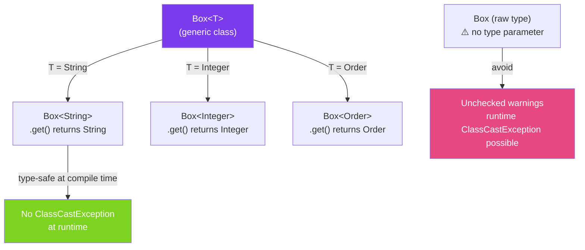

# 🧩 Generic Types

> [!abstract] TL;DR
> Generics let you write a class or interface that works with any type, with **compile-time type checking**. Instead of writing `ObjectBox` that holds `Object` (requires casting everywhere), you write `Box<T>` where `T` is filled in at usage (`Box<String>`, `Box<Integer>`). The compiler verifies type correctness; at runtime, type info is erased (see [[Type_Erasure]]).

## Intuition — The Problem Generics Solve

Before generics (Java 1.4), you'd write:

```java
// Pre-generics: everything is Object
List list = new ArrayList();
list.add("hello");
String s = (String) list.get(0);  // cast required — ClassCastException at runtime if wrong type
list.add(42);  // compiles! but crashes when you cast to String
```

Generics move the error from runtime to compile time — a fundamentally better guarantee.

---

## How It Works



## Key Concepts / Details

### Declaring a Generic Class

```java
// T is the type parameter — convention: single uppercase letter
// T=Type, E=Element, K=Key, V=Value, N=Number, R=Return type
public class Box<T> {
    private T value;

    public Box(T value) {
        this.value = value;
    }

    public T get() { return value; }
    public void set(T value) { this.value = value; }

    @Override
    public String toString() {
        return "Box[" + value + "]";
    }
}

// Usage
Box<String> stringBox = new Box<>("hello");
String s = stringBox.get();  // no cast — compiler knows it's String
// stringBox.set(42);         // compile error — type safety!

Box<Integer> intBox = new Box<>(42);
int n = intBox.get();  // unboxes Integer → int automatically
```

### Multiple Type Parameters

```java
// Maps, pairs, and similar structures use multiple type parameters
public class Pair<A, B> {
    private final A first;
    private final B second;

    public Pair(A first, B second) {
        this.first = first;
        this.second = second;
    }

    public A getFirst() { return first; }
    public B getSecond() { return second; }

    // Factory method — better syntax (diamond inference)
    public static <A, B> Pair<A, B> of(A first, B second) {
        return new Pair<>(first, second);
    }
}

Pair<String, Integer> nameAge = Pair.of("Alice", 30);
String name = nameAge.getFirst();  // String
int age = nameAge.getSecond();     // int (auto-unboxed)
```

### Generic Interfaces

```java
// Comparable is a generic interface — T is the type being compared
public interface Comparable<T> {
    int compareTo(T other);
}

// Implementing a generic interface with a concrete type
public class Temperature implements Comparable<Temperature> {
    private final double celsius;

    @Override
    public int compareTo(Temperature other) {
        return Double.compare(this.celsius, other.celsius);
    }
}

// Implementing with another type parameter
public class Wrapper<T> implements Comparable<Wrapper<T>> {
    // ...
}
```

### Raw Types — Avoid in New Code

```java
// Raw type: erases all generic information — like Java 1.4 mode
Box rawBox = new Box("text");   // compiles with unchecked warning
Object obj = rawBox.get();       // returns Object, not String
String s = (String) rawBox.get(); // cast required — runtime risk

// Raw types exist for backward compatibility with legacy code
// NEVER use raw types in new code — always parameterise

// Exception: instanceof (cannot parameterise)
if (obj instanceof List) {       // OK — can't write instanceof List<String>
    List<?> list = (List<?>) obj; // use wildcard for unchecked cast
}
```

### The Diamond Operator `<>`

```java
// Before Java 7 — redundant type declaration
Map<String, List<Integer>> map = new HashMap<String, List<Integer>>();

// Java 7+ — diamond operator infers from left side
Map<String, List<Integer>> map = new HashMap<>();

// Java 10+ — var infers the whole type
var map = new HashMap<String, List<Integer>>();  // type inferred from right side
```

### Generic Type Parameters Summary Table

| Convention | Meaning | Example |
|------------|---------|---------|
| `T` | Type | `Box<T>`, `Optional<T>` |
| `E` | Element | `List<E>`, `Set<E>` |
| `K`, `V` | Key, Value | `Map<K,V>` |
| `N` | Number | `<N extends Number>` |
| `R` | Return type | `Function<T, R>` |
| `A`, `B` | Multiple types | `Pair<A, B>`, `BiFunction<T, U, R>` |

## Real-World Notes

- **Java Collections API is built entirely on generics** — `List<E>`, `Map<K,V>`, `Optional<T>`, `Comparator<T>` all use type parameters. Understanding generics is prerequisite to using the standard library idiomatically.
- **Generic types and inheritance** — `Box<String>` is NOT a subtype of `Box<Object>`, even though `String extends Object`. This is called **invariance**. This surprises many Java developers. Use wildcards for covariance/contravariance.
- **Type safety is a compile-time guarantee only** — at runtime, `Box<String>` and `Box<Integer>` are both just `Box` (type erasure). The compiler adds invisible casts that are guaranteed to succeed because of compile-time checking.

## Common Pitfalls

- **Raw types in new code** — if you write `List list = new ArrayList()` you lose all type safety and get warnings. Always parameterise.
- **Forgetting the diamond operator** — `new HashMap<String, List<Integer>>()` is verbose; use `new HashMap<>()`.
- **Assuming `List<String>` is a `List<Object>`** — these are unrelated types. Assigning `List<String>` to `List<Object>` is a compile error. Use `List<? extends Object>` or `List<?>` for read-only access.
- **Creating generic arrays** — `new T[10]` is illegal (due to type erasure). Use `List<T>` instead or suppress with `@SuppressWarnings("unchecked")` and cast carefully.

## Related Concepts
- [[Bounded_Type_Parameters]] — add constraints to type parameters with `extends`/`super`
- [[Wildcards]] — `?` for flexible APIs (read-only covariance / write-only contravariance)
- [[Type_Erasure]] — why generic types disappear at runtime and the implications

## Review Questions
1. What is the difference between `Box<String>` and a raw `Box`?
2. Why is `List<String>` not assignable to `List<Object>` in Java?
3. When should you use a type parameter (`T`) vs a wildcard (`?`)?

#java #generics #type-parameters #parameterized-types
