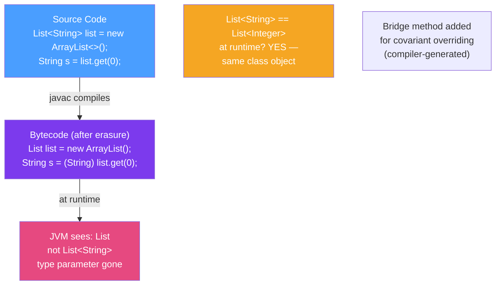

# 🫥 Type Erasure

> [!abstract] TL;DR
> At runtime, all generic type information is **erased** — `List<String>` and `List<Integer>` are both just `List` in bytecode. The compiler replaces type parameters with their bound (or `Object` if unbounded) and inserts invisible casts. This means you cannot: do `new T()`, `new T[]`, use `T.class`, or use `instanceof` with generic types. Heap pollution occurs when the type system's guarantees are broken through raw types or unchecked casts.

## Intuition — Why Erasure Exists

Java generics were added in Java 5 (2004), but the JVM already existed with millions of compiled class files. The Java designers chose **erasure** for backward compatibility: existing non-generic `List` code continues to work with the new generic `List<T>` without recompiling the JVM or breaking binary compatibility.

The alternative — **reification** (keeping type info at runtime, like C# generics) — would have required redesigning the JVM and breaking all existing bytecode. Java chose backward compatibility over runtime type safety.

---

## How It Works



## Key Concepts / Details

### How Erasure Works: Compiler Transforms

```java
// BEFORE erasure (your source code)
public class Box<T> {
    private T value;

    public Box(T value) { this.value = value; }
    public T get() { return value; }
}

Box<String> box = new Box<>("hello");
String s = box.get();

// AFTER erasure (what bytecode looks like conceptually)
public class Box {           // T is gone
    private Object value;   // T → Object (unbounded)

    public Box(Object value) { this.value = value; }
    public Object get() { return value; }
}

Box box = new Box("hello");
String s = (String) box.get();  // invisible cast added by compiler
```

With bounded type parameters:

```java
// BEFORE — T has an upper bound
public class NumberBox<T extends Number> {
    private T value;
    public T get() { return value; }
    public double doubleValue() { return value.doubleValue(); }
}

// AFTER erasure — T → Number (the upper bound)
public class NumberBox {
    private Number value;
    public Number get() { return value; }
    public double doubleValue() { return value.doubleValue(); }
}
```

### What You CANNOT Do Because of Erasure

```java
public class Container<T> {

    // ❌ Cannot create instance of T
    public T create() {
        return new T();  // COMPILE ERROR — type unknown at runtime
    }

    // ❌ Cannot create array of T
    public T[] createArray(int size) {
        return new T[size];  // COMPILE ERROR
    }

    // ❌ Cannot use T in instanceof
    public boolean isInstance(Object obj) {
        return obj instanceof T;  // COMPILE ERROR
    }

    // ❌ Cannot get T's Class object
    public Class<T> getType() {
        return T.class;  // COMPILE ERROR
    }

    // ❌ Cannot catch T (if T is Throwable)
    // catch (T e) {}  // COMPILE ERROR

    // ✅ Workaround: pass Class<T> explicitly (class token pattern)
    private final Class<T> type;

    public Container(Class<T> type) {
        this.type = type;
    }

    public T create() throws ReflectiveOperationException {
        return type.getDeclaredConstructor().newInstance();
    }

    public boolean isInstance(Object obj) {
        return type.isInstance(obj);
    }

    public Class<T> getType() {
        return type;
    }
}

// Usage
Container<String> c = new Container<>(String.class);
boolean isStr = c.isInstance("hello");  // true
```

### Heap Pollution and @SafeVarargs

**Heap pollution**: a variable of a parameterised type refers to an object that is NOT of that type. The type system's guarantee is violated, and a `ClassCastException` occurs in an unexpected place.

```java
// Heap pollution via raw types
List rawList = new ArrayList<String>();
rawList.add(42);  // compiles with unchecked warning — adds Integer to "String list"

List<String> stringList = rawList;  // unchecked warning
String s = stringList.get(0);        // ClassCastException! — at get(), not add()

// Heap pollution via varargs (common gotcha)
@SafeVarargs  // suppress warning — you promise you won't cause heap pollution
public static <T> List<T> listOf(T... elements) {
    // elements is actually T[] after erasure — Object[] at runtime
    // Safe because we only read from it
    return Arrays.asList(elements);
}

// UNSAFE varargs — causes heap pollution
public static <T> T[] toArray(T... args) {
    return args;  // returns Object[] at runtime — ClassCastException when caller assigns
}

String[] strings = toArray("a", "b", "c");  // ClassCastException! args is Object[], not String[]
```

### Unchecked Casts and Suppression

```java
// Sometimes unavoidable — e.g., deserializing from JSON/cache
@SuppressWarnings("unchecked")
public <T> T getFromCache(String key, Class<T> type) {
    Object raw = cache.get(key);
    // We trust the cache is typed correctly — suppress the warning
    return (T) raw;  // unchecked cast — runtime behavior depends on actual object type
}

// Better: use Class<T> for safe casting
public <T> Optional<T> getFromCache(String key, Class<T> type) {
    Object raw = cache.get(key);
    return type.isInstance(raw) ? Optional.of(type.cast(raw)) : Optional.empty();
}
```

### Checking Generic Types at Runtime

```java
// Checking raw type is OK
List<String> strings = new ArrayList<>();
System.out.println(strings instanceof List);           // true — OK, raw type check
// System.out.println(strings instanceof List<String>); // COMPILE ERROR

// Get reified type using reflection (limited)
List<String> list = new ArrayList<>();
// list.getClass() returns ArrayList.class — not ArrayList<String>.class

// For method/field types, reflection can see generic signatures
Method method = MyClass.class.getMethod("getList");
Type returnType = method.getGenericReturnType();
// returnType is ParameterizedType — can get actual type arguments
if (returnType instanceof ParameterizedType pt) {
    Type[] args = pt.getActualTypeArguments();  // [String]
    System.out.println(args[0]);  // class java.lang.String
}
```

### Erasure Restrictions Summary Table

| Operation | Allowed? | Workaround |
|-----------|----------|------------|
| `new T()` | No | Pass `Class<T>`, use factory/supplier |
| `new T[]` | No | Use `Object[]`, cast or use `List<T>` |
| `instanceof T` | No | Pass `Class<T>`, use `.isInstance()` |
| `T.class` | No | Pass `Class<T>` as constructor param |
| `catch (T e)` | No | Catch a common supertype |
| `List<String> == List<Integer>` (raw) | Yes (same class) | Unavoidable |
| Reflection on method return type | Yes | `getGenericReturnType()` |

## Real-World Notes

- **Super type tokens (TypeToken) work around erasure** — Google Guava's `TypeToken` and Jackson's `TypeReference` capture generic type information at construction time by exploiting the fact that subclasses of a generic type ARE reified. `new TypeToken<List<String>>() {}` creates an anonymous subclass that retains the type argument.
- **Spring's `ParameterizedTypeReference`** — `RestTemplate.exchange()` uses `ParameterizedTypeReference<List<Order>>` to tell Jackson what to deserialize into, working around erasure the same way.
- **Arrays and generics don't mix well** — `List<String>[]` is a generic array creation — illegal. Use `List<List<String>>` instead. The combination of covariant arrays and erased generics creates heap pollution risks.

## Common Pitfalls

- **Expecting `List<String>.class` to work** — it doesn't. `List.class` is the only option. Use TypeToken/TypeReference for richer runtime type info.
- **Suppressing `@SuppressWarnings("unchecked")` blindly** — each suppressed warning is a potential `ClassCastException` at a distant point. Always document WHY you know the cast is safe.
- **Using arrays of generic types** — `List<String>[]` is illegal; `List[]` loses type safety. Use `List<List<String>>`.
- **Calling `getClass()` on a generic object to "get" the type parameter** — `box.getClass()` returns `Box.class`, not `Box<String>.class`.

## Related Concepts
- [[Generic_Types]] — type parameters that are subject to erasure
- [[Wildcards]] — also erased at runtime — `List<?>` is just `List`
- [[Reflection_API]] — reflection can access generic signatures via `getGenericReturnType()`

## Review Questions
1. What does the Java compiler replace `T` with in bytecode when `T` is unbounded vs `T extends Number`?
2. What is heap pollution and what Java annotation signals a safe varargs method?
3. How does `TypeToken<List<String>>` work around type erasure to preserve the `List<String>` type at runtime?

#java #generics #type-erasure #heap-pollution #safevarargs #reification
