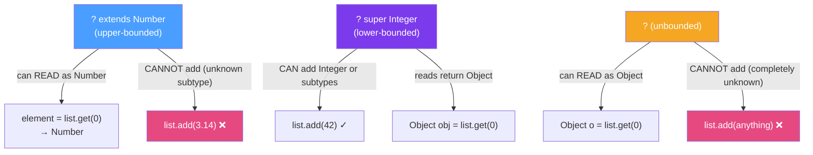

# ❓ Wildcards in Java Generics

> [!abstract] TL;DR
> Wildcards (`?`) make generic method signatures more flexible. **`? extends T`** (upper-bounded) makes a collection a "producer" — you can READ elements, but not add. **`? super T`** (lower-bounded) makes a collection a "consumer" — you can ADD elements but reads return `Object`. The mnemonic is **PECS: Producer Extends, Consumer Super**. Unbounded `?` accepts any type with no read or write other than null/Object.

## Intuition — Why Wildcards Exist

The core problem: `List<Integer>` is NOT a subtype of `List<Number>`, even though `Integer extends Number`. This breaks intuition — you'd expect to pass a `List<Integer>` wherever a `List<Number>` is expected.

Wildcards solve this with a trade-off:
- **`List<? extends Number>`** — "a list of some Number subtype" — safe to read (every element IS a Number), but unsafe to write (you don't know if it's `List<Integer>` or `List<Double>`).
- **`List<? super Integer>`** — "a list of some Integer supertype" — safe to write integers, but reads return `Object` (you don't know if it's `List<Integer>`, `List<Number>`, or `List<Object>`).

---

## How It Works



## Key Concepts / Details

### The Core Problem: Generic Invariance

```java
// Integer IS-A Number. Does that mean List<Integer> IS-A List<Number>? NO.
List<Integer> ints = new ArrayList<>(List.of(1, 2, 3));
// List<Number> nums = ints;  // COMPILE ERROR — intentional!

// WHY: if this were allowed, you could do:
// nums.add(3.14);  // adds Double to a List<Integer> → ClassCastException later
// That's why generic types are INVARIANT.

// Solution: use wildcards for flexibility
List<? extends Number> nums = ints;  // OK
Number n = nums.get(0);              // OK — reads as Number
// nums.add(3.14);                   // COMPILE ERROR — safely prevented
```

### Upper-Bounded Wildcard: `? extends T` (Producer)

```java
// Method that READS from a collection — use ? extends
public static double sumAll(List<? extends Number> numbers) {
    double total = 0;
    for (Number n : numbers) {  // safe to read as Number
        total += n.doubleValue();
    }
    return total;
}

// Accepts List<Integer>, List<Double>, List<BigDecimal> — all work!
sumAll(List.of(1, 2, 3));          // List<Integer>
sumAll(List.of(1.5, 2.5, 3.0));    // List<Double>
sumAll(List.of(BigDecimal.TEN));    // List<BigDecimal>

// Why you can't add to ? extends:
List<? extends Number> list = new ArrayList<Integer>();
// list.add(1);    // Compile error — compiler doesn't know if it's List<Integer> or List<Double>
// list.add(1.0);  // Compile error
// list.add(null); // OK — null is always safe
```

### Lower-Bounded Wildcard: `? super T` (Consumer)

```java
// Method that WRITES to a collection — use ? super
public static void addIntegers(List<? super Integer> list, int count) {
    for (int i = 0; i < count; i++) {
        list.add(i);  // safe — list can hold Integer or any supertype
    }
}

// Accepts List<Integer>, List<Number>, List<Object>
List<Integer> ints = new ArrayList<>();
addIntegers(ints, 5);    // OK

List<Number> nums = new ArrayList<>();
addIntegers(nums, 5);    // OK — Number can hold Integer

List<Object> objs = new ArrayList<>();
addIntegers(objs, 5);    // OK — Object can hold anything

// Reads return Object — safe but not useful
List<? super Integer> consumer = new ArrayList<Number>();
Object obj = consumer.get(0);  // only Object is safe return type
// Integer i = consumer.get(0);  // Compile error — might be a Long in there
```

### PECS — The Mnemonic

**P**roducer → **E**xtends, **C**onsumer → **S**uper

```java
// Classic PECS example from Effective Java (Joshua Bloch)
public static <T> void copy(List<? super T> dest, List<? extends T> src) {
    for (T item : src) {   // src PRODUCES T — use extends
        dest.add(item);    // dest CONSUMES T — use super
    }
}

// Usage
List<Object> dest = new ArrayList<>();
List<String> src = List.of("a", "b", "c");
copy(dest, src);  // T inferred as String
// dest now contains "a", "b", "c"

// Collections.copy in the standard library uses this exact signature!
```

### Unbounded Wildcard: `?`

```java
// When you don't care about the type at all — use ?
public static void printAll(List<?> list) {
    for (Object item : list) {
        System.out.println(item);  // toString() always works
    }
}

printAll(List.of(1, 2, 3));         // works
printAll(List.of("a", "b", "c")); // works
printAll(List.of(new Object()));    // works

// Common use: instanceof checks, null checks, size()
public static boolean isEmpty(Collection<?> collection) {
    return collection.size() == 0;
}
```

### Wildcard Capture — Advanced Pattern

```java
// Sometimes you need to call a method that requires a concrete type
// Use a helper method to "capture" the wildcard
public static void reverse(List<?> list) {
    reverseHelper(list);  // delegate to capture the wildcard
}

private static <T> void reverseHelper(List<T> list) {
    for (int i = 0, j = list.size() - 1; i < j; i++, j--) {
        T temp = list.get(i);
        list.set(i, list.get(j));
        list.set(j, temp);
    }
}
```

### Wildcard Decision Table

| Need | Wildcard | Can Read | Can Add |
|------|----------|----------|---------|
| Read elements as type T | `? extends T` | Yes, as T | No |
| Add elements of type T | `? super T` | Yes, as Object | Yes, T or subtype |
| Don't care about elements | `?` | Yes, as Object | No (only null) |
| Both read and write with same T | `<T>` type param | Yes, as T | Yes, as T |

## Real-World Notes

- **`Collections.copy`, `Collections.sort`, `Stream.flatMap`** all use PECS — reading the JDK source teaches you the pattern better than any tutorial.
- **Return type with wildcard is usually wrong** — avoid `List<? extends Number> getNumbers()`. If the caller needs to know the specific type, use a type parameter `<T extends Number> List<T> getNumbers()`.
- **APIs should use wildcards for flexibility** — library methods should accept `List<? extends Animal>` not `List<Animal>` — the wider type makes your API easier to use without breaking type safety.
- **Wildcards in generic classes are rare** — wildcards shine as method parameter types. Using them in class field declarations is unusual and often a sign of design issues.

## Common Pitfalls

- **Confusing `? extends` and `? super`** — "extends" looks like a restriction but it's the PRODUCER (flexible for reading). "super" looks more permissive but it's the CONSUMER (flexible for writing). PECS resolves the confusion.
- **Using `<T>` when you don't need to reference T** — if the method just reads from a list as Object, `List<?>` is simpler than `<T> void foo(List<T>)`. Only use `<T>` when you need to refer to the type in return type or other params.
- **Returning a wildcard type** — `List<? extends Number> getList()` forces callers to deal with bounded wildcards. Return `List<Number>` or use a type parameter instead.
- **Adding elements to `? extends`** — `list.add(someValue)` on `List<? extends Number>` is a compile error. Many developers discover PECS this way.

## Related Concepts
- [[Bounded_Type_Parameters]] — `T extends X` for type parameters (vs `? extends X` for wildcards)
- [[Generic_Types]] — invariance of generic types is why wildcards exist
- [[Type_Erasure]] — wildcards are erased at runtime just like type parameters

## Review Questions
1. Why is `List<Integer>` not a subtype of `List<Number>` in Java?
2. What does PECS stand for and how does it help you decide between `? extends T` and `? super T`?
3. Why can you add `null` to a `List<?>` but not any other value?

#java #generics #wildcards #pecs #upper-bounded #lower-bounded
