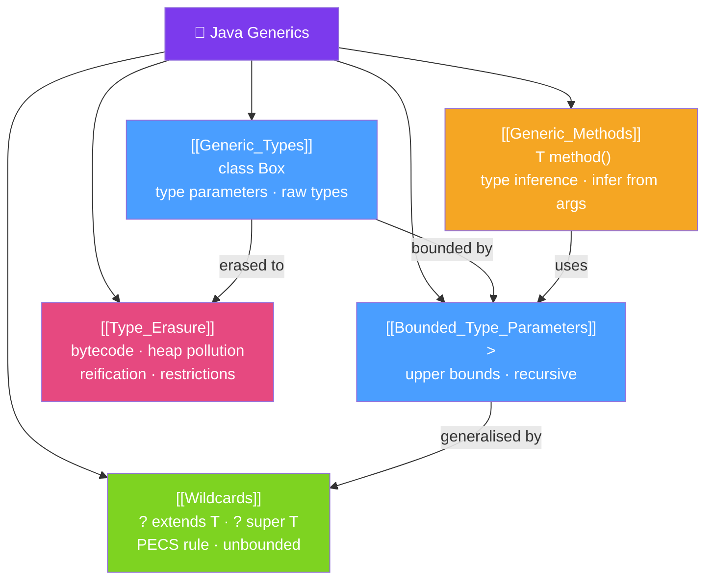

# 🧩 Java Generics — Map of Content

> [!abstract] What This Section Covers
> Java Generics bring **compile-time type safety** to collections, methods, and classes without runtime overhead. This section covers generic type declarations, bounded type parameters (`extends`/`super`), wildcards and the PECS rule, type erasure (why `List<String>` and `List<Integer>` are the same at runtime), and generic methods. Generics are used throughout the Java ecosystem — understanding them is essential for reading and writing idiomatic Java.

## Concept Map

## Learning Path
1. [[Generic_Types]] — Declare generic classes and understand type parameters.
2. [[Bounded_Type_Parameters]] — Constrain type parameters with `extends` and `super`.
3. [[Wildcards]] — Use `?` for flexible APIs; learn the PECS rule.
4. [[Type_Erasure]] — Understand why Java erases generic types at runtime.
5. [[Generic_Methods]] — Declare methods with their own type parameters.

## All Notes at a Glance
| Note | Difficulty | What You'll Learn |
|------|------------|-------------------|
| [[Generic_Types]] | Intermediate | Generic class/interface syntax, type parameters, raw types, multiple bounds |
| [[Bounded_Type_Parameters]] | Intermediate | `<T extends Number>`, recursive bounds, multiple bounds with `&` |
| [[Wildcards]] | Advanced | `? extends T`, `? super T`, unbounded `?`, PECS (Producer Extends, Consumer Super) |
| [[Type_Erasure]] | Advanced | Why generics are erased, heap pollution, unchecked casts, reification limits |
| [[Generic_Methods]] | Intermediate | Generic method declaration, type inference, static factory methods |

## Key Questions This Section Answers
- Why can't you do `new T[]` in a generic class?
- What is the PECS rule and when do you use `? extends T` vs `? super T`?
- Why is `List<String>` not a subtype of `List<Object>`?
- What is heap pollution and why does it trigger unchecked warnings?
- How does the Java compiler infer type parameters for generic methods?

## Related Sections
- [[_MOC_Java_Master|↑ Java Master MOC]]
- [[32_Distributed_Systems_Java/_MOC_Distributed_Systems|← Distributed Systems]]
- [[34_Java_Annotations/_MOC_Java_Annotations|→ Java Annotations]]

#MOC #java #generics #type-erasure #wildcards #bounded-types
