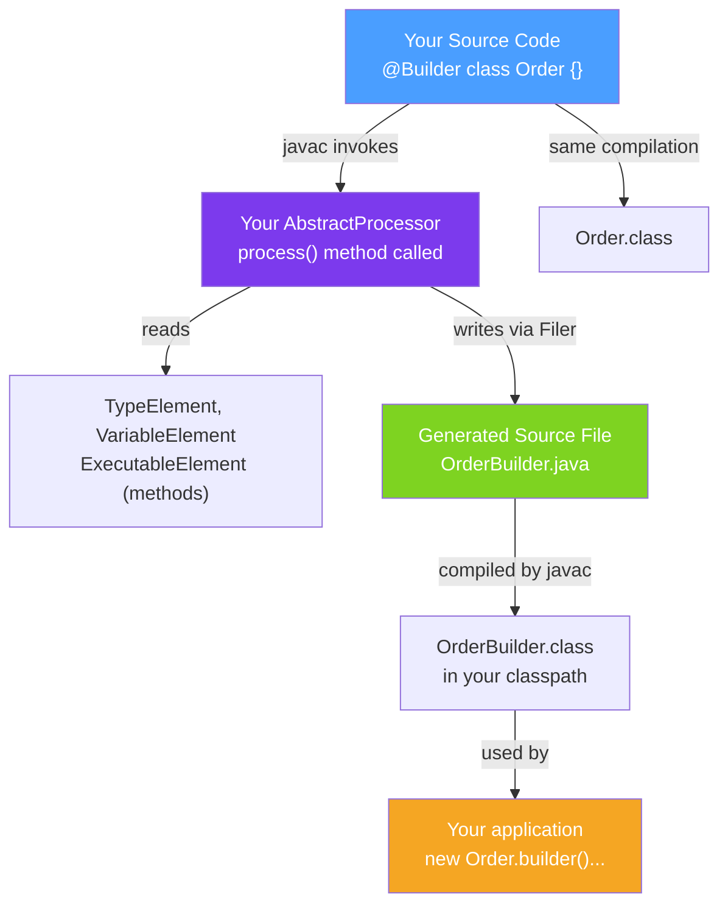

# ⚙️ Annotation Processing (APT)

> [!abstract] TL;DR
> **Annotation Processing** (APT) runs during compilation. Your `AbstractProcessor` is called by the Java compiler with the annotated elements; you can generate new source files, emit warnings/errors, or validate code structure. This is how **Lombok** generates `equals`/`hashCode`/`toString`, how **MapStruct** generates mapper implementations, and how **Dagger** generates dependency injection code — all at compile time, with zero runtime overhead.

## Intuition — Code That Writes Code

APT is like a **paralegal who reads contracts (annotations) and drafts boilerplate documents (generated code)** before any actual work begins (runtime). You write the annotation on a class, and the processor reads it during compilation and generates the implementation. The generated code is compiled together with your code — no reflection needed at runtime.

**Key distinction**: APT (compile-time) vs reflection (runtime). Lombok uses APT — no performance cost. Spring uses reflection — slight startup overhead.

---

## How It Works



## Key Concepts / Details

### Setting Up an Annotation Processor (Maven)

```xml
<!-- Module: my-annotation-processor -->
<dependencies>
    <!-- Access to javax.annotation.processing and javax.lang.model -->
    <!-- auto-service registers processor in META-INF/services automatically -->
    <dependency>
        <groupId>com.google.auto.service</groupId>
        <artifactId>auto-service</artifactId>
        <version>1.1.1</version>
    </dependency>
</dependencies>
```

### Implementing `AbstractProcessor`

```java
import com.google.auto.service.AutoService;
import javax.annotation.processing.*;
import javax.lang.model.SourceVersion;
import javax.lang.model.element.*;
import javax.lang.model.type.TypeMirror;
import javax.tools.Diagnostic;
import java.io.IOException;
import java.io.PrintWriter;
import java.util.Set;

// @AutoService generates META-INF/services/javax.annotation.processing.Processor
@AutoService(Processor.class)
@SupportedAnnotationTypes("com.example.annotations.Builder")
@SupportedSourceVersion(SourceVersion.RELEASE_17)
public class BuilderProcessor extends AbstractProcessor {

    @Override
    public boolean process(Set<? extends TypeElement> annotations, RoundEnvironment roundEnv) {
        for (TypeElement annotation : annotations) {
            Set<? extends Element> annotatedElements = roundEnv.getElementsAnnotatedWith(annotation);

            for (Element element : annotatedElements) {
                if (element.getKind() != ElementKind.CLASS) {
                    processingEnv.getMessager().printMessage(
                        Diagnostic.Kind.ERROR,
                        "@Builder can only be applied to classes",
                        element
                    );
                    continue;
                }

                TypeElement classElement = (TypeElement) element;
                generateBuilder(classElement);
            }
        }
        return true;  // true = annotation is claimed; false = other processors can also process it
    }

    private void generateBuilder(TypeElement classElement) {
        String className = classElement.getSimpleName().toString();
        String packageName = processingEnv.getElementUtils()
            .getPackageOf(classElement).getQualifiedName().toString();

        // Collect fields
        List<VariableElement> fields = classElement.getEnclosedElements().stream()
            .filter(e -> e.getKind() == ElementKind.FIELD)
            .map(e -> (VariableElement) e)
            .collect(Collectors.toList());

        String builderClassName = className + "Builder";

        try {
            // Create new source file
            JavaFileObject file = processingEnv.getFiler()
                .createSourceFile(packageName + "." + builderClassName);

            try (PrintWriter out = new PrintWriter(file.openWriter())) {
                out.println("package " + packageName + ";");
                out.println();
                out.println("public class " + builderClassName + " {");

                // Generate fields
                for (VariableElement field : fields) {
                    out.println("    private " + field.asType() + " " + field.getSimpleName() + ";");
                }

                // Generate setter methods
                for (VariableElement field : fields) {
                    String fieldName = field.getSimpleName().toString();
                    String fieldType = field.asType().toString();
                    out.println();
                    out.println("    public " + builderClassName + " " + fieldName + "(" + fieldType + " " + fieldName + ") {");
                    out.println("        this." + fieldName + " = " + fieldName + ";");
                    out.println("        return this;");
                    out.println("    }");
                }

                // Generate build() method
                out.println();
                out.println("    public " + className + " build() {");
                out.println("        " + className + " obj = new " + className + "();");
                for (VariableElement field : fields) {
                    String fn = field.getSimpleName().toString();
                    out.println("        obj." + fn + " = this." + fn + ";");
                }
                out.println("        return obj;");
                out.println("    }");
                out.println("}");
            }
        } catch (IOException e) {
            processingEnv.getMessager().printMessage(
                Diagnostic.Kind.ERROR, "Failed to generate builder: " + e.getMessage()
            );
        }
    }
}
```

### The `javax.lang.model` Type Hierarchy

```java
// Elements represent program structure (compile-time)
Element                  // base type
  TypeElement            // class or interface: MyClass.class
  ExecutableElement      // method or constructor
  VariableElement        // field, parameter, or local variable
  PackageElement         // package

// Getting information from elements
TypeElement classElem = ...;
classElem.getQualifiedName();              // "com.example.Order"
classElem.getSimpleName();                 // "Order"
classElem.getEnclosedElements();           // all members (fields, methods, constructors)
classElem.getSuperclass();                 // TypeMirror of superclass
classElem.getInterfaces();                 // List<TypeMirror>

ExecutableElement method = ...;
method.getSimpleName();                    // "findById"
method.getParameters();                   // List<VariableElement>
method.getReturnType();                    // TypeMirror
method.getAnnotation(MyAnnotation.class); // get specific annotation

VariableElement field = ...;
field.getSimpleName();                     // "orderId"
field.asType();                            // TypeMirror (e.g., "java.lang.Long")
```

### Validation Example — Compile-Time Checks

```java
// Validate that @Service-annotated classes implement Closeable
@SupportedAnnotationTypes("com.example.Service")
public class ServiceValidationProcessor extends AbstractProcessor {

    @Override
    public boolean process(Set<? extends TypeElement> annotations, RoundEnvironment roundEnv) {
        TypeElement closeable = processingEnv.getElementUtils()
            .getTypeElement("java.io.Closeable");
        TypeMirror closeableType = closeable.asType();

        for (Element element : roundEnv.getElementsAnnotatedWith(
                processingEnv.getElementUtils().getTypeElement("com.example.Service"))) {

            if (element instanceof TypeElement typeElem) {
                boolean implementsCloseable = processingEnv.getTypeUtils()
                    .isAssignable(typeElem.asType(), closeableType);

                if (!implementsCloseable) {
                    // Emit a compiler ERROR — stops compilation
                    processingEnv.getMessager().printMessage(
                        Diagnostic.Kind.ERROR,
                        "@Service classes must implement Closeable",
                        element
                    );
                }
            }
        }
        return true;
    }
}
```

### Well-Known Annotation Processors

| Library | Annotation(s) | What It Generates |
|---------|--------------|-------------------|
| **Lombok** | `@Data`, `@Builder`, `@Slf4j` | `equals`, `hashCode`, `toString`, constructors, logger |
| **MapStruct** | `@Mapper` | Type-safe mapper implementation classes |
| **Dagger** | `@Component`, `@Module` | Dependency injection graph |
| **AutoValue** | `@AutoValue` | Immutable value class implementation |
| **Immutables** | `@Value.Immutable` | Builder + immutable implementation |
| **QueryDSL** | JPA entities | Q-classes for type-safe queries |
| **Spring (partial)** | `@ConfigurationProperties` | Config metadata JSON |

## Real-World Notes

- **APT generates code in `target/generated-sources`** — look there to understand what Lombok/MapStruct actually generated. Knowing what's generated helps debug subtle issues.
- **Processing rounds** — APT runs in "rounds". If your processor generates new source files, the compiler re-invokes all processors on the new files. Check `roundEnv.processingOver()` to skip final cleanup.
- **No modifying existing files** — APT can only CREATE new files or emit messages. Lombok bypasses this restriction by using the internal `javac` compiler API (`com.sun.tools.javac.*`) to modify the AST directly — this is why Lombok is considered "hacky" and tied to specific compiler versions.
- **Incremental compilation and APT** — some build tools (Gradle's incremental compilation) struggle with APT because generated files depend on annotated files. Configure your build tool's annotation processor integration carefully.

## Common Pitfalls

- **Returning `false` prematurely** — return `true` from `process()` to claim the annotation. If you return `false`, other processors get the annotation (usually undesirable).
- **Processing in the final round without checking** — if `roundEnv.processingOver()` is true, no more elements will be processed. Don't generate files in the final round (the Filer rejects it).
- **Not handling multiple rounds** — processors are called once per round. Guard against processing the same element twice by tracking processed elements with a `Set`.
- **Using Lombok + APT together** — Lombok modifies the AST at compile time. Other annotation processors that read Lombok-generated methods may not see them unless they run after Lombok.

## Related Concepts
- [[Custom_Annotations]] — the annotations that processors consume
- [[Runtime_Annotations]] — alternative: process annotations at runtime via reflection
- [[Reflection_API]] — the runtime equivalent of APT's compile-time introspection

## Review Questions
1. What is the key advantage of APT (compile-time processing) over runtime reflection?
2. Why does Lombok use internal `javac` APIs instead of standard `AbstractProcessor` Filer?
3. What does returning `true` vs `false` from `process()` mean in annotation processing?

#java #annotations #apt #annotation-processing #lombok #mapstruct #code-generation
